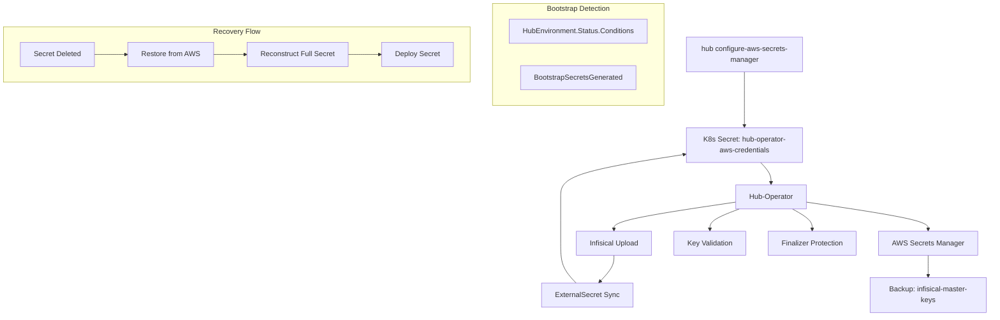

# Design: Infisical ENCRYPTION_KEY Recovery & Protection

## Overview

This design implements a comprehensive disaster recovery and protection system for Infisical's master encryption keys. The solution addresses the critical issue where `ENCRYPTION_KEY` regeneration causes complete data loss by implementing automated backup to AWS Secrets Manager and intelligent restore logic.

The design follows the requirements-first workflow with validated technical decisions from the discovery phase. It implements a Day 0 bootstrap operator that handles initial secret generation, backup, and recovery while preventing future incidents through finalizer protection and strict validation.

## Architecture

### High-Level Components



### Authentication Strategy

**Decision**: Static IAM credentials via CLI injection (NOT IRSA)

**Rationale**:
- Hetzner clusters lack OIDC configuration for IRSA
- No existing AWS infrastructure in codebase
- Follows established GitHub secrets pattern
- Production-ready with proper IAM policies

### Data Flow Patterns

1. **Secret Zero Pattern**: CLI creates → Operator uploads to Infisical → ESO manages thereafter
2. **Backup Flow**: Generate keys → Validate → Backup to AWS → Mark bootstrap complete
3. **Restore Flow**: Detect missing keys → Restore from AWS → Validate → Reconstruct secret
4. **Protection Flow**: Add finalizers → Prevent deletion → Remove on teardown

## Components and Interfaces

### CLI Command Interface

```go
// cmd/hub/configure_aws_secrets_manager.go
type AWSSecretsManagerConfig struct {
    AccessKeyID     string
    SecretAccessKey string
    Region          string
    Kubeconfig      string
}

func runConfigureAWSSecretsManager(cmd *cobra.Command, args []string) error
```

**Purpose**: Inject AWS credentials following Secret Zero pattern
**Input**: AWS IAM credentials via flags
**Output**: Kubernetes secret `hub-operator-aws-credentials`

### Hub-Operator Secret Generation Interface

```go
// internal/secrets/generator.go
func GenerateInfisicalSecrets(hubEnv *HubEnvironment, existingSecrets map[string]*corev1.Secret) (*InfisicalSecrets, error)

type InfisicalSecrets struct {
    EncryptionKey string // 32 hex characters
    AuthSecret    string // 32 hex characters  
    RedisURL      string // Constructed from existing Redis password
    DBRootCert    string // Base64-encoded CA certificate
}
```

**Bootstrap Detection Logic**:
```go
isFirstTime := !meta.IsStatusConditionTrue(hubEnv.Status.Conditions, "BootstrapSecretsGenerated")
```

**Recovery Priority**:
1. Try AWS Secrets Manager restore
2. If backup exists → restore and validate
3. If no backup AND first-time → generate new keys and backup
4. If no backup AND NOT first-time → FAIL with clear error

### AWS Integration Interface

```go
// internal/aws/secrets_manager.go
type SecretsManagerClient struct {
    client *secretsmanager.Client
    region string
}

type MasterKeysBackup struct {
    EncryptionKey     string    `json:"encryptionKey"`
    AuthSecret        string    `json:"authSecret"`
    CreatedAt         time.Time `json:"createdAt"`
    ClusterID         string    `json:"clusterId"`
    Version           string    `json:"version"`
    BackupTimestamp   time.Time `json:"backupTimestamp"`
}

func (c *SecretsManagerClient) BackupMasterKeys(clusterID string, keys MasterKeysBackup) error
func (c *SecretsManagerClient) RestoreMasterKeys(clusterID string) (*MasterKeysBackup, error)
```

**AWS Configuration**:
- Path: `/hub-operator/{HubEnvironment.Name}/infisical-master-keys`
- Secret name: `infisical-master-keys` (no timestamps)
- KMS encryption enabled
- IAM policy restricted to hub-operator paths only

### Key Validation Interface

```go
// internal/secrets/validator.go
func validateEncryptionKey(key string) error
func validateAuthSecret(secret string) error
```

**Validation Rules**:
- Must be exactly 32 hex characters
- Must be valid hexadecimal (0-9, a-f)
- Must not be all zeros
- Must not be empty

### Finalizer Protection Interface

```go
// internal/controller/finalizer_controller.go
const EncryptionKeyProtectionFinalizer = "ops.nutgraf.in/encryption-key-protection"

func (r *HubEnvironmentReconciler) addFinalizers(ctx context.Context, secretNames []string) error
func (r *HubEnvironmentReconciler) removeFinalizers(ctx context.Context, secretNames []string) error
```

**Protected Secrets**:
- `infisical-secrets`
- `infisical-redis-credentials`

**Teardown Logic**: Remove finalizers when `HubEnvironment.DeletionTimestamp` is set

## Data Models

### AWS Backup Schema

```json
{
  "encryptionKey": "8ec32a8fafb27566fccd50da3d789979",
  "authSecret": "841e8ab0c28196d44e66b9075019cbfc", 
  "createdAt": "2026-04-06T14:22:07Z",
  "clusterId": "hub-production",
  "version": "1",
  "backupTimestamp": "2026-04-20T14:30:00Z"
}
```

### Kubernetes Secret Structure

```yaml
apiVersion: v1
kind: Secret
metadata:
  name: infisical-secrets
  namespace: hub-platform-security
  finalizers:
    - ops.nutgraf.in/encryption-key-protection
type: Opaque
stringData:
  ENCRYPTION_KEY: "8ec32a8fafb27566fccd50da3d789979"  # 32 hex chars
  AUTH_SECRET: "841e8ab0c28196d44e66b9075019cbfc"     # 32 hex chars
  REDIS_URL: "redis://:password@redis-master.hub-platform-data.svc:6379"
  DB_ROOT_CERT: "LS0tLS1CRUdJTi..."                   # Base64 CA cert
```

### HubEnvironment Status Conditions

```yaml
status:
  conditions:
  - type: BootstrapSecretsGenerated
    status: "True"
    reason: MasterKeysBackedUp
    message: "ENCRYPTION_KEY and AUTH_SECRET generated, validated, and backed up to AWS"
    lastTransitionTime: "2026-04-20T14:30:00Z"
```

## Error Handling

### Backup Failure Scenarios

**AWS API Timeout**:
- Retry with exponential backoff (max 5 attempts)
- Fail operator reconciliation if backup fails after retries
- Do NOT mark `BootstrapSecretsGenerated` until backup succeeds
- Alert operations team via monitoring

**Invalid AWS Credentials**:
- Validate credentials during operator startup
- Fail fast with clear error message
- Document credential setup procedure

### Restore Failure Scenarios

**Corrupted Backup Data**:
- Validate restored keys before use
- Reject invalid formats (non-hex, wrong length, all-zeros)
- Fail with clear error message
- Log validation failures for debugging

**Split-Brain Prevention**:
- Use `BootstrapSecretsGenerated` condition as source of truth
- If AWS times out AND cluster already bootstrapped → HALT with error
- Never generate new keys on AWS API failures after initial bootstrap

### Key Validation Errors

```go
// Example validation error messages
"ENCRYPTION_KEY must be 32 characters, got 28"
"AUTH_SECRET must be valid hex string: invalid character 'g'"
"ENCRYPTION_KEY cannot be all zeros"
```

## Testing Strategy

### Unit Testing Approach

**Key Validation Tests**:
- Valid 32-character hex strings pass validation
- Invalid lengths (31, 33 characters) fail validation
- Non-hex characters fail validation
- All-zeros keys fail validation
- Empty strings fail validation

**Bootstrap Detection Tests**:
- First-time bootstrap generates new keys
- Existing cluster with backup restores keys
- Existing cluster without backup fails with clear error
- AWS timeout during restore does not generate new keys

**Secret Reconstruction Tests**:
- Restored secret includes all 4 fields
- Redis password preserved from existing secret
- DB certificate read from platform-db-ca
- REDIS_URL constructed correctly

### Integration Testing Approach

**AWS Integration Tests**:
- Backup operation succeeds with valid credentials
- Restore operation retrieves correct data
- Invalid credentials fail with clear error
- Network timeouts retry with exponential backoff

**Finalizer Tests**:
- Finalizers prevent secret deletion
- Manual finalizer removal allows deletion
- Teardown removes finalizers automatically
- Namespace deletion completes successfully

**End-to-End Recovery Tests**:
- Delete `infisical-secrets` → Operator restores from AWS
- Delete with AWS unavailable → Operator fails gracefully
- Fresh cluster bootstrap → Keys generated and backed up
- Corrupted backup → Validation fails before secret creation

### Manual Validation Procedures

**Recovery Verification**:
1. Delete `infisical-secrets` secret
2. Verify operator restores both keys from AWS backup
3. Confirm Infisical pods restart and become healthy
4. Validate all secrets accessible in Infisical UI

**Backup Verification**:
1. Fresh cluster deployment
2. Verify keys generated, validated, and backed up
3. Confirm `BootstrapSecretsGenerated` condition set
4. Check AWS Secrets Manager contains backup

**Teardown Verification**:
1. Set `HubEnvironment.DeletionTimestamp`
2. Verify finalizers removed automatically
3. Confirm namespace deletion completes
4. No hanging resources or deadlocks

## Implementation Plan

### Phase 1: CLI Command Implementation

**Files to Create**:
- `cmd/hub/configure_aws_secrets_manager.go`
- Update `cmd/hub/main.go` to register command
- Add AWS credential mappings to `internal/infisical/secret_mappings.go`

**Files to Modify**:
- `internal/hub/components/secrets.go` - Add `InstallAWSSecretsManagerAuth()`
- `go.mod` - Add AWS SDK v2 dependency

### Phase 2: Operator Core Logic

**Files to Create**:
- `internal/aws/secrets_manager.go`
- `internal/secrets/validator.go`

**Files to Modify**:
- `internal/secrets/generator.go` - Update `GenerateInfisicalSecrets()`
- `internal/controller/hubenvironment_controller.go` - Add backup/restore logic

### Phase 3: Finalizer Protection

**Files to Create**:
- `internal/controller/finalizer_controller.go`

**Files to Modify**:
- Update secret manifests with finalizers
- Add teardown logic to main controller

### Phase 4: Deployment Integration

**Files to Create**:
- `manifests/hub-operator/aws-credentials-externalsecret.yaml`

**Files to Modify**:
- `config/manager/manager.yaml` - Add AWS environment variables
- Update deployment manifests with secret references

## Dependencies

### External Dependencies

**AWS Resources**:
- AWS Secrets Manager in same region as cluster
- IAM user with restricted Secrets Manager permissions
- CloudTrail enabled for audit logging

**Kubernetes Resources**:
- Hub-operator ServiceAccount with finalizer permissions
- RBAC for secret creation/modification
- ExternalSecret CRDs for GitOps sync

### Internal Dependencies

**Operator Components**:
- HubEnvironment CRD and controller
- Infisical secret uploader
- UncachedClient for reading secret data

**Platform Services**:
- Infisical deployment for secret storage
- ESO for ongoing secret synchronization
- ArgoCD for GitOps manifest sync

### Code Dependencies

**Go Modules**:
- `github.com/aws/aws-sdk-go-v2/service/secretsmanager`
- `github.com/aws/aws-sdk-go-v2/config`
- `sigs.k8s.io/controller-runtime`
- `k8s.io/client-go`

**Existing Packages**:
- `internal/infisical` - Secret upload patterns
- `internal/hub/components` - CLI secret creation
- `k8s.io/apimachinery/pkg/apis/meta/v1` - Status conditions
