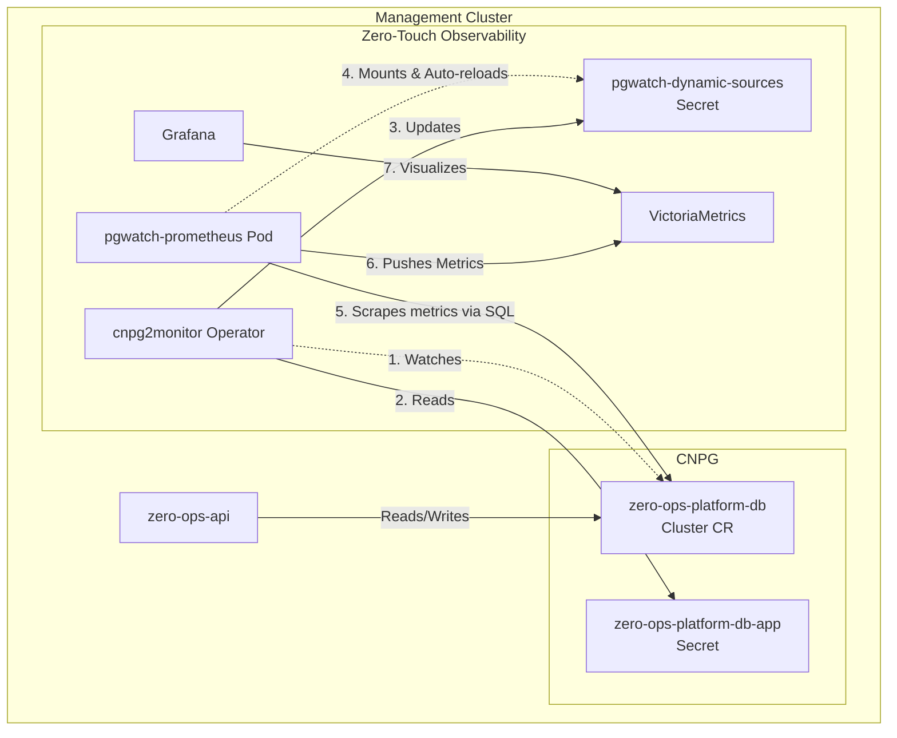

### Part 1: Is `cnpg2monitor` sufficient for a "Syself-Level Autopilot" model?

**No, `cnpg2monitor` is only one piece of the puzzle.** 
`cnpg2monitor` solves **Zero-Touch Observability** (wiring databases to Grafana/AI reporters automatically). To achieve a true "Autopilot" model for enterprise customers (like Syself or PostgresAI), you need a combination of operators covering the entire lifecycle:

1. **Lifecycle & HA Operator (Already solved)**: The **CloudNativePG (CNPG)** operator handles self-healing, replication, failover, and zero-downtime rolling upgrades.
2. **Observability Operator (Being built now)**: **`cnpg2monitor`** wires the CNPG clusters to the PostgresAI metrics stack (PGWatch + VictoriaMetrics + Grafana).
3. **Automated Maintenance Operator (Future)**: You need an operator or cron system to run tools like **`pg_index_pilot`** (found in `components/index_pilot/` in the codebase) to automatically rebuild bloated indexes and run `VACUUM` jobs without human intervention.
4. **Auto-Scaling Operator (Future)**: A Kubernetes **Vertical Pod Autoscaler (VPA)** tied to VictoriaMetrics to automatically increase CPU/Memory for CNPG pods when sustained load is detected.

---

### Part 2: Image Analysis & Codebase Cross-Reference

Here is the analysis of the provided images, mapping them to the `postgres-ai` codebase, and the solution for how your Management Panel DB (`zero-ops-platform-db`) will achieve this.

#### Image 1: Syself Autopilot & Services on Top
*   **Analysis**: This is the commercial vision of a PaaS—offering BYOC Kubernetes with managed add-ons (Services on Top) like PostgreSQL.
*   **Code Reference**: Your `docs/prds/prd.md` (Zero-Ops Platform architecture).
*   **Solution**: The `zero-ops-api` (using the CNPG database we are provisioning) will hold the tenant billing and service catalog metadata to power this UI.

#### Image 2: PostgresAI Console - Issues List (H002, F005, etc.)
*   **Analysis**: A centralized SaaS dashboard showing active database health issues (Unused indexes, B-tree bloat).
*   **Code Reference**: `reporter/postgres_reports.py` (which queries VictoriaMetrics to evaluate rules) and `reporter/schemas/` (e.g., `H002.schema.json`, `F005.schema.json`).
*   **Solution**: By deploying the `postgres-reports` container as a Kubernetes `CronJob` against the `zero-ops-platform-db`, it will generate these exact JSON files. The `zero-ops-api` can then serve these JSONs to your frontend.

#### Image 3: PostgresAI Console - Issue Details (H002 Unused Indexes)
*   **Analysis**: Detailed view showing specific tables, sizes, and a button to "Resolve in Cursor".
*   **Code Reference**: `monitoring_flask_backend/app.py` (which serves the exact queries/tables) and `cli/lib/mcp-server.ts` (which powers the "Resolve in Cursor" AI integration).
*   **Solution**: The `cnpg2monitor` operator ensures PGWatch collects the `unused_indexes` metric (defined in `config/pgwatch-prometheus/metrics.yml`). The Go MCP server you build in Phase 3 will read these reports and expose them as tools to Cursor/Goose.

#### Image 4: Installation Logs & Grafana Access
*   **Analysis**: Shows the user the Grafana URL and credentials after a successful deployment.
*   **Code Reference**: `postgres_ai_helm/values.yaml` (where `grafana-admin-password` is set) and `postgres_ai_helm/templates/ingress.yaml`.
*   **Solution**: Your `zero-ops` CLI will output the ingress URL for the central Grafana instance running in the Management Cluster.

#### Image 5: Grafana Dashboards List
*   **Analysis**: The 13 pre-built expert dashboards for Postgres.
*   **Code Reference**: The entire `config/grafana/dashboards/` directory (e.g., `Dashboard_2_Aggregated_query_analysis.json`).
*   **Solution**: We will deploy the `postgres-ai-monitoring` Helm chart in the `zero-ops-system` namespace. These dashboards will be loaded via ConfigMaps. 

#### Image 6: Dashboard 01 - Single Node Performance Overview
*   **Analysis**: Real-time metrics showing CPU, Connections, TPS, and Active Sessions.
*   **Code Reference**: `config/pgwatch-prometheus/metrics.yml` (specifically the `db_stats`, `pg_stat_activity`, and `wait_events` queries).
*   **Solution**: `cnpg2monitor` injects the `zero-ops-platform-db` connection string into PGWatch. PGWatch runs the SQL from `metrics.yml`, pushes to VictoriaMetrics, and Grafana instantly populates this dashboard.

---

### Part 3: The Unified Specification

Here is the complete spec file that implements **both** the CNPG Platform Database provisioning (to unblock the `zero-ops-api`) **and** the `cnpg2monitor` operator for zero-touch observability.

```markdown
--- START OF FILE .kiro/specs/tenant-onboarding/cnpg-provisioning/spec.md ---
---
inclusion: manual
---
<!------------------------------------------------------------------------------------
   Add rules to this file or a short description and have Kiro refine them for you.
-------------------------------------------------------------------------------------> 

# Product Requirements Document: Platform Database & Zero-Touch Monitoring Operator (`cnpg2monitor`)

**Version:** 1.0  
**Status:** APPROVED  
**Project Name:** Zero-Ops Platform (Phase 2 - Platform DB & Observability)  

---

## 1. Executive Summary

This initiative delivers two critical components for the Zero-Ops Management Cluster: 
1. The highly available **Platform Database (`zero-ops-platform-db`)** via CloudNativePG (CNPG) to back the `zero-ops-api`.
2. A new Kubernetes operator named **`cnpg2monitor`**. 

Targeted at Platform Engineers, this ensures that the core SaaS database is resilient, while providing **zero-touch observability**. Any time a CNPG database is provisioned, `cnpg2monitor` automatically discovers it and registers it with the centralized PostgresAI monitoring stack (PGWatch + VictoriaMetrics + Grafana), enabling instant access to advanced insights (bloat, unused indexes, wait events) without manual configuration.

---

## 2. Problem Statement

### **Current State**
The Management Cluster has the CloudNativePG operator installed, but lacks the actual relational database required to run the `zero-ops-api`. Furthermore, integrating a database into the PostgresAI observability stack requires manually editing YAML files (`instances.yml`) and restarting monitoring pods.

### **Gap / Motivation**
We cannot proceed with building the `zero-ops-api` without a running platform database. Additionally, observability cannot be an afterthought ("Day 2"). If the Platform DB suffers from transaction wraparound or severe index bloat, the entire SaaS platform fails. We must bridge the gap between CNPG provisioning and the PostgresAI observability stack automatically.

### **Constraints & Non-Goals**
**Constraints:**
- **Go-Centric:** `cnpg2monitor` must be written in Go using `controller-runtime`.
- **Event-Driven:** Must use Kubernetes Informers; synchronous polling is strictly forbidden.
- **Declarative Hand-off:** The operator must write a native Kubernetes `Secret` that is mounted into PGWatch, triggering its native hot-reload feature.

**Non-Goals:**
- We are *not* building custom Prometheus exporters. We are reusing the proven `postgres-ai` PGWatch/VictoriaMetrics stack.
- We are *not* altering the CNPG operator itself.

---

## 3. User Personas & User Journeys

### **Personas**
- **Platform Admin:** Deploys and maintains the `zero-ops-platform-db` and global monitoring stack. Needs instant Grafana visibility without manual wiring.

### **End-to-End User Journeys**

#### **Journey 1: Platform Database Provisioning & Auto-Monitoring**
- **Trigger:** Platform Admin applies the `zero-ops-platform-db` CNPG Cluster manifest.
- **Actions:** 
  - K8s schedules 3 CNPG instances.
  - The `cnpg2monitor` operator detects the new `Cluster` CR.
- **System Response:** 
  - The operator waits for `status.phase == ClusterPhaseHealthy`.
  - It extracts the auto-generated `-app` connection Secret.
  - It updates the central `pgwatch-dynamic-sources` Secret.
  - The `pgwatch3` pod detects the file change and auto-reloads.
  - Grafana Dashboards instantly populate with Platform DB metrics.

---

## 4. Proposed Architecture

### **4.1 High-Level Flow**



### **4.2 Components & Responsibilities**

| Component | Implementation Choice | Responsibility |
| :--- | :--- | :--- |
| **Platform DB** | CloudNativePG (`Cluster` CR) | HA 3-node PostgreSQL database storing SaaS tenant metadata and billing. |
| **cnpg2monitor** | Go Operator (`controller-runtime`) | Discovers CNPG Clusters, extracts credentials, and maintains PGWatch targets. |
| **PGWatch Config** | K8s `Secret` (YAML format) | Stores the `instances.yml` equivalent. Mounted into PGWatch to trigger `fsnotify` hot-reloads. |
| **PostgresAI** | Helm Chart (`pgwatch3` + VM) | Executes heavy SQL metric queries (bloat, wait events) against discovered databases. |

### **4.3 Integration & Control Plane**
- **CNPG Bootstrap:** The CNPG Cluster uses `postInitTemplateSQL` to create the `postgres_ai` schema and `pg_monitor` grants automatically on creation, ensuring the database is ready for PGWatch scraping immediately.
- **Read-Only Scraping:** `cnpg2monitor` specifically configures PGWatch to scrape the `-ro` (read-only) service endpoint of the CNPG cluster to protect the primary writer node from heavy analytical queries.

---

## 5. Technical Specifications

### **5.1 Platform Changes**
1. **Platform Database (`zero-ops-platform-db`):**
   - A CNPG `Cluster` resource in `zero-ops-system`.
   - Bootstraps the `zeroops` database and `zeroops-api` owner.
   - Runs post-init SQL to set up monitoring schemas.
2. **Deploy `cnpg2monitor` Operator:**
   - RBAC: `get/list/watch` on `postgresql.cnpg.io/v1 Clusters`.
   - RBAC: `get/list/watch/read` on `Secrets` (to fetch DB passwords).
   - RBAC: `get/update/patch` on `Secret/pgwatch-dynamic-sources` in `zero-ops-system`.

### **5.2 Core Resources & APIs**

**Platform DB Manifest (Target Implementation):**
```yaml
apiVersion: postgresql.cnpg.io/v1
kind: Cluster
metadata:
  name: zero-ops-platform-db
  namespace: zero-ops-system
  labels:
    zero-ops.io/monitored: "true"
spec:
  instances: 3
  storage:
    size: 20Gi
    storageClass: hcloud-volumes
  bootstrap:
    initdb:
      database: zeroops
      owner: zeroops-api
      postInitTemplateSQL:
        - CREATE EXTENSION IF NOT EXISTS pg_stat_statements;
        - CREATE SCHEMA IF NOT EXISTS postgres_ai;
        - GRANT USAGE ON SCHEMA postgres_ai TO pg_monitor;
        - GRANT pg_monitor TO "zeroops-api";
```

**PGWatch Source YAML Structure (Generated by `cnpg2monitor`):**
```yaml
- name: zero-ops-system_zero-ops-platform-db
  # Connects to the -ro service to offload monitoring queries from primary
  conn_str: postgresql://zeroops-api:<password>@zero-ops-platform-db-ro.zero-ops-system.svc:5432/zeroops?sslmode=require
  preset_metrics: full
  is_enabled: true
  custom_tags:
    env: production
    cluster: mothership
    node_name: platform-db
```

### **5.3 Defaulting & Automation Logic**
- **Target Filtering:** The operator only processes `Cluster` CRs possessing the label `zero-ops.io/monitored: "true"`.
- **String Construction:** The operator parses the `<cluster-name>-app` secret. It swaps the host from the RW service to the RO service (`<cluster-name>-ro.<namespace>.svc`).

### **5.4 Operational Semantics (Lifecycle & Frequency)**
- **Kubernetes Events (`cnpg2monitor`):**
  - *Startup:* Caches all monitored `Clusters`. Constructs and applies the initial `pgwatch-dynamic-sources` Secret.
  - *Runtime:* Triggered by Add/Update/Delete events from `SharedInformerFactory`.
  - *Frequency:* Instantly upon CNPG Cluster state changes.
- **Observability Stack (PGWatch):**
  - *Startup:* Reads mounted `/etc/pgwatch/sources.yml`.
  - *Runtime:* Uses built-in `fsnotify` to watch the file. When `cnpg2monitor` updates the K8s Secret, Kubelet updates the pod volume, and PGWatch hot-reloads connections.

### **5.5 Idiomatic Behavior & Anti-Patterns**
- **Idiomatic:**
  - Using Kubelet's native Secret-to-Volume syncing to propagate config changes to PGWatch without API calls.
  - Idempotent reconciliation: Rebuilding the entire YAML list in-memory and patching the Secret.
- **Anti-Patterns:**
  - **MUST NOT** poll the K8s API.
  - **MUST NOT** scrape the primary node for metrics. Always format the connection string for the `-ro` service.
  - **MUST NOT** attempt to restart the PGWatch pod manually.

### **5.6 Security, Compliance & Reliability**
- **Secret Isolation:** The operator runs in `zero-ops-system` but requires cross-namespace Secret reading. The reconciliation loop MUST strictly verify that the Secret belongs to an authentic CNPG Cluster before reading it.
- **TLS Enforcement:** Injected connection strings append `?sslmode=require`.
- **API Connectivity:** `zero-ops-api` connects to the `-rw` service using K8s native env-from-secret mounting of the `zero-ops-platform-db-app` Secret.

---

## 6. User Journey Deep Dives

### **Scenario 1: Initializing Platform DB and Observability**
**Actors:** Platform Admin, `cnpg2monitor`, PGWatch.

**Step-by-Step Flow:**
1. **Action:** Admin applies `zero-ops-platform-db.yaml`.
2. **Platform:** CNPG provisions instances and creates `zero-ops-platform-db-app` Secret.
3. **Operator:** `cnpg2monitor` receives an `Add` event. Ignores it until `status.phase == ClusterPhaseHealthy`.
4. **Operator:** Once healthy, it fetches the `zero-ops-platform-db-app` Secret.
5. **Operator:** Constructs PGWatch YAML block, using `zero-ops-platform-db-ro` as the host.
6. **Operator:** Patches the `pgwatch-dynamic-sources` Secret in `zero-ops-system`.
7. **Platform:** Kubelet updates the mounted file in the `pgwatch-prometheus` pod.
8. **Platform:** PGWatch logs `Reloading YAML sources` and begins scraping. Grafana dashboards immediately light up.

---

## 7. Success Criteria & Acceptance Tests

**Platform Database:**
- [ ] `zero-ops-platform-db` is `Ready` with 3 replicas.
- [ ] `zero-ops-api` can connect and create its initial schema migrations.

**Zero-Touch Operator:**
- [ ] `cnpg2monitor` successfully generates the `pgwatch-dynamic-sources` Secret.
- [ ] Connection string correctly points to the `-ro` service.
- [ ] PGWatch logs confirm automatic hot-reload without pod restarts.
- [ ] PostgresAI Grafana Dashboards (e.g., "01. Single node performance overview") display metrics for `zero-ops-platform-db`.

**Verification Commands:**
```bash
# Verify Platform DB Health
kubectl get cluster zero-ops-platform-db -n zero-ops-system

# Verify Operator generated the sources
kubectl get secret pgwatch-dynamic-sources -n zero-ops-system -o jsonpath='{.data.sources\.yml}' | base64 -d

# Verify PGWatch hot-reload
kubectl logs deployment/postgres-ai-monitoring-pgwatch-prometheus -n zero-ops-system | grep "Reloading YAML"
```
--- END OF FILE spec.md ---
```