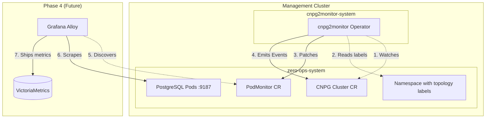

# CNPG Provisioning - Design Specification

**Version:** 1.0  
**Status:** DRAFT  
**Created:** 2026-03-10  
**Based on:** Requirements v1.0, Reference Patterns (34 documented), BDD Test Cases  

---

## 1. Executive Summary

This design specification defines the technical architecture for Phase 2 CNPG provisioning: the Platform Database deployment and the `cnpg2monitor` Kubernetes operator. The design implements Option 1 (PodMonitor Patcher) approach, leveraging CNPG's built-in `enablePodMonitor: true` feature while adding zero-touch topology label injection and AI correlation event emission.

**Key Design Decisions:**
- Single-namespace scope (Management Cluster only)
- Server-Side Apply for field-level ownership
- Event-driven reconciliation with sync-period fallback
- Annotation-based state tracking to prevent duplicate events

---

## 2. System Architecture

### 2.1 Component Overview



### 2.2 Data Flow Architecture

**Phase 2 (Current Scope):**
1. CNPG Operator provisions PostgreSQL cluster
2. CNPG Operator creates base PodMonitor (no relabelings)
3. cnpg2monitor detects CNPG Cluster with `nutgraf.in/monitored: "true"`
4. cnpg2monitor reads topology labels from namespace
5. cnpg2monitor patches PodMonitor with relabelings via SSA
6. cnpg2monitor emits K8s Events for lifecycle changes

**Phase 4 Integration:**
7. Grafana Alloy discovers PodMonitor via label selector
8. Alloy scrapes PostgreSQL pods, applies relabelings
9. Alloy ships labeled metrics to VictoriaMetrics

---

## 3. Operator Design

### 3.1 Controller Architecture

**Based on Reference Pattern P2.1 (Controller Struct with Embedded Client):**

```go
type Cnpg2Monitor struct {
    Client     client.Client
    Log        logr.Logger
    Scheme     *runtime.Scheme
    Recorder   record.EventRecorder
    SyncPeriod time.Duration
    Config     Config
    retryCounters sync.Map // map[types.NamespacedName]int for PodMonitor retry tracking
}

type Config struct {
    MonitoringNamespace string
    EnableEventEmission bool
    TopologyLabelPrefix string
}
```

### 3.2 Watch Configuration

**Based on Reference Pattern P2.2 (Predicate-Based Event Filtering):**

```go
func (r *Cnpg2Monitor) SetupWithManager(mgr ctrl.Manager) error {
    return ctrl.NewControllerManagedBy(mgr).
        For(&cnpgv1.Cluster{}, builder.WithPredicates(
            predicate.NewPredicateFuncs(func(obj client.Object) bool {
                labels := obj.GetLabels()
                return labels != nil && labels["nutgraf.in/monitored"] == "true"
            }))).
        Watches(&corev1.Namespace{}, handler.EnqueueRequestsFromMapFunc(
            r.mapNamespaceToCluster)).
        Watches(&monitoringv1.PodMonitor{}, handler.EnqueueRequestsFromMapFunc(
            r.mapPodMonitorToCluster)).
        Complete(r)
}
```

**Watch Strategy:**
- **Primary:** CNPG Clusters with `nutgraf.in/monitored: "true"` label
- **Secondary:** Namespace events (for topology label changes)
- **Tertiary:** PodMonitor events (for creation detection)

### 3.3 Reconciliation Logic

**Based on Reference Pattern P4.1-P4.4 (Reconciliation Patterns):**

```go
func (r *Cnpg2Monitor) Reconcile(ctx context.Context, req ctrl.Request) (ctrl.Result, error) {
    log := r.Log.WithValues("cnpgCluster", req.NamespacedName)
    
    // Phase 1: Observe - fetch all state, no writes
    state, err := r.observe(ctx, req)
    if err != nil {
        return ctrl.Result{}, err
    }
    
    if state.cluster == nil {
        return r.handleDeletion(ctx, req.NamespacedName)
    }
    
    // Phase 2: Analyze - pure function, determines desired actions
    actions := r.analyze(state)
    
    // Phase 3: Act - execute writes based on actions
    return r.act(ctx, state, actions)
}

func (r *Cnpg2Monitor) observe(ctx context.Context, req ctrl.Request) (*observedState, error) {
    // Fetch CNPG Cluster
    cnpgCluster := &cnpgv1.Cluster{}
    if err := r.Client.Get(ctx, req.NamespacedName, cnpgCluster); err != nil {
        if client.IgnoreNotFound(err) != nil {
            return nil, err
        }
        return &observedState{cluster: nil}, nil
    }
    
    // Early validation
    if !r.hasMonitoringLabel(cnpgCluster) {
        return &observedState{cluster: cnpgCluster, skipReason: "missing monitoring label"}, nil
    }
    
    if !r.hasPodMonitorEnabled(cnpgCluster) {
        return &observedState{cluster: cnpgCluster, skipReason: "enablePodMonitor disabled"}, nil
    }
    
    // Check cluster readiness
    if cnpgCluster.Status.Phase != apiv1.PhaseHealthy {
        return &observedState{cluster: cnpgCluster, skipReason: "cluster not healthy"}, nil
    }
    
    // Find PodMonitor and topology labels
    podMonitor, err := r.findPodMonitor(ctx, cnpgCluster)
    topologyLabels, err2 := r.getTopologyLabels(ctx, cnpgCluster.Namespace)
    
    return &observedState{
        cluster: cnpgCluster,
        podMonitor: podMonitor,
        podMonitorErr: err,
        topologyLabels: topologyLabels,
        topologyErr: err2,
    }, nil
}
```

---

## 4. Server-Side Apply Implementation

### 4.1 SSA Patch Strategy

**Based on Requirements NFR2.2 and Reference Pattern P4.4:**

```go
func (r *Cnpg2Monitor) patchPodMonitor(ctx context.Context, 
    podMonitor *monitoringv1.PodMonitor, 
    topologyLabels map[string]string) error {
    
    // Build relabelings array with deterministic ordering
    keys := make([]string, 0, len(topologyLabels))
    for k := range topologyLabels {
        keys = append(keys, k)
    }
    sort.Strings(keys)
    
    relabelings := []monitoringv1.RelabelConfig{}
    for _, k := range keys {
        relabelings = append(relabelings, monitoringv1.RelabelConfig{
            TargetLabel: k,
            Replacement: topologyLabels[k],
        })
    }
    
    // Construct SSA patch targeting specific array element
    patch := &monitoringv1.PodMonitor{
        ObjectMeta: metav1.ObjectMeta{
            Name:      podMonitor.Name,
            Namespace: podMonitor.Namespace,
            Labels: map[string]string{
                "nutgraf.in/monitored": "true", // Restore if missing
            },
        },
        Spec: monitoringv1.PodMonitorSpec{
            PodMetricsEndpoints: []monitoringv1.PodMetricsEndpoint{
                {
                    Port:        "metrics", // Merge key
                    Relabelings: relabelings,
                },
            },
        },
    }
    
    // Apply with field manager ownership
    return r.Patch(ctx, patch, client.Apply, 
        client.ForceOwnership, 
        client.FieldOwner("cnpg2monitor"))
}
```

**SSA Field Ownership:**
- `spec.podMetricsEndpoints[port=metrics].relabelings` - cnpg2monitor owns
- `metadata.labels.nutgraf.in/monitored` - cnpg2monitor owns
- All other fields - CNPG owns

### 4.2 Missing Topology Labels Handling

```go
func (r *Cnpg2Monitor) handleMissingTopologyLabels(ctx context.Context,
    cnpgCluster *cnpgv1.Cluster,
    podMonitor *monitoringv1.PodMonitor) (ctrl.Result, error) {
    
    // Emit warning event
    r.Recorder.Event(cnpgCluster, corev1.EventTypeWarning,
        "CNPGTopologyLabelsMissing",
        "Namespace missing required nutgraf.in/* topology labels")
    
    // Remove monitored label to prevent Alloy discovery using strategic merge patch
    patch := map[string]interface{}{
        "metadata": map[string]interface{}{
            "labels": map[string]interface{}{
                "nutgraf.in/monitored": nil, // Delete label
            },
        },
    }
    
    if err := r.Patch(ctx, podMonitor, client.StrategicMergeFrom(podMonitor), 
        client.RawPatch(types.StrategicMergePatchType, patchBytes)); err != nil {
        return ctrl.Result{}, err
    }
    
    return ctrl.Result{RequeueAfter: r.SyncPeriod}, nil
}
```

---

## 5. Event Emission Design

### 5.1 Annotation-Based State Tracking

**Based on Requirements FR3.3:**

```go
const (
    MonitoredLabel = "nutgraf.in/monitored"
    TopologyLabelPrefix = "nutgraf.in/"
    CNPGClusterLabel = "postgresql.cnpg.io/cluster"
    LastScaledInstancesAnnotation = "cnpg2monitor.nutgraf.in/last-scaled-instances"
    LastConfigGenerationAnnotation = "cnpg2monitor.nutgraf.in/last-config-generation"
    LastStorageGenerationAnnotation = "cnpg2monitor.nutgraf.in/last-storage-generation"
)

func (r *Cnpg2Monitor) emitLifecycleEvents(ctx context.Context, 
    cnpgCluster *cnpgv1.Cluster) error {
    
    // Check for scaling events
    if err := r.checkScalingEvent(ctx, cnpgCluster); err != nil {
        return err
    }
    
    // Check for config events
    if err := r.checkConfigEvent(ctx, cnpgCluster); err != nil {
        return err
    }
    
    // Check for storage events
    if err := r.checkStorageEvent(ctx, cnpgCluster); err != nil {
        return err
    }
    
    return nil
}
```

### 5.2 Level-Based Event Detection

```go
func (r *Cnpg2Monitor) checkScalingEvent(ctx context.Context, 
    cnpgCluster *cnpgv1.Cluster) error {
    
    currentInstances := cnpgCluster.Status.ReadyInstances
    specInstances := cnpgCluster.Spec.Instances
    
    // Only emit if ready instances match spec (scaling complete)
    if currentInstances != specInstances {
        return nil
    }
    
    // Check if already processed
    lastInstances := cnpgCluster.Annotations[LastScaledInstancesAnnotation]
    if lastInstances == fmt.Sprintf("%d", currentInstances) {
        return nil // Already processed
    }
    
    // Emit event
    r.Recorder.Event(cnpgCluster, corev1.EventTypeNormal, "CNPGScaled",
        fmt.Sprintf("Cluster scaled to %d instances", currentInstances))
    
    // Update annotation
    return r.updateAnnotation(ctx, cnpgCluster, 
        LastScaledInstancesAnnotation, 
        fmt.Sprintf("%d", currentInstances))
}

func (r *Cnpg2Monitor) checkConfigEvent(ctx context.Context, 
    cnpgCluster *cnpgv1.Cluster) error {
    
    // Only emit if cluster is healthy and observed generation matches
    if cnpgCluster.Status.Phase != apiv1.PhaseHealthy {
        return nil
    }
    
    if cnpgCluster.Status.ObservedGeneration != cnpgCluster.Generation {
        return nil
    }
    
    // Check if already processed
    lastGeneration := cnpgCluster.Annotations[LastConfigGenerationAnnotation]
    currentGeneration := fmt.Sprintf("%d", cnpgCluster.Generation)
    
    if lastGeneration == currentGeneration {
        return nil // Already processed
    }
    
    // Emit event
    r.Recorder.Event(cnpgCluster, corev1.EventTypeNormal, "CNPGConfigChanged",
        "PostgreSQL configuration successfully applied")
    
    // Update annotation
    return r.updateAnnotation(ctx, cnpgCluster, 
        LastConfigGenerationAnnotation, 
        currentGeneration)
}
```

---

## 6. Namespace Label Mapping

### 6.1 EnqueueRequestsFromMapFunc Implementation

**Based on Requirements FR3.2 Implementation Note:**

```go
func (r *Cnpg2Monitor) mapNamespaceToCluster(ctx context.Context, obj client.Object) []reconcile.Request {
    namespace := obj.(*corev1.Namespace)
    
    // Find all CNPG Clusters in this namespace (always enqueue for reconciliation decision)
    clusterList := &cnpgv1.ClusterList{}
    if err := r.List(ctx, clusterList, 
        client.InNamespace(namespace.Name)); err != nil {
        return nil
    }
    
    var requests []reconcile.Request
    for _, cluster := range clusterList.Items {
        if cluster.Labels["nutgraf.in/monitored"] == "true" {
            requests = append(requests, reconcile.Request{
                NamespacedName: types.NamespacedName{
                    Name:      cluster.Name,
                    Namespace: cluster.Namespace,
                },
            })
        }
    }
    
    return requests
}
```

### 6.2 PodMonitor Creation Detection

```go
func (r *Cnpg2Monitor) mapPodMonitorToCluster(ctx context.Context, obj client.Object) []reconcile.Request {
    podMonitor := obj.(*monitoringv1.PodMonitor)
    
    // Extract cluster name from selector
    clusterName := ""
    if podMonitor.Spec.Selector.MatchLabels != nil {
        clusterName = podMonitor.Spec.Selector.MatchLabels["postgresql.cnpg.io/cluster"]
    }
    
    if clusterName == "" {
        return nil
    }
    
    // Check if corresponding CNPG Cluster has monitoring enabled
    cluster := &cnpgv1.Cluster{}
    key := types.NamespacedName{Name: clusterName, Namespace: podMonitor.Namespace}
    
    if err := r.Get(ctx, key, cluster); err != nil {
        return nil
    }
    
    if cluster.Labels["nutgraf.in/monitored"] != "true" {
        return nil
    }
    
    return []reconcile.Request{{NamespacedName: key}}
}
```

---

## 7. Configuration & Deployment Design

### 7.1 Environment Configuration

**Based on Reference Pattern P3.1 (Environment Variable Configuration):**

```go
func LoadConfigFromEnv() Config {
    return Config{
        MonitoringNamespace: getEnvOrDefault("MONITORING_NAMESPACE", "zero-ops-system"),
        EnableEventEmission: parseBoolEnv("ENABLE_EVENT_EMISSION", true),
        TopologyLabelPrefix: getEnvOrDefault("TOPOLOGY_LABEL_PREFIX", "nutgraf.in/"),
    }
}

func getEnvOrDefault(key, defaultValue string) string {
    if value := os.Getenv(key); value != "" {
        return value
    }
    return defaultValue
}

func parseBoolEnv(key string, defaultValue bool) bool {
    if value := os.Getenv(key); value != "" {
        parsed, err := strconv.ParseBool(value)
        if err != nil {
            return defaultValue
        }
        return parsed
    }
    return defaultValue
}
```

### 7.2 Manager Setup

**Based on Reference Patterns P1.1-P1.4 (Main Entrypoint Patterns):**

```go
func main() {
    var (
        metricsAddr     = flag.String("metrics-bind-address", ":8080", "Metrics server bind address")
        probeAddr       = flag.String("health-probe-bind-address", ":8081", "Health probe bind address")
        syncDuration    = flag.Duration("sync-duration", 30*time.Second, "Reconciliation sync period")
        enableDebug     = flag.Bool("debug", false, "Enable debug logging")
        kubeQPS         = flag.Int("kube-qps", 20, "Kubernetes API QPS limit")
        kubeBurst       = flag.Int("kube-burst", 30, "Kubernetes API burst limit")
    )
    flag.Parse()
    
    // Setup logging
    opts := zap.Options{Development: *enableDebug}
    ctrl.SetLogger(zap.New(zap.UseFlagOptions(&opts)))
    
    // Load configuration
    config := LoadConfigFromEnv()
    
    // Setup manager with namespace restriction
    mgr, err := ctrl.NewManager(ctrl.GetConfigOrDie(), ctrl.Options{
        Scheme:                 scheme,
        MetricsBindAddress:     *metricsAddr,
        HealthProbeBindAddress: *probeAddr,
        Cache: cache.Options{
            Namespaces: []string{config.MonitoringNamespace},
        },
    })
    if err != nil {
        setupLog.Error(err, "unable to start manager")
        os.Exit(1)
    }
    
    // Tune REST config
    mgr.GetConfig().QPS = float32(*kubeQPS)
    mgr.GetConfig().Burst = *kubeBurst
    
    // Setup controller
    if err = (&Cnpg2Monitor{
        Client:     mgr.GetClient(),
        Log:        ctrl.Log.WithName("controllers").WithName("Cnpg2Monitor"),
        Scheme:     mgr.GetScheme(),
        Recorder:   mgr.GetEventRecorderFor("cnpg2monitor"),
        SyncPeriod: *syncDuration,
        Config:     config,
    }).SetupWithManager(mgr); err != nil {
        setupLog.Error(err, "unable to create controller", "controller", "Cnpg2Monitor")
        os.Exit(1)
    }
    
    // Setup health checks
    if err := mgr.AddHealthzCheck("healthz", healthz.Ping); err != nil {
        setupLog.Error(err, "unable to set up health check")
        os.Exit(1)
    }
    if err := mgr.AddReadyzCheck("readyz", healthz.Ping); err != nil {
        setupLog.Error(err, "unable to set up ready check")
        os.Exit(1)
    }
    
    setupLog.Info("starting manager")
    if err := mgr.Start(ctrl.SetupSignalHandler()); err != nil {
        setupLog.Error(err, "problem running manager")
        os.Exit(1)
    }
}
```

---

## 8. RBAC Design

### 8.1 Cross-Namespace RBAC Pattern

**Based on Requirements DR1.2:**

```go
// +kubebuilder:rbac:groups=postgresql.cnpg.io,resources=clusters,verbs=get;list;watch,namespace=zero-ops-system
// +kubebuilder:rbac:groups=monitoring.coreos.com,resources=podmonitors,verbs=get;list;watch;patch,namespace=zero-ops-system
// +kubebuilder:rbac:groups=core,resources=events,verbs=create;patch,namespace=zero-ops-system
// +kubebuilder:rbac:groups=core,resources=namespaces,verbs=get;list;watch

type Cnpg2Monitor struct {
    client.Client
    // ... other fields
}
```

**Generated RBAC Resources:**
```yaml
apiVersion: v1
kind: ServiceAccount
metadata:
  name: cnpg2monitor
  namespace: cnpg2monitor-system
---
apiVersion: rbac.authorization.k8s.io/v1
kind: Role
metadata:
  name: cnpg2monitor-role
  namespace: zero-ops-system
rules:
- apiGroups: ["postgresql.cnpg.io"]
  resources: ["clusters"]
  verbs: ["get", "list", "watch"]
- apiGroups: ["monitoring.coreos.com"]
  resources: ["podmonitors"]
  verbs: ["get", "list", "watch", "patch"]
- apiGroups: [""]
  resources: ["events"]
  verbs: ["create", "patch"]
---
apiVersion: rbac.authorization.k8s.io/v1
kind: ClusterRole
metadata:
  name: cnpg2monitor-namespace-reader
rules:
- apiGroups: [""]
  resources: ["namespaces"]
  verbs: ["get", "list", "watch"]
---
apiVersion: rbac.authorization.k8s.io/v1
kind: RoleBinding
metadata:
  name: cnpg2monitor-rolebinding
  namespace: zero-ops-system
subjects:
- kind: ServiceAccount
  name: cnpg2monitor
  namespace: cnpg2monitor-system
roleRef:
  kind: Role
  name: cnpg2monitor-role
  apiGroup: rbac.authorization.k8s.io
---
apiVersion: rbac.authorization.k8s.io/v1
kind: ClusterRoleBinding
metadata:
  name: cnpg2monitor-namespace-reader-binding
subjects:
- kind: ServiceAccount
  name: cnpg2monitor
  namespace: cnpg2monitor-system
roleRef:
  kind: ClusterRole
  name: cnpg2monitor-namespace-reader
  apiGroup: rbac.authorization.k8s.io
```

---

## 9. Metrics & Observability Design

### 9.1 Prometheus Metrics

**Based on Reference Pattern P5.1 (Prometheus Metrics Registration):**

```go
var (
    podMonitorsCreatedTotal = prometheus.NewCounter(prometheus.CounterOpts{
        Name: "cnpg2monitor_podmonitors_created_total",
        Help: "Total number of PodMonitors created",
    })
    podMonitorsUpdatedTotal = prometheus.NewCounter(prometheus.CounterOpts{
        Name: "cnpg2monitor_podmonitors_updated_total",
        Help: "Total number of PodMonitors updated",
    })
    eventsEmittedTotal = prometheus.NewCounterVec(prometheus.CounterOpts{
        Name: "cnpg2monitor_events_emitted_total",
        Help: "Total number of K8s Events emitted",
    }, []string{"reason"})
    reconcileErrorsTotal = prometheus.NewCounterVec(prometheus.CounterOpts{
        Name: "cnpg2monitor_reconcile_errors_total",
        Help: "Total number of reconciliation errors",
    }, []string{"error_type"})
)

func init() {
    metrics.Registry.MustRegister(
        podMonitorsCreatedTotal,
        podMonitorsUpdatedTotal,
        eventsEmittedTotal,
        reconcileErrorsTotal,
    )
}
```

### 9.2 Structured Logging

**Based on Reference Pattern P5.2 (Structured Logging with Context):**

```go
func (r *Cnpg2Monitor) Reconcile(ctx context.Context, req ctrl.Request) (ctrl.Result, error) {
    log := r.Log.WithValues("cnpgCluster", req.NamespacedName)
    
    log.Info("Starting reconciliation")
    
    // ... reconciliation logic ...
    
    log.V(1).Info("Checking topology labels", "labels", topologyLabels)
    log.Info("PodMonitor patched successfully", "podMonitor", podMonitor.Name)
    
    return ctrl.Result{RequeueAfter: r.SyncPeriod}, nil
}
```

---

## 10. Testing Strategy

### 10.1 BDD Test Implementation

**Based on `.kiro/specs/tenant-onboarding/cnpg-provisioning/e2e-bdd.md`:**

**Suite 1: Platform Database Bootstrap**
- Scenario 1.1: High Availability Cluster Provisioning
- Scenario 1.2: Post-Init SQL and Database Owner Verification  
- Scenario 1.3: Secret Generation for API Consumption

**Suite 2: cnpg2monitor Operator Auto-Wiring**
- Scenario 2.1: Topology Label Injection (The Golden Path)
- Scenario 2.2: Ignoring Unmonitored Databases
- Scenario 2.3: Dynamic Namespace Label Updates

**Suite 3: AI Correlation Event Emission**
- Scenario 3.1: Emitting Scale Events
- Scenario 3.2: Emitting PostgreSQL Config Change Events

### 10.2 Test Environment Setup

```go
// Test helper functions for BDD scenarios
func createTestCNPGCluster(name, namespace string, monitored bool) *cnpgv1.Cluster {
    labels := map[string]string{}
    if monitored {
        labels["nutgraf.in/monitored"] = "true"
    }
    
    return &cnpgv1.Cluster{
        ObjectMeta: metav1.ObjectMeta{
            Name:      name,
            Namespace: namespace,
            Labels:    labels,
        },
        Spec: cnpgv1.ClusterSpec{
            Instances: 3,
            Monitoring: cnpgv1.MonitoringConfiguration{
                EnablePodMonitor: true,
            },
        },
    }
}

func createTestNamespaceWithTopologyLabels(name string) *corev1.Namespace {
    return &corev1.Namespace{
        ObjectMeta: metav1.ObjectMeta{
            Name: name,
            Labels: map[string]string{
                "nutgraf.in/cluster_id":        "mothership",
                "nutgraf.in/region":            "fsn1",
                "nutgraf.in/cloud_provider":    "hetzner",
                "nutgraf.in/availability_zone": "fsn1-dc14",
                "nutgraf.in/cluster_class":     "management",
            },
        },
    }
}
```

---

## 11. Error Handling & Edge Cases

### 11.1 Race Condition Handling

```go
func (r *Cnpg2Monitor) handlePodMonitorNotFound(ctx context.Context, 
    cnpgCluster *cnpgv1.Cluster, err error) (ctrl.Result, error) {
    
    if !client.IgnoreNotFound(err) != nil {
        return ctrl.Result{}, err
    }
    
    // Increment retry counter
    retryCount := r.getRetryCount(cnpgCluster)
    if retryCount >= 5 {
        // Emit warning and rely on sync period
        r.Recorder.Event(cnpgCluster, corev1.EventTypeWarning,
            "CNPGPodMonitorNotFound",
            "CNPG PodMonitor not found after 5 retries, waiting for sync cycle")
        
        r.clearRetryCount(cnpgCluster)
        return ctrl.Result{RequeueAfter: r.SyncPeriod}, nil
    }
    
    // Increment and requeue with backoff
    r.incrementRetryCount(cnpgCluster)
    return ctrl.Result{RequeueAfter: 2 * time.Second}, nil
}
```

### 11.2 Graceful Degradation

```go
func (r *Cnpg2Monitor) handleDeletion(ctx context.Context, 
    namespacedName types.NamespacedName) (ctrl.Result, error) {
    
    // CNPG Cluster deleted - PodMonitor cleanup handled by CNPG's OwnerReference
    // No action needed from cnpg2monitor
    
    r.Log.Info("CNPG Cluster deleted, cleanup handled by CNPG", 
        "cluster", namespacedName)
    
    return ctrl.Result{}, nil
}
```

---

## 12. Future Enhancements

### 12.1 Phase 3 Multi-Tenant Support

**Design Changes Required:**
- Upgrade from Role/RoleBinding to ClusterRole/ClusterRoleBinding
- Remove namespace cache restriction
- Add namespace filtering logic
- Implement tenant isolation validation

### 12.2 Phase 4 Integration Validation

**Integration Points:**
- Grafana Alloy PodMonitor discovery validation
- VictoriaMetrics metric flow verification
- OpenSearch event correlation testing

### 12.3 Phase 7 AI Diagnostics Enhancement

**Event Enrichment:**
- Add structured event metadata
- Include performance metrics in events
- Implement event correlation IDs

---

## 13. Security Considerations

### 13.1 Least Privilege Implementation

- Operator runs with minimal RBAC permissions
- No access to PostgreSQL connection secrets
- Field-level SSA ownership prevents privilege escalation
- Cross-namespace RoleBinding follows Kubernetes security model

### 13.2 Data Protection

- Topology labels contain no sensitive information
- Events contain no database credentials
- Metrics scraping uses Kubernetes ServiceAccount tokens only

---

**Document Owner:** Platform Architecture Team  
**Reviewers:** Senior Platform Engineers, Security Team  
**Approval Required:** Technical Lead, Product Owner  
**Next Phase:** Task Specification (tasks.md)