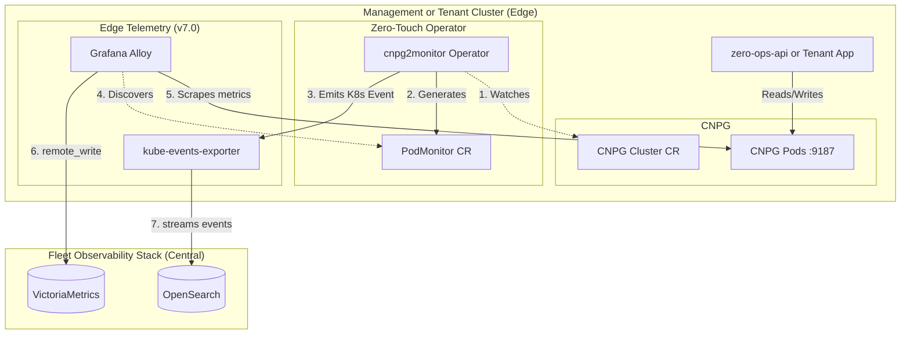

# Product Requirements Document: Platform Database & Zero-Touch Monitoring Operator (`cnpg2monitor`)

**Version:** 2.0 (v7.0 Architecture Aligned)  
**Status:** APPROVED  
**Project Name:** Zero-Ops Platform (Phase 2)  
**Author:** Senior Platform Architecture Team  

---

## 1. Executive Summary

This initiative delivers the highly available Platform Database (`zero-ops-platform-db`) via CloudNativePG (CNPG) and introduces the `cnpg2monitor` Kubernetes operator, fully aligned with the Zero-Ops v7.0 Fleet Observability Stack. Targeted at Platform Engineers, this ensures the core SaaS backend (`zero-ops-api`) has a resilient state store. Furthermore, it delivers edge-native, zero-touch observability: whenever a CNPG database is provisioned, `cnpg2monitor` automatically discovers it, generates an edge-scraping configuration for **Grafana Alloy**, and injects v7.0 fleet topology labels (`cluster_id`, `region`, etc.). This guarantees that all metrics reach the central **VictoriaMetrics** and all lifecycle events reach **OpenSearch** for immediate AI-agent correlation.

---

## 2. Problem Statement

### **Current State**
The Management Cluster currently has the CloudNativePG operator installed, but lacks the relational database required to run the `zero-ops-api`. In the v7.0 architecture, metrics are collected at the edge by Grafana Alloy and shipped to a central VictoriaMetrics cluster, while events go to OpenSearch. Currently, CNPG databases do not automatically configure themselves for Alloy scraping, nor do they inject the required fleet-wide topology labels necessary for cross-cluster AI correlation.

### **Gap / Motivation**
We cannot proceed with Phase 2 (SaaS API) without a running platform database. Additionally, to support the v7.0 Multi-Agent Collaboration System, the `MetricsAgent` and `DiagnosticsAgent` require metrics to be perfectly labeled by region, cloud, and cluster, and require an event timeline. Relying on humans to manually configure `ServiceMonitors` or tag metrics per-database defeats the "Zero-Ops" promise. 

### **Constraints & Non-Goals**
**Constraints:**
- **Edge Collection Only:** Metrics must be collected locally inside the cluster by Grafana Alloy, then shipped via `remote_write`. The operator must *not* attempt to scrape metrics centrally.
- **Topology Labeling:** The operator must successfully inject `cluster_id`, `shard_id`, `region`, `cloud_provider`, and `availability_zone` into the generated monitoring CRDs.
- **Event-Driven:** Must use Kubernetes Informers (no polling).

**Non-Goals:**
- Deploying the actual VictoriaMetrics or OpenSearch clusters (handled in Phase 4).
- Modifying the core CNPG operator or Grafana Alloy binaries.
- Executing heavy SQL-based checks (like index bloat) from this operator. (Those are handled by `postgres-ai` queries running against the DB via the `DiagnosticsAgent` or scheduled `pg_index_pilot` jobs).

---

## 3. User Personas & User Journeys

*Note: These journeys are written to facilitate Behavior-Driven Development (BDD) test case generation.*

### **3.1 Personas**
- **Platform Admin:** Deploys the `zero-ops-platform-db` and expects the platform to self-monitor instantly.
- **Tenant Developer:** Provisions BYOC Postgres clusters via the CLI and expects instant visibility in Grafana without touching YAML.

### **3.2 End-to-End User Journeys**

#### **Journey A: Platform Database Bootstrap & Connection (First-Time Setup)**
- **Trigger:** Platform Admin applies the `zero-ops-platform-db` CNPG `Cluster` manifest.
- **Actions:** K8s schedules 3 CNPG instances. The CNPG operator provisions the `zeroops` database and creates the `zero-ops-platform-db-app` Secret.
- **System Response:** The `zero-ops-api` Pod starts, mounts the Secret via environment variables, connects to the database, and runs its initial schema migrations.
- **Error States:** If CNPG fails to schedule (e.g., PVC failure), the `zero-ops-api` crash-loops. K8s events are fired and captured by OpenSearch for the `DiagnosticsAgent` to debug.

#### **Journey B: Edge Telemetry Auto-Wiring (Day-1 Observability)**
- **Trigger:** A new CNPG `Cluster` resource labeled `nutgraf.in/monitored: "true"` becomes `Ready` in a namespace.
- **Actions:** The `cnpg2monitor` operator receives the `Add`/`Update` event.
- **System Response:** 
  1. The operator reads the topology labels from the Namespace (e.g., `nutgraf.in/region=eu-central-1`).
  2. The operator creates a Prometheus-operator compatible `PodMonitor` resource targeting the CNPG pods.
  3. The `PodMonitor` includes `relabelings` that hardcode the fleet topology attributes.
  4. Grafana Alloy (running at the edge) detects the `PodMonitor` and begins scraping the CNPG pods, forwarding perfectly tagged data to VictoriaMetrics.

#### **Journey C: Infrastructure Change Event Correlation (Day-2 Operations)**
- **Trigger:** A tenant scales their CNPG cluster from 3 to 5 replicas.
- **Actions:** The `cnpg2monitor` operator detects the `Spec` change in the `Cluster` resource.
- **System Response:** The operator emits a standard Kubernetes `Event` of type `Normal` with reason `CNPGClusterScaled`. The edge `kube-events-exporter` captures this event and streams it to the OpenSearch `k8s-events` index, making it available for the `DiagnosticsAgent` to query during future anomalies.

---

## 4. Proposed Architecture

### **4.1 High-Level Flow**



### **4.2 Components & Responsibilities**

| Component | Implementation Choice | Responsibility |
| :--- | :--- | :--- |
| **Platform DB** | CloudNativePG (`Cluster` CR) | Highly available PostgreSQL storing SaaS state. |
| **cnpg2monitor** | Go Operator (`controller-runtime`) | Watches CNPG Clusters, translates namespace metadata into `PodMonitor` CRs, and emits correlation events. |
| **PodMonitor** | `monitoring.coreos.com/v1` CR | Declarative scrape configuration. Supported natively by Grafana Alloy's `prometheus.operator.podmonitors` component. |
| **Grafana Alloy** | Helm Chart (DaemonSet) | Edge collector. Finds `PodMonitors`, scrapes CNPG `9187` metrics port, and pushes to VictoriaMetrics. |

### **4.3 Integration & Control Plane**
- **Label Propagation:** The operator relies on standard Zero-Ops Namespace labels (injected by CAPI/ArgoCD during tenant onboarding) to know the topology. It maps `nutgraf.in/region` to the PromQL `region` label via metric relabeling.
- **Scrape Target:** CloudNativePG natively exports Prometheus metrics on port `9187`. The operator simply tells Alloy where to look and what labels to attach.

---

## 5. Technical Specifications

### **5.1 Platform Changes**
1. **Platform Database Manifest:** Deploy the 3-node CNPG Cluster to `zero-ops-system`.
2. **`cnpg2monitor` Deployment:** Deploy the Go operator.
   - RBAC: `get, list, watch` on `postgresql.cnpg.io/v1 Clusters` and `v1 Namespaces`.
   - RBAC: `create, update, patch, delete` on `monitoring.coreos.com/v1 PodMonitors`.
   - RBAC: `create` on `events`.

### **5.2 Core Resources & APIs**

**Platform DB Manifest:**
```yaml
apiVersion: postgresql.cnpg.io/v1
kind: Cluster
metadata:
  name: zero-ops-platform-db
  namespace: zero-ops-system
  labels:
    nutgraf.in/monitored: "true"
spec:
  instances: 3
  storage:
    size: 20Gi
    storageClass: hcloud-volumes
  bootstrap:
    initdb:
      database: zeroops
      owner: zeroops-api
```

**Target PodMonitor (Generated by `cnpg2monitor`):**
```yaml
apiVersion: monitoring.coreos.com/v1
kind: PodMonitor
metadata:
  name: zero-ops-platform-db-monitor
  namespace: zero-ops-system
spec:
  selector:
    matchLabels:
      postgresql.cnpg.io/cluster: zero-ops-platform-db
  podMetricsEndpoints:
  - port: metrics
    relabelings:
    # Hardcoded fleet topology labels injected by the operator
    - targetLabel: cluster_id
      replacement: "mothership-01"
    - targetLabel: region
      replacement: "fsn1"
    - targetLabel: cloud_provider
      replacement: "hetzner"
    - targetLabel: cluster_class
      replacement: "management"
```

### **5.3 Defaulting & Automation Logic**
- **Namespace Metadata:** The operator queries the K8s `Namespace` of the CNPG cluster to extract `nutgraf.in/*` labels. It uses these to populate the `relabelings` array in the `PodMonitor`.
- **Event Generation:** On `Update` events where `oldCluster.Spec.Instances != newCluster.Spec.Instances`, the operator fires a K8s Event: `Type: Normal, Reason: CNPGScale, Message: "Cluster scaled from X to Y"`.

### **5.4 Operational Semantics (Lifecycle & Frequency) [REQUIRED]**
- **Kubernetes API Interactions (`cnpg2monitor`):**
  - *Startup:* Informer syncs all `Clusters` and `Namespaces` into local cache. No synchronous API calls.
  - *Runtime:* Reconciles on `Cluster` events. Generates/patches `PodMonitor` via Server-Side Apply (SSA).
  - *Frequency:* Only executes on resource state change. **Never** polls.
- **Edge Telemetry (Alloy):**
  - *Runtime:* Alloy watches `PodMonitors` continuously. When the operator creates the `PodMonitor`, Alloy dynamically updates its scrape targets in memory (no restart required) and begins scraping the DB every 15s.

### **5.5 Idiomatic Behavior & Anti-Patterns [REQUIRED]**
- **Idiomatic:**
  - Using Server-Side Apply (SSA) for the `PodMonitor` so the operator explicitly owns specific fields without fighting manual user edits.
  - Emitting K8s Events for state changes so the separate `kube-events-exporter` can stream them to OpenSearch anonymously.
- **Anti-Patterns (Implementers MUST NOT do the following):**
  - **MUST NOT** push metrics to VictoriaMetrics from the operator itself.
  - **MUST NOT** write events directly to OpenSearch API from the operator. (Rely entirely on Kubernetes standard events).
  - **MUST NOT** perform SQL queries against the databases from this operator.

### **5.6 Security, Compliance & Reliability**
- **Credential Safety:** By using `PodMonitors`, the operator does *not* need to read or handle PostgreSQL passwords. Alloy scrapes the pod metrics port natively using Kubernetes ServiceAccount tokens.
- **Network Boundaries:** Scraping stays within the local cluster network boundary. Metrics are shipped to VictoriaMetrics over mTLS.

---

## 6. User Journey Deep Dives (Scenario-Based)

### **Scenario 1: End-to-End Metric Labeling (v7.0 Core Requirement)**
**Actors:** Tenant Developer, `cnpg2monitor`, Grafana Alloy, VictoriaMetrics.
**Preconditions:** Tenant namespace `tenant-foo` exists with labels `nutgraf.in/region=us-east`.

**Step-by-Step Flow:**
1. **User Action:** Tenant creates a CNPG `Cluster` named `app-db`.
2. **Platform Action:** CNPG operator provisions the pods.
3. **Operator Action:** `cnpg2monitor` detects the `Cluster`. It queries the local cache for the `tenant-foo` Namespace object to read topology labels.
4. **Operator Action:** It generates a `PodMonitor` named `app-db-monitor` containing `relabelings` that enforce `region="us-east"`.
5. **Platform Action:** Grafana Alloy discovers the `PodMonitor`, scrapes `app-db` pods, attaches `region="us-east"`, and pushes to VictoriaMetrics.
6. **Agent Action:** The `MetricsAgent` can now successfully query `victoriametrics-mcp` with `{region="us-east"}` and find this database.

### **Scenario 2: Change Event Correlation for AI Diagnostics**
**Actors:** Tenant, `cnpg2monitor`, `kube-events-exporter`, OpenSearch.

**Step-by-Step Flow:**
1. **User Action:** Tenant updates the CNPG `Cluster` manifest to change PostgreSQL parameters (e.g., `shared_buffers`).
2. **Operator Action:** `cnpg2monitor` detects the `Spec.Postgresql.Parameters` change.
3. **Operator Action:** The operator uses the `record.EventRecorder` to emit a K8s Event: `"PostgreSQL parameters updated: shared_buffers changed"`.
4. **Platform Action:** `kube-events-exporter` (running as a DaemonSet) sees the K8s Event and streams it to the OpenSearch `k8s-events` index.
5. **Agent Action:** 10 minutes later, if the database crashes, the `DiagnosticsAgent` queries `opensearch-mcp`, finds the parameter change event, correlates it to the crash, and recommends a rollback.

---

## 7. Success Criteria & Acceptance Tests

**Database Provisioning (BDD Test Focus):**
- [ ] **Given** the Management Cluster is running, **When** the `zero-ops-platform-db` manifest is applied, **Then** 3 PostgreSQL pods reach the `Ready` state.
- [ ] **Given** the DB is ready, **When** `zero-ops-api` boots, **Then** it successfully connects and creates the `tenants` and `users` tables.

**Zero-Touch Observability (BDD Test Focus):**
- [ ] **Given** `cnpg2monitor` is running, **When** a CNPG Cluster is created in a labeled namespace, **Then** a `PodMonitor` is generated within 2 seconds.
- [ ] **Given** the generated `PodMonitor`, **Then** it contains `relabelings` mapping exactly to the namespace's `nutgraf.in/*` topology labels.
- [ ] **Given** a modification to the CNPG Cluster spec, **When** the operator processes the update, **Then** a K8s Event is successfully emitted to the cluster event stream.

**Verification Commands:**
```bash
# Verify Platform DB is up
kubectl get cluster zero-ops-platform-db -n zero-ops-system

# Verify Operator generated the PodMonitor with labels
kubectl get podmonitor zero-ops-platform-db-monitor -n zero-ops-system -o yaml | grep "relabelings" -A 10

# Verify Event Emission (simulating change correlation)
kubectl get events -n zero-ops-system --sort-by='.metadata.creationTimestamp' | grep "CNPG"