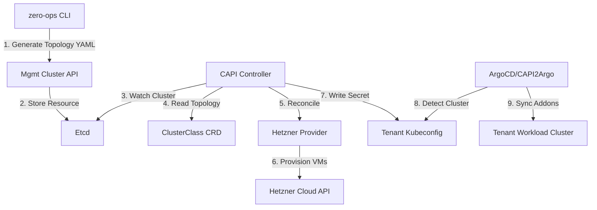

# Product Requirements Document: Zero-Ops Infrastructure Platform

**Version:** 1.1
**Status:** DRAFT
**Project Name:** zero-ops
**Author:** Product Architect / Platform Engineering Lead

---

## 1. Executive Summary
The **Zero-Ops Platform** is an opinionated, multi-tenant Kubernetes management system designed to replicate the "SaaS Mothership" operational model. It leverages a "Bring Your Own Cloud" (BYOC) architecture where the control plane is hosted by the platform (Management Cluster), while compute resources are provisioned in the tenant's own cloud account.

Targeting **Platform Engineers** (SaaS Admins) and **Tenant Developers** (Customers), this initiative delivers a "Thin Client" CLI (`zero-ops`) that acts strictly as a manifesto generator and API client. The core promise is to abstract infrastructure complexity using CAPI **ClusterClass** topologies, enabling the provisioning of production-grade, GitOps-ready clusters on Hetzner (MVP) and future providers (AWS) via a unified interface.

---

## 2. Problem Statement

### 2.1 Current State
Provisioning Kubernetes currently relies on imperative, client-side heavy workflows (scripts, manual `clusterctl` execution). There is no "Management Plane" holding the state of multiple tenants. "Day 2" operations (upgrades, scaling) require manual intervention on individual clusters, and there are no standardized blueprints (`ClusterClass`), leading to configuration drift across tenants.

### 2.2 Gap & Motivation
To operate as a SaaS, we cannot run logic on a developer's laptop. We need a centralized **Management Cluster** that acts as the source of truth.
*   **Missing:** A standardized bootstrapping process to create the self-hosted Management Cluster.
*   **Missing:** Definition of `ClusterClass` objects to template "Production" vs "Staging" topologies.
*   **Missing:** A thin CLI that generates topology-aware manifests rather than raw infrastructure calls.

### 2.3 Constraints & Non-Goals
*   **Thin Client Principle:** The `zero-ops` CLI must not maintain state. It communicates only with the Management Cluster's Kubernetes API.
*   **Topology First:** All clusters must be based on CAPI `ClusterClass`. No ad-hoc machine deployments.
*   **BYOC:** We do not pay for tenant compute resources; tenants provide their own Cloud API Credentials.

---

## 3. User Personas & User Journeys

### 3.1 Personas
*   **Platform Admin (SaaS Operator):** Responsible for the "Mothership." They bootstrap the Management Cluster, define `ClusterClasses`, and manage the CAPI providers.
*   **Tenant Developer (Customer):** Consumes the platform. They provide credentials and request clusters based on predefined "Flavors" (Classes).

### 3.2 End-to-End User Journeys

#### Journey A: Platform Bootstrap (The "Inception" - Platform Admin)
*   **Trigger:** Setting up the Zero-Ops SaaS infrastructure for the first time.
*   **Actions:**
    1.  Admin configures `zero-ops` with their own Hetzner credentials.
    2.  Runs `zero-ops mgmt bootstrap`.
*   **System Response:**
    1.  Creates ephemeral local Bootstrap Cluster (Kind).
    2.  Installs CAPI, CAPH (Hetzner), and CAPI Operator on Kind.
    3.  Provisions the **Permanent Management Cluster** on Hetzner.
    4.  Installs CAPI/CAPH components onto the new Remote Cluster.
    5.  Performs `clusterctl move` to migrate state from Kind to Remote.
    6.  **Crucial Step:** Applies standard `ClusterClass` definitions (e.g., `hetzner-prod-v1`, `hetzner-dev-v1`) to the Management Cluster.
*   **Outcome:** A self-hosted Management Cluster exists, reachable via public API, ready to accept tenant requests.

#### Journey B: Tenant Onboarding (Platform Admin)
*   **Trigger:** A new customer signs up.
*   **Actions:** Runs `zero-ops tenant onboard --name=acme-corp`.
*   **System Response:** Creates a Kubernetes Namespace (`tenant-acme-corp`) in the Management Cluster with restrictive RBAC/Quotas.
*   **Outcome:** Isolated tenant workspace ready.

#### Journey C: Tenant Cluster Provisioning (Tenant Developer)
*   **Trigger:** Tenant needs a Kubernetes cluster.
*   **Actions:**
    1.  Runs `zero-ops secret create --provider=hetzner --token=...` (creates Secret in their namespace).
    2.  Runs `zero-ops cluster create --name=prod-1 --class=hetzner-prod-v1 --workers=3`.
*   **System Response:** CLI generates a CAPI `Cluster` resource referencing the `hetzner-prod-v1` **ClusterClass**.
*   **Outcome:** CAPI controller reconciles the request using the topology defined in the Class, creating infrastructure in the tenant's account.

---

## 4. Proposed Architecture

### 4.1 High-Level Flow


### 4.2 Components & Responsibilities

| Component | Choice | Responsibility |
| :--- | :--- | :--- |
| **Thin CLI** | Go (Cobra) | User interface. Does not run terraform/ansible. Simply authenticates and applies YAMLs to the Mgmt Cluster. |
| **Mgmt Cluster** | K8s (Hetzner) | The SaaS control plane. Hosts the Controllers and Tenant Namespaces. |
| **Cluster Topology** | **ClusterClass** | Defines the "Blueprints" (e.g., CPX31 for Control Plane, CX21 for Workers). Abstracts infrastructure details from the tenant. |
| **Infra Provider** | CAPH | Talks to Hetzner API. |
| **GitOps Engine** | ArgoCD | Delivers Day-2 manifests (CNI, CSI, Metrics) to the tenant cluster once it creates. |
| **Tool Registry** | Go Interfaces | Internal CLI logic to swap tools (e.g., generating Flux manifests instead of ArgoCD if selected). |

---

## 5. Technical Specifications

### 5.1 Platform Changes & Configuration
*   **Bootstrap Config:** The CLI must embed default manifests for bootstrapping the Management Cluster (Cilium CNI, HCloud CCM, Cert-Manager).
*   **ClusterClass Definitions:**
    The `zero-ops` repo must contain a library of `ClusterClasses` to be applied during bootstrap.
    *   `hetzner-prod-v1`: HA Control Plane (3 nodes), Private Network, dedicated load balancer.
    *   `hetzner-dev-v1`: Single Control Plane, Public Network.

### 5.2 Core Resources & APIs (ClusterClass Strategy)
The core innovation is relying on `ClusterClass` to drive provisioning.

**Example `ClusterClass` Structure (Hetzner):**
```yaml
apiVersion: cluster.x-k8s.io/v1beta1
kind: ClusterClass
metadata:
  name: hetzner-prod-v1
spec:
  controlPlane:
    ref:
      kind: KubeadmControlPlaneTemplate
      name: hetzner-prod-control-plane
  infrastructure:
    ref:
      kind: HetznerClusterTemplate
      name: hetzner-prod-cluster
  workers:
    machineDeployments:
      - class: default-worker
        template:
          bootstrap:
            ref:
              kind: KubeadmConfigTemplate
              name: hetzner-prod-worker-boot
          infrastructure:
            ref:
              kind: HCloudMachineTemplate
              name: hetzner-prod-worker-infra
  variables:
    - name: region
      required: true
      schema: { type: string, default: "fsn1" }
```

### 5.3 CLI Architecture (The Registry)
The `zero-ops` CLI project structure must support the "Select your own tool" requirement via a Registry/Adapter pattern.

```text
pkg/
├── registry/               # Registry logic (Category -> Implementation)
└── provider/
    ├── infrastructure/
    │   ├── hetzner/        # Adapters for CAPH
    │   └── aws/            # Adapters for CAPA
    └── gitops/
        ├── argocd/         # Generates Argo App-of-Apps
        └── flux/           # Generates Flux Kustomizations
```

### 5.4 Security & Multi-Tenancy
*   **Infrastructure Secrets:** Tenant API tokens are stored in `Secret` resources within their specific namespace. CAPH uses the `--metrics-bind-addr=0` security context (default).
*   **Isolation:** The CLI uses `client-go` with the user's kubeconfig. The user (Tenant) only has RBAC access to their specific namespace in the Management Cluster.

---

## 6. User Journey Deep Dives (Scenario-Based)

### Scenario 1: Platform Admin Bootstraps the SaaS (The Inception)
**Actors:** Platform Admin, Local Docker Daemon, Hetzner Cloud.
**Preconditions:** `zero-ops` installed, `HCLOUD_TOKEN` set.

**Step-by-Step Flow:**
1.  **User:** Runs `zero-ops mgmt bootstrap --name=mothership --region=fsn1`.
2.  **CLI:**
    *   Creates local Kind cluster `bootstrap-kind`.
    *   Initializes `clusterctl init --infrastructure hetzner`.
    *   Waits for CAPI/CAPH pods to be Ready.
3.  **CLI (Provisioning):**
    *   Generates a `Cluster` manifest for the *real* Management Cluster (using `hetzner-prod-v1` specs manually constructed for bootstrap).
    *   Applies manifest to Kind.
    *   CAPH (on Kind) creates VMs, LB, and Network on Hetzner.
4.  **CLI (Pivot):**
    *   Retrieves Kubeconfig for the new Hetzner cluster.
    *   Installs CAPI/CAPH onto the new Hetzner cluster.
    *   Runs `clusterctl move --to-kubeconfig <new-cluster>`.
5.  **CLI (Configuration):**
    *   Applies the standard library of **ClusterClasses** (`hetzner-prod-v1`, `hetzner-dev-v1`) to the new cluster.
6.  **Success:** User receives message "Management Hub Ready". Kind cluster is deleted.

### Scenario 2: Tenant Provisions a Production Cluster
**Actors:** Tenant User, Management Cluster.
**Preconditions:** `hetzner-prod-v1` ClusterClass exists. Tenant namespace and Secret exist.

**Step-by-Step Flow:**
1.  **User:** Runs `zero-ops cluster create --name=web-app --class=hetzner-prod-v1 --workers=5`.
2.  **CLI:**
    *   Validates that the requested `ClusterClass` exists in the registry cache.
    *   Generates the following YAML:
        ```yaml
        kind: Cluster
        metadata: { name: web-app, namespace: tenant-a }
        spec:
          topology:
            class: hetzner-prod-v1
            version: v1.31.0
            workers:
              machineDeployments:
                - class: default-worker
                  replicas: 5
        ```
    *   Applies YAML to Management Cluster.
3.  **Platform:**
    *   CAPI reads the `Cluster` resource.
    *   Hydrates the topology from the `ClusterClass`.
    *   Creates/Updates underlying `HCloudMachine` resources.
4.  **Success:** CLI polls for `Cluster` status `Ready: true`.

---

## 7. Success Criteria & Acceptance Tests

### 7.1 Bootstrap Criteria
- [ ] **Self-Hosting:** The Management Cluster must be running on Hetzner, not Kind, after bootstrap completes.
- [ ] **Blueprint Availability:** `kubectl get clusterclasses -n caph-system` on the Management Cluster must list the default classes.

### 7.2 Provisioning Criteria
- [ ] **Topology Sync:** Creating a `Cluster` resource referencing a `ClusterClass` successfully provisions VMs.
- [ ] **Drift Detection:** Manually deleting a VM in the Hetzner Console results in CAPI automatically replacing it (Self-healing).

### 7.3 Thin Client Verification
- [ ] **No State:** Deleting the local `~/.zero-ops` config folder should not affect running clusters or the ability to manage them (as long as Kubeconfig to Management Cluster exists).
- [ ] **Multi-Tool:** The CLI code must contain interfaces `ClusterProvisioner` and `GitOpsInstaller`, allowing distinct implementations for Hetzner/AWS and Argo/Flux.