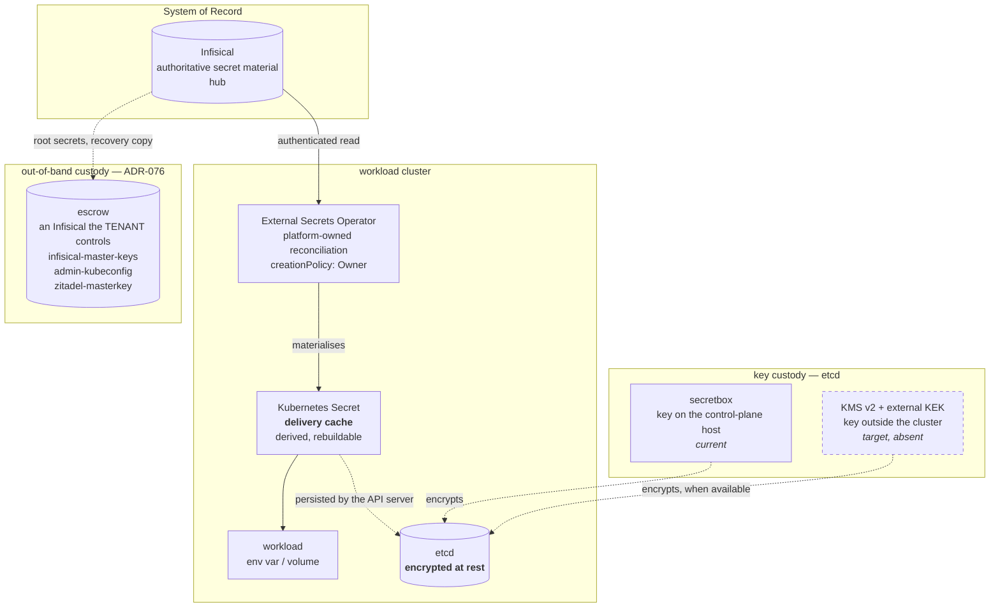

# ADR-003: Secret Management Architecture

**Date:** 2026-06-08 (rewritten)
**Status:** Accepted (rewritten — supersedes original ADR-003 and `bootstrap-vs-application-secrets.md`)

## Context

The platform manages secrets across multiple resource classes: bootstrap secrets for infrastructure initialization, tenant passwords for database access, spoke infrastructure credentials for cross-cluster connectivity, and application secrets for workload consumption. Each follows the same fundamental lifecycle: generation, storage, delivery, consumption, and rotation.

The original ADR-003 organized secret management around "who uploads what" (Pattern A/A2/A2a/A2b/B) rather than the underlying concerns that govern all secrets. The `bootstrap-vs-application-secrets.md` document addressed a specific ESO ownership conflict but accepted dual ownership as a necessary compromise. This rewrite consolidates both documents and restructures secret management around the five universal concerns.

All ownership assignments reference ADR-039. All controller responsibilities reference ADR-041. Day-0 vs Day-1 classification references ADR-040.

## Decision

### 1. Generation

Secret material is generated once by the authorized Generator defined in ADR-039.

| Secret Class | Generator | Phase | Idempotency |
|---|---|---|---|
| Bootstrap Secrets | CLI | Day-0 | CLI checks Infisical before generation; skips if exists |
| Application Secrets | Human / Infisical UI | Day-1+ | Manual — Infisical UI rejects duplicates |
| Tenant Passwords | Kube-SBT | Day-1+ | Tenant provisioning controller queries Infisical; generates only if missing and first-time |
| Spoke Infrastructure Credentials | Hub Operator | Day-1+ | Hub Operator queries Infisical; generates only if missing |
| Database Passwords (ESO-generated) | ESO (via Generator resources) | Day-1+ | ESO Generator resources handle idempotency |

**Constraints:**
- Generation is a one-time event. The Generator is distinct from the Lifecycle Owner — see ADR-039.
- All generated secrets use full-entropy cryptographically random values. No entropy weakening for URI formatting. Consumers apply URL-encoding at injection time.
- If a previously generated secret is missing from the System of Record, the Generator must fail reconciliation — it must never silently regenerate a secret that may be in use.

### 2. Storage

All secrets are stored in Infisical. Infisical is the System of Record for all secret material in the platform.

| Infisical Project | Type | Purpose |
|---|---|---|
| `hub-secrets` | `secret-manager` | Application secrets, bootstrap secrets, database credentials, infrastructure tokens |
| `hub-platform` | `cert-manager` | PKI infrastructure: Fleet Intermediate CA, certificate profiles |

**Constraints:**
- No Kubernetes Secret may serve as a secret's System of Record. Kubernetes Secrets are a delivery cache, not an authoritative store.
- Secrets must never be stored in Git, ConfigMaps, environment variables, or container images.

**PushSecret is banned. No exception.**

Two distinct layers enforce this ban:

1. **Technical (hard block):** ESO's Infisical provider throws `not implemented` for PushSecret. Infisical's API requires `workspaceId` + `environmentSlug` that ESO's generic PushSecret interface cannot dynamically map. The `InfisicalPushSecret` CRD and `infisical-operator` exist but are architecturally excluded for value authoring (see below).

2. **Architectural (ownership inversion):** Even if PushSecret were technically supported, the pattern inverts the ownership model: Kubernetes becomes the origin, Infisical becomes the mirror. This violates the invariant that Infisical is the System of Record. The correct flow is: generation authority writes directly to Infisical (API), ESO pulls to all consumers.

### 3. Delivery

ESO is the sole delivery mechanism for secrets from Infisical to Kubernetes. All ExternalSecrets reference the `hub-secrets` ClusterSecretStore.

| Secret Class | ExternalSecret `creationPolicy` | Rationale |
|---|---|---|
| Bootstrap Secrets | `Merge` | The CLI creates the initial Kubernetes Secret during Day-0. ESO keeps it synchronized with Infisical without taking ownership. |
| Application Secrets | `Owner` | ESO creates and owns the Kubernetes Secret. Infisical is the only source. |
| Tenant Passwords | `Owner` | ESO creates the Kubernetes Secret on the Spoke cluster. No Hub Kubernetes Secret exists. |
| Spoke Infrastructure Credentials | `Owner` | ESO creates the Kubernetes Secret on the Spoke cluster. Credentials are stored in Infisical (System of Record). Lifecycle owned by Hub Operator per ADR-039. |

**Spoke Delivery Path:**

Spoke clusters pull secrets from Hub Infisical via their own ESO instance and a namespaced SecretStore referencing the Hub Infisical backend. No secrets traverse Crossplane Composition Functions. No secrets are embedded in ClusterResourceSet payloads. See ADR-032 and ADR-035 for certificate and trust distribution (which follow different paths).

### 4. Consumption

Consumers read secrets from Kubernetes Secrets mounted as volumes or environment variables. They never access Infisical directly.

| Consumer | Secret Class | Consumption Method |
|---|---|---|
| CNPG | Bootstrap Secrets | Kubernetes Secret reference in Cluster spec |
| Infisical (self-hosted) | Bootstrap Secrets | Kubernetes Secret reference in Deployment |
| Crossplane provider-sql | Application / Tenant / Spoke Secrets | Kubernetes Secret reference in ProviderConfig or Role CR |
| Workloads (Ory, SPIRE, etc.) | Application Secrets | Kubernetes Secret mounted as volume or env |
| Tenant Applications | Tenant Passwords | Kubernetes Secret mounted as volume |
| Operators | Application Secrets | Kubernetes Secret reference |

**Constraints:**
- Consumers must not cache credentials indefinitely. Workloads must support rolling updates triggered by secret changes (via Stakater Reloader annotations or equivalent).
- Consumers of password values in DSN URLs must apply URL-encoding at injection time (`urlquery`). The stored secret must never be pre-encoded.
- Where a consumer requires a DSN URL, the Kubernetes Secret must also project individual components (`host`, `port`, `username`, `password`, `dbname`) alongside the opaque URL.

### 5. Rotation

Rotation follows a dual-phase model: the managed system (database) is updated before the System of Record (Infisical). ESO delivers the updated credential to Kubernetes as a downstream step.

```
Phase 1 — Update managed system first (zero-downtime window opens)
  ↓
ALTER ROLE <user> WITH PASSWORD '<new-password>'  ← Database altered FIRST
  ↓
Both old and new passwords valid simultaneously (overlap period)
  ↓
Update Infisical with new password  ← System of Record updated
  ↓
ESO detects change, syncs new password to Kubernetes Secret
  ↓
Applications pick up new credential (rolling restart or secret reload)
  ↓
Phase 2 — Expire old credential (overlap period ends)
  ↓
Confirm all connections using new password
  ↓
Invalidate old password in database
  ↓
Zero-downtime rotation complete
```

**Why the database is updated first:** The database is the authoritative system for whether a credential works. Updating Infisical before the database creates an authentication failure window where ESO has synced the new password but the database still has the old one.

**Rotation triggers:**
- Infisical's built-in secret rotation scheduler.
- Manual trigger via Infisical UI/API.
- Continuous reconciliation via ESO `refreshInterval`.

**ESO's role in rotation:** ESO delivers the current active credential from Infisical to Kubernetes. It does not initiate or drive rotation. ESO's `refreshInterval` ensures delivery of an already-rotated credential; it is not a rotation trigger.

**Provider reconciliation:** Crossplane `provider-sql` continuously monitors the referenced Kubernetes Secret. When the password changes, provider-sql issues `ALTER ROLE ... PASSWORD` without dropping the role. See ADR-024 and ADR-030 for the closed-loop rotation lifecycle.

## Boundary Rules

- Infisical is the System of Record for all secrets. No exception.
- ESO is the sole delivery mechanism from Infisical to Kubernetes. No exception.
- The dual-phase rotation pattern (database first, Infisical second) applies to all database credential rotation. No exception.
- PushSecret is banned. No exception. ESO's Infisical provider does not support PushSecret (`not implemented`), and the `InfisicalPushSecret` CRD is architecturally excluded for value authoring.
- Secrets must never be generated by a component that does not own the secret class (per ADR-039).
- Secrets must never be delivered by any mechanism other than ESO (per ADR-041).
- Kubernetes Secrets are a delivery cache. No component may use a Kubernetes Secret as the System of Record for secret material.
- ConfigMaps must never contain sensitive data. Service DNS must be used for service discovery.

## ESO Configuration Reference

### Bootstrap Secrets (CLI creates, ESO syncs)

```yaml
apiVersion: external-secrets.io/v1
kind: ExternalSecret
spec:
  target:
    creationPolicy: Merge  # CLI creates, ESO updates from Infisical
```

### Application, Tenant, and Spoke Secrets (ESO creates)

```yaml
apiVersion: external-secrets.io/v1
kind: ExternalSecret
spec:
  target:
    creationPolicy: Owner  # ESO creates and owns the Kubernetes Secret
```

### Spoke Delivery (ESO on Spoke, no Hub Kubernetes Secret)

Spoke ESO pulls from Hub Infisical using a namespaced SecretStore. The Hub Operator stores the credential in Infisical directly. No Kubernetes Secret exists on the Hub for this credential class.

```yaml
apiVersion: external-secrets.io/v1
kind: ExternalSecret
metadata:
  namespace: platform-ops
spec:
  secretStoreRef:
    name: infisical-secret-store
    kind: SecretStore
  target:
    creationPolicy: Owner
```

### Addendum 1 — Which Infisical path (2026-08-28)

The section above defines the delivery *mechanism* but not **where the value is
written**, and that is the half people get wrong. Two axes decide it, and the
second has three positions:

**Who originates the value**

| Origin | Example | Route |
|---|---|---|
| Hub Operator generates | DB passwords, cookie secrets | `secret_mappings.go` entry |
| Supplied externally | API tokens, S3 keys | Infisical UI → ESO |
| **Another hub controller generates** | hydra-maester OAuth client secrets, cert-manager keypairs | **captured** from the Kubernetes Secret its owner created, then uploaded |

The third row is the one with no previous home. It is neither operator-generated
nor externally supplied, so neither existing pattern names it, and the question
"how does the BFF client secret reach a spoke?" had no documented answer. Capture
it from the owning controller's Secret — never re-issue it, or two credentials
exist for one client and the second breaks the first.

**Who consumes the value**

| Consumer | Path | Notes |
|---|---|---|
| Hub only | `/<root>` | Never readable from any spoke. |
| Every tenant on one spoke | `/spoke-pool/<cellId>/shared` | Cell infrastructure, e.g. `AGENTGATEWAY_OIDC_COOKIE_SECRET`. |
| One tenant on one spoke | `/spoke-pool/<cellId>/tenants/<tenantId>` | Per-tenant credentials, e.g. `AGENTREGISTRY_*`. |

Choosing `shared` for a per-tenant credential exposes it to every tenant on that
cell. That is the isolation ADR-031 exists to enforce, and nothing downstream
will object — the ExternalSecret resolves and the workload starts.

**Why the root is not a fallback.** A spoke's SecretStore is authorised for its
own `/spoke-pool/<cellId>/` prefix ONLY (ADR-031). A value at the root is
unreadable from a spoke however correct it is. The failure is silent and reads
like a provider outage rather than a path error:

```
could not get secret data from provider
```

The value is present, the key name matches, the store is healthy, and the secret
still does not arrive. Check the path before anything else. This is the observed
cause of the agentgateway cookie secret existing at the root while every spoke
ExternalSecret referencing it failed.

**Spelling differs by position, deliberately.** Root entries are kebab-case;
cell-scoped entries are SCREAMING_SNAKE, matching each consumer's ExternalSecret.
`CellScopedKey` in `secret_mappings.go` carries both spellings for this reason —
it is not a duplicate.

### 6. Protection at rest (Amendment 2026-10-02)



Added because a security audit asked a question this ADR could not answer.

**The delivery model is retained. It is not the defect.** Infisical is the System of
Record, ESO reconciles, Kubernetes Secrets are a delivery cache, workloads consume
env vars and volumes.

**What this ADR never said is that the delivery cache is unprotected.** A
Kubernetes Secret is persisted by the API server into etcd, and on this fleet it is
persisted in plaintext: no encryption provider is configured on any API server, and
none is defined anywhere in the platform. Base64 is an encoding.

The consequence is that etcd data, an etcd backup, or a control-plane disk snapshot
discloses every tenant credential. On Hetzner spokes that includes provider-side
volume snapshots.

Stating that Kubernetes Secrets are a delivery cache rather than an authoritative
store was true, and read as reassurance. A cache of live credentials requires the
same protection as the store; what makes it a cache is that it can be rebuilt, not
that its disclosure matters less.

#### The control

Kubernetes Secrets MUST be encrypted at rest.

The encryption provider is `secretbox` as the current implementation and KMS v2
with an externally managed key-encryption key as the target. The distinction is
custody: `secretbox` keeps the key on the control-plane host, so it protects etcd
data, backups and snapshots but not host compromise; KMS v2 keeps the key outside
the cluster, which is the property host compromise requires.

KMS v2 is not adopted yet because it requires a provider plugin on every
control-plane node and this fleet's provider offers no managed KMS — making it a
component the platform must operate, whose unavailability denies the API server the
ability to decrypt Secrets. `secretbox` is therefore the current provider and not
the endpoint; providers are ordered and migratable, so adopting it does not
foreclose KMS v2.

`aescbc` is rejected. Kubernetes classifies it as weak and does not recommend it,
so adopting it would be a new design choice rather than an interim one.

#### Why the existing out-of-band custody does not serve this

The platform already keeps what a box cannot be rebuilt without outside the box:
ADR-076's escrow, in an Infisical the tenant controls and the box does not host,
mandatory, holding the secret store's master keys, the administrative credential and
the identity provider's encryption key.

That is external custody, and it is not a KMS for etcd. The difference is when the
value is needed. An escrowed key is read during recovery — rarely, and by a person
who has time. An encryption-provider key is read by the API server on **every**
Secret read, so it must be reachable at all times from the cluster that is using it.

Two consequences follow, and both are why the escrow does not extend to cover this:

- the escrow lives deliberately where the box cannot reach it as a matter of course;
  a key on the critical decrypt path must be the opposite of that;
- the one KMS already in the box cannot serve it either. The secret store runs on
  the hub, so a workload cluster's API server would depend on reaching another site
  to decrypt a Secret — a failure of that link becomes a total outage of the
  cluster, which is the dependency the two-site separation (ADR-046) exists to
  avoid. It is also circular on the hub, where the secret store reads its own
  database credential from a Secret.

**A key on the critical decrypt path MUST NOT live across the hub/workload-cluster
boundary.** Stated because the nearest available KMS is the one that violates it.

#### Enabling the provider is not the whole control

Encryption applies to subsequent writes. Enabling it leaves every existing Secret
stored as it was, which is the failure mode where a control is enabled, reported as
complete, and protects nothing already written.

The transition is therefore: add the provider while retaining the identity fallback
so existing Secrets remain readable; rewrite every Secret so each is re-encrypted
on write; verify the stored representation in etcd directly; then remove the
fallback. While the fallback remains, an unencrypted Secret is still readable and
the control is partial.

The API server argument is carried by the spoke ClusterClass, whose templates are
immutable or effectively so (ADR-041), so this is a new control-plane template with a
rollout rather than an edit.

**The template is adopted in two phases, and that is a decision rather than an
implementation detail.** `encryption-provider-config` is what makes the API server
REQUIRE the file, and a path it cannot read is a control plane that does not start.
The file arrives through a ClusterClass patch that renders its Secret name from
`{{ .builtin.cluster.name }}` inside CAPI at topology-reconcile time, which cannot
be verified anywhere but on a real node. Shipping the argument and the file together
makes the first evidence of a correct render "the API server came up" — or did not,
on the management cluster that every other cluster is repaired from.

So **v3** delivers the mount and the file and nothing that reads them, and **v4**
adds the argument once a replaced node has been inspected. Two rolls, and two
releases, because `soloz encryption enable` applies the ClusterClass from the CLI's
embedded assets.

**The key is per cluster, so its delivery object is too.** The Secret is
`<cluster>-encryption-config`. A ClusterClass is shared by every cluster of its
class, so a name written literally into a template is one object serving all of them
— which shipped briefly, and would have meant the first cluster to rotate left the
others' etcd undecryptable by a key they still believed in. The name is built on the
create side in Go and on the read side by the CAPI patch; preflight 88 pins the two
together, because a disagreement is not reported as a missing Secret but as a node
that never finishes bootstrapping.

The procedure is `docs/runbooks/encrypt-secrets-at-rest.md`. Its verification reads the STORED form from etcd: an API read
shows plaintext either way, because the API server decrypts on the way out, so
`kubectl get secret` cannot distinguish an encrypted cluster from an unencrypted one.
That distinction is why the step exists.

#### What a KMS v2 adoption decides — now ADR-100

The questions below were open when this section was written and are answered by
ADR-100, which decides the architecture: one non-exportable key per cluster in an
instance of the tenant's secret store OUTSIDE every box, a platform-owned
rotation-aware node-local plugin, no rotation controller, no copy of the key anywhere,
and the key store accepted into the cluster's availability boundary with a
failure-injection test required rather than a documented expectation.

`secretbox` remains the current provider and this section remains the control. ADR-100
is the endpoint, and the two are ordered: the audit finding closes on `secretbox`, and
adopting ADR-100 is a separate change with its own migration.

One thing ADR-100 decides that is worth repeating here, because it is the one place
this platform's own escrow rule does not apply: **the key is deliberately NOT
escrowed.** Every other root secret is escrowed because it cannot be regenerated; a
copy of this one outside the key store would be an offline decryption path for every
backup taken while it was in force, which is the exposure encryption at rest exists to
remove.

#### What the earlier draft left open

Recorded because "KMS v2 is the target" reads as a plan and is not one. None of
these has an answer, and each has to have one before a box adopts it.

**A lost key-encryption key makes every etcd backup unreadable.** The backups hold
data keys wrapped by it, so the key has the same property the escrow's membership
test selects for — it cannot be regenerated without loss — while also sitting on the
critical decrypt path, where the escrow deliberately does not reach. A box adopting
KMS v2 therefore needs a key-recovery story BEFORE it adopts it, and the platform
cannot supply one because it holds no key belonging to a tenant (ADR-065).

Also open: what a cluster does when its KMS is unreachable, given the provider
caches data keys and so degrades rather than failing cleanly; whether the plugin runs
as a node-level static pod, which is the only placement that does not deadlock
against the API server it serves; which plugins are supported and by whom; and
whether each cluster carries its own key, since one key for the fleet reintroduces
the cross-boundary dependency forbidden above.

**Rotation is NOT yet supported, and the earlier claim that it was is withdrawn.**
This ADR said the migration procedure was also the rotation procedure, on the
reasoning that a new key takes effect only for data written after it and so needs
the same rewrite. The rewrite part is true; the conclusion was not.

Rotating `secretbox` requires TWO keys present in the provider list at once — the
new one first so writes use it, the old one second so everything already written
still reads — then a roll, the rewrite, removal of the old key, and another roll.
The provider configuration this platform renders carries exactly one key, so there
is no state in which both are present, and replacing the single key is precisely the
"new key against existing data" loss the escrow exists to prevent.

Closing it needs a two-key template and a procedure of its own. It has not been
built because ADR-100 changes the mechanism: under KMS v2 the key identifier is a
version and rotation is the plugin's concern rather than a file's. Until one lands,
**a cluster's key is set once** and a new key means a new cluster.

#### Why the box's own secret store cannot be the KMS

Assessed against the deployed version, and recorded so the question is not reopened
from the product page.

The secret store does offer a key-management service with named keys and
encrypt/decrypt operations, and a hardware-backed root key. Three facts decide it
anyway:

- a VENDOR PLUGIN EXISTS and implements the current provider version, deploying as a
  node-level static pod with a machine identity. An earlier draft of this section
  claimed there was none and that the platform would have to write the whole bridge;
  that was wrong. What the vendor plugin does not do is key rotation, which it states,
  and that is the part the platform owns (ADR-100).
- the hardware-backed root key and external key management are licensed features,
  disabled by default. Without them the root key is held by the same box.
- it is circular on the management cluster and cross-boundary for every workload
  cluster, which the rule above forbids. The secret store reads its own database
  credential from a Secret in the very store of data it would be protecting.

**An instance OUTSIDE the box can serve it**, and that is the distinction worth
keeping: the prohibition is on a key that lives in the cluster it protects or across
the boundary from it, not on the product. A tenant running their own instance with a
hardware-backed root key is a viable custodian, and the escrow already keeps that
instance's own keys recoverable (ADR-076) — which closes the key-loss problem above
for that case, and for no other.

#### Access control

Secret access is least-privilege and tenant-scoped, and the audit covers indirect
access as well as read verbs. Audited 2026-10-02:

- No fleet declares access to Secrets.
- Authority to create a burst workload (ADR-052) is authority to author a pod
  specification, and a pod specification may consume any Secret in its namespace.
  Combined with read access to pod logs, a workload holding it can disclose every
  Secret in its own namespace irrespective of its Secret rules.
- That reachable set is the tenant's own, because burst workloads are namespaced
  and are created in the namespace of the request. **Tenant isolation rests on
  namespace scoping, not on Secret RBAC**, which is the property to defend and the
  reason a cluster-scoped grant is the thing to scrutinise.
- Fleet-declared RBAC rules are rendered without validation. A fleet may therefore
  grant itself access to Secrets, or authority to mint ServiceAccount tokens,
  within its own namespace. Bounded by the Role being namespaced; unbounded within
  it, and not reported.

#### Infisical Kubernetes Auth is not part of this control

Replacing ESO's long-lived Infisical credential with a ServiceAccount identity is
available in the OSS edition at the deployed version, and is nonetheless deferred
for reasons of topology rather than licensing:

- the OSS token-review mode requires a long-lived token-reviewer credential, so it
  relocates a long-lived credential into the System of Record rather than removing
  one;
- it requires the Infisical workload to reach every workload cluster's token-review
  endpoint, which the two-site separation (ADR-046) does not provide, and
  connectivity established for other paths does not establish this one;
- the mode that removes the reviewer credential is not in the OSS edition.

It is evaluated separately as an authentication improvement. This control does not
depend on it.

#### Position

Infisical remains the secret authority. ESO delivers credentials into Kubernetes
Secrets. Kubernetes Secrets are encrypted at rest with KMS v2 where an external KMS
is available and `secretbox` where it is not. Secret access is least-privilege and
tenant-scoped, and tenant isolation rests on namespace scoping. The presence of
Kubernetes Secrets in etcd is an accepted property of the delivery cache, protected
by encryption at rest, access control, and encrypted backups.

## Ownership

Per ADR-039. This amendment introduces one resource class; the rest of this ADR
defines the secret lifecycle and owns no resources beyond those below.

| Resource Class | System of Record | Lifecycle Owner | Reconciler | Consumer | Phase |
|---|---|---|---|---|---|
| Secret encryption configuration | Git | Platform | CAPI (ClusterClass) | kube-apiserver | Day-0 |
| Secret encryption key (`secretbox`) | Control-plane host | Platform | CAPI (ClusterClass) | kube-apiserver | Day-0 |
| Key-encryption key (KMS v2) | Customer's KMS | Customer | — | encryption provider | Day-0 |

The key-encryption key is owned by the CUSTOMER, not the platform: ADR-065 holds
that the platform keeps no credential belonging to a tenant, and ADR-076 applies the
same rule to the escrow account. Its reconciler column is empty because no such key
exists on any box today — KMS v2 is supported where a box has a KMS, and `secretbox`
is what runs where one does not.

## Consequences

### Positive

- Single concern-based model replaces four named patterns (A, A2a, A2b, B) with universal rules.
- Every secret class in the platform can be described by the same five concerns, regardless of the Generator or Consumer.
- Dual ownership is eliminated: each secret class has exactly one Generator, one System of Record, and one Lifecycle Owner.
- Rotation is a first-class concern with a single, consistent dual-phase pattern.

### Negative

- The model is more abstract than the original pattern-based approach. Developers implementing secret flows must map their secret class to the five concerns rather than selecting a named pattern.
- The dual-phase rotation pattern requires every database credential consumer to implement connection retry logic during the overlap period.

## Impact

This rewrite supersedes the original ADR-003 (ESO-Infisical Integration Pattern) and the `bootstrap-vs-application-secrets.md` document. Both are retained for historical reference but must not be treated as current architecture.

## References

- ADR-039: Platform Ownership Model
- ADR-065: The platform holds no credential belonging to a tenant
- ADR-076: Reaching a box you own — the escrow, and what it holds
- ADR-100: The key that encrypts etcd lives outside the box
- ADR-040: Day-0 vs Day-1 Lifecycle Boundary
- ADR-041: Controller Responsibility Matrix
- ADR-024: Crossplane Password Rotation
- ADR-030: Autonomous Credential Rotation Lifecycle
- ADR-035: Enterprise PKI and Delegated Trust
