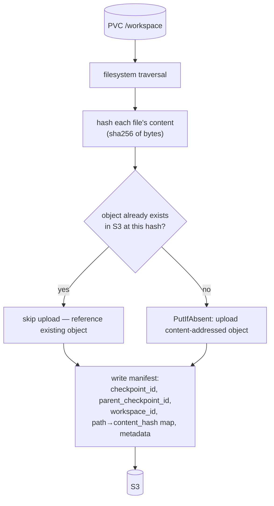

# ADR-052: Elastic Burst Capacity for Tenant Workloads

**Date:** 2026-08-23
**Status:** Accepted (amended 2026-08-31, 2026-09-02, 2026-09-06). §§16–19 are
normative contracts — durable work, control-plane availability, workspace
durability, tenant isolation — not aspirational sections. **§19 is
conditionally satisfied and is the one open approval gate.** It carries four
live gaps, each stated with its evidence rather than implied: effective
sandbox egress is any host on 443 (§19.2, replacement control specified in
§19.3 but not built); the existing policy check passes over that open boundary
and so must not be read as verification (§19.5); sandbox pods automount a
ServiceAccount token and the workload container still holds `DATABASE_URL` and
`WAYPOINT_INTERNAL_TOKEN`, so the single-channel credential contract is not yet
in force (§19.6); and credentials are stored as plaintext literals in the
`EphemeralJob` CR (§19.6). No tenant-facing confidentiality claim may be made
until these close. §20 records the CAPI/Kubernetes version floor these
contracts assume, the requirement that deployed artifacts pin exact versions
rather than prose, and the two re-measurement obligations the upgrade carries.
**Relates to:** ADR-005 (unified abstraction layers in Crossplane), ADR-011 (declarative over imperative), ADR-012 (billing/metering), ADR-014 (platform-owned stateful infrastructure), ADR-033 (fleet scale targets), ADR-034 (control-plane failure domains), ADR-036 (pluggable provider architecture), ADR-039 (ownership model), ADR-041 (controller responsibility matrix), ADR-043 (control plane authority), ADR-046 (placement classes, burst worker pool), ADR-047 (fleet tenant deployment contract), `crossplane-capi-ownership-pattern`

---

> **Amendment 2026-09-02b — Ephemeral compute is two mechanisms, not one.**
> §0's premise that a burst node is an ordinary node of the spoke does not hold
> on a HYBRID spoke: Cilium needs a tailnet InternalIP to reach home-lab nodes
> and the hcloud CCM needs the private one, and a node publishes only one. Five
> bootstrap versions were attempted; §13 records each and why it failed. The
> decision splits by what a workload needs rather than by what is available — a
> render needs nothing inbound and runs on a VM outside the cluster, a sandbox is
> connected to and must be a pod. Pure-Hetzner spokes are unaffected and keep
> burst capacity for both. §10's capacity rule is scoped rather than withdrawn.

---

> **Amendment 2026-09-02 — Authorship replaces admission; the count gets an owner.**
> Two gaps, both found by running the path end to end. Neither changes the four
> layers. §8 is withdrawn and rewritten: placing a sandbox by admission policy is
> a weaker guarantee than authoring its pod, and on the dev spoke the policy was
> absent from the catalog entirely, so every sandbox ran unplaced on home-lab
> capacity — the outcome this ADR exists to prevent. `EphemeralJob` now carries a
> lifecycle discriminator and the operator authors the pod for both shapes.
> Separately, the component §3 and the Ownership table name as owner of Burst
> Node Count — cluster-autoscaler — had never been deployed. The burst
> MachineDeployment is rendered with autoscaler bounds and deliberately no
> replicas field, so with nothing filling that role the pool sat at zero
> permanently and every burst pod pended against capacity that could not arrive.
> An ADR naming an owner does not create one.

---

> **Amendment 2026-08-31 — Cold-start budget and sandbox provisioning visibility.**
> Two gaps, both on the interactive-sandbox path, neither of which changes the
> decision. The four layers stand and no consumer gains an infrastructure
> permission. What is added is a *stated*
> cold-start budget (§11) — this ADR names node-join latency as a cost but never
> as a number, and the first consumer to reach burst capacity holds a
> 120-second readiness deadline that a node join cannot meet — and a
> provisioning-visibility contract for `Sandbox` (§12), which §7 grants
> `EphemeralJob` and §8 withholds from the workload where a human is actually
> waiting.

> **Amendment 2026-08-31 (2) — Placement authorship, and why the job path stays
> a controller.**
> Two clarifications to the Decision, neither changing it.
>
> **Placement is supplied by whichever component authors the pod (§4).** The job
> controller authors the `batch/v1` Job and therefore writes `nodeSelector`, the
> burst toleration and `priorityClassName` into it directly. Kyverno mutation is
> scoped to `Sandbox`, the one pod the platform does not author because its CRD
> is vendored (constraint 1). An arrangement in which the controller marks the
> Job for classification and admission policy then adds placement to that same
> object is rejected: it holds the weaker guarantee while the platform has
> already paid for the stronger one.
>
> **`EphemeralJob` is deliberately not an XRD and composition (§7).** ADR-005
> would normally place a tenant-facing abstraction there, and it was considered.
> It does not hold for this resource class: submission rate follows a fleet's
> concurrent users, so job objects are numerous and short-lived, while
> Crossplane's costs are proportional to object lifetime. The exception is
> recorded in §Impact and does not generalise.
>
> A consequence of that volume is stated in §Consequences and is not resolved
> here: at the expected rate, admission rejection under the §5 quota is the
> common case rather than an error path, and this ADR provides no queue.

---

## Context

Spoke worker capacity is a platform asset with a hard ceiling. Under ADR-046 the
default worker pool is home-lab hardware and the cloud `MachineDeployment` sits
at `replicas: 0` as an escape hatch. Every node added to serve a tenant workload
becomes capacity the platform must own, size, patch and pay for permanently — to
serve demand that is bursty, tenant-driven and unpredictable.

Two workload shapes drive that demand and neither belongs in a fixed pool:

| Shape | Consumer API | Profile |
|---|---|---|
| Batch execution | ephemeral job | Fire-and-forget, minutes, high resource envelope |
| Interactive sandbox | `agents.x-k8s.io/Sandbox` | Session-scoped, idle-terminated, reachable in-cluster, tenant-supplied image |

The platform needs both to run on capacity that appears when work exists and
disappears when it does not, while the cluster keeps serving control-plane and
infrastructure workloads on capacity the platform sizes for itself.

Four existing constraints bound the answer:

1. **The `Sandbox` CRD is vendored upstream and must not be forked** (ADR-019:
   OSS consumed unmodified). Its schema is `podTemplate`-shaped and already
   carries `nodeSelector`, `tolerations` and `runtimeClassName`.
2. **Sandboxes are reached over the cluster network** at
   `http://<service>.<namespace>.svc.cluster.local:<port>`, and their egress is
   policed by a platform-owned `CiliumClusterwideNetworkPolicy`. Compute that
   cannot be reached this way, or policed this way, cannot serve them.
3. **Crossplane composes only Managed Resources.** Per
   `crossplane-capi-ownership-pattern` and ADR-005, CAPI and core Kubernetes
   objects must be wrapped in `provider-kubernetes` `Object` resources.
4. **Infrastructure authority is Crossplane** (ADR-043), and CAPI/CAPH is the
   platform's established mechanism for cloud machines. A controller that calls
   a cloud provider API directly is a second infrastructure provisioner — the
   responsibility creep ADR-041 exists to prevent.

---

## Decision

The abstraction, end to end. Each boundary below is a place where a decision
stops being the fleet's and becomes the platform's, and nothing crosses back:

```text
  FLEET                    │ PLATFORM
  ─────────────────────────┼──────────────────────────────────────────────────
                           │
  EphemeralJob             │   ephemeral-job-operator          §7, §8
    image, command         │     authors the Pod
    capacity (envelope)    │     writes nodeSelector,          §4
    mode: Job | Service    │       tolerations, priorityClass
    timeout / idle         │     never provisions a node
                           │            │
  ── declares what ────────┼────────────┼── decides where ────────────────────
                           │            ▼
                           │   Pod: unschedulable
                           │            │
                           │            │ demand, not a control loop     §3
                           │            ▼
                           │   cluster-autoscaler
                           │     reads MachineDeployment bounds
                           │     min 0 .. max N                          §2
                           │            │
  ── asks for capacity ────┼────────────┼── owns the count ───────────────────
                           │            ▼
                           │   MachineDeployment.replicas
                           │            │
                           │            ▼
                           │   CAPI + provider → burst node joins spoke  §0
                           │            │
                           │            ▼
                           │   Pod scheduled, bounded by ResourceQuota   §5
                           │            │
  ◄── terminal result ─────┼────────────┘
      (callback)           │
```

Four objects, four owners, one direction. A fleet expresses demand and never a
node property; the autoscaler owns the count and never the placement; the
operator owns the pod and never the infrastructure. §11 keeps the two clocks —
waiting for a node, and running — separate, so neither is charged for the other.


**Home-lab capacity is reserved for platform infrastructure and fleet
control-plane services. Tenant execution runs on elastic cloud nodes,
provisioned through the platform's existing CAPI/CAPH path and scaled by
unschedulable demand.**

The only new component is the ephemeral job reconciliation logic. No new
infrastructure controller is introduced.

### 0. Invariant: burst nodes join the spoke, they do not form a cluster

Burst nodes are members of **the same spoke cluster** that already runs the
fleet's workloads. They are the ADR-046 burst `MachineDeployment` for that spoke,
scaled off zero — not a separate cluster, not a separate control plane, not an
external execution target.

The distinction this ADR draws is **placement, not membership**: a workload moves
from a home-lab node to a cloud node within one cluster, distinguished only by
the `workload-location` label (ADR-046 §11 placement classes).

```
            ONE spoke cluster — one control plane, one CNI, one DNS, one quota
 ┌────────────────────────────────────────────────────────────────────────────────┐
 │                                                                                │
 │   workload-location: home                     workload-location: hetzner       │
 │   ┌──────────────────────────────┐            ┌──────────────────────────────┐ │
 │   │  home-lab nodes — FIXED      │            │  burst nodes — ELASTIC       │ │
 │   │  (capacity you already own)  │            │  MachineDeployment 0 ──► N   │ │
 │   │                              │            │  (ADR-046 burst pool)        │ │
 │   │  · platform infrastructure   │            │                              │ │
 │   │  · platform controllers      │            │  · Sandbox pods              │ │
 │   │  · fleet control plane:      │            │  · EphemeralJob pods         │ │
 │   │      API, BFF, frontend,     │            │  · renders, inference,       │ │
 │   │      coordinating workers    │            │    fine-tuning, batch        │ │
 │   │                              │            │                              │ │
 │   │  envelope set by PLATFORM    │            │  envelope set by TENANT      │ │
 │   └──────────────────────────────┘            └──────────────────────────────┘ │
 │                  ▲                                           ▲                 │
 │                  │                                           │                 │
 │                  └───────────────── same cluster ────────────┘                 │
 │                    ClusterIP resolves · cluster DNS answers                    │
 │                    CiliumClusterwideNetworkPolicy enforces                     │
 │                    kubectl logs streams · events, CSI, quota apply             │
 └────────────────────────────────────────────────────────────────────────────────┘

   NOT a second cluster · NOT a second control plane · NOT an external executor.
   A burst node is an ordinary node of this spoke that happens to be disposable.
```

```
EphemeralJob → Job → unschedulable Pod → autoscaler → CAPI/CAPH → Hetzner → scheduler → Pod
```

Everything else in this decision depends on that invariant. Constraint 2 is
satisfied — `ClusterIP` Services resolve, cluster DNS answers, the platform
`CiliumClusterwideNetworkPolicy` enforces, `kubectl logs` streams — because the
burst node is in the *same* cluster as the consumer, not merely because it is in
*a* cluster. A design that placed burst nodes in a second cluster would
reintroduce every problem §Alternatives rejects, with a cross-cluster hop added.

Consequently: no burst node ever carries a control-plane role, and the burst pool
scales only within one spoke. A cell that needs more burst capacity than one
spoke's pool allows raises `maxNodes`; it does not gain a second cluster.

### 1. Four layers, four questions

Each layer answers exactly one question and owns nothing the layer below owns:

```
EphemeralJob / Sandbox
        │  "this workload must run on cloud capacity"
        ▼
EphemeralJob controller (jobs)  ·  Kyverno mutation (Sandbox only)
        │  emits a Pod already carrying burst placement
        ▼
Scheduler + cluster-autoscaler
        │  "I need N more nodes"
        ▼
BurstCapacity XR → provider-kubernetes Object → burst MachineDeployment
        │  "those N nodes should exist, within the declared envelope"
        ▼
CAPI / CAPH
        │
        ▼
Hetzner nodes  (workload-location: hetzner)
        │
        ▼
Normal Kubernetes scheduling → workload Pod
```

**This layer expresses capacity intent; it never expresses capacity quantity.**
Neither the controller nor the mutation creates, patches or computes `replicas`,
and neither owns the `BurstCapacity` XR. The relationship to that XR is a
*dependency* — the job requires capacity the XR governs — not ownership. If every job scaled
infrastructure independently, N jobs would produce N uncoordinated scaling
decisions; deciding how many nodes serve a set of pending pods is the
autoscaler's single responsibility.

### 2. `BurstCapacity` XR — the envelope, not the count

`BurstCapacity` is a **platform-owned, per-cell, Git-declared** composite
resource. It is reconciled by ArgoCD → Crossplane → `provider-kubernetes`
`Object` → the burst `MachineDeployment` that ADR-046 already defines at
`replicas: 0`. One XR per cell per size class; never one per job.

```yaml
apiVersion: compute.nutgraf.in/v1alpha1
kind: BurstCapacity
metadata:
  name: burst-standard
spec:
  cellId: <cell>
  placementClass: hetzner        # ADR-046 placement class
  machineType: <provider size class>
  minNodes: 0                    # >0 keeps warm capacity (§6)
  maxNodes: 8                    # the cell's burst spend ceiling
  scaleDownUnneededAfter: 10m
```

The XR composes the `MachineDeployment` and the autoscaler bounds annotations
(`cluster.x-k8s.io/cluster-api-autoscaler-node-group-{min,max}-size`) that
derive from `minNodes`/`maxNodes`. **`maxNodes` is the cell's cloud spend
ceiling**, declared in Git, reviewed like any other infrastructure change, and
enforced by a component that cannot exceed it.

Crossplane owns whether the pool exists and what shape it has. It does not own
how many nodes are running right now.

### 3. Scaling is unschedulable demand, not a control loop we write

`cluster-autoscaler` with `--cloud-provider=clusterapi` scales the burst
`MachineDeployment` from unschedulable pods, within the annotated bounds. It is
deployed **one instance per spoke, running on the hub**, using the
CAPI-generated spoke kubeconfig the hub already holds: the `MachineDeployment`
it scales lives on the hub, so this placement keeps the management credential on
the management cluster and adds no cross-cluster credential to a
tenant-serving spoke.

Scaling is therefore hub-dependent. Per ADR-034 this is a degradation, not an
outage: during a hub outage running workloads continue and the existing burst
pool keeps serving; only *new* capacity is unavailable. The dependency is
inherent to the `MachineDeployment` living on the hub and is not introduced by
this placement.

The platform writes no scaling logic. Node group discovery, scale-down,
draining, PodDisruptionBudget awareness, unready-node handling and expander
policy are all inherited.

### 4. Placement is platform-supplied, never fleet-declared

Placement is set by whichever component authors the pod, and the platform authors
it on both paths — but by different means, because it authors the two pods to a
different degree.

**Jobs: authored.** The platform writes the entire `batch/v1` Job (§7), so
`nodeSelector`, the burst toleration and `priorityClassName` are written into it
directly. The fleet's `EphemeralJob` has no field in which to express placement,
so on this path there is nothing to mutate and nothing to reject.

**Sandboxes: mutated.** The `Sandbox` CRD is vendored (constraint 1) and the
upstream controller authors the pod from `spec.podTemplate`, so the platform
cannot compose it. Here a platform-owned Kyverno mutating policy adds, to pods
matching the platform-owned `agents.x-k8s.io/sandbox` selector, in namespaces
whose fleet has the capability enabled:

- `nodeSelector: workload-location: <placementClass>`
- the matching toleration for the burst pool taint
- the platform `PriorityClass` for burst work (§5)

A companion validating policy rejects fleet-authored burst tolerations and
`priorityClassName` values on that path. This preserves ADR-047: a fleet can
neither place itself onto burst capacity it was not granted, nor escape burst
placement to consume home-lab nodes.

The two mechanisms are not equally strong, and the difference is worth stating.
Mutation is a guarantee that holds because a policy matches correctly and a
companion policy rejects correctly. Authorship is a guarantee that holds because
the fleet-facing resource has no field to carry the value. **Unrepresentable is
a stronger property than rejected** — it survives a policy being disabled,
mis-scoped, or lost in a refactor.

The test is therefore not which component supplies placement in the abstract,
but whether the platform authors the pod. Where it does, it writes placement and
no mutation is required. Where an unmodifiable upstream CRD means it does not,
mutation is correct and the validating policy carries the guarantee. A design in
which the platform authors the pod and *then* has a second component add
placement to it satisfies neither test: it holds the weaker guarantee while
paying for the stronger one.

### 5. Per-fleet bounds are native Kubernetes, not a new admission path

Burst pods carry a platform-owned `PriorityClass` (`burst-tenant`) with a value
below every platform workload, so burst work can never preempt infrastructure.

Per-fleet burst capacity is then a `ResourceQuota` with a
`scopeSelector` on that priority class:

```yaml
spec:
  hard: { requests.cpu: "16", requests.memory: 32Gi, pods: "8" }
  scopeSelector:
    matchExpressions:
      - operator: In
        scopeName: PriorityClass
        values: ["burst-tenant"]
```

This bounds a fleet's burst footprint without bounding its in-cluster
footprint, is enforced by the API server, and requires no custom webhook. It
composes with `maxNodes` (§2): the XR caps the cell, the quota caps the fleet.

Two bounds, two authors, two enforcement points — neither raisable by a fleet:

```
   PLATFORM Git                                FLEET REGISTRY (ADR-047 Tier 2)
   BurstCapacity.maxNodes: 8                   fleet declares a burst request,
        │                                      platform AUTHORS the object
        │                                           │
        │  caps the CELL's spend                    │  caps the FLEET's share
        ▼                                           ▼
 ┌───────────────────────────────┐       ┌────────────────────────────────────┐
 │ node-group-max-size           │       │ ResourceQuota                      │
 │   annotation on the burst     │       │   scopeSelector: PriorityClass     │
 │   MachineDeployment           │       │     In [burst-tenant]              │
 │                               │       │   hard: cpu / memory / pods        │
 │ enforced by the autoscaler    │       │ enforced by the API server         │
 └───────────────────────────────┘       └────────────────────────────────────┘
        │                                           │
        └──────────────────┬────────────────────────┘
                           ▼
              a fleet cannot exceed EITHER bound:
              quota rejects the pod before it is ever pending,
              maxNodes refuses the node even if the pod is pending
```

The `burst-tenant` PriorityClass sits below every platform workload, so burst
work can never preempt infrastructure — the quota scope and the preemption order
come from the same object.
The quota is platform-rendered from `fleet-registry` values at ADR-047 Tier 2 —
a fleet declares its request, the platform authors the object.

### 6. Warm capacity and scale-down are settings, not features

`minNodes > 0` keeps that many nodes permanently available, so the first burst
workload of the day does not pay node-join latency. This is the warm pool,
expressed natively; the platform writes no pre-warming code.

`scaleDownUnneededAfter` governs reclamation. One consequence must be stated
plainly: **an idle interactive sandbox pins its node for as long as its own
idle timeout allows**, so burst cost tracks sandbox idle timeout rather than
sandbox usage. Sandbox `shutdownTime`/`shutdownPolicy` and
`scaleDownUnneededAfter` must be tuned together, and the sandbox idle timeout is
the dominant cost lever.

### 7. `EphemeralJob` owns the job state machine and nothing else

`compute.nutgraf.in/v1alpha1 EphemeralJob` is a fleet-authored, namespaced
resource. Its controller materialises a `batch/v1` Job and owns exactly one
thing: the job lifecycle.

```
Pending → Provisioning → Running → Succeeded | Failed | TimedOut → Cleanup
```

`Provisioning` is the interval in which the pod is unschedulable and capacity is
being created. The controller surfaces *why* — unschedulable, scaling, node
joining, image pulling — by projecting pod events and node conditions into
`status`, so a submitter sees infrastructure progress without holding
infrastructure permissions.

Beyond the state machine the CRD adds what a bare `batch/v1` Job lacks: a
single-use completion token, an input/output object contract, a terminal result
the submitter can await, and TTL cleanup. It provisions nothing.

**Why a controller and not a composition** (Amendment 2). A tenant-facing
abstraction on this platform is normally an XRD and a composition, and ADR-005
would point that way. It does not hold here, because job objects are not
infrastructure. Submission rate scales with the number of concurrent users of a
fleet's product rather than with how often infrastructure changes, so the
population is large, short-lived and continuously turning over. Crossplane
reconciles a composite and its managed resources for as long as they exist,
polls their observed state, and holds finalizers on both — costs proportional to
object lifetime, which is the correct trade for a database and the wrong one for
a workload measured in seconds. Deletion is where this concentrates: TTL cleanup
is the most frequently executed path in the system, and it is the path on which
finalizer-bound objects accumulate. A controller reconciles on watch rather than
on a timer and adds one object per request rather than three.

**Placement is written by the controller, not stamped for another component**
(Amendment 2). Because the controller authors the Job, it supplies the §4
placement fields directly. An arrangement in which the controller marks the Job
with a burst classification and admission policy then adds placement to the same
object is rejected: it holds the weaker guarantee — placement present only while
a policy is loaded and correctly scoped — while the platform has already paid
for the stronger one by authoring the object. The validating policy remains, as
defence in depth rather than as the mechanism.

This does not reopen the ADR-041 boundary. The controller writes placement into
a workload it owns; it does not author placement *policy*, and it holds no
authority over nodes, machine templates or replica counts.

### 8. One authored pod, two lifecycles (Amendment 2026-09-02)

This section previously read "`Sandbox` is unmodified": the upstream controller
created the pod, Kyverno placed it, the autoscaler provided the node. That is
withdrawn. It rested on admission being a sufficient insertion point for
placement, and it is not.

A mutating policy places a pod only while it is loaded, enabled and correctly
scoped. When it is not, the pod is admitted anyway — unplaced, on whatever node
has room, with nothing in error. On the dev spoke the policy was absent from the
catalog entirely and every sandbox ran on home-lab capacity, which is the outcome
this ADR exists to prevent. §4 already states that authorship is the stronger
property; §8 was the one place the platform did not hold it.

`EphemeralJob` therefore carries a lifecycle discriminator, and the operator
authors the pod in both cases:

```
mode: Job      Pending → Provisioning → Running → Succeeded | Failed | TimedOut
               bounded by its own exit; reaped by TTL after a terminal phase

mode: Service  Pending → Provisioning → Running → Succeeded
               no completion to wait for; reaped by an idle clock
```

`Service` adds a Pod rather than a `batch/v1` Job, because `batch/v1` exists to
drive something to completion and an interactive sandbox has none; a Service in
front of it, owned by the same request, gives the stable in-cluster address.

The idle clock is required in `Service` mode, not defaulted. A long-lived
workload with no idle bound never terminates, and a bound guessed on a session's
behalf is how burst capacity leaks. It is refreshed through the status
subresource, so a client saying "still in use" cannot also rewrite the request's
image, capacity or placement class.

Because a burst node is an ordinary node of the same spoke cluster (§0),
everything constraint 2 requires keeps working unchanged: `ClusterIP` Services,
cluster DNS, the platform `CiliumClusterwideNetworkPolicy` egress allowlist,
`kubectl logs`, events, CSI and quota. The sandbox client's
`http://<svc>.<ns>.svc.cluster.local:<port>` address is unaffected by placement.

The vendored `Sandbox` CRD is no longer the provisioning path. Constraint 1 — do
not fork upstream — is satisfied more completely than before: the platform does
not modify the upstream controller, it stops depending on it for placement.

The validating policy that rejects fleet-supplied placement remains, and the
mutating policy is now redundant on this path. Defence in depth, not the
mechanism.

### 9. Isolation, and the one workload class that needs more

Burst workloads are isolated at the pod boundary — the same boundary they have
today, relocated to cloud nodes. This is not a regression.

Workloads requiring host-level privilege (nested containers, a container
runtime socket) are the exception: as pods they would need privileged
`securityContext`, which is worse on a shared node than on a disposable
machine. The remedy is **node dedication, not a second execution mechanism**: a
separate placement class whose `BurstCapacity` provisions a dedicated tainted
pool sized so one pod occupies one node. Machine-level isolation, same four
layers, no new component.

### 10. Capacity rule

> **May consume home-lab nodes:** platform infrastructure and controllers, and
> fleet control-plane services whose resource envelope is set by the platform —
> API, BFF, frontend, coordinating workers.
>
> **Must burst:** any workload whose resource envelope is set by tenant demand —
> sandboxes, batch jobs, renders, inference, fine-tuning.

Fleet quota (ADR-047) bounds the first. `BurstCapacity.maxNodes` and the
priority-scoped `ResourceQuota` bound the second.

### 11. Cold start is a budget, not an acknowledgement (Amendment 2026-08-31)

§Consequences records that "cold-start latency is a node join, materially slower
than starting a pod on existing capacity." That is true and it is not actionable.
It names no number, and it says nothing about what the latency demands of the
consumers this ADR moves onto burst capacity — which is where the cost is
actually paid.

The first such consumer already contradicts it. `@waypoint/sandbox-k8s` — the
library that creates every `Sandbox` CR under §8 — holds `POLL_TIMEOUT_MS` and
`HTTP_READY_TIMEOUT_MS` at 120 seconds. A cold burst start is the serial sum of
the autoscaler's scan interval, the CAPI/CAPH machine create, Hetzner
provisioning and boot, kubeadm join, CNI readiness, image pull and container
start. Two minutes does not cover it, and no tuning of the consumer's polling
interval changes that.

**The resulting failure is not a clean timeout.** In-cluster, the readiness wait
polls the `ClusterIP` URL and never reads pod phase, so an unschedulable pod and
a crashed sandbox are the same observation — connection refused until the
deadline — and the error distinguishes neither. Worse, the registry row is
written only *after* readiness succeeds, so a timeout leaves a `Sandbox` CR with
no registry entry. The next message finds no active mapping, takes the recreate
branch, and deletes the deterministically-named CR — destroying the pending pod
whose node was still being provisioned. The autoscaler observes the pending pod
disappear and may reverse the scale-up it had already triggered; a new pod with
the same name appears moments later and the cycle repeats. The system does not
converge, it thrashes, and it pays for node joins that never serve a request.

This is a contract gap, not a bug in one consumer. Any consumer written against
existing capacity carries a deadline calibrated to pod start, and this ADR moves
such consumers onto capacity measured in machine start without telling them.
Therefore:

1. **Every placement class MUST declare a cold-start budget** — p50 and p95
   seconds from unschedulable pod to `Running` — as a measured, documented
   property of the `BurstCapacity` XR. This ADR deliberately declines to name a
   number: it depends on machine type, image size and registry locality, and an
   invented default would be adopted as though it had been measured.

2. **No consumer may hold a readiness deadline shorter than the p95 budget of
   the placement class it targets.** A consumer that cannot wait that long has
   not been made burst-ready by relabelling its pods; the remedy is `minNodes > 0`
   (§6), which is what warm capacity exists for.

3. **A consumer MUST NOT delete a workload object solely because a readiness
   deadline expired.** To the autoscaler, deletion during provisioning is
   indistinguishable from deletion of a healthy workload, and is the thrash
   described above. Provisioning-timeout and provisioning-failure are different
   terminal conditions and must be distinguished before any cleanup runs.

4. **Where an interactive path cannot tolerate the budget, warm capacity is a
   required cost, not a tuning preference.** `minNodes > 0` is the only setting
   under which cold start does not apply, and §6's trade — money for latency —
   is then already decided by the workload, not open to the operator.

The migration consequence is explicit: **a fleet is not burst-ready when its
pods carry burst placement. It is burst-ready when its timeouts and its
failure handling match the budget of the class it was placed in.**

### 12. `Sandbox` provisioning visibility (Amendment 2026-08-31)

§7 gives `EphemeralJob` a `Provisioning` state that surfaces *why* —
unschedulable, scaling, node joining, image pulling — "so a submitter sees
infrastructure progress without holding infrastructure permissions." §8 says
`Sandbox` is unmodified. Both are right, and together they left the asymmetry
backwards: batch work, where no human is waiting, got the progress signal;
the interactive session, where a human is waiting, got none.

The asymmetry is not in the CRD and the remedy must not be. Constraint 1 stands
— `Sandbox` is vendored and is not forked — and nothing here amends it. The gap
is that this ADR never said where a sandbox consumer is *permitted* to read
provisioning state from, so the only obvious answers are the ones ADR-047
forbids it: `Node` conditions, the `MachineDeployment`, the autoscaler's own
status, all cluster-scoped and all outside a Tier-2 namespaced grant.

**Burst placement MUST be observable from namespaced objects alone.** The
pending Pod's `PodScheduled` condition carries `reason: Unschedulable` and its
message, and `cluster-autoscaler` writes its `TriggeredScaleUp` /
`NotTriggerScaleUp` events onto that same Pod — in the tenant's own namespace.
Between them, "waiting on capacity" is already distinguishable from "failed to
start" without reading a single cluster-scoped object. That this signal exists
where a fleet may read it is now a **requirement on the platform**, not an
incidental property of the components chosen: any future change to the scaling
component must preserve a namespaced provisioning signal on the pending Pod.

Two obligations follow.

**On the platform:** the burst placement path must not require a fleet consumer
to read `Nodes`, `MachineDeployments`, or autoscaler state to learn that its pod
is waiting for capacity. The ADR-047 Tier-2 grant for a sandbox-consuming fleet
must therefore include `pods` and `events` read in its own namespace — which the
existing example grant, scoped to `agents.x-k8s.io/sandboxes` verbs alone, does
not cover.

**On the consumer:** a wait on a burst-placed pod MUST read that signal before
concluding failure, and MUST distinguish three outcomes that are not the same
condition and must not share a code path:

| Observation | Meaning | Correct response |
|---|---|---|
| Create rejected at admission | Fleet's priority-scoped `ResourceQuota` (§5) is full | Terminal. Do not retry, do not create. Surface the quota. |
| Pod exists, `PodScheduled=false`, scale-up event present | Capacity is being provisioned | Wait, up to the §11 p95 budget. Report progress. |
| Pod exists, `PodScheduled=false`, `NotTriggerScaleUp` | `maxNodes` reached, or no node group fits | Terminal for now. Surface the cell ceiling; do not delete and recreate. |

The first case is easy to mistake for the second and is the opposite of it: a
quota rejection means the pod was never created, so a consumer that treats it as
"still pending" waits out its full budget before reporting a condition that was
knowable at the create call.

This adds no component. It states where the signal lives, that the platform must
keep it there, and that a consumer must read it — which is what §7 already
promised the batch path and §8 left unsaid for the interactive one.

**Scope.** The two paths reach the same guarantee by different routes. On the
**job path** the controller already holds the projection responsibility §7
assigns it, so a fleet reads its own `EphemeralJob` status and needs no access
to the Pod at all. On the **`Sandbox` path** no such component exists — the
upstream controller projects nothing about capacity — so the consumer reads the
Pod and its Events directly, and the namespaced-signal requirement above is what
makes that possible without a cluster-scoped grant. Both learn that they are
waiting on capacity rather than broken, which is the guarantee; only the route
differs, and only the `Sandbox` path constrains the platform's choice of scaling
component.

---

### 13. Ephemeral compute per environment (Amendment 2026-09-02)

§0 assumes a burst node is an ordinary node of the spoke. On a **hybrid** spoke
that assumption does not hold, and the reason is structural rather than a defect
to be fixed: two components require different values in the same field.

- Cilium derives the VXLAN tunnel endpoint from the node's `InternalIP`, so
  reaching home-lab nodes requires a **tailnet** address (ADR-046 invariant 6).
- The hcloud CCM validates `provided-node-ip` against the addresses the Hetzner
  API reports, so initialising the node requires the **private** address.

A node cannot publish both. Five bootstrap versions were attempted and each
failed in a way worth recording, because each looked like the previous one had
been fixed:

| version | change | outcome |
|---|---|---|
| v1 | no node-ip mechanism | joins, CCM-initialised, **unreachable** from home-lab nodes |
| v2 | force tailnet node-ip at join | reachable, but CCM refuses the node; `uninitialized` taint never clears, nothing schedules |
| v3 | register privately, wait for the taint, then switch | joins **and** initialises — the only version to do both — but the address never switches |
| v4 | port the hub CP's script, incl. self-assigned `--provider-id` from the metadata service | node never joins at all |
| v5 | drop the pre-join kubelet restart from v4 | node still never joins |

v3 is the high-water mark and the evidence that sequencing is achievable. v4/v5
regressed node join for a cause not identified from the API; the remaining
signal is on the server (`/var/log/cloud-init-answer.log`), and the preflight
now asserts each of these four properties separately so a future attempt fails
at the check rather than on a spoke.

**Decision, by environment.** Ephemeral compute is not one mechanism. It is two,
selected by what the workload needs rather than by what is available:

| | dev (hybrid) | staging / production (pure Hetzner) |
|---|---|---|
| **render** — S3 in, callback out, nothing inbound | `ephemeral-vm-provisioner`: a Hetzner VM outside the cluster | `EphemeralJob` on burst capacity |
| **sandbox** — the SDK connects *to* it over SSE | `EphemeralJob`, `placementClass: home` | `EphemeralJob` on burst capacity |

The split follows **direction**, which is the property that actually decides it.
A render needs no inbound path, so a VM with no cluster membership serves it and
the node-ip conflict never arises — the VM has no `InternalIP`, no Cilium and no
CCM. A sandbox is connected to at
`sandbox-<id>-svc.<ns>.svc.cluster.local`, so it must be a pod with a Service,
and on a hybrid spoke the only nodes a pod can occupy today are home-lab ones.

On a pure-Hetzner spoke neither constraint exists: every node is Hetzner,
reachable over the private network, so `InternalIP` is uncontested and both
workloads use burst capacity as §0 describes. **The hybrid arrangement is a
topology consequence, not a downgrade**, and it does not generalise to other
cells.

**§10's capacity rule is scoped, not withdrawn.** It reserved home-lab capacity
for platform infrastructure; a hybrid sandbox now runs there. The protections
that rule existed for are kept rather than dropped: home placement carries the
`burst-tenant` PriorityClass, so tenant execution still cannot preempt platform
infrastructure, and it remains inside the `burst-compute` ResourceQuota scoped to
that class. What changes is that on a hybrid spoke the binding limit is the
hardware, not the quota — measured headroom is roughly 1.6 and 0.8 CPU across the
two home workers, against a quota ceiling of 8 CPU those nodes cannot supply.

### 14. Workspace persistence: a platform-owned PVC plus a platform-owned S3 tier (Amendment 2026-09-06)

Some sandboxes need `/workspace` to survive pod recreation — a coding-agent
sandbox whose disk holds work in progress, not a stateless request/response
one. Until now this was a *fleet's* problem twice over: waypoint's
harness-runtime hand-rolled git-commit-and-upload-to-S3 from inside the sandbox
process (waypoint ADR-036 §4–§8) because the sandbox pod it received had no
persistence primitive of its own (only `emptyDir`), *and* held a broker-scoped
path to the S3 credential itself (`s3-presign.ts`) to do the upload. That is
exactly the kind of thing §4's principle already forbids doing twice: a fleet
holding provisioning-adjacent responsibility the platform should carry,
because the platform authors the pod either way. This amendment moves both
pieces — the disk and the S3 mechanics — to the operator. **Only two
decisions remain the fleet's: when a unit of work is worth checkpointing
(frequent, produces an S3 Workspace Checkpoint), and when a user has
explicitly finalized their work (rare, produces a git commit)** — both are
domain knowledge (what a conversation turn means, what the user asked for)
the platform cannot have and should not try to have. Waypoint ADR-036 §10
records that fleet-side delta; this section is the mechanism both decisions
call into, and owns the diagrams below in full — ADR-036 §10 does not repeat
them.

**Component diagram (ASCII):**

```
                    TENANT (waypoint-sdk)
             EphemeralJob.spec.workspacePersistence
                       { workspaceId }
                             │
                             ▼
        ┌────────────────────────────────────────┐
        │    ephemeral-job-operator (platform)    │
        │  buildPodSpec: PVC lookup-or-create     │
        │   + BOTH workspace containers, as       │
        │     initContainers (see §14.1)          │
        └────────────────────┬─────────────────────┘
                             │
          ┌──────────────────┼──────────────────────┐
          ▼                  ▼                       ▼
 ┌──────────────────┐ ┌──────────────────┐  ┌────────────────────────┐
 │  PVC /workspace   │ │ init container:  │  │ NATIVE sidecar:        │
 │  local-path (home)│ │ workspace-sync   │  │ workspace-sync serve   │
 │  hcloud-volumes   │ │ restore          │  │  (initContainer with   │
 │  (burst)          │ │ (runs once, at   │  │   restartPolicy:Always)│
 │                   │ │  pod start)      │  │  on-demand /checkpoint │
 │                   │ │                  │  │  + periodic backstop   │
 │                   │ │                  │  │  + SIGTERM teardown    │
 └─────────┬─────────┘ └────────┬─────────┘  └────────────┬────────────┘
           │                    │                          │
           │                    └───────────┬──────────────┘
           │                                ▼
           │                    ┌─────────────────────────────┐
           │                    │  S3: content-addressed       │
           │                    │  objects + per-checkpoint     │
           │                    │  manifests                    │
           │                    └─────────────────────────────┘
           ▼
 ┌───────────────────────────────┐
 │  fleet's workload container    │
 │  (e.g. harness-runtime)        │
 │  — writes files continuously   │
 │  — calls sidecar's local       │
 │    /checkpoint endpoint        │
 │  — only it ever runs           │
 │    git commit (on finalize)    │
 └───────────────────────────────┘
```

**Lifecycle (ASCII):**

```
Pod created
     │
     ▼
init container: is the PVC freshly empty?
     │                              │
    yes                             no  (reattach after crash/idle-reap)
     │                              │
     ▼                              ▼
download latest manifest       skip — PVC already
+ objects from S3,              has the data
materialize verbatim
     │                              │
     └──────────────┬───────────────┘
                    ▼
        workload container starts
                    │
                    ▼
    ┌───────────────────────────────────┐
    │ loop: each turn / meaningful       │◄────────────────┐
    │ boundary                           │                  │
    │  workload writes files              │                  │
    │  workload → POST /checkpoint        │                  │
    │  sidecar hashes files, uploads      │                  │
    │  only changed content, writes       │                  │
    │  manifest, returns checkpoint_id    │                  │
    └──────────────────┬──────────────────┘                  │
                       │                                      │
                       ▼                                      │
       periodic backstop (anonymous, same  ────────────────────┘
       engine, no name) — covers the span
       since the last named checkpoint
                       │
                       ▼
       idle-timeout fires, or explicit delete
                       │
                       ▼
       kubelet SIGTERMs the WORKLOAD containers
                       │
                       ▼
       workload containers exit — nothing is
       writing the tree any more
                       │
                       ▼
       ONLY THEN does the kubelet SIGTERM the
       native sidecar (this ordering is the
       whole reason it is a native sidecar)
                       │
                       ▼
       sidecar: stop backstop → drain in-flight
       /checkpoint → snapshot → exit
                       │
                       ▼
       pod terminates; PVC retained (no ownerRef
       to the EphemeralJob) — reattaches next time
       this workspaceId is used
```

Nothing in that sequence involves the operator. It reaps the workload; the
workload's own sidecar finalizes the state it owns.

**Component diagram (Mermaid, same information, for renderers that support it):**

```mermaid
graph TB
    SDK["waypoint-sdk<br/>submits EphemeralJob"]
    subgraph OPERATOR["ephemeral-job-operator (this ADR)"]
        RECON["buildPodSpec: PVC lookup-or-create<br/>+ both workspace containers as initContainers"]
        INITC["init container: workspace-sync restore<br/>owned image, holds S3 credential via Secret"]
        SIDEC["NATIVE sidecar: workspace-sync serve<br/>initContainer, restartPolicy: Always<br/>snapshot engine — on-demand + periodic backstop<br/>+ teardown snapshot on SIGTERM, in-pod<br/>owned image, holds S3 credential via Secret"]
        REAPER["separate reconcile loop:<br/>workspace-PVC reaper (30-day TTL)"]
    end
    subgraph POD["Sandbox Pod"]
        PVC[("PVC /workspace<br/>local-path (home) | hcloud-volumes (burst)")]
        WORKLOAD["fleet's workload container<br/>(e.g. harness-runtime)<br/>calls sidecar's local /checkpoint endpoint;<br/>only it ever runs git commit"]
    end
    S3[("S3: content-addressed objects + per-checkpoint manifests")]

    SDK -->|EphemeralJob.spec.workspacePersistence.workspaceId| RECON
    RECON -->|creates/reuses, no ownerRef| PVC
    RECON -->|adds| INITC
    RECON -->|adds| SIDEC
    INITC -.->|mounts, runs once at pod start| PVC
    SIDEC -.->|mounts, runs alongside workload| PVC
    INITC <-->|download latest or a specific checkpoint's manifest + objects, only if PVC empty| S3
    WORKLOAD -->|POST /checkpoint name, description| SIDEC
    SIDEC <-->|hash, PutIfAbsent new objects, write manifest| S3
    WORKLOAD -->|writes files + git commit (finalize only)| PVC
    REAPER -.->|deletes abandoned PVCs, last-touched TTL| PVC
```

**Decision.** `EphemeralJobSpec` gains an optional field:

```go
type EphemeralJobSpec struct {
    ...
    // WorkspacePersistence gives the pod a durable /workspace, backed by both
    // a PVC (crash/restart tier) and an S3-compatible object store (disaster
    // recovery / cross-node-move tier). The operator owns StorageClass
    // selection, PVC naming and reuse, the S3 credential, and the
    // restore/flush mechanics; the fleet states only which workspace, never a
    // storage mechanism (§4's rule, applied to storage: unrepresentable is
    // stronger than a convention the fleet is trusted to follow).
    WorkspacePersistence *WorkspacePersistenceSpec `json:"workspacePersistence,omitempty"`
}

type WorkspacePersistenceSpec struct {
    // Identifies the workspace, not this request. Two EphemeralJobs with the
    // same WorkspaceID — e.g. two sessions of the same app — resolve to the
    // same PVC and the same S3 prefix. This is deliberate reuse, not a
    // collision to guard against.
    WorkspaceID string `json:"workspaceId"`
}
```

**The operator adds two containers when this field is set, both from a single
platform-owned image (`workspace-sync`, alongside `ephemeral-job-operator`
itself — same packaging shape as `agent-vault`, never fleet-supplied):**

**Terminology: S3 Workspace Checkpoints.** Immutable, independently addressable, point-in-time snapshots of the complete `/workspace` tree — tracked, untracked, and uncommitted files alike, `.git` included as an ordinary subdirectory, never as the payload. This is a distinct concept from a git commit (§ below) and the naming is deliberate: a design that instead synced only committed git objects and restored via `git checkout HEAD -- .` would silently discard any edit made after the agent's last commit — exactly the class of loss this whole mechanism exists to prevent, and exactly the failure mode observed once already (waypoint ADR-036: *"a session produced a complete app... and recorded zero sync activity... that work existed only until the pod died"*).

**Correction to an earlier draft of this section:** it claimed content-addressed dedup "does not carry over to arbitrary working-tree files, which have no equivalent immutable content identity." That's wrong — any file has a content-addressed identity, namely a hash of its bytes; git's object model isn't required to get that property, and Sandbox0's own object store (`rootfsblock/objectstore.go`'s `ObjectStorePublisher.PutImmutable`, vendored at `zero-ops/reference-projects/sandbox/sandbox0`) proves it: it content-addresses and conditionally-writes (`PutIfAbsentContext`, fail-closed on a hash collision with different content) arbitrary byte payloads, not git blobs. `workspace-sync` is redesigned below as a snapshot engine on that same principle, adapted from Sandbox0's actual granularity (block ranges, tied to their custom NBD device — not portable here, see the earlier discussion in waypoint ADR-036 §10) to file granularity, which needs no block device at all.

**Snapshot engine, not a backup uploader:**



A checkpoint is one manifest plus whatever content-addressed objects it references. Two checkpoints that share 9,997 of 10,000 files cost exactly 3 new objects — deduplication falls out of content-addressing itself, with no need to diff against a specific parent to get it. `parent_checkpoint_id` is carried for lineage/diffing in the UI, not for the dedup property.

**One primitive, two triggers — not two mechanisms:**
- **On-demand, named.** The agent (harness-runtime) calls a local, credential-free control endpoint on the sidecar — `POST /checkpoint {name?, description?}` — at whatever boundary it considers meaningful (a turn, a tool call). The sidecar runs the snapshot engine above and returns a `checkpoint_id`. This is the common case, and it is why the sidecar needs no periodic timer to be the primary mechanism — the agent decides when a checkpoint is worth taking, exactly as it previously decided when a commit was worth making, just redirected to a different payload.
- **Periodic, anonymous — a backstop only.** On a low-frequency interval, and again at graceful teardown (see §14.1), the sidecar runs the same snapshot engine with no name attached, covering the span since the agent's last on-demand checkpoint. This exists for the one case an on-demand checkpoint can't help: the agent crashes or the node dies mid-edit, before it ever called `/checkpoint`. **The periodic interval — not the teardown snapshot — is what actually bounds worst-case loss**, because the failure modes that matter most (node loss, hard eviction, SIGKILL) provide no graceful window in which a teardown snapshot could run at all.

Both triggers call the identical underlying function — there is one snapshot engine, not two.

- **Init container (`workspace-sync restore`).** Runs before the workload container starts. Checks whether the PVC is freshly empty — first-ever provisioning for this `WorkspaceID`, or a genuine delete — and only then reads the workspace's latest manifest, downloads every object it references, and materializes the tree verbatim. On an ordinary reattach (idle-timeout recreate, crash restart) the PVC already has the data and this is a no-op, exiting immediately.
- **Restore-to-a-specific-checkpoint** (not just latest) is the same operation parameterized by `checkpoint_id` instead of "latest" — this is what a user-initiated "undo to checkpoint-002" resolves to (see waypoint ADR-036 §10 for the caller-side flow and the checkpoint-history record this populates).
- **Teardown snapshot is taken in-pod, on SIGTERM, by the sidecar itself** — see §14.1. It is a graceful-shutdown optimization, not the durability mechanism.
- **S3 credential.** Provisioned into the init container and sidecar's env from a zero-ops-owned Secret (the platform's existing Infisical/ESO secret-delivery pattern), the same shape `agent-vault` already uses for GitHub/Tavily/RunPod/AI-Gateway credentials (`buildWorkloadContainer`, `agent-vault-entrypoint.sh`). The fleet's own workload container never receives this credential, brokered or otherwise — it only ever calls the sidecar's local, unauthenticated-to-S3 control endpoint.
#### §14.1 The teardown checkpoint: native sidecar, not operator flush

`workspace-sync serve` is a **native sidecar** — an entry in `.spec.initContainers` carrying `restartPolicy: Always` (Kubernetes ≥1.29, stable in 1.33; this fleet's version floor is §20). Both of the operator's workspace containers live in `initContainers`, `workspace-restore` first and `workspace-sync` last. Three properties follow from that placement, and all three are load-bearing:

1. **A `mode: Job` pod can complete.** A pod reaches `Succeeded` only when every container in `.spec.containers` has exited. A never-exiting snapshot process there would hang every batch workload that asked for a persisted workspace, until a deadline killed it.
2. **The teardown snapshot is application-consistent.** The kubelet terminates native sidecars only *after* the regular containers exit. The tree is therefore quiescent when it is read — the one checkpoint in this design that is not merely crash-consistent (§18.3).
3. **Restore completes before sync starts, and both before the workload.** Plain init containers before a native sidecar run to completion first; the sidecar is then up before the workload begins.

The teardown snapshot runs in the sidecar's own SIGTERM handler, in a fixed order: stop the periodic backstop, drain in-flight `/checkpoint` requests via graceful server shutdown, take the snapshot under a bounded context, then exit. The HTTP listener must not be allowed to disappear before the handler finishes.

**`terminationGracePeriodSeconds` has a floor when `workspacePersistence` is set** (`minWorkspaceGraceSeconds`). The kubelet SIGKILLs whatever is still running when the grace period expires, so that value is a hard ceiling on the teardown snapshot, and the 30s default is not a chosen number. It is a floor, not an override — a fleet asking for more keeps it — and it should be re-derived from measured p95 checkpoint latency once there is any. Manifest-written-last ordering means a truncated run leaves *no* checkpoint rather than a corrupt one: it fails safe, but it fails.

**An earlier revision of this ADR specified a finalizer-gated flush**, in which the operator added a finalizer, POSTed to the sidecar to snapshot, and released the finalizer on completion — modelled on the quiescence-via-finalizer pattern in the vendored `agent-sandbox` reference. It was implemented and it could never have worked. Three independent defects, none of which any test caught because the path never executed:

- **It was unreachable.** The operator dialled the pod IP; the sidecar binds `127.0.0.1`. Containers share a network namespace with each other, not with other pods, so the connection could never establish. The code comment justifying the loopback bind (*"this only works from inside the pod network"*) described precisely why the call must fail.
- **It fired against a pod that was already gone.** The finalizer ran on `EphemeralJob` deletion, but the pod is reaped at idle timeout, long before anything deletes the CR. The two lifetimes it tried to coordinate were never the same lifetime. Observed directly: `Succeeded` CRs holding an unfired finalizer with no pod behind them.
- **It held deletion open on a call that could not succeed**, and `PhaseCheckpointing` — the phase meant to protect an in-flight flush from cancellation — was never assigned by any code path.

The generalisable error is that **durability of pod-local state was modelled as an operator responsibility.** The operator's authority is over the workload's lifecycle; it has no privileged access to the workload's state and no way to reach into a pod that has already terminated. Moving the checkpoint into the process that already holds the credential, the volume mount, and a kubelet-guaranteed termination signal removes the network call, the authentication question, the finalizer, and the phase — the correct boundary is that **the operator manages the lifecycle of the workload, and the workload manages the durability of its own state.**

The limit is explicit and unavoidable: no signal-based design survives node failure, hard eviction, or SIGKILL. Under those conditions there is no teardown checkpoint. This is why the periodic backstop, not this path, is the stated durability mechanism.

- **Checkpoint retention is an open question, not resolved here.** Deleting a manifest is cheap. Reclaiming the content-addressed objects it referenced is not automatically safe — another checkpoint (this workspace's or, if objects are ever shared cross-workspace, another's) may reference the same hash. This needs either per-workspace-scoped object keys (simpler, no cross-checkpoint reference-counting, some dedup benefit given up) or a real mark-and-sweep/reference-counted GC pass (more dedup, more complexity) — Sandbox0's own snapshot delete is consistent with not solving this eagerly either (*"Delete a snapshot... does not affect forks created from the same rootfs state"*, implying it doesn't naively free shared content on delete). Left as an implementation decision.

**PVC naming and ownership.** The operator derives a PVC name deterministically
from `WorkspaceID` (a short hash, not the raw string — RFC 1123 subdomain
rules), looks it up, and creates it if absent. **The PVC carries no ownerRef to
the `EphemeralJob` CR.** A CR is reaped by TTL/idle-timeout on a timescale of
minutes; a workspace is meant to outlive any single sandbox's idle cycle, so CR
garbage collection must never cascade into deleting the disk. A separate,
long-interval reconcile loop (last-touched annotation, default 30-day TTL)
garbage-collects abandoned workspace PVCs — deliberately conservative, because
`reclaimPolicy: Delete` on `local-path` (below) means a PVC delete is an
immediate, unrecoverable `rm -rf` with nothing to restore from.

**StorageClass selection follows the same placement resolution §4 already
performs, not a new input.** `local-path` for `placementClass: home` (already
deployed cluster-wide, `manifests/hub-core-services/storage/local-path-
storage.yaml`, DaemonSet-restricted to `workload-location: home` nodes);
`hcloud-volumes` for burst/cloud placement (already deployed per-spoke via the
CAPI addon template, `manifests/providers/hetzner/base/spoke-addons/csi-addon-
template.yaml`). Both StorageClasses predate this amendment; nothing new is
deployed to support it.

**Node-pinning is a consequence of `WaitForFirstConsumer`, not operator code.**
Both StorageClasses declare `volumeBindingMode: WaitForFirstConsumer`. The PV
`local-path-provisioner` creates on first bind carries `nodeAffinity` for the
specific node it landed on, and the default scheduler already refuses to place
a pod whose PVC is bound to that PV anywhere else. So every subsequent
`EphemeralJob` sharing a `WorkspaceID` is pinned to the same node as a
consequence of ordinary PVC/PV binding — the operator writes no nodeSelector
for this beyond what §4 already writes for `placementClass`.

**Durability is asymmetric between the two StorageClasses, and this is an
accepted trade, not an oversight.** `local-path` is `hostPath`-backed with no
replication: that node's hardware failure or a manual drain permanently loses
the workspace, with nothing to fall back to. `hcloud-volumes` is a real
network-attached block volume — Hetzner's CSI can reattach it to a different
node in-region, so node loss alone does not lose the workspace there. This
mirrors an asymmetry §13 already established for compute placement itself
(home-lab sandboxes on a hybrid spoke have no burst alternative); §14 extends
the same accepted trade to the sandbox's disk. `ReadWriteOnce` is accepted
platform-wide for this workload class: a workspace shared across sessions of
one app (waypoint ADR-017/036 §4) is shared by pinning every session's sandbox
to the same node, not by concurrent multi-node access. **§18.1 states this
normatively as a product property — a workspace is single-writer,
serial-session — rather than leaving it as an implementation consequence.**

**Both the PVC and the S3 tier are this operator's responsibility now, in
full.** The PVC closes the crash/restart/idle-recreate gap. The
`workspace-sync` init container/sidecar closes the gap the PVC cannot — a
home-lab node's hardware failure (`local-path` has no replication) and moving
a workspace to a different node entirely — and it is what previously lived,
S3 credential and all, inside waypoint's harness-runtime (ADR-036 §4–§8).
Waypoint ADR-036 §10 records the corresponding reduction on the fleet side:
harness-runtime keeps exactly two things — deciding when a unit of work is
worth checkpointing, and deciding when the user has finalized their work —
because those are the pieces that require knowledge only the agent and the
user have. Every S3 credential, every upload, every restore decision moves
here.

### 15. A workload queue (Kueue) and a durable agentic state machine (Amendment 2026-09-06)

**The gap, in this ADR's own words, from §"Negative / Trade-offs" above:**
*"Admission rejection is the expected steady state, and this ADR provides no
queue... a batch API whose common case is rejection is unusable without a
queue and a submitter-visible position in it... this ADR does not settle
[whether admission is synchronous] and must be decided before the job path
carries production load."* This amendment settles it.

**Decision: adopt Kueue as the admission/fairness layer, in front of the
mechanism this ADR already owns — not in place of it.** Kueue does not
replace `ephemeral-job-operator`, CAPI, Crossplane, or cluster-autoscaler; it
sits between "a fleet submitted an `EphemeralJob`" and "the operator creates
the underlying Job/Pod and lets the autoscaler see unschedulable demand"
(§3). Concretely:

- Each tenant namespace gets a Kueue `LocalQueue`, pointing at a shared
  `ClusterQueue` scoped to the `burst-tenant` resource class this ADR already
  defines (§5, §10). The `ClusterQueue`'s quota *is* the enforcement point
  this ADR's `ResourceQuota`/`scopeSelector` mechanism (§5) used to be —
  Kueue's admission check replaces it, rather than sitting alongside a
  second, redundant quota; `maxNodes` (§2) is unaffected, since it bounds the
  cell, not the fleet.
- `ephemeral-job-operator`, on reconciling an `EphemeralJob`, creates a Kueue
  `Workload` object representing its resource ask (Kueue's supported
  extension point for a custom controller, the same integration model
  batch/v1 Job, JobSet, and RayJob use) and waits for it to be admitted
  before creating the underlying Job/Pod — this is the one new step in a
  reconcile loop that otherwise proceeds exactly as it does today.
- Fairness, priority, and preemption ordering are Kueue's own mechanisms
  (`ClusterQueue` fair-sharing, workload priority), not new code this
  operator has to write — the `burst-tenant` `PriorityClass` (§5) continues
  to set the *pod-level* preemption floor against platform infrastructure;
  Kueue's priority governs fairness *among* burst-tenant workloads
  competing for the same `ClusterQueue`, a distinct axis this ADR did not
  previously have at all.
- Kueue reports pending-workload position/count on the `Workload` object,
  which the operator projects into `EphemeralJob.status` the same way it
  already projects pod/node conditions (§7) — so a submitter sees "queued,
  position N" rather than a rejected pod with no further signal.

**The state machine gains the phases Kueue's own admission step requires,
plus one this ADR's workspace-persistence work (§14) already implies but
never named:**

```go
const (
    PhaseAccepted     Phase = "Accepted"     // CR created, not yet admitted
    PhaseQueued       Phase = "Queued"       // Kueue Workload pending admission
    PhaseAdmitted     Phase = "Admitted"     // Kueue granted quota; Job/Pod about to be created
    PhaseProvisioning Phase = "Provisioning" // unchanged (§7): pod pending, capacity being created
    PhaseRunning      Phase = "Running"      // unchanged
    // No Checkpointing phase. An earlier revision had one, for a
    // finalizer-gated flush that no longer exists (§14.1): the teardown
    // snapshot happens inside the pod on SIGTERM, so there is no operator-side
    // state to represent.
    PhaseSucceeded    Phase = "Succeeded"
    PhaseFailed       Phase = "Failed"
    PhaseTimedOut     Phase = "TimedOut"
    PhaseCancelled    Phase = "Cancelled"    // new: an explicit submitter cancellation, distinct
                                              // from a timeout or a failure
)
```

`PhasePending` (§7's original name) is renamed `PhaseAccepted` for clarity now
that there are two distinct kinds of waiting (`Queued` before Kueue admits,
`Provisioning` after, while capacity is created) where one undifferentiated
`Pending` used to cover both — a submitter previously could not tell "waiting
on quota" from "waiting on a node," which is exactly the ambiguity §7's
`ConditionCapacity` reasons (`WaitingForCapacity` vs `QuotaRejected`) already
existed to resolve for the second half; `Queued` extends the same principle
to the first half.

**Kueue's operating model, decided explicitly rather than left to defaults.**
Kueue offers more than queue-and-admit, and the elastic-capacity setting makes
several of its options load-bearing rather than cosmetic:

| Mechanism | Decision | Reason |
|---|---|---|
| Fair sharing between `LocalQueue`s | **Enabled** | the reason for adopting Kueue at all (§15 opening) |
| `waitForPodsReady` | **Enabled, with a placement-class-derived timeout** | see the warning below — the default is actively dangerous here |
| Requeue on readiness timeout | **Enabled, with capped exponential backoff** | prevents an unschedulable workload monopolising an admission slot |
| Preemption within `burst-tenant` | **Enabled** | fairness needs it; the pod-level floor against platform infrastructure remains the `PriorityClass` (§5), which Kueue does not touch |
| `ProvisioningRequest` admission check | **Optional optimisation. MUST NOT be load-bearing** | see below — the normative mechanism is unschedulable-pod-driven scale-up (§3), which works on every autoscaler build |
| All-or-nothing / gang admission | **Not applicable today, not disabled** | every workload here is a single pod; this becomes required the moment a multi-pod shape (JobSet, indexed Job) is introduced |
| Topology-aware scheduling | **Rejected for now** | no gang or locality requirement exists for single-pod workloads; revisit with multi-pod |

> **`waitForPodsReady` has a sharp edge on burst capacity, and its default
> configuration violates §11.** Its purpose is to catch workloads admitted but
> never becoming ready, and its remedy is to evict and requeue. On existing
> capacity that is correct. On burst capacity, "admitted but not ready" is the
> *normal* state for as long as a node takes to join — and §11 already
> establishes, from a real incident, that deleting a workload whose node is
> mid-join makes the autoscaler reverse the scale-up it had already started,
> so the next attempt begins the same wait from nothing and the system
> thrashes instead of converging. A `waitForPodsReady.timeout` left at a
> pod-start-shaped default would therefore reintroduce exactly the failure
> §11 exists to prevent, at a new layer.
>
> Therefore: `waitForPodsReady.timeout` MUST be set from the placement class's
> *provisioning timeout* — §17.2's terminal threshold, not its p95 SLO target,
> for exactly the reason §17.2 gives — and eviction MUST NOT fire while the
> workload's pod reports the provisioning-in-progress signals §12 defines
> (`TriggeredScaleUp`, `PodScheduled=false` with a scale-up in flight).
> Eviction is for workloads that are stuck, never for workloads that are
> waiting.

**Why unschedulable-pod-driven scale-up stays the normative mechanism, and
`ProvisioningRequest` is an optimisation on top of it.** §3 already decided
that scaling is driven by unschedulable demand rather than by a control loop
the platform writes, and that mechanism works on every cluster-autoscaler
build. `ProvisioningRequest` inverts the order — it reserves capacity *before*
Kueue admits, so a workload does not become `Admitted` only to sit pending —
which is a genuine improvement to the admitted-but-not-ready window
`waitForPodsReady` exists to police. But making it normative would make a
load-bearing scheduling property depend on a feature of whichever autoscaler
build the hub happens to run, and this platform's autoscaler is a hub
component on the CAPI provider path (§17.1), not something a spoke controls.

The decision is therefore deterministic rather than conditional: **the
platform's correctness MUST NOT depend on `ProvisioningRequest`.** Where it is
available it MAY be enabled, and its only permitted effect is to shorten the
provisioning wait; where it is absent, behaviour is unchanged and no contract
in §§16–19 is weakened. Any future change that makes admission *depend* on it
is a change to §3 and must be argued there.

**This is additive to §7 and §8, not a rewrite of either.** The controller
still authors the Job/Pod, still owns exactly the state machine (now richer),
still writes placement directly (§4). Kueue governs *when* the controller is
allowed to proceed, not *what* it creates or *where*.

### 16. The durable work contract (Amendment 2026-09-06)

Normative. This section replaces an earlier draft that listed these as future
amendments; review was correct that they are API surface, not post-launch
hardening. "MUST" here binds the operator's implementation, not a fleet.

**16.1 Identity and idempotency.** Every submission MUST carry a
fleet-supplied `requestId`, unique per logical unit of work and stable across
retries. The CR's `metadata.name` is derived from it deterministically (§7
already does this for sandboxes, from the session id, and reuses on `409
Conflict` — this generalises that behaviour and makes it the contract rather
than an implementation detail of one path). Consequences, all MUST:

- A resubmission with the same `requestId` and an identical spec returns the
  existing work item. It is not a new execution and MUST NOT produce a second
  pod.
- A resubmission with the same `requestId` and a *different* spec is rejected
  with a terminal `SpecConflict` reason. Silently honouring either the old or
  the new spec is forbidden — both are wrong for a caller that believes it
  submitted the other.
- Idempotency is enforced at the CR, which is the durable record. A caller
  that never observes its own response still has exactly one work item.

**16.2 Execution semantics: at-least-once throughout, with a stable
idempotency key at every boundary.** The platform does not promise
exactly-once *execution* — a node can die mid-run and the work is retried,
which is the correct behaviour for a job. Fleets MUST treat the workload body
as retryable and MUST NOT assume a single execution.

**Terminal notification is at-least-once delivery with a stable terminal-event
key — not exactly-once side effects.** An earlier draft of this section
claimed the latter on the strength of `ConditionCallbackDelivered` (§7), and
that claim was wrong. The marker makes *reconciliation* idempotent — a resync,
a status write or an operator restart does not re-POST — but it cannot make
*delivery* exactly-once, because there is an unavoidable window between the
receiver committing its side effect and the operator persisting the condition:

```
POST callback ──► receiver commits side effect
                          │
                  operator crashes here
                          │
        ConditionCallbackDelivered never persisted
                          │
                  operator restarts, re-POSTs
                          ▼
                  duplicate delivery
```

No durable marker on the sender closes that window; only the receiver can.
The platform therefore promises, and a fleet MUST design against:

- Every terminal callback carries a stable `terminalEventId`, derived from
  the work item's `requestId` and its terminal phase. It is identical across
  every redelivery of the same outcome and different for any other outcome.
- Delivery is **at-least-once**. `ConditionCallbackDelivered` suppresses the
  common duplicate (the reconcile-driven one), which is a real and worthwhile
  reduction, but it is an optimisation of delivery count, not a guarantee of
  delivery cardinality.
- The receiver MUST deduplicate on `terminalEventId`. A receiver that does
  not is not protected by anything on this side of the boundary.

This is deliberately the same posture as the execution contract above: the
platform gives a stable key and honest at-least-once semantics; exactly-once
*effects* are achievable only at the endpoint that owns the effect.

**16.3 Retry classification and budget.** Failures MUST be classified before
they are retried, because the classes have opposite correct responses:

| Class | Example | Response |
|---|---|---|
| Infrastructure-transient | node evicted, image pull timeout, DNS race on a cold node (§8) | retry, counts against budget |
| Capacity | `QuotaRejected`, `CapacityUnavailable` (§12) | requeue in Kueue, does NOT count against the retry budget |
| Workload-terminal | non-zero exit, `podFailurePolicy` match | terminal, no retry |
| Platform-terminal | `SpecConflict`, malformed spec, admission rejection | terminal, no retry |

The retry budget is bounded per work item (`spec.retryLimit`, default 3) and
is a count of *infrastructure-transient* attempts only. Capacity waiting is
explicitly not failure: a workload can sit queued indefinitely without
consuming retries, which is the whole point of §15's queue.

**The classification MUST be expressed in native Job semantics wherever
Kubernetes can enforce it, not re-implemented in controller logic.** In
`mode: Job`, `podFailurePolicy` is the mechanism: `Ignore` for the
disruption-shaped conditions that make a failure infrastructure-transient
(`DisruptionTarget` — preemption, node drain, eviction), `FailJob` for
workload-terminal exit codes. That keeps the operator out of the business of
re-deriving, from pod status, a judgement the API server will make correctly
and consistently — and it means the table above is a specification of
configuration rather than of new code. The operator's own classification
logic is then confined to what `podFailurePolicy` cannot see: capacity
conditions (§12), which are properties of the *scheduling* attempt rather
than of a pod that ran. `mode: Service` has no `Job` object and therefore no
`podFailurePolicy`; its restart behaviour remains the `RestartPolicy: Always`
§8 already sets, and its terminal conditions remain the idle clock and
explicit deletion.

**16.4 Cancellation, and the race it creates.** Cancellation is a spec-level
request (`spec.cancelled: true`), never a delete. It MUST be resolvable at any
phase, and the resolution MUST be deterministic:

- `Accepted`/`Queued`/`Admitted` → the Kueue `Workload` is withdrawn, no pod
  is ever created, terminal phase `Cancelled`.
- `Provisioning`/`Running` → the pod is deleted, terminal phase `Cancelled`.
- Already terminal (`Succeeded`/`Failed`/`TimedOut`) → cancellation is a
  no-op. The terminal phase MUST NOT be overwritten; a result that already
  happened is not undone by a later cancel.
Cancellation is immediate from every phase, with no exception for workspace
persistence. An earlier revision made `Checkpointing` wait for an in-flight
flush; that phase and that flush are both gone (§14.1). A cancel now deletes
the pod, and the uncommitted work is protected by the same mechanism as every
other teardown — the kubelet SIGTERMs the workload, then the native sidecar,
which takes its final checkpoint on the way out.

**16.5 Recovery.** Each named failure has a defined convergence path, and none
of them depend on in-memory state:

- **Operator restart.** All state lives in the CR's `status` and in the Kueue
  `Workload`; the operator reconstructs from a watch on both. A pod that
  exists without a live CR is garbage-collected by ownerRef; a CR whose pod
  vanished re-enters `Provisioning`, subject to the retry budget. **The
  workspace PVC is exempt from ownerRef GC (§14) and MUST survive every
  recovery path in this list.**
- **Kueue restart.** `Workload` objects are durable API objects in the
  spoke's own etcd. Admission state is re-derived; already-admitted workloads
  are not re-queued behind newly submitted ones.
- **Hub partition / autoscaler failure.** See §17 — these do not stop
  admission or execution, only the creation of *new* capacity.
- **Stale work detection.** A work item in a non-terminal phase whose pod has
  not existed for longer than `provisioningGrace` MUST be re-driven or failed
  explicitly. §11's rule still binds and is the sharp edge here: a workload
  waiting on a node that is genuinely still being provisioned MUST NOT be
  deleted, so staleness is measured from *last observed progress*, not from
  submission time.

### 17. Control-plane availability contract (Amendment 2026-09-06)

Normative, and derived from where the components actually run rather than
asserted: cluster-autoscaler is a **hub** component
(`manifests/hub-core-services/cluster-autoscaler/`, driving CAPI
`MachineDeployment`s through a management kubeconfig), while Kueue, the
operator, the CRs and the workloads all run on the **spoke**. That split is
the whole contract.

**17.1 What a hub partition does and does not break.**

| Capability | During a hub partition | Why |
|---|---|---|
| Submitting new work | **Works** | CR is written to the spoke's own API server |
| Admission / queueing / fairness | **Works** | Kueue and its `Workload` objects are spoke-local |
| Running work that fits existing capacity | **Works** | scheduler and kubelet are spoke-local |
| Work already running | **Unaffected** | no hub component is in the data path |
| Workspace checkpoint/restore (§14) | **Works** | S3 endpoint is reached directly from the spoke |
| **Provisioning new burst nodes** | **Blocked** | autoscaler → CAPI → provider API all traverse the hub |
| Scale-down / node reclamation | Blocked | same path |

The single degraded behaviour is therefore precise: **during a hub partition
the cell cannot grow.** Work that fits on existing capacity is admitted and
runs normally; work that needs a new node stays `Queued` with
`WaitingForCapacity` rather than failing, and drains when the hub returns.
This is materially stronger than the pre-amendment posture, where the same
condition surfaced as admission *rejection* (§15) — queueing converts a hub
outage from an error the caller must handle into latency it must tolerate.

**17.2 Objectives.** These are the contract; the numeric targets are fleet
configuration, not constants of the architecture:

- **RTO, new-work admission: unaffected by hub availability.** Not a target —
  a structural property of 17.1. Admission depends on no hub component, and a
  regression here is a design break, not a missed SLO.
- **Capacity recovery after a hub partition heals — an SLO and a threshold,
  which are different things.** An earlier draft of this section called the
  p95 cold-start budget a "bound," which is a category error: a p95 is a
  percentile, and roughly one attempt in twenty exceeds it by definition. A
  percentile cannot bound anything. The contract is therefore two quantities,
  not one:
  - **Capacity-recovery SLO (a target):** `p95(autoscaler resync + node join)
    ≤ the placement class's declared cold-start budget` (§11). This is the
    number to alert on and to hold the platform to.
  - **Provisioning timeout (a threshold):** a separate, strictly larger value
    at which an individual workload's wait is declared terminal
    (`CapacityUnavailable`, §12) rather than continuing. It exists to stop
    one workload waiting forever; it is not a promise about the distribution.
  - The two MUST NOT be set to the same value. Setting the terminal threshold
    at the p95 target guarantees that ~5% of provisioning attempts are failed
    while they are behaving exactly as designed — which is §11's thrash
    failure re-created by arithmetic rather than by configuration.
- **RPO for work items: zero.** Work items are API objects; nothing about a
  hub partition can lose one.
- **Queued work survives a hub partition, a Kueue restart and an operator
  restart** (16.5). Queue *position* is a derived view and MAY be recomputed;
  the work item and its admission state MUST NOT be.

**17.3 Explicitly not claimed.** A spoke API-server or etcd failure is a
different failure domain and is out of scope for this ADR — it takes the
workloads with it and is the spoke's own HA problem. This section is about the
hub dependency only, which is the one this ADR introduced.

### 18. Workspace durability contract (Amendment 2026-09-06)

Normative. This section closes the items §14 left open.

**18.1 Concurrency model — stated as a product property, not an
implementation footnote.** A workspace is **single-writer, serial-session**.
Exactly one sandbox pod may have a workspace mounted at a time; sessions
sharing a `workspaceId` are serialised onto the same node by the RWO PVC
binding (§14). This is a deliberate scope limit, and it is the correct one for
a coding agent editing a working tree, where concurrent writers would produce
a tree neither session intended. Multi-reader and multi-writer workspaces are
**not** supported and MUST NOT be presented as available; a workload class
that needs them requires a different storage primitive (RWX) and a different
conflict model, and is out of scope for this ADR rather than a tuning change
to it.

**18.2 Source of truth, and it changes by phase.** This MUST be unambiguous
because restore correctness depends on it:

- While a sandbox is running, the **PVC is authoritative**. S3 is a lagging
  copy.
- Once the pod is gone, the **latest S3 checkpoint manifest is
  authoritative**. The PVC may still exist and MAY be reused as a fast path,
  but only after verification (18.4).
- A `finalized` git commit (waypoint ADR-036 §10) is authoritative for
  *project history* and is never overwritten by a workspace restore. Restoring
  a checkpoint changes the working tree; it MUST NOT rewrite committed
  history.

**18.3 Consistency.** Checkpoints are **crash-consistent, not
application-consistent.** The snapshot engine reads the tree while the agent
may still be writing it, so a checkpoint captures a point-in-time filesystem
state, not a quiesced one. This is acceptable *because* of when checkpoints
are taken: the on-demand trigger (§14) fires at agent turn boundaries, when
the agent is not mid-write, so the common case is quiescent in practice
without needing a freeze primitive Kubernetes does not offer. The periodic
backstop makes no such claim and MUST be treated as crash-consistent only.
Manifests are written **last and atomically**: a manifest exists only if every
object it references was fully uploaded first, so a partial upload is an
absent checkpoint rather than a corrupt one.

**18.4 Corruption detection.** Every object is stored under a key derived from
its content hash (§14). On restore the engine MUST verify each downloaded
object against the hash the manifest names, and MUST fail the restore loudly
rather than materialise unverified bytes. This is close to free given the
hashing the dedup path already performs, and it is the difference between
"restore failed" and a workspace that silently contains something other than
what was checkpointed.

**18.5 Encryption and key management.** Objects MUST be encrypted at rest.
Server-side encryption at the object store is the baseline requirement.
Application-layer encryption before upload (the model Sandbox0 uses, per
`docs/sandbox/snapshot-restore`) is **not** adopted: it defeats
content-addressed dedup unless keyed deterministically, and deterministic
keying reintroduces the correlation leak the encryption was for. The
consequence MUST be stated rather than hidden — the object store operator can
read workspace contents, so a workspace is only as confidential as the
storage account holding it. Per-tenant key separation is a real requirement
for a future multi-tenant confidentiality claim and is **not** satisfied
today.

**18.6 Retention and garbage collection.** Checkpoint objects are
content-addressed and therefore shared between checkpoints, so per-checkpoint
deletion is unsafe without reference tracking. The resolution:

- Object keys MUST be **scoped per `workspaceId`**. Dedup applies within a
  workspace, not across them. This gives up cross-workspace dedup and buys
  three things worth more than it: deletion becomes a prefix operation, a
  tenant's data is separable on request, and one workspace's checkpoint can
  never be a load-bearing dependency of another tenant's.
- Retention is **N most recent checkpoints per workspace plus all
  `finalized`-referenced state**, N being fleet configuration.
- GC is a mark-and-sweep over one workspace's prefix, run by the same
  long-interval reconcile that reaps abandoned PVCs (§14), and MUST be
  conservative: an unreferenced object is deleted only after a grace period,
  because the alternative failure is unrecoverable.
- A workspace's entire prefix is deletable in one operation, which is what
  makes a tenant deletion or data-retention obligation satisfiable at all.

**18.7 RPO/RTO.** RPO is bounded by checkpoint cadence: **zero for
pod-level failures** (the PVC survives, §14) and **one checkpoint interval for
node-level loss**. RTO for workspace availability after node loss is a fresh
PVC plus a full restore of the latest manifest, which scales with workspace
size and MUST be measured per placement class rather than asserted here.

### 19. Tenant isolation contract (Amendment 2026-09-06)

Normative, and consolidating what was previously scattered across this ADR,
ADR-047, and code. The workload this protects against is **tenant-authored
agent code with a shell**, which is the strongest threat model on the
platform.

**19.1 The boundary, in the order a request crosses it.**

| Layer | Control | Owner | Where it lives today |
|---|---|---|---|
| Namespace | one per tenant; fleets cannot author cluster-scoped resources | Platform | ADR-047 Tier 1/2/3 |
| Pod Security | `pod-security.kubernetes.io/enforce: restricted` | Platform | `universal-tenant/templates/namespace.yaml` |
| Pod runtime | `runAsNonRoot`, `runAsUser: 1000`, seccomp `RuntimeDefault`, `drop: [ALL]`, read-only root + explicit tmpfs | Platform (operator authors the pod) | `buildPodSpec` (§8) |
| Placement | `nodeSelector`/toleration/`priorityClassName` unrepresentable in the fleet-facing CR | Platform | §4, §7 |
| Quota / fairness | Kueue `ClusterQueue`, `burst-tenant` PriorityClass | Platform | §5, §15 |
| Network egress | cluster-wide default-deny `CiliumClusterwideNetworkPolicy` | Platform | `sandbox-network-policy.yaml` — **not effective today, §19.2/§19.3** |
| Credentials | single-channel injection at the proxy layer; no credential in the tenant container | Platform | `agent-vault` — **partially true today, §19.6** |
| Storage | PVC provisioned and mounted by the operator; fleets cannot author PVCs | Platform | §14, ADR-047 Tier 3 exclusion |

The invariant tying these together, and the one that MUST hold for any future
addition: **every control in this table is enforced on an object the platform
authors, not on one a fleet submits.** That is why §4's authorship argument
generalises — a fleet cannot omit, relabel or weaken any row above.

**19.2 A live gap, stated rather than implied.** The sandbox egress policy
currently contains a stopgap `toEntities: world` rule permitting outbound
HTTPS to any host on 443, because Cilium's FQDN cache does not populate on
this platform and the intended `toFQDNs` allowlist consequently enforces
deny-all. The file documents this honestly; this ADR elevates it, because a
tenant-isolation contract that describes the *intended* allowlist while the
*effective* posture is open-egress-on-443 would be false. **The effective
egress posture for tenant agent code today is: any host, port 443.** Data
exfiltration by tenant-authored code is therefore not currently prevented by
network policy. The compensating controls are the credential boundary (19.1 —
the tenant container holds no platform credential) and the fact that the
allowlist it replaced already contained `github.com`, itself an exfiltration
path. This MUST be closed before a confidentiality claim is made to any
tenant, and its revisit trigger is already recorded in the policy file.

**This is a blocking precondition on §19 as a whole, not a caveat inside it.**
The threat model this contract names is tenant-authored agent code with a
shell (§19 preamble); unrestricted outbound HTTPS is not a partial failure of
that boundary but the absence of one of its load-bearing controls. §19's other
rows are enforced and verifiable today; this one is not, and the contract is
therefore **conditionally satisfied, with the condition named in §19.3**.

**19.3 The replacement egress control — specified here, not yet built.** The
`toFQDNs` approach MUST NOT be the sandbox egress control. **An earlier draft
justified this by calling the FQDN path "exhausted." That was wrong, and the
correction strengthens the decision rather than weakening it.** The path is not
exhausted — it is diagnosed and unfixed, which is a different and more
actionable thing (`.agents/spec/enhancements/2026-08-31.md`, items 9–11):

- The mechanism is established, not mysterious: `ip rule` priority 9 sends
  fwmark `0x200/0xf00` to table 2004 (`local default dev lo`), so a
  TPROXY-matched DNS packet is **misrouted rather than dropped** and never
  reaches the DNS proxy socket. Every hop up to local delivery is measured
  correct; `proxy received 0` is the only failure.
- The obvious fix is **falsified with a reason**: the priority-8 exemption
  (`to 100.64.0.0/10 lookup 52`) covers *tailnet* destinations, and a DNS query
  to CoreDNS is addressed to a **pod**. The notes say it directly — "same class
  of fault, different path, and it needs its own exemption" — and that
  exemption has not been written.
- The exemptions that do exist live only in the mangle-guard DaemonSet
  (`cilium-addon-hybrid.yaml`), which is `nodeSelector`-pinned to
  `node-role.kubernetes.io/control-plane`. **Every sandbox runs on a worker,
  where none of them are applied.**

The reason to build an independent control is therefore not that the FQDN path
cannot be repaired, but that repairing it is **upstream-grade work on Cilium
1.17.18 with no established fix, and diagnosing it in place has already cost a
live tenant its DNS**. The platform's own conclusion is to reproduce it in a
scratch namespace rather than bisect further on a spoke. A tenant-isolation
boundary MUST NOT wait on that.

**This fault is also not only a sandbox problem, and MUST be tracked
independently of §19.3.** The same inert `toFQDNs` rules are why the BFF's JWKS
fetch fails, surfacing as `401 Unauthenticated` on a request the gateway
authenticated correctly. Building the egress proxy does not fix that, and
closing §19.3 MUST NOT be treated as closing it.

The replacement MUST NOT depend on the DNS-proxy path at all:

```
        BEFORE (broken)                    AFTER (specified)

  sandbox pod                        sandbox pod
      │                                  │  toEndpoints: egress-proxy only
      │ toFQDNs: allowlist               │  (ordinary L3/L4 identity rule —
      │ (cache empty → matches           │   this class of rule works today)
      │  nothing → deny-all)             ▼
      │                            egress-proxy (platform Deployment)
      │ ⇒ stopgap toEntities:world       │  host allowlist enforced at
      ▼                                  │  HTTP CONNECT / TLS SNI
   any host :443                         ▼
                                    allowed hosts only
```

Normative requirements:

- Sandbox pods MUST NOT hold `toEntities: world`. Their only permitted
  non-cluster egress is to a platform-owned egress proxy, expressed as an
  endpoint-to-endpoint rule — the rule class that demonstrably works on this
  platform, since only `toFQDNs` depends on the empty cache.
- The proxy is a **separate Deployment, not a sidecar.** `agent-vault` cannot
  serve this role despite already proxying sandbox traffic: it runs inside the
  sandbox pod (§8 `sidecars`), and a pod cannot be network-isolated from its
  own container. An in-pod proxy is a credential-injection mechanism, not an
  egress boundary, and conflating the two is how this control would be
  reintroduced in a form that does not enforce anything.
- The allowlist moves to the proxy, which sees the CONNECT target or TLS SNI
  directly and therefore needs no DNS cache to make its decision.
- §19.5's verification obligation applies: the policy MUST be asserted to
  select a non-zero endpoint set, and the proxy MUST be asserted to be
  *refusing* non-allowlisted hosts, continuously. "Egress works" is not
  evidence that egress is *restricted*.

**TLS inspection: the proxy MUST NOT terminate TLS.** An earlier draft left
this open; review was right that an approval-grade security architecture
cannot leave its own inspection boundary undecided, because the confidentiality
guarantee is a function of that choice. The decision, and the reasoning, in
full:

The control's job is **destination restriction**, and destination restriction
is fully achievable without decryption. For an `HTTP CONNECT` proxy the
requested host is plaintext in the CONNECT line, and the proxy — not the
sandbox — performs the DNS resolution and opens the upstream connection. The
sandbox therefore cannot reach a destination the proxy did not itself resolve
and approve, which is exactly the property §19.2 is missing today. Terminating
TLS adds no destination-restriction strength; it adds *content* inspection,
which is a different capability answering a question this threat model does
not ask.

Terminating TLS would also actively worsen the thing this section exists to
protect. The sandbox legitimately handles the tenant's own secrets — the
GitHub token and model-provider credentials `agent-vault` injects (§8), the
tenant's source code, the prompts and model responses. A terminating proxy
sees all of it in plaintext, so a control introduced to stop tenant data
leaving would itself become the single place where every tenant's plaintext
is concentrated. That is a strictly larger confidentiality exposure than the
exfiltration risk it mitigates, and it is the same reasoning §18.5 already
applied when declining application-layer encryption: do not create a
platform-side plaintext chokepoint in the name of confidentiality. Termination
additionally requires distributing a MITM CA into the sandbox trust store,
breaks any upstream that pins certificates, and is fragile against Encrypted
Client Hello.

**The guarantee that follows, stated precisely so it is not over-read:**

- **Guaranteed:** a sandbox can open connections only to hosts on the
  allowlist, resolved by the proxy. Connections to non-allowlisted
  destinations are refused, and the refusal is observable (§19.5).
- **Not guaranteed:** anything about *what* is sent to an allowlisted host.
  The proxy does not and will not inspect payloads.
- **Therefore the allowlist is the entire security boundary**, and its design
  is a security decision rather than a convenience one. Every allowlisted host
  that accepts writes is an exfiltration channel by construction — `github.com`
  and any package registry are read-write and cannot be made otherwise. Each
  such host MUST be explicitly enumerated and accepted as residual risk rather
  than assumed benign because it is well-known. Content inspection would not
  close this either: a terminating proxy cannot distinguish a legitimate
  `git push` from an exfiltrating one.
- The allowlist MUST be minimal and platform-owned. A fleet MUST NOT be able
  to extend it, since that would let a tenant authorise its own exfiltration
  destination.

**Remaining costs, which are real and are the reason this is a trade:** the
proxy becomes an availability chokepoint for all sandbox egress and must be
scaled and monitored as one, and it adds a hop to every outbound request.

**Status: specified, not implemented.** No part of §19.3 exists yet. This
section closes the *design* gap — there is now a control that can work with
the FQDN path broken, and its inspection boundary is decided rather than
open — and explicitly does not close the *security* gap. Until §19.3 is built
and its verification passes, §19.2 stands and no tenant-facing confidentiality
claim may be made.

**Status: specified, not implemented.** No part of §19.3 exists yet. This
section closes the *design* gap — there is now a control that can work with
the FQDN path broken — and explicitly does not close the *security* gap.
Until §19.3 is built and its verification passes, §19.2 stands and no
tenant-facing confidentiality claim may be made.

**19.4 Policy-engine decision, made rather than inherited.** Kyverno's
mutating placement policy is deleted, not migrated: §4/§8 made the operator
the author of placement, so the mutation is redundant, and a redundant
mutating webhook is a liability rather than defence in depth. The *validating*
policy that rejects fleet-supplied placement is retained and MUST migrate to
native `ValidatingAdmissionPolicy` (CEL, in-process, no webhook availability
dependency).

**The reason for deleting rather than replacing the mutating policy is
redundancy, not unavailability — this distinction is load-bearing and was
nearly lost.** An earlier draft of this section argued partly from the fact
that native `MutatingAdmissionPolicy` did not exist at the platform's then-
current Kubernetes v1.31. §20's upgrade makes that argument false, and an
argument that expires on a version bump is not an argument. The decision
stands on §4's principle alone: **the platform authors the pod, so there is
nothing left to mutate at admission.** A future reader who notices that native
mutating admission is now available MUST NOT read that as an invitation to
reintroduce placement mutation — doing so would restore the weaker guarantee
(placement present only while a policy is loaded and correctly scoped) that
§4 and §8 deliberately traded away, and would reintroduce the silent failure
mode that put every sandbox on home-lab capacity on the dev spoke.

**19.5 Verification is part of the control, not an afterthought.** The egress
policy's selector has silently matched zero endpoints **twice**, and a Cilium
policy selecting nothing reports `Healthy` while enforcing nothing — the two
states are indistinguishable from status. Therefore: any policy in 19.1 whose
enforcement depends on a selector MUST have a corresponding check asserting it
selects a non-zero endpoint set, and that check MUST run continuously rather
than at install time. An isolation control that cannot be observed to be
working is not a control.

**The existing check satisfies half of this, and its green light is currently
misleading.** `scripts/validate/cluster/76-policy-selects-nothing.sh` already
implements the non-inertness half well — it distinguishes a wrong selector
(pods carry the label keys but none match: hard fail) from a workload simply
not running (nothing carries the keys: reported, not failed), and it hard-fails
when its own matcher cannot answer. That is the right shape. But it asserts
only that a policy **selects** endpoints, never that the policy **denies**
anything. The sandbox policy's selector is correct today, so this check
**passes right now, against a policy whose effective posture is
`toEntities: world` on 443** (§19.2). A control that reports green over an
open egress boundary is worse than no check, because it converts an
unmitigated gap into an apparently-verified one.

A second check is therefore required, and §19 is not satisfied without it: a
**negative assertion** that a sandbox-identity workload is *refused* when it
attempts a non-allowlisted destination. It MUST test refusal, not
reachability — "egress works" is evidence of nothing — and it MUST run
continuously against the live policy, not once at install.

**19.6 Single-channel credential contract — agent-vault is the only credential
path, by construction.**

The platform authors the sandbox pod (§4), so *which* mechanisms can deliver a
credential into it is a platform decision, not a fleet convention. This
subsection makes it one. **agent-vault, injecting at the L7 proxy layer, is the
sole permitted channel.** Every other mechanism is forbidden, and forbidden in
the strong sense §4 uses: not discouraged, but absent from the object the
platform authors.

The pattern already exists in the codebase and this generalises it rather than
inventing it: `buildHarnessEnv` already sets `AI_GATEWAY_API_KEY:
'sk-proxy-managed'` — a **placeholder** in the workload's environment, with the
real key held only by agent-vault and injected into matching outbound requests.
That is the target shape for every credential.

**Forbidden, and each MUST be enforced rather than documented:**

- **No secret-valued environment variable in the workload container.** Where a
  library requires the variable to exist, it receives a non-secret placeholder,
  as `AI_GATEWAY_API_KEY` already does.
- **No Secret volume mounts in the workload container.**
- **`automountServiceAccountToken: false`.** This is currently **unset** in the
  operator's `buildPodSpec`, so it defaults to `true` and every sandbox pod
  carries a projected ServiceAccount token that tenant-authored code can read
  and present to the API server. This is a live gap, not a hypothetical, and it
  is the cheapest one on this list to close.
- **No ExternalSecret targeting a sandbox workload.** ADR-047 already denies
  fleets ExternalSecret authorship; this extends the same rule to the sandbox
  pod as a target.

**Credentials MUST NOT appear as literals in the `EphemeralJob` CR.** They do
today: `createSandbox` passes `AGENTREGISTRY_GITHUB_TOKEN`,
`AGENTREGISTRY_TAVILY_API_KEY`, `AGENTREGISTRY_RUNPOD_AUTH` and
`AI_GATEWAY_API_KEY` as literal values in the CR's `sidecars[].env`, which
means every one of them is stored in plaintext in etcd and readable by anyone
holding `get ephemeraljobs` in the tenant namespace. The CR is a *request*, not
a secret store. The operator MUST instead resolve these from a platform-owned
Secret by reference when it authors the sidecar, and the CR schema MUST NOT
accept credential literals — unrepresentable beats forbidden, per §4.

**Two credentials cannot use this channel today. Naming them is the point:**

- **`WAYPOINT_INTERNAL_TOKEN`** is in the workload container's environment. It
  *can* move to agent-vault in principle — the SDK is reached over HTTP — but
  two things block it: agent-vault's `NO_PROXY` deliberately exempts
  `.svc.cluster.local` and `waypoint-sdk`, so that traffic bypasses the proxy
  by design, and injection would require agent-vault to set a custom header
  name (`x-waypoint-internal-token`) rather than the bearer/basic forms it is
  known to support. Both are tractable; neither is done.
- **`DATABASE_URL`** carries a Postgres password into the workload container
  and **cannot** move to agent-vault at all: agent-vault is an HTTP/HTTPS MITM
  proxy and the Postgres wire protocol is not HTTP. There is no version of the
  single-channel rule that captures it.

The `DATABASE_URL` case is the honest residual and MUST be recorded as such
rather than glossed. The north star is that the sandbox holds no database
credential because it has no direct database access — all persistence flows
through the SDK's HTTP API, and the pooler egress rule is removed from the
sandbox policy. That is a substantial change to harness-runtime, which uses the
connection directly (LangGraph's Postgres checkpointer among others), so it is
not a same-change fix. Until then the required mitigations are: a **per-session
credential**, **least-privilege grants** (only the tables the harness genuinely
uses), and a **short TTL**, with the network policy continuing to restrict
reachability to the pooler alone.

**Token scope is a control, not a detail.** agent-vault registers `github.com`
and `api.github.com` and injects `GITHUB_TOKEN` automatically. Combined with
§19.3's allowlist necessarily containing GitHub, the platform is not merely
permitting egress to a write-capable host — it is **supplying the write
credential for it**. The exfiltration channel §19.3 names is therefore
credentialed by default. The mitigating control is token scope, and it is
mandatory: the injected GitHub credential MUST be fine-grained, scoped to the
specific repositories a session legitimately needs, and short-lived. A
broadly-scoped or long-lived token converts an accepted residual risk into an
unbounded one.

**Why this makes agent-vault's in-pod bypassability acceptable.** agent-vault's
proxy is wired through `HTTPS_PROXY`/`HTTP_PROXY` in `/shared/proxy.env`, so an
agent with a shell can unset them and skip it. That is **not** a hole in this
contract, because bypassing agent-vault is self-defeating: the bypassing
request simply arrives without the injected credential. The security boundary
is never agent-vault — it is §19.3's out-of-pod egress proxy, which the agent
cannot bypass because the network policy gives the pod no other path off-node.
The correct division, stated so it is not re-litigated: **agent-vault is a
credential-injection convenience inside the trust boundary; the egress proxy is
the trust boundary.** This is also why §19.3 forbids collapsing the two.

### 20. Platform version floor (Amendment 2026-09-06)

CAPI and the Kubernetes version it provisions are upgraded as part of this
ADR's implementation. Recording it here, rather than treating it as routine
maintenance, because §§16–19 are normative contracts and two of them now
depend on features the previous floor did not have — which makes the version
an architectural assumption, not an operational detail.

**What moves:**

| Component | Was | Now | Where |
|---|---|---|---|
| `clusterctl` / CAPI providers | `v1.10.0` | latest supported | `internal/hub-cli/binaries/clusterctl.go` (pinned with known-good checksums — the pin and its checksums move together) |
| Spoke Kubernetes | `v1.31.6` | current supported release | `spokepool-hetzner-composition.yaml`, `spokepool-hybrid-composition.yaml` (`Cluster.spec.topology.version`) |

**"Latest supported" is a floor, never a deployed value.** The two rows above
say what the upgrade moves *toward*; they are not themselves a configuration.
Prose like "current supported release" MUST NOT reach a deployment artifact:
the compositions' `Cluster.spec.topology.version` and
`clusterctl.go`'s pin MUST each carry a **concrete, exact version**, that
version MUST be the one CI's test matrix exercises, and the `clusterctl` pin
MUST move together with its known-good checksums — a bump that leaves the
checksums stale silently discards the only reason the pin exists. This ADR
fixes the capability floor; release engineering fixes the number, and the
number is the thing that ships.

**The floor this ADR requires, stated as capabilities rather than as a point
release**, because a point release is stale on write and a capability floor is
testable:

| Capability | Required by | Available from |
|---|---|---|
| `ValidatingAdmissionPolicy` (GA) | §19.4 — the native replacement for Kyverno's validating policy | v1.30 (already met before this upgrade) |
| `podFailurePolicy` (GA) | §16.3 — retry classification expressed natively rather than re-derived | v1.31 (already met) |
| Job `successPolicy`, `backoffLimitPerIndex` | §16.3, for any future multi-pod/indexed shape | v1.33 |
| Kueue's current `Workload`/fair-sharing API surface | §15 | tracks recent Kubernetes; the upgrade removes it as a constraint |

Nothing in §§14–19 requires `MutatingAdmissionPolicy`, at any version — see
§19.4 for why that remains true *after* the upgrade makes it available, which
is the one place this version change could otherwise be misread as licence to
change a decision.

**Two upgrade obligations that are this ADR's business, not generic upgrade
hygiene:**

- **§11's cold-start budget MUST be re-measured after the upgrade, not
  carried over.** Every readiness deadline in this design — the operator's
  provisioning timeout, `SANDBOX_READY_TIMEOUT_SECONDS`, and now §15's
  `waitForPodsReady.timeout` — is calibrated against a p95 node-join time
  that a new Kubernetes and a new CAPI can move in either direction. A stale
  budget under the new floor produces exactly §15's thrash failure, silently.
- **§19.5's selector-verification obligation applies with force during the
  upgrade.** The sandbox egress policy's selector has already broken twice on
  changes of exactly this kind — a component upgrade changing which labels
  the pod-authoring component sets. The check that the policy selects a
  non-zero endpoint set MUST pass on the upgraded spoke before it carries
  tenant workloads, because the failure is silent and reports `Healthy`.

**Not claimed:** this section does not assert that any specific newer feature
(`VolumeAttributesClass` for §14/§18 storage classes, DRA for the GPU
workloads §Context mentions) is adopted. They become *available*; adopting
any of them is a separate decision with its own trade-offs, and listing them
as unlocked is not the same as deciding to use them.

## Alternatives considered and rejected

**Dedicated machine per workload (Virtual Kubelet + a new Crossplane provider).**
Register virtual nodes whose pod lifecycle handler creates one cloud machine per
pod, provisioned through a purpose-built `provider-hetzner`.

Rejected as unnecessary complexity. It requires building a Crossplane provider
(none exists for this cloud today), a Virtual Kubelet provider, and a guest
agent, and — because a machine-backed pod is not a CNI endpoint — reconstructing
pod networking, `EndpointSlice` publication, `Service` reachability, NetworkPolicy
enforcement, FQDN egress control, log streaming and a warm pool. It would also
split Network Policy authority away from the CNI, requiring an ADR-043
amendment. The requirement is that tenant workloads run **outside the home
cluster**, not outside Kubernetes; a cloud node satisfies it while a dedicated
machine per pod satisfies only a stricter isolation requirement that §9 meets
with node dedication.

**A controller calling the cloud provider API directly.** Rejected under ADR-043
(Infrastructure authority is Crossplane) and ADR-041 (a second infrastructure
provisioner is responsibility creep). It would additionally reintroduce
credential handling, orphan reclamation and provider-specific logic into a
workload controller.

**The job controller scaling `MachineDeployment` replicas.** Rejected: N jobs
would produce N uncoordinated scaling decisions, and the controller would own a
capacity-planning responsibility that `cluster-autoscaler` already discharges
correctly, including scale-down and draining.

**`EphemeralJob` as an XRD and composition** (Amendment 2). Attractive, and
rejected on volume. It would place the job path on the platform's established
tenant-abstraction pattern and introduce no new component, and for a job
population comparable to the tenant population it would be the right answer.
The population is not comparable: submission rate follows a fleet's concurrent
users, so job objects are numerous, short-lived and continuously turning over,
while Crossplane's costs — continuous reconciliation of composite and managed
resource, observed-state polling, finalizers on both — are proportional to
object lifetime. The pattern is correct for resources that outlive their
reconcile interval and inverted for a workload that does not.

**Fleet-created `batch/v1` Jobs placed by admission policy alone.** Rejected.
It introduces no component and no reconciliation cost, but requires the fleet to
hold `create` on Jobs in its own namespace, which is the authority that makes
burst placement escapable: a fleet holding it can author a Job without burst
placement and consume home-lab capacity. The guarantee would then rest entirely
on a validating policy being present and correctly scoped, which §4 establishes
as the weaker of the two available guarantees.

---

## Ownership

### Ownership under this ADR

Registered against the ADR-039 matrix in its canonical seven-column form:

| Resource Class | Generator | System of Record | Lifecycle Owner | Reconciler | Consumer | Phase |
|---|---|---|---|---|---|---|
| Burst Capacity Envelope | Platform | Git (`zero-ops`) | ArgoCD | Crossplane | cluster-autoscaler | Day-1+ |
| Burst Node Count | cluster-autoscaler | Kubernetes API (`MachineDeployment.spec.replicas`) | cluster-autoscaler | CAPI | Scheduler | Day-1+ |
| Burst Machine | CAPH | Provider API | CAPI | CAPH | Burst pods | Day-1+ |
| Burst Placement | Platform | Git (`zero-ops`) | ArgoCD | ephemeral-job-operator | Burst pods | Day-1+ |
| Burst Placement Policy (defence in depth) | Platform | Git (`zero-ops`) | ArgoCD | Kyverno | Burst pods | Day-1+ |
| Per-Fleet Burst Quota (superseded by Kueue, §15) | Platform | Git (`fleet-registry`) | ArgoCD | Kueue `ClusterQueue` (was: kube-apiserver `ResourceQuota`) | Fleets | Day-1+ |
| Ephemeral Job Request | Fleet workload | Kubernetes API (fleet namespace) | Fleet | ephemeral-job-operator | Fleet workloads | Day-1+ |
| Ephemeral VM (dev/hybrid) | ephemeral-vm-provisioner | Provider API (Hetzner) | ephemeral-vm-provisioner | ephemeral-vm-provisioner | Fleet workloads | Day-1+ |
| Sandbox Workload Pod | ephemeral-job-operator | Kubernetes API (fleet namespace) | Fleet | ephemeral-job-operator | Chat runtime | Day-1+ |
| Burst Compute Usage | Observability Stack | OpenMeter | Observability Stack | Alloy / OTel Collector | Billing, SRE | Day-1+ |
| Sandbox Workspace PVC (§14) | ephemeral-job-operator | Kubernetes API (fleet namespace) | ephemeral-job-operator (created, mounted, and separately reaped — no ownerRef to any one `EphemeralJob`) | ephemeral-job-operator | Sandbox pod, mounted at `/workspace` | Day-1+ |
| Sandbox Workspace S3 Backup (§14) | ephemeral-job-operator, via the `workspace-sync` init container + native sidecar | S3-compatible object storage | ephemeral-job-operator | ephemeral-job-operator | Sandbox pod (restore only, at pod start) | Day-1+ |
| Sandbox Workspace S3 Credential (§14) | ephemeral-job-operator | zero-ops Secret (Infisical/ESO) | ephemeral-job-operator | `workspace-sync` init container + native sidecar only — never the fleet's workload container | Day-1+ |
| Kueue ClusterQueue / Quota (§15) | Platform | Git (`zero-ops`) | ArgoCD | Kueue | Fleets (fairness/admission scope) | Day-1+ |
| Kueue LocalQueue (§15) | Platform | Git (`zero-ops`), one per tenant namespace | ArgoCD | Kueue | Fleet workloads in that namespace | Day-1+ |
| Kueue Workload (§15) | ephemeral-job-operator | Kubernetes API (fleet namespace) | ephemeral-job-operator | Kueue (admission decision), ephemeral-job-operator (waits on it) | Day-1+ |

**The deliberate split.** A fleet is Lifecycle Owner of the *request* — a
`Sandbox` or an `EphemeralJob`. The platform owns every layer the request
depends on. This mirrors `TenantDatabase` (fleet declares, CNPG and Crossplane
own) and `Certificate` (fleet declares, cert-manager owns), and satisfies
ADR-039 constraint 3: Lifecycle Owner and Reconciler are distinct on the request
row.

**Metering** derives from pod resource-seconds already collected by the
observability stack and attributed by namespace. This covers both consumer APIs
uniformly and adds no emission path to the job controller.

### Repository ownership

| Artefact | Owner | Repository |
|---|---|---|
| `EphemeralJob` CRD and controller | Platform | `zero-ops` |
| `BurstCapacity` XRD and composition | Platform | `zero-ops` |
| cluster-autoscaler deployment, Kyverno placement policies, `PriorityClass` | Platform | `zero-ops` |
| Capability opt-in and per-fleet burst quota values | Fleet | `fleet-registry` |
| Workload images and submission call sites | Fleet | fleet's own repository |

The falsifiable test of conformance: **a conforming fleet contains no
compute-provisioning code and no provider credential.**

### ADR-041 matrix entries

**Ephemeral Job Controller**

| Allowed | Forbidden |
|---|---|
| Reconciling `EphemeralJob` CRs and owning the job state machine | Infrastructure provisioning of any kind |
| Creating and owning the `batch/v1` Job for a request, including its placement fields | Creating, patching or computing `MachineDeployment` replicas |
| Projecting pod and node conditions into job status | Holding or reading provider credentials |
| Minting single-use, job-scoped completion tokens | Authoring placement *policy*, quota or `PriorityClass` |
| Enforcing job timeout and TTL cleanup | Secret generation, PKI operations |

Writing placement fields into a Job the controller owns is distinct from
authoring placement policy, which remains platform-declared in Git (§4).

**cluster-autoscaler**

| Allowed | Forbidden |
|---|---|
| Scaling annotated `MachineDeployment` replicas within declared bounds | Creating or modifying machine templates or `MachineDeployment` shape |
| Cordoning and draining nodes it scaled down | Scaling outside the annotated min/max bounds |
| Reading pods, nodes and PodDisruptionBudgets to make scaling decisions | Provisioning infrastructure directly |
| | Acting on node groups it did not discover through CAPI |

### ADR-043 authority

**No amendment is required.** Infrastructure remains Crossplane's domain and is
exercised through the established Crossplane → `provider-kubernetes` → CAPI path.
Network Policy remains the CNI's domain, because burst nodes are ordinary CNI
nodes. Kubernetes State remains ArgoCD's domain, because the burst envelope is
declared in Git.

---

## Consequences

### Positive

- Home-lab node count is sized by platform need alone; tenant demand no longer
  drives it. This is the goal the ADR exists to serve.
- The only new component is the ephemeral job state machine. No new
  infrastructure controller, no new Crossplane provider, no guest agent.
- Placement on the job path is written by the component that owns the workload,
  so it does not depend on an admission policy being loaded and correctly scoped
  (§4).
- `Sandbox` runs on burst capacity with the upstream controller unmodified, and
  every Kubernetes semantic it depends on — Services, DNS, NetworkPolicy, logs,
  CSI — continues to work because a burst node is an ordinary node.
- Spend is bounded twice, declaratively: `maxNodes` per cell in Git, and a
  priority-scoped `ResourceQuota` per fleet, both enforced by components that
  cannot exceed them.
- Warm capacity and scale-down are settings on an existing component rather than
  features to build and operate.
- ADR-043 needs no amendment and no authority is split.
- **(§14)** A fleet needing durable `/workspace` no longer builds *any* part of
  its own persistence layer — not the crash-recovery path (platform-owned PVC,
  reusing `local-path`/`hcloud-volumes` already deployed for other purposes)
  and not the disaster-recovery path either (the `workspace-sync` init
  container/sidecar absorbs the S3 upload/download/credential mechanics that
  previously lived inside waypoint's harness-runtime, ADR-036 §4–§8). A fleet
  keeps exactly one responsibility for this feature: deciding when to commit,
  and making the commit.
- **(§14)** Node-pinning across a workspace's PVC lifetime is a consequence of
  standard `WaitForFirstConsumer` PV/PVC binding, not operator-written
  scheduling logic — one less thing to get wrong.
- **(§14.1)** The teardown checkpoint needs no coordination between components:
  the sidecar owning it already has the credential, the volume and a
  kubelet-guaranteed signal, so there is no network call, no authentication
  boundary, no finalizer and no operator-side phase to keep consistent. It also
  closes the `preStop`-hook gap waypoint ADR-036 flagged, without the hard,
  unextendable grace window a hook would have imposed — the grace period here
  is a value this operator sets deliberately (§14.1) rather than one inherited.

### Negative / Trade-offs

- **Cold-start latency is a node join**, materially slower than starting a pod
  on existing capacity. `minNodes > 0` trades money for latency; there is no
  setting that is both cheap and fast. The obligation this places on consumers —
  a declared budget, deadlines matched to it, and no deletion on timeout — is
  normative in §11.
- **Idle interactive sandboxes pin nodes**, so burst cost tracks idle timeout
  rather than usage (§6). This is the dominant cost risk and it is a tuning
  problem, not a design flaw.
- **Scaling depends on hub reachability** (§3). Degraded rather than broken, but
  it is a real dependency for a tenant-facing capability.
- **Isolation is pod-level by default.** Workloads needing host privilege
  require a dedicated pool (§9), which is less efficient than shared nodes.
- Node churn adds CAPI/CAPH reconciliation load and cloud API calls that scale
  with burst frequency rather than with fleet count.
- ~~**Admission rejection is the expected steady state, and this ADR provides no
  queue**~~ (Amendment 2) — **RESOLVED by §15 (Amendment 2026-09-06).** The
  original finding stands as the reason §15 exists and is preserved here
  rather than deleted: because submission rate follows a fleet's concurrent
  users while the priority-scoped quota (§5) and `maxNodes` (§2) are fixed,
  demand routinely exceeds both, and a batch API whose common case is
  rejection is unusable without a queue and a submitter-visible position in
  it. §15 settles the contract question this bullet left open — submission is
  **accepted-and-deferred**: a work item is durably `Accepted`, then `Queued`
  with a visible position, and capacity pressure produces latency rather than
  an error. The `ResourceQuota` this bullet names as the rejecting mechanism
  is itself superseded by Kueue's `ClusterQueue` (§15).
- **(§14) `local-path` durability still has a real window, even with the S3
  tier.** A home-lab node's hardware failure loses everything written after the
  sidecar's last successful checkpoint — narrower than the once-considered
  PVC-only design's "everything, always," but not zero, and it scales with
  home-lab node count and MTBF, not a theoretical concern. Note that this is
  exactly the case in which the §14.1 teardown checkpoint does **not** run:
  node loss delivers no SIGTERM, so the window is bounded by the periodic
  backstop interval and by nothing else. That interval, not the teardown path,
  is the number to tune if this window is too wide.
- **(§14) Two persistence mechanisms (PVC, S3) must now stay reconciled by
  this operator.** A mismatch between what the PVC currently holds (working
  tree, uncommitted edits, `.git` history — all of it) and what the S3 tier
  last flushed is a class of drift this operator did not previously have to
  detect. This section does not fully specify detection or
  alerting for it.
- **(§14) `ReadWriteOnce` forecloses true multi-node concurrent access** to one
  workspace. App-wide sharing across sessions (waypoint ADR-017/036) is
  achieved by pinning every session's sandbox to the same node, which is a
  scheduling constraint under load, not just a data-locality optimization — a
  future workload class needing genuine multi-node access to shared storage is
  out of scope and would need a different mechanism (e.g. an RWX StorageClass).
- **(§14) The workspace-PVC reaper is a new component with no operational
  history.** Its TTL is deliberately conservative (30 days) precisely because
  getting it wrong in the other direction — reaping too eagerly — is
  unrecoverable data loss, but that conservatism means an abandoned workspace's
  storage cost is carried far longer than its `EphemeralJob`'s own TTL/idle
  timeout.
- **(§14) The `workspace-sync` image is a new, security-sensitive component**:
  it is the only place in this system that holds a real S3 credential for
  workspace data, and a bug in it (the init container in particular, which now
  runs unconditionally before every persistence-enabled workload starts) has
  no fallback path — the fleet's workload container has no S3 capability of
  its own to work around a broken restore.
- **(§15)** A busy fleet now gets a queue position instead of a rejected pod
  — the production blocker this ADR's own Negative/Trade-offs section already
  named is closed, not merely narrowed.
- **(§15)** Fairness and preemption ordering among competing burst-tenant
  workloads is a real Kueue mechanism now, not an emergent property of raw
  quota rejection — a fleet that submits often no longer starves fleets that
  submit rarely, which the old `ResourceQuota`-only model had no way to
  prevent or even detect.
- **(§15)** The richer phase machine (`Accepted`/`Queued`/`Admitted`/
  `Cancelled`) gives a submitter a durable, named state for
  every point in the lifecycle instead of inferring "waiting on quota" vs.
  "waiting on a node" from `ConditionCapacity` reasons alone.

### §15 amendment — additional Negative

- **A new external dependency for every burst submission.** Kueue's own
  availability and correctness now sit on the path between "fleet submits"
  and "pod exists" — an outage or bug in Kueue blocks admission platform-wide,
  not per-fleet, which is a larger blast radius than a `ResourceQuota`
  misconfiguration ever had (that failed one fleet's requests; this can fail
  all of them).
- **Migration is not free for in-flight state.** Existing `ResourceQuota`
  objects and the raw `Pending`/`Provisioning` phase values need a defined
  cutover — this amendment does not specify whether that is a hard switch, a
  dual-write period, or a per-fleet rollout, and getting it wrong risks
  either double-enforcing quota (both mechanisms rejecting) or briefly
  enforcing neither.
- **§15 made §§16–19 more pressing, which is why they are now normative
  rather than deferred.** A workload sitting `Queued` during a hub partition
  is exactly the "does queued work survive?" question an earlier draft
  deferred; §17.1 now answers it (it survives — Kueue is spoke-local) instead
  of listing it as future work.

### §§16–19 — Consequences of making the contracts normative

**Positive.**
- The four questions that determine correctness under failure — idempotency,
  hub-partition behaviour, workspace durability, and the tenant security
  boundary — are now answerable from this document rather than from code
  archaeology across three repos.
- Two of the four turned out to be **mostly already implemented and merely
  undocumented** (§16's idempotency and exactly-once callback delivery
  already exist as deterministic naming + `ConditionCallbackDelivered`;
  §19's controls all exist and are enforced on platform-authored objects).
  Writing the contract mostly surfaced what was true, which is why this was
  cheaper than the review's gate table implied.
- §17's contract is a *derivation*, not an aspiration: because
  cluster-autoscaler is a hub component and Kueue is spoke-local, "a hub
  partition stops growth but not admission or execution" is a structural
  property that can be regression-tested, not an SLO to be defended.

**Negative.**
- **§19.2 records a real, currently-open confidentiality gap** (effective
  egress is any host on 443, not the intended allowlist, because Cilium's
  FQDN cache does not populate here). Writing the isolation contract made
  this impossible to keep implicit, which is correct but means the platform
  MUST NOT make a tenant-facing confidentiality claim until it is closed.
  §19.3 now specifies a control that can work with the FQDN path broken — an
  out-of-pod egress proxy enforcing the allowlist at CONNECT/SNI — but
  **specifying a control is not deploying one**, and §19 is explicitly
  conditionally satisfied until it ships.
- **A code review against the contract found four further gaps, all now stated
  in §19 rather than discovered later** — and finding them is the argument for
  writing normative contracts at all, since each was invisible while the
  boundary lived as scattered implementation:
  - `automountServiceAccountToken` is unset in `buildPodSpec`, so every
    sandbox pod carries a readable ServiceAccount token (§19.6). Cheapest of
    the four to close.
  - The workload container holds `DATABASE_URL` (with password) and
    `WAYPOINT_INTERNAL_TOKEN`, so §19.1's credential row was overstated and is
    now qualified (§19.6).
  - Credentials are passed as **plaintext literals in the `EphemeralJob` CR**,
    putting them in etcd and in reach of anyone with `get ephemeraljobs` in the
    namespace (§19.6).
  - `76-policy-selects-nothing.sh` **passes today over the open egress
    boundary**, because it verifies non-inertness rather than refusal (§19.5).
    A check that reports green over an unmitigated gap is worse than no check.
- **§19.6 makes credential delivery single-channel by construction**, which is
  a genuine tightening rather than a restatement: the platform authors the pod,
  so forbidden mechanisms are *absent* rather than merely disallowed, and the
  `AI_GATEWAY_API_KEY: 'sk-proxy-managed'` placeholder already in the codebase
  is the shape being generalised rather than a new invention.
- **§19.6 also refuses to pretend `DATABASE_URL` fits.** agent-vault is an
  HTTP proxy and Postgres is not HTTP, so the single-channel rule cannot cover
  it; the ADR states the north star (no direct DB access from the sandbox) and
  the interim mitigations (per-session, least-privilege, short-TTL) instead of
  claiming a coverage it does not have.
- **§19.3 introduces a new availability chokepoint by construction.** Routing
  all sandbox egress through a platform proxy means that proxy's outage is a
  total egress outage for every sandbox, where today's (insecure) posture has
  no such single point. Trading an availability risk for a confidentiality
  control is the right trade here, but it is a trade, and the proxy inherits
  a scaling and monitoring obligation the platform does not have today.
- **§19.3 buys destination restriction and explicitly not content
  inspection.** Deciding against TLS termination means the proxy cannot see
  *what* leaves for an allowlisted host, so the allowlist alone carries the
  boundary — and every write-capable entry on it (`github.com`, package
  registries) is an exfiltration channel that must be enumerated and accepted
  rather than assumed benign. Termination would not have closed this either
  (it cannot distinguish a legitimate `git push` from an exfiltrating one),
  but the limitation is now a stated property rather than an unexamined one.
- **§18.5 declines application-layer encryption**, so the object store
  operator can read workspace contents and per-tenant key separation does not
  exist. That is a deliberate trade against content-addressed dedup, and it
  bounds what can be promised about workspace confidentiality today.
- **§18.1 fixes the product surface as single-writer/serial-session.** Making
  it normative closes off multi-session concurrency as an incremental tuning
  change — a future workload class needing it requires a different storage
  primitive and a conflict model, i.e. a new decision, not a parameter.
- §18.6's per-`workspaceId` key scoping **gives up cross-workspace dedup** to
  make deletion and tenant separation tractable. For workspaces sharing a
  large common dependency tree this is a real storage cost increase.

### §20 — Consequences of the version floor

**Positive.**
- §16.3's retry classification stops being operator logic and becomes
  `podFailurePolicy` configuration the API server enforces — less code, and
  consistent with how every other Job on the cluster behaves.
- The version-availability clause that §19.4's argument partly rested on is
  removed, leaving the decision resting only on §4's authorship principle,
  which does not expire.

**Negative.**
- **The upgrade invalidates §11's cold-start calibration**, and every
  readiness deadline in this design derives from it — including §15's
  `waitForPodsReady.timeout`, where a stale value produces autoscaler thrash
  silently rather than loudly. Re-measurement is an obligation of the
  upgrade (§20), not a follow-up.
- **A Kubernetes upgrade is exactly the class of change that has twice
  silently broken the sandbox egress selector** (§19.2, §19.5), because it
  can change which labels the pod-authoring components set. The upgrade
  therefore carries a security-verification step, not just a functional one.
- Moving the `clusterctl` pin means moving its known-good checksums; the pin
  exists to make provider binaries verifiable, so a bump that skips the
  checksums silently gives up that property.

---

## Impact

- **ADR-046** gains a purpose for the burst `MachineDeployment` it defines at
  `replicas: 0`: it becomes the elastic tenant-execution pool, bounded by a
  `BurstCapacity` XR. The escape hatch becomes a product.
- **ADR-047** gains a platform capability consumed through Tier-2 RBAC and
  platform-rendered quota, and the §10 capacity rule constrains what a fleet may
  run on home-lab capacity. Per §12 the Tier-2 grant for a sandbox-consuming
  fleet must also carry namespaced `pods` and `events` read, without which burst
  placement is unobservable to the consumer that has to wait for it.
- **ADR-039** gains seven resource-class rows; **ADR-041** gains two controller
  entries (§Ownership).
- **ADR-005** records a bounded exception: `EphemeralJob` is a tenant-facing
  abstraction that is deliberately not an XRD and composition, because its
  object population is workload-shaped rather than infrastructure-shaped (§7,
  Amendment 2). The exception is scoped to this resource class and does not
  generalise.
- **ADR-036** gains burst size classes and warm-capacity settings in the
  provider capability contract.
- **ADR-043**, **ADR-014** and **ADR-005** are unaffected.
- Migration of any existing fleet-built provisioning implementation is tracked
  separately as an alignment plan, not in this ADR.
- **Amendment 2026-09-02.** The vendored `Sandbox` CRD is no longer the
  provisioning path for burst compute, so constraint 1 is satisfied more
  completely: the platform does not modify the upstream controller, it stops
  depending on it for placement. The mutating placement policy is retained as
  defence in depth and is no longer load-bearing. **waypoint ADR-031** is amended
  to submit through this ADR's `EphemeralJob` for both job and sandbox shapes,
  and no longer names a machine type — capacity is stated, the machine is
  derived.
- **Amendment 2026-09-06 (§14).** **waypoint ADR-031** gains a new resource-
  class row (Sandbox Workspace Volume) and a cross-reference to
  `workspacePersistence`. **waypoint ADR-036** §10 records the corresponding
  reduction on the fleet side: harness-runtime's `core/s3/restore.py`,
  `sync.py`, `broker_client.py`, `node_modules_cache.py`, and the
  `s3-presign.ts` broker route are all deleted outright — including
  `sync.py`'s former per-turn `git commit` trigger, since ordinary
  checkpointing is no longer a git operation at all (only an explicit user
  "finalize" still triggers a commit). All S3 upload/download/credential
  mechanics this section's `workspace-sync` init container/sidecar now
  performs previously lived in that harness-runtime code; this amendment
  relocates it, it does not duplicate it.
- **Amendment 2026-09-06 (§15).** This ADR's own previously-flagged
  production blocker ("no queue") is closed. **ADR-047**'s Tier-2 quota
  contract is amended: a fleet's declared burst request now renders as a
  Kueue `ClusterQueue`/`LocalQueue` pair instead of a `ResourceQuota`
  `scopeSelector` object — the fleet-facing declaration is unchanged, only
  what it renders to changes. **waypoint ADR-031** gains the richer phase
  vocabulary (`Accepted`/`Queued`/`Admitted`/`Cancelled`)
  on the `EphemeralJob` contract it documents.
- **Amendment 2026-09-06 (§§16–19), superseding the deferral an earlier draft
  of this amendment proposed.** The four areas previously listed as future
  work are now normative sections of this ADR: the durable work contract
  (§16), the control-plane availability contract (§17), the workspace
  durability contract (§18), and the tenant isolation contract (§19).
  Consequences beyond this ADR: **ADR-047** gains an authoritative
  cross-reference target — §19.1 consolidates the tenant boundary its Tier
  1/2/3 model implies but never stated in one place. **ADR-041**'s controller
  matrix gains the operator's cancellation and retry-classification duties
  (§16.3, §16.4). **The Kyverno mutating placement policy
  (`manifests/spoke/spoke-catalog/infra/kyverno-burst-placement.yaml`) is
  deleted and its validating counterpart migrates to native
  `ValidatingAdmissionPolicy`** (§19.4), removing an external webhook from the
  admission path. **§19.2 records an open confidentiality gap** (effective
  sandbox egress is any host on 443) that is now a documented blocker on any
  tenant-facing confidentiality claim, and whose closure trigger already
  exists in `sandbox-network-policy.yaml`.
- **Amendment 2026-09-06 (§20): CAPI and spoke Kubernetes are upgraded as part
  of this ADR's implementation.** `internal/hub-cli/binaries/clusterctl.go`
  moves off the `v1.10.0` pin (with its checksums), and
  `spokepool-hetzner-composition.yaml` / `spokepool-hybrid-composition.yaml`
  move `Cluster.spec.topology.version` off `v1.31.6`. **ADR-046** is affected
  in the same change, since it owns the spoke topology these compositions
  render. Two obligations travel with the upgrade rather than following it:
  §11's cold-start budget MUST be re-measured (every readiness deadline in
  §§8, 14, 15 derives from it, and §15's `waitForPodsReady` fails *silently*
  on a stale value), and §19.5's egress-selector verification MUST pass on the
  upgraded spoke before it carries tenant workloads (a component upgrade is
  precisely what silently broke that selector twice before).

## References

- ADR-046 §Topology — the burst `MachineDeployment` at `replicas: 0`
- ADR-046 §11 — placement classes
- `crossplane-capi-ownership-pattern` — why CAPI objects are wrapped in `provider-kubernetes` `Object`
- ADR-047 §Sandbox Workloads — the platform-capability contract this ADR extends to elastic capacity
- `manifests/spoke/spoke-catalog/infra/agent-sandbox/` — the upstream CRD that must not be forked
- `manifests/spoke/spoke-catalog/infra/sandbox-network-policy.yaml` — the egress control that keeps working unchanged
- Kueue (`sigs.k8s.io/kueue`) — the admission/fairness layer adopted in §15; its custom-workload integration pattern (a controller creates a `Workload` object and waits for admission before creating the underlying resource) is the extension point `ephemeral-job-operator` uses, the same one batch/v1 Job, JobSet, and RayJob integrations use
- `zero-ops/reference-projects/sandbox/agent-sandbox/examples/latebind-storage-gke-sandbox` — the quiescence-via-finalizer pattern an earlier revision of §14 mirrored, and which §14.1 rejects: it coordinates a flush against a *claim* the orchestrator deletes, whereas this design's pod is reaped on idle timeout independently of its CR, so the two lifetimes never coincide
- `zero-ops/reference-projects/sandbox/sandbox0` — `pkg/rootfsblock/objectstore.go`'s `PutIfAbsentContext`, the content-addressed conditional-write principle §14's snapshot engine applies at file granularity instead of Sandbox0's own block granularity
