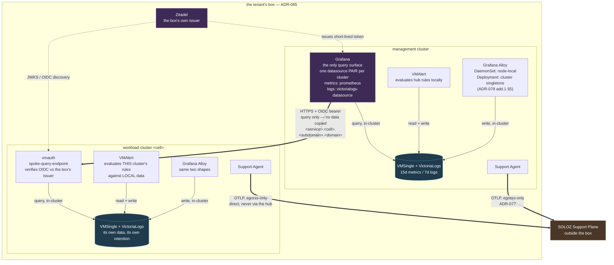

# ADR-083: Cross-Cluster Observability Federation

**Date:** 2026-09-19

**Status:** Proposed

*Constrained by: ADR-065 (The Control Plane Ships Into the Box), ADR-070 (The Minimum Supported Box), ADR-077 (The Support Agent), ADR-078 (The Observability Capability)*

> Data stays in the cluster that produced it. Only the query travels.

> **Amendment 2026-09-21 — the query endpoint is a listener, not a Gateway.**
> §"spoke query endpoint" gave this path a Gateway of its own on :443. On a
> spoke that also serves tenant hostnames that is a host-port conflict, because
> a Cilium hostNetwork Gateway binds a real port — envoy NACKs one of the two
> permanently while both report Programmed=True. The query endpoint is now a
> listener named `spoke-query` on the spoke's single :443 Gateway, contributed
> under ServerSideApply. See ADR-051's amendment of the same date for the rule
> and the evidence; nothing about this ADR's topology, retention or identity
> decisions changes.

---

## Topology

Two clusters shown; every workload cluster is identical to the spoke. Everything
inside the boundary is the tenant's box (ADR-065) and is reachable by nobody else.

```
                      the tenant's box — ADR-065
  ┌────────────────────────────────────────────────────────────────────────┐
  │                                                                        │
  │   MANAGEMENT CLUSTER                     WORKLOAD CLUSTER <cell>       │
  │  ┌──────────────────────────┐          ┌──────────────────────────┐    │
  │  │ Alloy                    │          │ Alloy                    │    │
  │  │   DaemonSet  node-local  │          │   DaemonSet  node-local  │    │
  │  │   Deployment singletons  │          │   Deployment singletons  │    │
  │  │        │ write           │          │        │ write           │    │
  │  │        ▼    in-cluster   │          │        ▼    in-cluster   │    │
  │  │ ╔══════════════════════╗ │          │ ╔══════════════════════╗ │    │
  │  │ ║ VMSingle             ║ │          │ ║ VMSingle             ║ │    │
  │  │ ║ VictoriaLogs         ║ │          │ ║ VictoriaLogs         ║ │    │
  │  │ ║ 15d metrics / 7d log ║ │          │ ║ its own data         ║ │    │
  │  │ ╚══════════════════════╝ │          │ ╚══════════════════════╝ │    │
  │  │      ▲          ▲        │          │      ▲          ▲        │    │
  │  │      │ read+    │ query  │          │      │ read+    │ query  │    │
  │  │      │ write    │        │          │      │ write    │        │    │
  │  │ ┌────┴─────┐    │        │          │ ┌────┴─────┐ ┌──┴──────┐ │    │
  │  │ │ VMAlert  │    │        │          │ │ VMAlert  │ │ vmauth  │ │    │
  │  │ │ hub      │    │        │          │ │ LOCAL    │ │ spoke-  │ │    │
  │  │ │ rules,   │    │        │          │ │ rules,   │ │ query-  │ │    │
  │  │ │ local    │    │        │          │ │ local    │ │ endpoint│ │    │
  │  │ └──────────┘    │        │          │ └──────────┘ └────┬────┘ │    │
  │  │            ┌────┴─────┐  │          │                   │      │    │
  │  │            │ Grafana  │══╪══════════╪═══════════════════╯      │    │
  │  │            │ the ONLY │  │  HTTPS + OIDC bearer                │    │
  │  │            │ query    │  │  QUERY ONLY — no data copied        │    │
  │  │            │ surface  │  │  <service>.<cell>.<subdomain>.<domain>   │
  │  │            └────┬─────┘  │          │                          │    │
  │  │                 │        │          │                          │    │
  │  │ ┌───────────┐   │        │          │ ┌───────────┐            │    │
  │  │ │ Support   │   │        │          │ │ Support   │            │    │
  │  │ │ Agent     │   │        │          │ │ Agent     │            │    │
  │  │ └─────┬─────┘   │        │          │ └─────┬─────┘            │    │
  │  └───────┼─────────┼────────┘          └───────┼──────────────────┘    │
  │          │         │ token                     │                       │
  │          │    ┌────┴──────────────┐            │                       │
  │          │    │ Zitadel           │────────────┼──► JWKS to vmauth     │
  │          │    │ the box's own     │            │                       │
  │          │    │ OIDC issuer       │            │                       │
  │          │    └───────────────────┘            │                       │
  └──────────┼─────────────────────────────────────┼───────────────────────┘
             │  OTLP, egress-only                  │  OTLP, egress-only
             │  ADR-077                            │  DIRECT — never via hub
             ▼                                     ▼
       ┌──────────────────────────────────────────────────┐
       │  SOLOZ Support Plane        outside the box      │
       └──────────────────────────────────────────────────┘
```



**What the arrows say, and what the absence of arrows says.**

| | |
|---|---|
| `Alloy → store` | always in-cluster. **No arrow crosses a cluster boundary carrying telemetry** — that is decision 6, and it is why a hub outage costs no data |
| `VMAlert → store` | always local. Evaluation never centralises (decision 2), so a spoke keeps alerting through a hub outage |
| `Grafana ⇒ vmauth` | the **only** cross-cluster line, and it carries a question, not data (decision 1). Hub→spoke, against the platform's usual spoke→hub direction |
| `Support Agent ⇒ Support Plane` | each cluster reports **directly**, never through the hub, and reads no observability component (ADR-077, ADR-078 §8). The two paths share evidence sources and nothing else |

**Read the failure modes off it.** Delete the hub: every spoke still collects, stores,
evaluates and alerts; what is lost is the pane of glass and the fleet view. Delete a
spoke's store: that cluster alone goes dark. Delete Zitadel: the hub cannot query
spokes — the cost of authentication having moved onto the box's own identity plane
(addendum 1 §1), and a dependency worth seeing rather than discovering.

**Not shown, because they do not exist.** There is no federation tier, so no single
PromQL expression spans clusters (decision 4). There is no `remote_write` between
clusters. There is no path from the Support Agent into any store.

## Context

ADR-078 addendum 1 placed the observability components: `VMSingle`, `VictoriaLogs`
and `VMAlert` on every cluster, Grafana on the hub alone, and the hub's Grafana
reaching each spoke's query API over that spoke's own ingress with mTLS. It decided
*where things run*. It did not establish that the resulting shape is an architecture
anyone else operates, and an architecture nobody else operates is one this platform
has to defend from first principles every time it is questioned.

Two things make that worth a decision of its own rather than a paragraph.

**It looks like a contradiction with ADR-077 and is not.** ADR-077 rejected routing
spoke telemetry through the hub, in terms: *"it makes the support channel depend on
the component most likely to be the subject of a support case — a hub outage would
blind the platform exactly when the evidence matters most."* ADR-078 then puts a
central query layer on the hub. A reader arriving at the two in order sees the same
argument answered twice, differently. The distinction that reconciles them is the
subject of this ADR and belongs somewhere a reader will find it.

**"Federation" is an overloaded word in exactly this domain.** Prometheus federation
is a `/federate` endpoint that *copies series out* of one store into another — which
is how `telemeter` works (`reference-projects/1proprietary/cluster-monitoring-operator/assets/telemeter-client/deployment.yaml:45-46`,
`--from=https://prometheus-k8s.openshift-monitoring.svc:9091`). That is metric
federation, it moves data, and it is not what this ADR decides. Query federation
leaves the data where it is and sends the question instead. Using one word for both
is how a design review ends up arguing about a different design.

## Decision

**The platform adopts central query federation over independent per-cluster stores.
Each cluster owns its telemetry, evaluates its own rules, and exposes a
Prometheus-compatible query API through its own ingress. A single query and
visualisation layer on the hub reads them. No telemetry is copied between clusters.**

### 1. The stores are independent; only the query layer is central

Every cluster — hub and spoke — runs its own `VMSingle`, `VictoriaLogs` and
`VMAlert`, retains its own data, and remains fully functional as an observability
system on its own. Grafana runs on the hub, holding one datasource pair per cluster.

This is the pattern Grafana documents for Grafana Enterprise Metrics, whose
`federation-frontend` provides *"the ability to combine data from multiple GEM
clusters into a single PromQL query"*, with *"combining the data from two GEM
clusters that are running in different regions"* as the stated use case. The target
clusters remain separate clusters; centralising the query does not centralise the
database.

It is also the pattern the vendor whose components this platform actually ships
documents for multi-region deployments: a top-level `vmselect` queries **regional
`vmselect` nodes** rather than storage — *"A top-level vmselect queries these instead
of connecting directly to vmstorage nodes"* — and *"If one region becomes
unavailable, the global vmselect can still query the healthy region, so dashboards
and queries can continue to work."*

### 2. Alert evaluation stays with the cluster that holds the data

`VMAlert` runs on every cluster, against that cluster's local store. Rule evaluation
is never centralised, and a hub outage therefore stops no alerting anywhere.

This is not a preference. Both vendors say the same thing from opposite directions.
Grafana's federation-frontend lists **no alerting or ruler support** among its
constraints — cross-cluster query is query only. VictoriaMetrics' multi-region guide
describes the same split, integrating alerting *through regional vmalert instances
pointing to local endpoints*.

So the central tier is a read path for humans and dashboards. The control loop that
decides whether to wake someone is local, which is the property that makes a spoke
survivable independently of the hub.

### 3. The query boundary is the cluster's ingress, and this platform authenticates it with mTLS

Grafana's own documentation places the query API behind an ingress rather than
exposing it directly: the Mimir HTTP API port *"is not typically exposed, as Grafana
Mimir generally runs behind an Nginx proxy, the GEM gateway, or Kubernetes ingress."*
A spoke publishing its query API through the ingress it already runs is the
Kubernetes implementation of that documented boundary, not a new one.

**The authentication is a deliberate departure.** GEM's federation-frontend *"does
not do any authentication itself"*; it *"forwards the Basic authentication and Bearer
token supplied by its clients to the underlying target clusters."* This platform uses
mTLS against the tenant's fleet CA (ADR-035) instead, for two reasons that are
specific to it rather than to the pattern:

- A bearer token forwarded from a browser session to a cluster query endpoint is a
  standing credential in a system whose PKI ADR-032 and ADR-035 built precisely to
  avoid standing credentials. The box already issues short-lived client certificates
  to every agent identity it runs.
- The endpoint is reachable from outside the cluster. Basic auth on a public query
  API is a password on the internet; a client certificate requirement is not.

Every spoke therefore gains **one authenticated public endpoint pair** — the query
APIs of its metrics and logs stores — and nothing else. This is the one new network
surface the topology creates and it is stated plainly here rather than discovered in
a security review.

### 4. There is no federation tier today, and the consequence is stated

Grafana holds one datasource per cluster. There is no `federation-frontend`, no
top-level `vmselect`, and no component whose job is to fan a query out.

**A single PromQL expression therefore cannot span clusters.** A dashboard shows
per-cluster panels, or combines results client-side through Grafana's mixed
datasource; it cannot compute a fleet-wide aggregate in one query. That is precisely
the capability GEM's federation-frontend and VictoriaMetrics' top-level `vmselect`
exist to provide, and this platform does not have it.

This is accepted rather than overlooked. At ADR-070's minimum box the fleet is small
enough that per-cluster panels answer the question, and a federation tier is a
component to run, secure, upgrade and be answerable for under ADR-069 — for a
convenience, not a capability.

### 5. The upgrade path is a tier, not a redesign

If fleet-wide aggregation becomes necessary, a top-level query tier is added on the
hub, reading the same per-cluster query APIs this ADR already exposes. Nothing moves,
no store is merged, and no spoke changes.

That is the whole reason for adopting a documented pattern rather than an
expedient one: the next step is the one the vendors already document, and the
trade-off it brings is documented too — VictoriaMetrics notes that with the
two-level topology *"queries usually take longer than using regional endpoints
directly, or through a load balancer."*

When it is taken, it is a new decision with a component behind it, on the discipline
ADR-078 §2 sets.

### 6. Telemetry is never copied between clusters

No spoke writes its telemetry to the hub. No hub store aggregates the fleet. This
rules out the `remote_write`-to-a-central-store design explicitly, so that it cannot
be reintroduced as an optimisation.

Two consequences follow, and both are the point:

- **ADR-077's argument is preserved, not contradicted.** It rejected making a *data
  path* depend on the hub. This ADR makes a *view* depend on the hub. When the hub
  is down, a spoke still collects, still stores, still evaluates its rules and still
  alerts; what is unavailable is the pane of glass. Support telemetry is untouched —
  the Support Agent reports from each cluster directly to the Support Plane
  (ADR-077), and never through the hub or through any observability component
  (ADR-078 §8).
- **Egress cost stays local and knowable.** Queries cross clusters only when someone
  is looking, rather than continuously in proportion to series count.

## Components

This ADR introduces no component. It decides where the components ADR-078 already
declares are placed, and what the connection between them is.

```architecture
capabilities:
  - observability
acceptance:
  - scripts/validate/cluster/88-observability-federation-topology.sh
```

The gate asserts the three properties that make this topology what it is rather than
an aggregation design that happens to work: every cluster declares its own store and
its own `VMAlert`; no Alloy configuration writes to another cluster's store; and the
spoke query endpoints require a client certificate.

## Provenance

### Taken, and why

**Central query layer over independent per-cluster stores** — Grafana Enterprise
Metrics, [Cross-cluster query federation](https://grafana.com/docs/enterprise-metrics/latest/manage/cluster-query-federation/).
The `federation-frontend`, introduced in GEM 1.4, combines *"data from multiple GEM
clusters into a single PromQL query"*, with two clusters in different regions as the
documented use case. Taken because it establishes that centralising the query is a
supported enterprise architecture and does not imply centralising storage.

**The same pattern in the components this platform actually ships** —
VictoriaMetrics, [Multi-regional setup: dedicated regions](https://docs.victoriametrics.com/guides/multi-regional-setup-dedicated-regions/).
A top-level `vmselect` queries regional `vmselect` nodes rather than storage, and
survives the loss of a region. Taken because a pattern documented by the vendor whose
software is in the box is worth more here than the same pattern documented by
another, and because it is the upgrade path in decision 5.

**Alerting stays regional** — both of the above. GEM lists no alerting or ruler
support as a constraint of cross-cluster federation; VictoriaMetrics' guide places
`vmalert` regionally, pointing at local endpoints. Taken because it is the property
that makes a spoke independently survivable, and because two vendors converging on it
from different products is a stronger signal than either alone.

**The query API sits behind an ingress** — Grafana Mimir,
[About Grafana Mimir network ports](https://grafana.com/docs/mimir/latest/references/architecture/ports/):
the HTTP API port *"is not typically exposed, as Grafana Mimir generally runs behind
an Nginx proxy, the GEM gateway, or Kubernetes ingress."* Taken because it makes the
spoke's ingress the documented boundary rather than an invention of this platform.

### Departed from, and why

**Authentication is mTLS, not forwarded bearer tokens.** GEM's federation-frontend
*"does not do any authentication itself"* and forwards the client's Basic or Bearer
credential to the target clusters. This platform issues short-lived client
certificates from the tenant's fleet CA to every agent identity it runs (ADR-035),
and the query endpoint is internet-reachable. Decision 3 gives both reasons.

**No federation tier is deployed.** GEM ships one and VictoriaMetrics documents one;
this platform has neither, and accepts the loss of cross-cluster PromQL that follows
(decision 4). The pattern is adopted at the architectural level; the component is
deferred until the fleet size justifies operating it.

**Query federation, not metric federation.** `telemeter` federates *metrics* — it
scrapes `/federate` and copies a selected series set to another system
(`assets/telemeter-client/deployment.yaml:45-46`). That is the right design for
bounded evidence leaving a boundary, and it is what ADR-077 does. It is the wrong
design here, because it would mean a second copy of every series, a second retention
policy, and a hub whose capacity bounds the fleet's observability.

## Alternatives considered

**Aggregate to a central store: spokes `remote_write` to the hub.** Simplest to
build, and the arrangement `hubdomain.go`'s derived `victoriametrics.hub.<domain>`
implies. Rejected: the hub's capacity becomes the fleet's ceiling, a hub outage
loses spoke data rather than merely the view of it, and alerting either centralises —
which both vendors' documentation declines to do — or evaluates against data that
has travelled. It also reintroduces, for the tenant's own telemetry, the bottleneck
ADR-077 rejected for the platform's.

**Grafana on every spoke.** Every cluster fully self-sufficient, nothing crossing
between them, no public query endpoint anywhere. Rejected: dashboards are release
content (ADR-078 §5), and delivering them to N clusters gives N places to diverge,
which makes *"which dashboards is this box running"* unanswerable. It also gives no
fleet view at all, at any cost.

**Tunnel queries back down the agent connection**, on the pattern `argocd-agent`
uses for its resource proxy (`manifests/argocd-principal/certificates.yaml:44`).
Architecturally the most consistent with the platform's existing spoke→hub-only
traffic, and it would avoid the public endpoint entirely. Rejected for now: it is a
component to build and maintain, with no vendor documentation behind it, for a
property the ingress plus mTLS already provides. Worth revisiting if the public
endpoint proves to be the wrong trade.

**Deploy a federation tier now** — GEM's `federation-frontend` or a top-level
`vmselect`. Rejected on ADR-070 grounds: it is a component to run, secure, upgrade
and stand behind, bought for cross-cluster PromQL that a small fleet does not yet
need. Decision 5 keeps the door open.

## Ownership

| Resource Class | System of Record | Lifecycle Owner | Reconciler | Consumer | Phase |
|---|---|---|---|---|---|
| Per-cluster telemetry stores | the cluster that produced the data | Observability capability | ArgoCD | Tenant operators | Day-1+ |
| Spoke query endpoint and its certificate | `<tenant>-gitops` | Tenant | cert-manager, ArgoCD | Hub Grafana | Day-1+ |
| Grafana datasource set | this repository, via the bundle | Platform | ArgoCD (`selfHeal`) | Tenant operators | Day-1+ |
| Alert evaluation state | the cluster that evaluates it | Observability capability | VMAlert | Tenant operators | Day-1+ |

See ADR-039 for the complete ownership matrix.

## Addendum 1: the query endpoint's authentication, its hostname, and the component it is (2026-09-19)

Six claims in this ADR were checked against the running cluster and the vendors'
documentation rather than against the pattern they were drawn from. Four did not
survive. Three of those are defects in this document; one is a defect in the design
it records, and it fails open.

Every finding below is verified. The command or file is named for each, because the
first version of this ADR cited its sources for the Grafana and VictoriaMetrics
patterns and asserted the rest.

### 1. mTLS at the Gateway does not work, and writing it produces a silent hole

Decision 3 requires the spoke query endpoint to be authenticated by client
certificate at the ingress. The API exists and Cilium ignores it.

The schema is present at the bundle this platform pins, and it is shaped exactly as
GEP-91 describes -- Gateway-level, with per-port override, rather than per-listener:

```
$ kubectl get crd gateways.gateway.networking.k8s.io -o json     # bundle v1.5.1
  spec.tls.frontend.perPort[].port
  spec.tls.frontend.perPort[].tls.validation.caCertificateRefs
  spec.tls.frontend.perPort[].tls.validation.mode
      enum = [AllowValidOnly, AllowInsecureFallback]
```

The implementation does not. Cilium v1.17.18's GatewayClass advertises twenty-eight
supported features and no client-certificate validation among them:

```
$ kubectl get gatewayclass cilium -o jsonpath='{.status.supportedFeatures}'
  GRPCRoute, Gateway, GatewayHTTPListenerIsolation,
  GatewayInfrastructurePropagation, GatewayPort8080, GatewayStaticAddresses,
  HTTPRoute..., Mesh, MeshClusterIPMatching, ReferenceGrant, TLSRoute
```

**So the field is accepted by the API server and dropped by the data plane.** A
Gateway carrying `AllowValidOnly` reports `Accepted=True`, raises no condition, logs
nothing -- and serves the tenant's entire telemetry store to the internet with no
client certificate required. A manifest-level gate passes on it. This is the worst
available failure mode: the security property this ADR rests on is absent, and
everything that would tell anyone is green.

**And terminating mTLS at the store instead is not available either.** `TLSRoute` is
in Cilium's feature list, so passthrough to a workload that verifies the client
certificate itself is implementable -- it is the pattern
`manifests/argocd-principal/certificates.yaml:15` already uses for the one
cross-cluster mTLS path this platform has. But the workload cannot do it:

> *"On top of this, Enterprise package of VictoriaMetrics includes the following
> features: mTLS for all the VictoriaMetrics components"*
> — [VictoriaMetrics Enterprise features](https://docs.victoriametrics.com/victoriametrics/enterprise/)

`-mtls` and `-mtlsCAFile` are Enterprise. So is `vmauth`'s mTLS-based request
routing, which is the other place the verification could have lived: *"The Enterprise
version of vmauth can be configured for routing requests to different backends
depending on the following subject fields in the TLS certificate."*

This platform is OSS and ships OSS components (ADR-071). **Client-certificate
authentication of the query endpoint is therefore not available at any layer the
platform can reach** -- not at the Gateway, not at the store, not at a proxy in front
of it.

**Decision. The query endpoint authenticates with OIDC, against the box's own
issuer.**

`vmauth` is OSS and its OIDC/JWT verification is OSS -- bearer tokens from v1.137.0,
with RSA/ECDSA verification and OIDC discovery. The box already runs Zitadel as its
identity provider (`hubdomain.go:39`), already issues tokens to every platform UI,
and hub Grafana already authenticates its users there. A `vmauth` in front of each
spoke's stores, verifying tokens from the box's own issuer, uses the box's existing
identity plane rather than a second authentication system.

This is a **departure from decision 3 and from GEM**, and the reason decision 3 gave
for departing from GEM no longer holds. It argued against forwarded bearer tokens
because they are *"a standing credential in a system whose PKI ADR-032 and ADR-035
built precisely to avoid standing credentials."* An OIDC access token from the box's
own issuer is short-lived and revocable at the issuer -- it is the opposite of a
standing credential, and it is what the rest of the box already uses. What decision 3
was right to reject was **static** Basic auth, which GEM also forwards.

**The consequence for ADR-035.** No new PKI, and no client certificate for Grafana --
which withdraws the question addendum 2 of ADR-069 and the review of this ADR raised
about a client identity that cannot hot-reload. Grafana's datasource carries an OIDC
credential, not a certificate, so the 24h/7d classification question does not arise
here. The spoke's *serving* certificate is an ordinary public ACME certificate on an
ordinary hostname.

**The gate must test enforcement, not declaration.** Because the failure above is
silent and fails open, `88-observability-federation-topology.sh` asserts that an
unauthenticated request to each spoke's query endpoint is REFUSED, from outside the
cluster. A check that reads the manifest would have passed on a wide-open endpoint,
which is how this defect would have shipped.

### 2. The hostname needs the cell id, and this ADR could not have used the spoke's existing wildcard

Decision 3 says the spoke publishes "through the ingress it already runs". The
ingress it already runs cannot express a per-cluster hostname:

```yaml
# manifests/spoke/spoke-catalog/templated-fields.yaml:133-139
- kind: Gateway
  name: tenant-gateway
  # The wildcard a spoke terminates tenant traffic on: *.<zone>.
  fields:
    - replaceAll: {from: dev.nutgraf.in, with: '{{ .Values.global.hubDomain }}'}
```

`*.<zone>` where zone is `global.hubDomain` -- **per box, not per cluster**. Two
spokes in one box both resolve `victoriametrics.<hubDomain>`, and external-dns races
for a single record.

ADR-051 states a rule rather than a list -- *"every public hostname is
`<service>.<subdomain>.<domain>`"*, and *"no individual hostname is independently
declared"* -- so nothing enumerated blocks a new name. But the rule has no cluster
component, and ADR-051's own Consequences already concede the gap: *"A tenant
spanning multiple spokes has no answer here."*

**Decision.** `<service>.<cluster>.<subdomain>.<domain>`, where `<cluster>` is the
workload cluster's name.

That name is already the cell id (ADR-082: *"Every per-cluster identity derives from
the cluster's name"*), and this becomes the fourth identity derived from it,
alongside the CNPG archive prefix (ADR-014), the cell label (ADR-047) and the ArgoCD
cluster secret. It is not a new convention; it is the existing one reaching a
hostname.

**ADR-051 needs the amendment**, and it is the ADR that owns the rule. Recorded here
because this ADR is what forces it, and noted as blocking: the datasource set in
decision 3 below cannot be generated until the hostname scheme exists.

### 3. The datasource set is generated per box, not shipped in the bundle

This ADR's Ownership table reads *"Grafana datasource set | this repository, via the
bundle | Platform"*. That is wrong, and it is wrong against the ADR written one
number earlier.

Cluster names are tenant-chosen (ADR-082) and differ per box. A datasource set
enumerating them is an instance, and ADR-082 is explicit: *"The bundle ships the
template, never an instance of it."*

**Correction.** The bundle ships the datasource *template*; the box generates the
*set*, through `templated-fields.yaml`, which is the mechanism that already exists
for exactly this class of value (`hubDomain`, the Infisical ids, the cluster name in
Alloy's `external_labels`).

| Resource Class | System of Record | Lifecycle Owner |
|---|---|---|
| Grafana datasource **template** | this repository, via the bundle | Platform |
| Grafana datasource **set** | the box, generated at scaffold from its declared clusters | Tenant |

### 4. "One datasource pair per cluster" is two datasource types, and one of them needs a plugin

Decision 1 says each cluster exposes *"a Prometheus-compatible query API"*, singular.
There are two stores and only one of them is Prometheus-compatible.

VictoriaLogs speaks LogsQL. Its Loki compatibility is on the **ingest** path
(`/insert/loki/api/v1/push`), not on query, and the vendor is direct about it:
Grafana's built-in Loki datasource does not work with VictoriaLogs, which requires
the `victorialogs-datasource` plugin, installed through `GF_INSTALL_PLUGINS`.

**This is a live defect in a shipped descriptor.**
`manifests/argocd/components/03/grafana.yaml` declares the VictoriaLogs datasource as
`type: loki`, which would fail at first query with an error about the query language
rather than about the datasource.

**Correction.** The Grafana chart installs `victoriametrics-logs-datasource`, and the
logs datasource is that type. Decision 1's phrasing becomes *"a Prometheus-compatible
metrics query API and a LogsQL query API"*.

### 5. Alert routing is configured once per cluster, and that cost is not stated

`VMAlert` runs on every cluster (decision 2) and ADR-078 §6 leaves routing to the
tenant, shipping no default receiver. A tenant therefore configures notification N
times, once per cluster, and that is not in this ADR's negatives.

It is stated rather than solved, because the obvious fix is unavailable: centralising
routing means centralising evaluation, which is the thing both vendors decline to do
and which decision 2 rests on. It also partly undoes the single-source argument
decision 4 makes for dashboards -- dashboards are delivered once, alert routing is
not.

### 6. The endpoint is a component

This ADR says *"This ADR introduces no component"* while creating, on every spoke, a
hostname, a DNS record, a serving certificate with a renewal cycle, a Gateway
listener, an authenticating proxy and a port policy. That is a component with an
owner and a failure mode, and ADR-078 §4 -- written by the same hand, one ADR earlier
-- states the rule it breaks: *"No component named in this ADR exists only as a
noun."*

It is also the direct cause of three of the findings above. A component registration
would have forced the hostname question (2), the certificate's consumer and lifecycle
(1), and the authentication mechanism that turned out not to exist (1). They were
missed because nothing made them be answered.

```architecture
capabilities:
  - observability
components:
  - spoke-query-endpoint
acceptance:
  - scripts/validate/cluster/88-observability-federation-topology.sh
```

`spoke-query-endpoint` is `vmauth`, its HTTPRoute, its serving Certificate and its
DNS record, on every workload cluster.

### 7. Gate 88 must not fail a supported configuration

The gate greps spoke `remote_write` blocks for `victoriametrics\.hub\.|\.hub\.` to
assert that no spoke writes to another cluster's store. ADR-078 §7.1 permits a tenant
to add their own destinations, additively -- so a tenant whose corporate Prometheus
is at `metrics.hub.corp.example` fails a configuration this platform supports.

**Correction.** The gate matches the box's own derived hub hostname, not a substring,
and tests only the platform's own pipeline.

### 8. What this addendum does not change

The topology stands: independent per-cluster stores, local alert evaluation, a
central query layer on the hub, no telemetry copied between clusters. Every finding
above is about how the query endpoint is built, named, authenticated and registered.
The provenance in this ADR -- GEM's federation-frontend, VictoriaMetrics' multi-region
`vmselect`, Mimir's ingress boundary -- is unaffected, and decision 6's reconciliation
with ADR-077 is unaffected.

## Addendum 2: built (2026-09-19)

Every component this ADR and ADR-078 name is applied by something. What the build
found that neither document anticipated:

**`crds.plain: true` installs zero CRDs.** The operator chart gates its CRDs on a
`crds` subchart with `condition: crds.plain`, so a render that has not run
`helm dependency build` emits none -- verified against 0.38.0: `plain=true` yields
0, `plain=false` yields 16. Both the hub descriptor and the spoke vendoring had
`true`. The CRs would have been applied against an API that does not serve them,
and boundary 03 would have failed the way the spoke catalogue did on its Cilium
policy.

**kustomize cannot inflate the chart on the spoke.** Its helm integration shells
out to `helm version -c` -- a Helm 2 flag -- and fails on any modern helm. The
operator is vendored instead, like every other operator in the catalogue
(cloudnative-pg, crossplane, kyverno). A build that depends on the operator's
toolchain breaks on someone else's machine.

**The VMAuth CR cannot express OIDC.** `VMUser` at chart 0.38.0 carries no `jwt`
field, so the query endpoint is a Deployment with an explicit `-auth.config`
rather than a CR. The config verifies tokens by OIDC discovery against the box's
own issuer and maps only READ paths: `/prometheus/api/v1/query*` and
`/logs/select/*`. `/api/v1/write` is deliberately absent, so a compromised token
cannot poison a store.

**The spoke's kube-state-metrics address was aspirational.** It named
`kube-system` and nothing installed it there -- verified absent on nutgraf-01 --
so every `kube_*` series a workload cluster should report has been missing, and
the alert rules reading them evaluated against nothing.

```architecture
capabilities:
  - observability
components:
  - spoke-query-endpoint
acceptance:
  - scripts/validate/cluster/37-spoke-public-endpoints.sh
  - scripts/validate/cluster/87-observability-tenant-scoping.sh
  - scripts/validate/cluster/88-observability-federation-topology.sh
  - internal/soloz-cli/bootstrap
```

Gate 37 is separate from 35-public-api-endpoints.sh on purpose. That module's
hosts derive from the zone alone because every one belongs to the BOX; these
belong to a CLUSTER, so the list is one entry per workload cluster the box has
declared and the names are the tenant's (ADR-082). It reads them from the ArgoCD
cluster registry -- the same inventory the fleet ApplicationSets generate from --
so the check and the delivery it verifies cannot disagree about which clusters
exist.

It asserts the endpoint resolves, terminates TLS on a chain a browser accepts,
and **refuses an unauthenticated query**. The last is the one that matters:
addendum 1 §1 records that a Gateway carrying `AllowValidOnly` reports
`Accepted=True` and serves the store to the internet anyway, so a check that
only confirmed the endpoint answers would pass on exactly that hole. A 200 to an
unauthenticated query is a hard failure, not a warning.

**What is deferred, and named rather than left to be discovered.** There is still
no federation tier (decision 4), so no single PromQL expression spans clusters.
The datasource set's workload-cluster half is generated at scaffold from the
clusters a repository declares, and a set that drifts from the cluster set fails
as a missing panel rather than an error -- which is this ADR's own negative, now
with a gate behind it.

## Consequences

### Positive

A spoke is independently survivable. It collects, stores, evaluates and alerts with
no dependency on the hub, so the cluster most likely to be the subject of an incident
is not the cluster whose failure hides it.

The topology is one two vendors document, so a security or architecture review reads
a published pattern rather than an argument. The upgrade path to cross-cluster
querying is the tier those vendors already ship.

Telemetry volume never crosses a cluster boundary, so fleet growth does not consume
hub capacity and egress stays local and knowable.

Dashboards remain single-sourced release content with one place to install them.

### Negative

**Every spoke gains an internet-reachable query endpoint.** Client-certificate
authentication bounds it, but the endpoint exists, and it is a new surface that did
not exist before this decision.

**No query spans clusters.** Fleet-wide aggregates are not expressible in PromQL
until a federation tier is added, and some dashboards will be per-cluster that an
operator would rather see combined.

**A hub outage costs the pane of glass.** Data, retention and alerting are unaffected,
but nobody is looking at a dashboard while the hub is down.

**N datasources is a configuration surface that grows with the fleet.** Adding a
spoke means adding a datasource pair, and a datasource set that drifts from the
cluster set fails silently as a missing panel rather than as an error.

## Impact

- **Extends ADR-078.** Its addendum 1 decision 1 placed the components; this names
  the architecture that placement belongs to, and supplies its provenance.
- **Reconciles with ADR-077.** That ADR rejected a hub-dependent *data path*; this
  one creates a hub-dependent *view*. Decision 6 states why they are different, so
  the two can be read in sequence without appearing to contradict.
- **Bounded by ADR-070.** Per-cluster stores are a footprint on every spoke, and the
  federation tier is deferred on the same grounds.
- **Depends on ADR-035.** The query endpoint's mutual authentication uses the
  tenant's fleet CA and the `infrastructure-services` profile, with no new PKI.
- **Untouched: ADR-077's support path.** The Support Agent reports from each cluster
  directly to the Support Plane and reads no observability component (ADR-078 §8).
  Nothing in this ADR is in that path.

## References

- ADR-032: PKI Architecture, Revocation, and Secret Traversal
- ADR-035: Enterprise PKI and Delegated Trust via Infisical OSS
- ADR-039: Platform Ownership Model
- ADR-065: The Control Plane Ships Into the Box
- ADR-069: The Maintenance Promise
- ADR-070: The Minimum Supported Box
- ADR-076: Reaching a Box You Own
- ADR-077: The Support Agent
- ADR-078: The Observability Capability
- [Grafana Enterprise Metrics — Cross-cluster query federation](https://grafana.com/docs/enterprise-metrics/latest/manage/cluster-query-federation/)
- [Grafana Mimir — About Grafana Mimir network ports](https://grafana.com/docs/mimir/latest/references/architecture/ports/)
- [VictoriaMetrics — Multi-regional setup: dedicated regions](https://docs.victoriametrics.com/guides/multi-regional-setup-dedicated-regions/)
