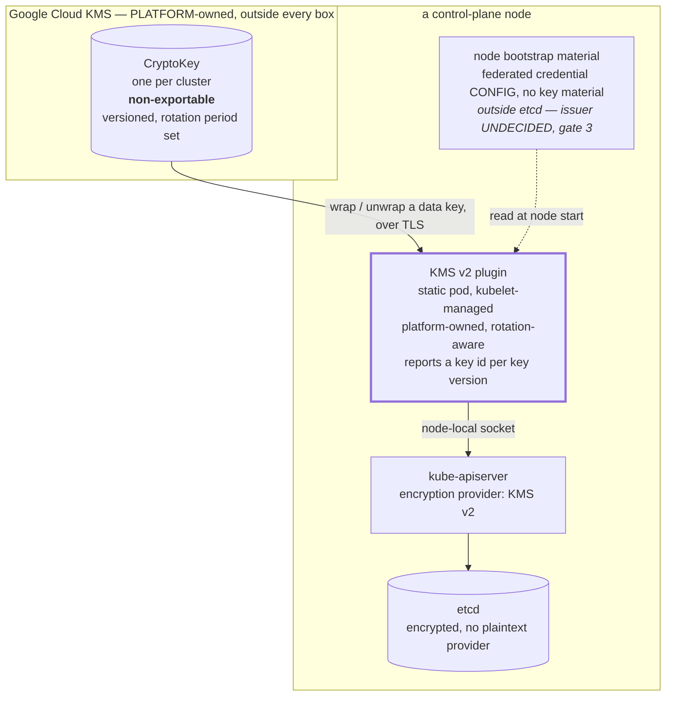

# ADR-100: The key that encrypts etcd lives outside the box

**Date:** 2026-10-02
**Last amended:** 2026-10-06 (Amendment 2)
**Status:** **Proposed — revision required.** Accepted 2026-10-02; **that acceptance is
withdrawn** following external review on 2026-10-06. The architecture is not in dispute.
The conditions are in [Review](#review).
**Amends:** ADR-003 §6 (Protection at rest)
**Relates to:** ADR-065 Amendment 2 (the platform may own crypto infrastructure, and
what that costs), ADR-076 (the escrow), ADR-046 (two sites), ADR-041 (template
immutability)



## Review

**2026-10-06 — external review: rejected as presented.** The architectural direction was
not disputed: external, per-cluster, non-exportable keys; a node-local KMS v2 plugin; no
plaintext provider after migration; key administration separated from key use. What was
rejected was this document's internal consistency and the strength of its evidence.

Four findings were **document contradictions introduced by Amendments 1 and 2** — the
amendments changed the decision and did not sweep the sections downstream of it. All four
are confirmed and fixed:

| finding | where it was | now |
|---|---|---|
| "No new vendor and no second cloud account" survived in Positive consequences | Consequences | struck, with the honest accounting |
| Gate 1's outstanding work still named Infisical as the real store | Completion gate 1 | rewritten; the 19/19 result marked superseded |
| "the platform composes nothing", stated twice beside a suffix | Alternatives table, Amendment 2 | both corrected |
| the no-reactivation test cited as "the best evidence in the run" | Gate 1 findings | withdrawn, with why the test was misread |

One finding was a **real defect in the implementation**, not just the document, and is
the most valuable thing the review produced:

- **The IAM policy described would not have worked.** The plugin called `GetCryptoKey`,
  needing `cloudkms.cryptoKeys.get`, which `roles/cloudkms.cryptoKeyEncrypterDecrypter`
  does not carry — while this ADR listed that permission under that role. Resolved by
  removing the call: the active version is discovered by encrypting against the parent
  key. Two permissions, one standard role, no custom role. See "The platform owns the
  plugin".

One finding is **partly disputed, on the record**:

- *"No timeout/retry policy exists."* They exist in code and were undocumented, which
  is a different defect with a different fix. Per-call timeout 10s; three bounded
  retries for integrity failures only; transport and permission errors return
  immediately rather than being retried. Now recorded under "Operational design".
  Location, availability target, quota budget and recovery objective genuinely did not
  exist and are now decided there — except the two marked as needing an owner.

The remaining findings are accepted as blocking and are **not** closed by this revision:

| # | condition | owner | state |
|---|---|---|---|
| 1 | one coherent target state; no Infisical-as-KMS remnants | platform | **closed** |
| 2 | Git-managed desired state and a named reconciler for key, IAM, federation, rotation, retention | platform | **decided, not built, and its premise now verified.** Crossplane on the hub, already installed and ArgoCD-delivered at wave 01; the provider schema was checked and does enforce forward-only rotation. Not Terraform, and not as a substitute for it — see "Declarative delivery" |
| 3 | exact key-scoped IAM policy, federation claim mapping, credential bootstrap and rebuild path, revocation procedure | platform | **the IAM policy half is CLOSED** — applied by `soloz kms init` and verified against real IAM on 2026-10-06, **12 of 12** by real authorization-denial calls, running as the plugin's own identity. See "Real-project IAM evidence". Federation claim mapping and the full-rebuild credential path remain open — Gate 3 |
| 4 | a durable, independently enforceable no-reactivation policy, **or removal of the guarantee** | platform | **closed as far as expressibility goes.** Removed from the plugin; enforcement moved to condition 2, and the provider schema was verified on 2026-10-06 to have no primary-version field at all. Two caveats recorded: the schema is beta, and inexpressible is not the same as detected |
| 5 | real-GCP evidence: cold restart during outage, credential expiry and revocation, denied cross-key access, rotation, rollback, migration, backup restoration | **needs a GCP project** | open — Gate 3 |
| 6 | repository locations so the abstractions can be verified | — | see below |

**On condition 6.** The reviewer could not verify any implementation claim because they
had no repository. That is a review-setup problem rather than an ADR defect, and it means
every implementation finding in that review except the IAM one is unverified rather than
refuted. The code is in this repository: the plugin at `operators/kms-plugin/`
(`ATTRIBUTION.md` records what it forks and the seven ways it diverges), the structural
checks at `scripts/validate/preflight/100-kms-identifier-is-deterministic.py`, the
integration gate at `operators/kms-plugin/test/gate1/`, and the delivery templates at
`manifests/providers/hetzner/base/` and `internal/assets/manifests/classes/`.

**What this ADR may not claim until conditions 3 and 5 close.** That the design is
production-ready. It may claim that the architecture is decided, that the plugin
implements the contract as read from the pinned client and the API server's own source,
and that the plumbing holds against a stand-in. Nothing about real IAM, real federation,
real quotas or real failure modes is established, and the gates say so.

### 2026-10-06, second round: eleven mandatory controls

A second review restated the bar as eleven conditions. Status against each, with what
closed them and who owns what did not. **Amendment 3** is the code and design change this
round produced.

| # | condition | state |
|---|---|---|
| 1 | one coherent GCP-only design; no Infisical-KMS claims, tests, costs or recovery language | **CLOSED.** `internal/keystore/infisical.go` and its test are deleted; the remaining mentions of Infisical in this ADR and in the plugin are either historical record of why it was rejected, or correct statements about it being the secret store and the ADR-076 escrow — which it still is |
| 2 | Git-managed declarative ownership of key, IAM, federation, rotation policy, retention, recovery metadata | **OPEN.** Decided and its premise verified (Crossplane on the hub; the provider schema was checked); not built. See "Declarative delivery" |
| 3 | a real reconciler / IaC mechanism, not manual cloud-console steps | **BOOTSTRAP HALF CLOSED; reconciliation is condition 2.** There are no console steps: `soloz kms init` applies the key, the IAM policy and the identity, idempotently, with tests asserting the binding lands at the key, that an existing unrelated binding survives, and that no call ever touches the service-account key endpoint. A command run once is still not a reconciler, which is why condition 2 is separate and open |
| 4a | one cluster's plugin cannot use another cluster's key | **PROVEN** against real GCP: `PERMISSION_DENIED` encrypting under a second key in the same ring. Each cluster also has its own key and its own service account bound only to it. The probe key is a sibling rather than literally a second cluster's key; the IAM check is identical, and it becomes literal once a second cluster is provisioned |
| 4b | plugin cannot rotate, disable, destroy, administer or alter IAM | **CLOSED.** 12 of 12 against real GCP on 2026-10-06, all five administrative operations refused on a canary carrying the identical binding. Real calls on the enforcement path, aimed at a canary key carrying the IDENTICAL binding, with the aim enforced in code by `mustBeCanary`. Three designs preceded it and all were wrong: live-key mutation (performs the action it tests for), an unbound throwaway (refused for the wrong reason), and `testIamPermissions` (documented by Google as unsuitable for authorization checking and able to fail open). Policy Troubleshooter would add *attribution* of which binding decides and is **not implemented** — recorded as a complement, not a substitute |
| 4c | the required `GetCryptoKey` permission is explicitly accounted for | **CLOSED, and it is no longer required.** This is the finding from the first round, and the fix was to remove the need rather than grant it: the plugin discovers its active version by encrypting against the parent key and reading `EncryptResponse.Name`. `cryptoKeys.get` is not held, the plugin does not call it, the denial is proven against real GCP, and a preflight fails the build if the call reappears |
| 5 | complete bootstrap identity design: issuer, per-node credential source, renewal, revocation and expiry, full hub-rebuild path, no long-lived key on disk | **DECIDED, NOT BUILT — still the critical path.** See "The bootstrap identity". X.509 federation against the per-cluster CA; the API surface, the attribute mapping, the token exchange and the Go support were all **verified on 2026-10-06** against the pinned modules, and the plugin's client already routes through the auth library that supports it with no dependency change. Node replacement needs no action and identity isolation is structural. **Three things remain open and are named there:** the hub-rebuild trust-anchor step is a procedure whose *enforcement* is not written; nothing reports the certificate's remaining lifetime, so a pod that does not restart for a year expires into a failed cold read; and credential failure is **not** cleanly distinguishable by gRPC status code, so the health classification needs a separate credential probe rather than the code |
| 6 | a durable rotation authority enforcing monotonic progression; not plugin memory, not operator discipline | **CLOSED for detection; remediation is deliberately manual.** Plugin memory gone (Amendment 2); operator discipline gone (Amendment 3 removed the suffix). Reactivation is not expressible in the reconciler's desired state, and a durable **version floor** now lives on the reviewed manifest with `soloz kms drift` alarming on a regression — see "Drift control". No automatic repair, by decision: that would restore the mutation authority withheld from anything in-cluster. **Open:** nothing runs the check on a schedule or routes its failure to an owner |
| 7 | remove the synthetic key-ID suffix unless a shared-key use case is formally enforced | **CLOSED, and more completely in Amendment 4.** There is no shared-key use case: the key is per cluster and cross-cluster use is denied by IAM. Amendment 3 removed the suffix from the identifier but kept the flag as break-glass; the second review was right that an available flag *is* the manual mutation path, so Amendment 4 **deletes it**. No configuration can append anything to the identifier |
| 8 | defined availability design: location, latency/SLO budget, quotas, retry/timeouts, monitoring, alerting, incident ownership, DR assumptions | **CARRIER, OWNER, SIGNING-KEY POLICY AND INSTRUMENTATION DONE; BUDGETS OPEN.** Location signed off; timeouts, retries and probe rates recorded. `soloz kms check` plus a scheduled CI workflow observe from outside the clusters they check. Owner is **Platform Security / Control-Plane on-call**, and the workflow refuses to run without one. Signing-key rotation is event-driven with a stated expiry condition. The plugin now exports latency, failures by reason, the active key version and health — the inputs an SLO needs. **Open:** the SLO and error budget themselves, measured quotas, and a recovery objective, all of which want numbers from running it rather than from design |
| 9 | real-GCP end-to-end evidence: bootstrap, key-scoped IAM denial, rotation, API-server restart during outage, credential expiry and revocation, migration, backup restoration, full recovery | **IAM DENIAL DONE** — 12 of 12 by real denial calls, see "Real-project IAM evidence". Bootstrap of the KEY is done. Everything else is **blocked on condition 5**: running a real control plane against Cloud KMS needs the node credential that condition 5 has not decided |
| 10 | verified repository review showing static pod, CAPI template, GitOps reconciliation, image supply chain and product boundary actually implement this ADR | **OPEN**, and partly downstream of 2 and 5. The static pod, the image and its supply chain exist and are asserted by preflight; the CAPI template work is gate 3; GitOps reconciliation is condition 2 |
| 11 | status **Proposed** until mandatory controls and production evidence are complete | **ALREADY DONE** — the acceptance was withdrawn in the first round, before this list arrived |

**The shape of what remains.** Five conditions are closed, two partly, and the rest
reduce to one decision: **how a static pod on a Hetzner node presents a federated
identity to Google.** Conditions 9 and 10 are gated on it, condition 5 *is* it, and no
amount of further work on the plugin or the provisioner moves them. That is the next
decision, and it is architectural rather than a task to hand off.

## Amendments

### Amendment 1 — 2026-10-05: the authority is Google Cloud KMS, not the tenant's store

**What changed.** This ADR was first accepted with the tenant's own Infisical instance
as the key authority, on the reasoning that it already offered key management and "there
is no second vendor to add". Both the plugin and its client were built against it. The
authority is now **Google Cloud KMS**, platform-owned.

**Why.** Two properties emerged from building it, both verified in the deployed source
and both recorded in the Context below: the permission subject that expresses
"encrypt/decrypt this one key and nothing else" is licence-gated, and the encrypt
endpoint takes no version — so the version that performed an encryption could only be
inferred, never stated. Neither is a defect in the product. Both make it the wrong
authority for this particular key. Infisical remains the secret store and the ADR-076
escrow.

**What this costs, stated plainly.** The platform now depends on a cloud provider it had
no prior footprint with — zero files in this repository reference GCP, AWS or Azure
before this change; the object store is Hetzner's. This is a new vendor, a new billing
relationship, a new identity federation to operate and a new availability dependency on
the control plane's cold-read path. ADR-065 Amendment 2 is what permits it and states
the consequence.

#### Alternatives considered

The selection criterion is narrow and worth naming, because it is not "which KMS is
best": it is **which KMS maps onto the Kubernetes KMS v2 contract without the plugin
having to invent the mapping**. That contract requires a `key_id` that changes when the
effective key changes, never repeats, and is identical in `Status` and `Encrypt` for the
same write. A provider that does not expose *which key version performed an operation*
forces the plugin to infer it, and every inference there is a silent failure mode.

| | Verdict | Why |
|---|---|---|
| **Google Cloud KMS** | **selected** | Explicit `CryptoKeyVersion`; `CryptoKey.Primary` names the active one; `EncryptResponse.Name` states the version that *actually performed* the encryption; `EncryptRequest.Name` accepts a version, so the write can be pinned to the version being reported; IAM grantable at the individual key; external workload identity federation for a non-GCP node. The `key_id` is then built on a resource name GCP already guarantees is unique, rather than on a scheme the platform has to defend. |
| **AWS KMS** | rejected for fit | Strong key-level IAM and a credible non-AWS machine identity path (IAM Roles Anywhere). But automatic rotation deliberately **preserves the key id and ARN** while the underlying material changes, which is the opposite of what this contract needs: the `key_id` must change when the effective key does. Expressing that would mean a platform-invented key-generation convention layered on top — exactly the inference this criterion rejects. Not a judgement on AWS KMS. |
| **Azure Key Vault Managed HSM** | rejected on weight | Role assignments can be scoped to a single key and to versions of it, and managed identities exist, so it is technically viable. Rejected because Managed HSM brings a larger security and infrastructure plane than one wrapping key for one cluster warrants. |
| **HashiCorp Vault** | rejected | Its Kubernetes KMS provider is Enterprise **and beta**, and HashiCorp's own guidance discourages beta functionality in production. It also puts the platform back in the position of operating the external key authority itself, which forfeits most of the reason for introducing an external KMS at all. |
| **Infisical CMEK** | rejected | The two verified reasons in the Context below. |

**Provenance, because it differs between rows.** The Cloud KMS row is verified against
the pinned client (`cloud.google.com/go/kms@v1.35.0`) field by field, per ADR-097. The
AWS, Azure and Vault rows are from those vendors' published documentation and have
**not** been verified against a deployment — no account with any of them exists here.
They are recorded as the reasoning that was available at decision time, not as tested
facts. The Infisical row is verified source.

### Amendment 5 — 2026-10-06: `testIamPermissions` was the wrong instrument

**Withdrawn one revision after adopting it.** Amendment 4 replaced the mutating
administrative probes with `testIamPermissions`, on the reasoning that it answers the IAM
question without changing anything. It does not answer it. Google's own client documents
the call:

> *"Note: This operation is designed to be used for building permission-aware UIs and
> command-line tools, **not for authorization checking**. This operation may 'fail open'
> without warning."*
> — `cloud.google.com/go/kms@v1.35.0` `apiv1/key_management_client.go:1337-1339`

That caveat is in the same generated file this ADR already cites for `CreateKeyRing` and
`SetIamPolicy`, so ADR-097's rule — read the source of the pinned version — would have
caught it and did not, because the call was adopted for its *shape* rather than read.

**Fail-open is the wrong direction for a negative assertion.** Every administrative row is
of the form "this permission is NOT held", and a check that may silently report a
permission as absent while the identity holds it fails in precisely the direction that
produces false confidence.

#### What replaced it: a canary key with the identical binding

The objection to a throwaway key was that the identity has no binding on it, so a refusal
there is a refusal for the wrong reason and proves nothing about the live key. The fix is
to stop making it a throwaway:

| key | binding | proves |
|---|---|---|
| the live key | the generated binding | encrypt and decrypt **work** — positives only, and the only key the round trip touches |
| the **canary** | **the identical binding** — same service account, same single role, at the key — and holds no data | every administrative operation is **refused for the production reason**: `updatePrimaryVersion`, `setIamPolicy`, `createCryptoKeyVersion`, `disable`, `destroy` |
| the **deny probe** | **none** | the identity cannot reach a key it was never granted |

Three keys because they prove three different things, and the canary is the one that was
missing.

**Real calls on the enforcement path are stronger than any policy analysis, and that is
the argument for this over Policy Troubleshooter.** Analysing the key's IAM policy shows
what that policy says; it does not show what the API does. An inherited project-level
grant — someone holding `roles/cloudkms.admin` at the project — would leave the key-level
policy looking correct and would make these calls **succeed**, failing the row. Policy
Troubleshooter remains worth adding for *attribution* (which binding decides), and is
**not implemented**; it is recorded under condition 4b as a complement rather than a
substitute.

**The aim is enforced in code, not by comment.** Every administrative method refuses a
target whose key name does not end in `-canary` (`mustBeCanary`), so an edit that re-points
one at the live key fails at runtime instead of performing it. A test asserts the guard,
asserts no administrative call reaches a non-canary key, asserts the canary's policy is
byte-identical to the live key's, asserts the deny probe stays unbound, and asserts that a
call which *succeeds* fails its row — because a fake that refuses everything would pass
whatever the assertion was.

`--with-canary` on `soloz kms init` creates and binds it. Without it the administrative
rows report `not-tested` rather than being redirected at the live key.

### Amendment 4 — 2026-10-06: the break-glass flag is deleted, and the denial checks stop mutating

Two corrections from a second review, both accepted in full.

**`--key-suffix` is deleted rather than retained unset.** Amendment 3 removed it from the
identifier and kept the flag for a disaster-recovery case the rotation authority's schema
cannot express. That is still the manual identifier mutation this design removed: a
break-glass path that is merely available gets used, and a flag is not an authorisation
boundary. There is now no configuration that can produce an identifier other than the
`CryptoKeyVersion` resource name.

**The administrative denials are established by asking, not by attempting.**
`soloz kms prove` used to call `setIamPolicy`, `createCryptoKeyVersion`, `disable` and
`destroy` and record the refusals. Amendment 3 bounded the blast radius by aiming the
destructive two at a throwaway key; the review was right that this did not fix the
problem:

- `setIamPolicy` wrote back the policy it had just read. That looks like a no-op and is a
  **lost update** — a legitimate IAM change landing between the read and the write is
  silently reverted. Bounding blast radius does not address a race.
- `createCryptoKeyVersion` against the live key is a production mutation whatever the
  resulting version does.

`testIamPermissions` answers the IAM question directly and changes nothing, so there is no
blast radius to bound and no race to lose. Every permission is named individually, so a
failing row says *which* one leaked. Two real calls remain because they prove enforcement
rather than policy and neither mutates: the data-path `Encrypt`/`Decrypt` round trip, and
`GetCryptoKey`, which is a read.

The mutating methods were **deleted from the client**, not left unused. This package is
imported by the CLI and by the bootstrap provisioner, and an exported method that can
destroy a key version is a hazard waiting for a caller.

### Break-glass: reinstating retired material

Deliberately not a flag, and deliberately not fully designed here. If a primary version is
ever regressed out of band, the reinstated material reports an identifier the API server
has already seen, which the KMS v2 interface forbids. Recovering from that requires making
the identifier fresh, and the only honest ways are a **new key version** (forward, which
the rotation authority can express) or a **new key** (and a re-encryption of everything
under it).

Appending a string was the third way and is withdrawn. What replaces it is an audited
platform workflow with a separate authorisation, and **it is not written yet** — it is an
open item under condition 6, alongside the durable version floor and the drift alert that
would detect the regression in the first place.

### Amendment 3 — 2026-10-06: the identifier loses its suffix, and the administrative denials are checked

**The reported `key_id` is now exactly the Cloud KMS `CryptoKeyVersion` resource name.**
The operator-supplied suffix is removed from it. The second review's reasoning is correct
and is recorded in "The key identifier": the suffix's remaining job was reinstatement
discrimination, which is operator discipline — and the same review forbids resting a
durable invariant on that. Cluster scoping, its other claimed job, is done by IAM and
proven. `--cluster` on the plugin is now a log label; `--key-suffix` survives unset as a
disaster-recovery escape hatch.

**`soloz kms prove` now attempts the whole administrative surface**, not just
`updatePrimaryVersion`: `setIamPolicy`, `createCryptoKeyVersion`, `disable` and
`destroy`. The last two are aimed at the deny-probe key rather than the live one, because
a check that establishes a denial by performing the call does the damage if the policy is
wrong — and `destroy` against the key protecting etcd is not a thing to discover that way.
A test pins that aim so a later edit cannot quietly redirect it.

### Amendment 2 — 2026-10-06: the plugin is a fork of Google's, and two decisions reverse

The implementation stopped being an independent one. It is now derived from
`GoogleCloudPlatform/k8s-cloudkms-plugin` `plugin/v2` at commit `a88bafe6`, Apache-2.0,
with the deltas and the reasoning recorded in `operators/kms-plugin/ATTRIBUTION.md`.

Two things this ADR previously decided are **reversed**, and both reversals are
described where they belong — "The key identifier" and "Where the no-reactivation
invariant lives" below. In short:

1. **The identifier is no longer composed by the platform from parts it chose.** It is
   the Cloud KMS `CryptoKeyVersion` resource name, optionally followed by `:<suffix>`.
   An earlier draft of this amendment claimed "the platform composes nothing" while
   describing a suffix two lines later; that was a contradiction and the suffix is the
   thing it contradicted. What the suffix is for, and why it is not load-bearing for
   cluster scoping, is in "The key identifier" below.
2. **The plugin no longer enforces no-reactivation.** It could not: the record of which
   versions had been active lived in process memory, so the enforcement lapsed on every
   restart and every control-plane node replacement — which is the case it existed for.
   The invariant moved to the rotation authority. The plugin reports what Cloud KMS says
   and warns when it holds evidence of a regression.

## Context

ADR-003 §6 established that Kubernetes Secrets must be encrypted at rest, adopted
`secretbox` as the immediate control, and named KMS v2 as the target without deciding
anything about it. `secretbox` keeps its key on the control-plane host, so it protects
etcd data, backups and disk snapshots and not a compromised node. Closing that
remaining exposure requires the key to leave the box.

Three facts constrain how:

- the provider interface is a node-local socket served by a plugin on every
  control-plane node, and the API server depends on it for every Secret read. A
  plugin that depends on ordinary scheduling cannot serve the API server that
  scheduling depends on.
- the key store must be **outside** every box. Inside is circular on the management
  cluster, whose store reads its own database credential from a Secret in the data it
  would protect, and cross-boundary for a workload cluster, which would then depend on
  another site to read a Secret (ADR-046).
- least privilege has to be expressible. The plugin needs to encrypt and decrypt under
  ONE key and nothing else — not read secrets, not administer or destroy keys.

### Why not the tenant's own secret store, which was this ADR's first answer

An earlier version of this Context argued that the tenant's Infisical instance already
offered a key-management service and that "there is no second vendor to add". Both the
plugin and its client were built against it. Two things emerged from doing that:

**Least privilege is licence-gated.** The permission subject that expresses
"encrypt/decrypt this one key and nothing else" is `cmek`, and custom roles that could
grant only it are enterprise-only — `role-service.ts` refuses with *"Upgrade to
Infisical Enterprise plan to create custom roles"*, and the default plan carries
`rbac: false`. On a free tier the plugin's identity must hold a built-in project role,
which grants secret access the plugin has no business having, as a file on every
control-plane node. That is not the scoping this ADR claimed.

**Its encrypt endpoint takes no version.** Verified in the deployed source: encrypt
uses whatever material is current, so a rotation landing mid-call produces material
under one version reported as another. The platform's plugin closes that by reading
the version, wrapping, and reading again — correct, and a retry loop existing only to
compensate for an API shape.

Neither is a defect in the vendor's product; both are reasons it is the wrong authority
for this particular key. Infisical **remains** the secret store and the ADR-076 escrow.
It is no longer the KMS authority.

## Decision

> **Scope, stated once and precisely.** "The key that encrypts etcd", including in this
> ADR's title, is shorthand. What is encrypted is **the resources the
> `EncryptionConfiguration` lists**, which is `secrets` and nothing else. ConfigMaps, and
> everything else in etcd, are stored exactly as they were. The title stays as it is because
> it is referenced elsewhere, but a reader who takes it literally will put something in a
> ConfigMap believing it is protected — so the precise claim is: **no selected encrypted
> resource is written before KMS is active.**

**The key that encrypts etcd is PLATFORM-OWNED and held in Google Cloud KMS, in a
platform security project outside every Kubernetes cluster. One CryptoKey per cluster,
non-exportable and versioned. The platform owns the node-local KMS v2 plugin and the
lifecycle of each cluster's encryption state.**

**This changes ADR-065's boundary and that ADR is amended, not reinterpreted.** Its
Amendment 2 carries the rule and the consequence; the consequence is restated here
because it belongs in both places:

> As KMS authority, the platform is technically capable of decrypting a customer's
> Kubernetes control-plane data.

The KEK is never exported, the platform never sees plaintext Secrets, and every call is
audited — and it still unwraps the data encryption keys protecting every Secret in that
cluster's etcd. Whoever holds KMS authority and an etcd snapshot holds the cluster's
secrets. This ADR does not use the word "infrastructure" to avoid saying that.

**Why platform-owned rather than tenant-owned.** A tenant-owned key preserves ADR-065
literally, and makes a GCP project, KMS key, IAM binding and workload federation a
prerequisite of provisioning a cluster — customer cloud onboarding in the path of
every box, which is the opposite of what this platform is for. Platform-owned gives
`provision cluster -> KEK provisioned -> cluster starts`. The cost is the sentence
above, consciously accepted for clusters the platform is accountable for.

**The OSS and self-hosted path is not this**, and ADR-065's amendment records it as
open: a self-hoster has no access to the platform's GCP project, so `secretbox` — what
both clusters run today — remains their default until decided otherwise.

### One key per cluster, never copied

Blast radius and lifecycle are per cluster, so the key is too. It is non-exportable
and is never written to a control-plane disk, a Kubernetes Secret, etcd, object
storage, a repository, or a backup. **An exported key is an offline decryption path
for every backup taken while it was in force**, which is the property encryption at
rest exists to remove.

Object storage may hold recovery METADATA — which cluster, which key, which version
is current, what a migration verified — and never key material. This is the one place
the escrow pattern (ADR-076) does NOT extend: every other root secret is escrowed
because it cannot be regenerated, and this one is deliberately not, because a copy
outside the key store is the exposure.

**This is an invariant with no enforcement yet, and that is a gap rather than a
footnote.** Nothing today stops two clusters being pointed at one `KMS_CRYPTO_KEY` — the
value is substituted per cluster into the control-plane template, and a copy-paste makes
them share. The review raised it against the identifier suffix; the suffix is the wrong
place to answer it.

Where it will be answered, when the v5 template lands (completion gate 3): the key's
resource name is derived in the ClusterClass patch from `{{ .builtin.cluster.name }}`
rather than supplied as a literal, so two clusters cannot be given the same value without
also being given the same name — and a preflight asserts no two rendered templates carry
the same key. **Until that exists this ADR claims one key per cluster as a convention,
not as a control**, and the Review table records it under condition 2.

### The platform owns the plugin, and owns it because of rotation

The vendor plugin is adopted rather than rewritten, with one capability added: the
provider's rotation model is driven entirely by the key identifier the plugin
reports. A new key version must produce a new identifier, that identifier must stay
stable until the key actually changes, and an identifier must never be reused —
otherwise the API server either re-encrypts continuously or fails to notice a
rotation at all. The vendor plugin does not support rotation, so this is the gap, and
it is the whole of what the platform adds.

It remains a single daemon. It implements the provider interface, authenticates,
wraps and unwraps, reports status, observes which key version is active, and retains
the ability to unwrap data written under previous versions.

### The key identifier is the key's VERSION, and a version is never reactivated

This is the load-bearing detail, and getting it wrong makes rotation either
continuous or invisible.

Cloud KMS and the Kubernetes provider interface describe the same thing at different
granularity. A `CryptoKey` is the stable name; a `CryptoKeyVersion` is the material, and
a rotation adds a version and makes it primary while retaining the previous ones so
older data still unwraps. The Kubernetes interface treats the reported identifier as the
identity of the effective key: it must change when the key changes, stay stable while it
does not, and **never be reused**.

The mapping is therefore mechanical rather than inferred, and that is what Cloud KMS
buys over the store considered first. Verified in `cloud.google.com/go/kms@v1.35.0`:

- `EncryptResponse.Name` names **the exact version that performed the encryption**, and
  its own doc comment says *"Check this field to verify that the intended resource was
  used for encryption"* (`service.pb.go`). It is how the plugin learns the active version;
- `EncryptRequest.Name` accepts a `CryptoKey` **or** a `CryptoKeyVersion`, so a write can
  be pinned to the version being reported (`service.pb.go`);
- `CryptoKey.Primary` also names the active version (`resources.pb.go`), and the plugin
  deliberately does **not** read it: that needs `cloudkms.cryptoKeys.get`, which the one
  role its identity holds does not carry.

The vendor plugin for that other store returned the configured key id verbatim from
both its status and its encrypt path and tracked no version at all — verified in its
source — so a rotation was invisible to the API server and protected nothing. That is
the defect this platform's plugin exists to avoid, and under Cloud KMS avoiding it
needs no inference: the response states the version.

**The reported identifier is the `CryptoKeyVersion` resource name. Nothing is appended.**
(Amendment 3. Two earlier designs added to it and both are deleted.)

```
projects/P/locations/L/keyRings/R/cryptoKeys/K/cryptoKeyVersions/N
```

The resource name already carries project, location, key ring, key and version, so it is
globally unique and version 2 is already a different identifier from version 1. An
earlier design composed one from the cluster name, the key name and the version number
(`internal/keyid`); it restated what GCP says and added a second thing that could be
wrong, and it is deleted.

**The suffix is gone from the identifier (Amendment 3), and the second review was right
to demand it.** Its history is worth keeping because it took two passes to see:

- the first draft claimed it did two jobs — cluster scoping and reinstatement
  discrimination. Those cannot both be load-bearing: if one key per cluster holds,
  scoping is unnecessary; if scoping is needed, one key per cluster does not hold.
- the second draft kept it for reinstatement only. But changing a suffix when returning
  retired material to service **is operator discipline**, and the same review forbids
  resting a durable invariant on that. A mechanism that only works when somebody
  remembers is not a control.

Both jobs are now done elsewhere, and better:

| | |
|---|---|
| cluster scoping | each cluster has its own key (`kms.KeyIDFor` puts the cluster name in the KEY name) and its own service account bound only to that key. A cluster pointed at another cluster's key is **denied by IAM** — proven against real GCP, not asserted by a string |
| no reuse on reinstatement | reactivation is **not expressible** in the rotation authority's desired state: the provider's `CryptoKey` resource has no primary-version field (verified 2026-10-06) |

So the identifier is exactly what GCP guarantees to be unique — and **`--key-suffix` is
deleted, not kept unset.** It survived one revision as break-glass: if a primary version
were ever regressed out of band, reinstated material would otherwise report an identifier
the API server has already seen, and appending something was the only way to make it
fresh. That reasoning is sound and is still not a reason to ship the flag. A break-glass
path that is merely *available* is the manual identifier mutation this design removed,
wearing a different name, and anything reachable by adding one argument gets reached.

There is now **no configuration that can produce an identifier other than the resource
name**: `service.New` takes no suffix, `deriveKeyID` has no second branch, and a test
asserts it is the identity function. If that recovery is ever needed it is a separately
authorised, audited platform workflow — see "Break-glass: reinstating retired material" —
not an argument a plugin accepts.

`--cluster` on the plugin is now a log label. It used to be required because it supplied
the suffix; it supplies nothing.

**Encryption names the version it is reporting.** Not the parent key. `EncryptRequest`
accepts either, and letting Cloud KMS select the primary again is a trap: changing a
key's primary version is **eventually consistent**, so the status path and the encrypt
path can resolve different versions, and the API server requires the two `key_id`s to be
equal — `k8s.io/apiserver` `encryptionconfig/config.go:424` gates DEK rotation on exactly
that equality and errors out otherwise, marking the provider unhealthy for as long as the
propagation window lasts. Reading the primary once and pinning the write to it collapses
two independent reads into one.

Unwrapping is addressed to the **parent** key, because the ciphertext embeds its version
and Cloud KMS retains non-destroyed versions. Data written before any number of rotations
keeps decrypting. Only the ACTIVE version is constrained.

### Where the no-reactivation invariant lives

**Reactivating a previous version as the active one remains prohibited.** The interface
forbids reusing an identifier, so a reinstated version would be reported under a name it
has already used — or under a new name for old material, which makes the identifier a
lie.

**The plugin does not enforce it.** (Amendment 2.) It used to, and the enforcement was
unsound in a way worth recording, because the lesson generalises: it kept the set of
previously-active versions in process memory, so `v1 → v2 → plugin restart → primary
regresses to v1` was accepted silently. A restart is not an exotic event — every
control-plane roll replaces the node. The guard worked in every case except the one it
was written for.

Deriving the rule from GCP instead was designed and rejected on evidence. The proposal
was to refuse when `CryptoKey.Primary` is lower than the highest existing
`CryptoKeyVersion`, since GCP holds that history durably. It is not safe:
`CreateCryptoKeyVersion` and `UpdateCryptoKeyPrimaryVersion` are separate calls, so "a
newer version exists but is not yet primary" is the normal middle of every rotation — and
for HSM and external keys a new version **must** sit un-primary in `PENDING_GENERATION`
while its material is generated. The guard would have refused a state the API requires to
exist, taking the control plane's encryption path down to defend a rule it could not
enforce anyway. It would also have needed `cryptoKeyVersions.list`, widening the identity
this ADR scopes to three calls.

So the invariant belongs to the **rotation authority** — the only identity permitted to
call `UpdateCryptoKeyPrimaryVersion`, and a different identity from the plugin's by
design. Rotation only ever advances. Two things back that up:

- **the plugin warns when it happens to hold the evidence.** Observing a primary lower
  than one it has already seen is logged, never refused. Detection where there is
  evidence; no enforcement that pretends to be durable.
- **recovery has a procedure.** If material that was active before must be returned to
  service, the operator changes the `key_id` suffix in the same change that moves the
  primary. The identifier reported for that material is then one the API server has not
  seen, and the no-reuse rule holds without the plugin having to remember anything.

This is a weaker guarantee than the ADR originally claimed, and saying so is the point:
the original claim was not true in the case that mattered.

### There is no rotation controller

Rotation is: the key store rotates the key to a new version, the plugin observes that
version, the identifier it reports changes, the API server establishes new
encryption state, and subsequent writes use it. No component in the cluster
participates.

Completing a rotation — rewriting existing data so nothing still depends on the
previous version — is a procedure with a verification step, not a reconcile. A
controller that rewrote every Secret on a schedule would be a component capable of
destroying the cluster's data if its notion of the current key were ever wrong.

### Rotation cadence and retention

**Ninety days, for BOTH providers, and it is one number rather than two that happen to
match.** `secretbox` and Cloud KMS protect the same data for the same reason;
`assets.EncryptionRotationWindow` is the single constant, and
`internal/platform/kms` sets the Cloud KMS rotation period from it rather than
declaring its own. A second spelling of a cryptoperiod is a second policy.

**What the standards actually mandate, stated so this is not over-claimed.** No
framework hands over the number:

- **PCI DSS v4.0 req. 3.7.4** requires a cryptoperiod to be *defined* and keys rotated
  at the end of it. It names no figure. The requirement is that somebody decided.
- **NIST SP 800-57 Part 1** puts the originator-usage period of a symmetric
  data-encryption key at up to two years — a ceiling, not a target.
- **Cloud-provider convention** is the tighter figure: Google's guidance for a symmetric
  encryption key is 90 days; AWS KMS automatic rotation is annual.

**What decides it here is narrower and does not need a framework.** This ADR already
adopted at most 90 days for the Cloud KMS key, because the API server retains data
encryption keys in memory and a key's exposure window is otherwise unbounded.
`secretbox` keeps its key **on the control-plane host**, which is strictly more exposed
than a non-exportable key in an external authority — so it cannot carry a *longer*
cryptoperiod than the stronger control it is a stopgap for. 90 days is both the tighter
convention and the figure already in force.

**A disclosed key is not a cadence matter, and this window must not be read as
permission to wait.** A key known to have left its trust boundary is an incident: it is
replaced now, and the 90-day clock governs keys that have not. Treating a disclosure as
"due at the next window" keeps a known-compromised key in force for a quarter.
`soloz encryption rotate --help` states both halves, so the distinction is in front of
whoever runs it.

**This has an open instance.** `nutgraf-01`'s secretbox key was disclosed into session
transcripts, which is outside the control-plane trust boundary. It falls under the
incident clause rather than the window, and the rotation — three control-plane rolls —
is approved and not yet executed.

**Retention.** A previous key version is retained until every object encrypted under it
is known to be migrated AND the disaster-recovery retention window has passed.
Destroying it earlier makes the backups taken under it unreadable, which is the same
loss as losing the key.

### The plugin's own credential is the remaining trade

The plugin authenticates with an identity scoped to one key: `useToEncrypt` and
`useToDecrypt` from `roles/cloudkms.cryptoKeyEncrypterDecrypter`, bound at the CryptoKey
and nowhere wider. No access to ordinary secret paths, no project-wide read, no metadata
read, audited.

**"A machine identity on a node" is not an authentication design, and the review was
right to refuse it as one.** What is decided: credentials come from Application Default
Credentials, reading a Workload Identity Federation credential *configuration* from a
file on the node; a long-lived service-account key is prohibited; the configuration names
an external identity source and carries no key material, which is the property that makes
mounting it acceptable. The plugin reads the path itself and depends on no Kubernetes
feature — an earlier draft used `valueFrom.fileKeyRef`, which is KEP-4440, alpha in 1.33,
on a control plane running 1.31.6.

What is **not** decided, and blocks production rather than Gate 1:

| | |
|---|---|
| the external identity provider | undecided. A static pod cannot consume a projected Kubernetes ServiceAccount token, so the usual workload-identity path is unavailable. X.509 federation is the leading candidate |
| the claim-to-principal mapping | undecided; follows from the provider |
| how the configuration reaches a NEW node | undecided. It must come from node bootstrap material, which means the CAPI template, which means it is in Git — see "Declarative delivery" |
| credential renewal and expiry behaviour | the plugin reports unhealthy on any failed probe; it does **not** yet distinguish an expired credential from an unreachable endpoint. That needs real gRPC status codes |
| revocation | the mechanism exists (unbind the principal) and the procedure is unwritten |
| full-hub-rebuild source of truth | undecided, and it is the hardest one: rebuilding the hub requires the credential, which requires the bootstrap material, which is in a repository the hub serves |

That last row is the one that must not be hand-waved. It is tracked as completion gate 3
and is the reason this ADR's status is Proposed.

Its bootstrap credential is node-level material and lives **outside etcd** — it
cannot be a Kubernetes Secret, because the plugin must authenticate before the API
server can read one.

**How that file arrives is the same three-case problem the encryption key has**, and
was not stated here until gate 1 was planned. For a workload cluster it is a Secret in
the *hub's* `platform-capi`, rendered to a node file by CAPI — a different cluster's
etcd, so no circularity. For the hub at node replacement, the same, rendered by the
hub's own API server, which is already running. For the hub at **full rebuild** there
is no hub to render it, so it must come from the bootstrap cluster or the escrow, which
is precisely why `secret-encryption-key` is escrowed (ADR-076).

Whether this credential also belongs in the escrow is open. ADR-076's membership test
is whether the value can be regenerated without loss, and a machine identity's secret
can be reissued — which argues it does **not** belong there. Settled at gate 3, not
assumed now. This is the irreducible trade: a credential on the node that
reaches the key store. **It does not expose the key**, which stays non-exportable, so
compromising the node yields the ability to ask for unwrapping while the credential
is valid rather than the key itself. That is a smaller exposure than `secretbox`,
where the node holds the key.

### The plaintext provider is removed, not retained

A plaintext provider is kept only while existing data is being migrated, and removed
once every object has been rewritten and the stored form verified. Retained, it
permits plaintext writes and makes an incomplete migration invisible.

### Migration is part of adoption

Deploy the plugin, configure the provider, verify that new data is encrypted, rewrite
every existing object, inspect the stored form directly, confirm every object is
encrypted, remove the plaintext provider, verify again. The verification reads the
stored form: a read through the API server shows plaintext either way, because it
decrypts on the way out.

**The provider configuration arrives in two phases, as `secretbox` does, and for the
same reason.** `encryption-provider-config` is what makes the API server require the
configuration, and under KMS the requirement is stronger: the API server needs a
plugin answering on a unix socket before it will serve. A phase that delivers the
socket, the static pod and the configuration without the argument is a cluster that
is healthy and unencrypted — inspectable, and recoverable by doing nothing. The
argument follows once a replaced node has been inspected. ADR-003 §6 records the
same split for `secretbox` (v3 then v4) and the runbook executes it.

**This ADR inherits a working per-cluster delivery, and that was a prerequisite
rather than an assumption.** One key per cluster (above) needs one delivery object
per cluster, and a ClusterClass is shared by every cluster of its class — so a name
written into a template is one object for all of them. `secretbox` shipped that
defect and it was closed before this ADR was picked up: the Secret is
`<cluster>-encryption-config`, rendered by a ClusterClass patch from
`{{ .builtin.cluster.name }}`, with preflight 003-encryption-secret-is-per-cluster pinning the Go and CAPI halves of
the name together. KMS replaces what the object CARRIES, not how one object per
cluster reaches a control plane.

### The key store becomes part of the availability boundary

This is the consequence that must be accepted explicitly rather than discovered.
With the key outside the box, **the key store's availability is now part of the
cluster's ability to read its own Secrets.** Data keys are cached, so a brief outage
is survivable and an API server restart during one may not be.

This ADR therefore requires a FAILURE-INJECTION TEST, not a documented expectation:
the behaviour during an outage, after a restart during an outage, how long the cache
carries the cluster, and how a key-store incident affects recovery. An availability
boundary that has only been reasoned about is one whose limits are discovered during
an incident.

### What this does not do

It does not rotate the credentials inside the Secrets. Application credentials remain
static secrets reconciled into Kubernetes Secrets (ADR-003); this encrypts the
storage of that data and says nothing about its contents.

### The bootstrap identity: how a static pod presents a federated identity

Completion gate 3, review condition 5, and the thing every remaining condition queues
behind. This section decides the design; what is still unverified is named at the end and
is the only part that needs anything outside this repository.

#### The constraint that eliminates most of the options

It is not that a static pod cannot mount a projected ServiceAccount token, though it
cannot. It is **ordering**: the API server cannot serve a Secret until the plugin answers,
so the plugin cannot obtain its credential from the API server. Anything that depends on
a Kubernetes token, a Kubernetes Secret, or a running control plane is circular by
construction, and the circularity appears at exactly the moment it costs most — a cold
start.

That rules out the obvious answer. The credential has to come from **node bootstrap
material**, which on this platform means the CAPI control-plane template, which means it
is in Git and reconstructible.

| option | verdict |
|---|---|
| **OIDC against the cluster's own API server** as issuer | **rejected.** Circular: the plugin needs a token from the component it must be running before. It also needs GCP to reach the issuer's JWKS, which means a public API server or a published JWKS |
| **A credential in the template** | **rejected.** A `KubeadmControlPlaneTemplate` spec is immutable and long-lived; a token is neither. It works until the first expiry and then every new node fails |
| **A long-lived service-account key** | **prohibited** by this ADR, and there is no flag that creates one |
| **An on-node renewal agent** | **rejected as an answer.** It moves the question rather than settling it: the agent needs its own identity |
| **X.509 federation against the cluster's own CA** | **SELECTED.** See below |
| **Keep `secretbox` on the hub, KMS v2 on spokes only** | **retained as sequencing**, not as the end state. See "Staging" |

#### The design: X.509 Workload Identity Federation, per cluster

```
cluster CA (CAPI-managed, one per cluster)
    │
    ├── uploaded as the trust anchor of a WIF provider created PER CLUSTER
    │
    └── signs a dedicated plugin client certificate, on the node, at bootstrap
                │
                └── plugin presents it over mTLS to Google STS
                        └── short-lived access token
                              └── Cloud KMS, scoped to this cluster's key
```

Why each part:

- **The trust anchor is the cluster's own CA, and there is one provider per cluster.** That
  is what makes identity isolation structural rather than configured: a certificate from
  cluster B does not validate against cluster A's provider, because the two clusters have
  different CAs. Combined with the per-cluster service account and the per-cluster key
  binding, a misconfigured node is refused three times over.
- **The certificate is dedicated to the plugin, not a reused kubeadm certificate.** Reusing
  `apiserver-kubelet-client` or similar would conflate two identities and tie the KMS
  credential's lifetime to an unrelated rotation.
- **It is signed on the node, by the cluster CA, at bootstrap.** Control-plane nodes already
  hold `ca.key`, so this needs nothing from outside and no secret in the template — only a
  command and a credential *configuration* file, which names an identity source and
  carries no key material. It also means **node replacement needs no action**: a new node
  signs its own certificate from the same CA, which is the property that matters because
  every control-plane roll replaces nodes.
- **The credential configuration is template content**, delivered the same way the
  encryption configuration already is, so it is in Git and a rebuild reproduces it.

#### What this does NOT solve: the hub rebuild

A rebuilt hub gets a **new** cluster CA. Its certificates will not validate against a
trust anchor uploaded from the old one, so the plugin cannot authenticate, so the API
server cannot decrypt, so the hub does not come up. The circularity this ADR's Context
rejects for the key store reappears here, one level down.

Two ways out, and the choice is not obvious:

1. **Escrow the cluster CA** so a rebuild restores the same CA and the trust anchor still
   matches. The CA already is escrowable material in the ADR-076 sense. The cost: the CA
   is now a recovery dependency for encryption as well as for PKI, and a compromised
   escrow yields the ability to mint a plugin identity.
2. **Re-upload the trust anchor as a rebuild step.** The operator holds GCP credentials
   outside the cluster, so `soloz kms` can replace the provider's trust anchor with the new
   CA before the control plane is expected to decrypt. Nothing extra is escrowed, and the
   rebuild gains a mandatory ordered step that, if skipped, produces a hub that starts and
   cannot read a Secret.

**Preference: (2)**, because it adds a procedure rather than a standing exposure, and
because a rebuild is already an ordered procedure with verification steps. It needs the
step to be *enforced* rather than documented — a rebuild that silently omits it fails in
the worst way — and that enforcement is not written.

#### The rebuild trust-anchor step is now enforceable, and the sequencing it forces

A rebuilt cluster gets a **new** certificate authority while the federation provider still
holds the old one. Every certificate the new control plane presents then fails validation,
the plugin cannot authenticate, and the API server cannot decrypt a single Secret. The
cluster comes up and is useless, and the first symptom — a KMS provider reporting
unhealthy — reads as a plugin fault rather than as a step somebody skipped.

This ADR chose re-uploading the trust anchor over escrowing the cluster CA, because it adds
a procedure rather than a standing exposure. **A procedure that fails silently when skipped
is not good enough for a platform whose claim is that operations are not manual**, so it is
now a check rather than a sentence in a runbook:

```
soloz kms trust-anchor --cluster <name> --ca-file <the cluster CA, PEM>
```

It refuses, before anything is configured to depend on the identity, when the provider

- **does not exist** — the rebuild trap, named in the error;
- **does not trust this CA** — printing both fingerprints, so a rebuild against a stale
  anchor is unambiguous;
- **is disabled** — which validates nothing however correct its anchors are, and would
  otherwise be the worst kind of pass: right about the anchor, wrong about the outcome;
- **has no X.509 trust store** — an OIDC or AWS provider cannot validate a control-plane
  certificate at all.

**Fingerprints, not strings.** The same certificate round-tripped through different tools
differs in line wrapping and trailing newlines, and a string comparison would report a
mismatch that is not one — the kind of false alarm that gets a check switched off. The PEM
is parsed as a certificate and the SHA-256 of its DER compared; a `PRIVATE KEY` block or a
`CERTIFICATE` block holding something else is refused rather than confidently hashed.

#### What enforcing it reveals about sequencing

Putting the check where it belongs exposes an ordering this ADR had not stated. The
trust anchor is a cluster's **own CA**, and that CA does not exist until CAPI has
generated it — which is after the `Cluster` object is applied, and the encryption
configuration is applied *before* that, because it is control-plane file content CAPI
consumes while building the node.

So a cluster cannot be bootstrapped straight into KMS v2 in one pass. The honest sequence
is two phases:

```
1  provision the control plane under secretbox        CA now exists
2  upload the trust anchor from that CA               soloz kms trust-anchor verifies it
3  roll the control plane onto the KMS provider       a new template name, as ADR-041 requires
```

That is the same shape as every other control-plane change on this platform — a template
is immutable, so a change is a new name and a roll — and it means
`--encryption-mode kms-v2` at bootstrap is **not** a single-shot flag for a fresh cluster.
It is correct for a cluster whose trust anchor already exists, and the check above is what
makes the difference fail loudly instead of producing a control plane that will not serve.

**Not built:** the gate that refuses step 3 when step 2 has not happened. The check exists
and nothing yet calls it from the provisioning path, because the control-plane template
work is gate 3. Until then this is a command an operator runs, which is better than a
paragraph and weaker than a control.

#### Staging, so spokes are not blocked on the hub's hardest case

Spokes are created **by** the hub, which can provision a spoke's WIF provider and trust
anchor before the spoke exists. The hub's rebuild problem does not apply to them. So KMS
v2 can reach spokes first, with the hub on `secretbox` until the rebuild path is enforced.

Stated plainly because it is backwards from a pure risk view: the hub's etcd holds every
cluster's credentials and would keep the weaker control for longer. The justification is
sequencing, not security, and it should not be allowed to become permanent.

#### Verified 2026-10-06: the API surface exists and the plugin already reaches it

**The trust anchor.** A workload identity pool provider takes a customer-supplied CA:
`WorkloadIdentityPoolProvider.x509.trustStore.trustAnchors[].pemCertificate`, with
optional `intermediateCas[]`, created by `gcloud iam workload-identity-pools providers
create-x509 --trust-store-config-path`. So "upload this cluster's CA as the trust anchor"
is a field, not a hope.

**The attribute mapping.** Certificate fields are exposed to CEL as an `assertion` object:
`assertion.subject.dn.cn` (the default for `google.subject`), `.dn.o`, `.dn.ou`,
`assertion.san.dns`, `assertion.san.uri` (the SPIFFE-shaped one), `assertion.issuer.dn.*`,
`assertion.serial_number`, `assertion.sha256_fingerprint`. Binding `google.subject` to the
certificate subject or to a SAN URI is therefore expressible, which is what makes the
per-cluster identity mapping concrete rather than assumed.

**The token exchange.** mTLS to `https://sts.mtls.googleapis.com/v1/token`, subject token
type `urn:ietf:params:oauth:token-type:mtls`. The credential *configuration* file names a
second file rather than carrying material:

```json
"credential_source": { "certificate": {
    "certificate_config_location": "/etc/kubernetes/kms/certificate_config.json" } }
```

which in turn names `cert_path` and `key_path`. Both files are configuration; neither is a
secret, which is the property that made mounting this acceptable where a service-account
key is not.

**And the Go half, which is the part that could have sunk the design.** Verified against
the pinned modules rather than the documentation:

| | |
|---|---|
| `golang.org/x/oauth2@v0.35.0` | **does NOT support it.** `externalaccount`'s `CredentialSource` has no certificate field at all, and an X.509 configuration falls through to `basecredentials.go:437`, *"unable to parse credential source"* |
| `cloud.google.com/go/auth@v0.20.0` | **does.** `credentials/internal/externalaccount/x509_provider.go:40` (`x509Provider`) and `:202` (`createX509Client`); the source is parsed at `externalaccount.go:200-212`, including the `use_default_certificate_config` alternative |
| the plugin's client | **already routes through the one that works.** `google.golang.org/api@v0.287.1/transport/grpc/dial.go` imports `cloud.google.com/go/auth/credentials`, so `kms.NewKeyManagementClient` picks up an X.509 credential configuration through ordinary ADC with **no dependency change** |

**One consequence worth recording, because it is a trap rather than a problem.**
`internal/platform/kms` — the CLI's provisioner — calls
`golang.org/x/oauth2/google.FindDefaultCredentials` directly, so **the CLI cannot use an
X.509 credential even though the plugin can.** That is fine today: the CLI is run by an
operator with user ADC, and the plugin is the only thing that needs node identity. It
stops being fine the moment anything wants to verify a node's credential by running the
CLI as that identity, and the fix then is to move the CLI onto
`cloud.google.com/go/auth` rather than to discover this from a parse error.

#### Two identities, two mechanisms, and the split is the design

The components have genuinely different constraints, and forcing one mechanism on both was
the mistake the correction above revealed.

| | the Crossplane reconciler | the KMS plugin |
|---|---|---|
| what it is | an ordinary Deployment | a **static pod the API server depends on before it can serve** |
| can it get a projected ServiceAccount token? | yes | **no** — it must answer before the API server does, so it cannot obtain a credential from it |
| federation | **OIDC, with the cluster's JWKS uploaded** | **X.509, against the cluster CA as trust anchor** |
| what the platform maintains | the JWKS copy, re-synced on signing-key rotation | the trust anchor, re-uploaded on rebuild |
| no | client certificate, cert-manager dependency, private CA key, public discovery endpoint, long-lived key | long-lived key |

**Use the standard Kubernetes identity mechanism wherever the workload can use it**, and
reserve the specialised bootstrap identity for the one component that genuinely cannot.
That also disposes of the ordering problem that made X.509-for-the-reconciler awkward —
Crossplane is sync wave 01 and cert-manager is wave 03, so a reconciler certificate issued
by cert-manager would wait on something installed after it. A projected token needs
neither.

#### The JWKS synchronisation lifecycle

Uploading the key set buys unreachability and costs a **copy**. Cluster service-account
signing keys rotate; when they do the copy is stale and every token fails validation —
surfacing as a reconciler that cannot authenticate with nothing in the cluster having
changed. So it is a platform control rather than a setup step:

```
soloz kms jwks --cluster <name> --jwks-file jwks.json
```

- **Idempotent by content**, not by string. It compares key identifiers, so a key set
  re-serialised by a different tool does not trigger a write — a string comparison would
  PATCH on every scheduled run and turn the control into a write loop against the identity
  provider.
- **The PATCH is scoped** to `oidc.jwks_json` with an explicit `updateMask`, so an
  `attributeMapping` or audience somebody changed deliberately is not reverted by a routine
  sync.
- **An empty key set is refused.** The API accepts it, and it means nothing validates — a
  change that reads as a successful sync and removes the identity it was meant to
  establish.
- **An oversized set is refused rather than truncated.** A cluster mid-rotation briefly
  publishes more keys than usual, and silently dropping one could drop the key signing
  current tokens.
- **Pointing it at the X.509 provider is refused by name**, because the plugin's provider
  holds a trust anchor rather than a key set and the two are different objects for
  different identities.

**Still open:** like the drift check, nothing schedules this. A signing-key rotation
between runs is exactly the window it exists to close, so the carrier is condition 8's
work and the gap is real rather than theoretical.

#### The renewal problem, which is the real finding

**kubeadm will not renew this certificate.** `kubeadm certs renew all` and `kubeadm upgrade
apply` renew a fixed, hardcoded list under `/etc/kubernetes/pki` — `apiserver`, `etcd-*`,
`front-proxy-*`, `admin.conf`. They do not discover custom certificates and will not touch
`/etc/kubernetes/kms/`. A non-CA certificate signed by the cluster CA defaults to one year;
the CA itself to ten.

So a certificate issued once at node bootstrap expires, silently, roughly a year later —
and the symptom is a control plane that cannot cold-read Secrets. That is the same failure
class as losing the key, arriving on a schedule nobody set.

**The answer is to re-issue on every plugin start, in the initContainer that already
exists.** `--prepare-socket-dir` runs as root before the plugin drops to 65532, the node
holds `ca.key`, and a static pod is restarted by kubelet on node reboot and on any manifest
change — which includes every control-plane roll. A certificate re-issued on each start,
with a lifetime comfortably longer than the longest expected uninterrupted pod lifetime, is
renewed by the thing that already happens rather than by a timer somebody has to maintain.

**The deliberate choice inside that: the plugin itself does not get `ca.key`.** It would be
simpler to have the plugin renew its own certificate on its refresh loop, and it would mean
a process that can sign with the cluster CA can mint any identity in the cluster. The
initContainer holds that capability for the seconds it needs it; the long-running process
does not.

**What this still does not cover, and it is open:** nothing yet reports the certificate's
remaining lifetime. A pod that happens not to restart for a year expires, and the first
symptom is a failed cold read. The plugin should surface its own certificate expiry — in
`Status` logging, where monitoring can reach it — and that is not written.

#### Credential failure is NOT cleanly distinguishable, correcting an earlier assumption

This ADR has an open item on telling "credential expired" apart from "key authority
unreachable", and the obvious hope was that gRPC status codes separate them. They do not,
reliably. Verified in `google.golang.org/grpc@v1.83.2/internal/transport/http2_client.go`:

- `:689` — a per-RPC credentials failure carrying no status becomes `codes.Unauthenticated`;
- `:721` — the same shape of failure on the call-credentials path becomes **`codes.Internal`**;
- and on both paths, an error that *already* carries a status is returned unchanged, or
  rewritten to `codes.Internal` if that status is a restricted control-plane code.

An expired client certificate fails the mTLS handshake to the STS endpoint, which surfaces
as a plain Go error — so it lands on whichever of those two paths the client used, and
`Unauthenticated` is one possible outcome rather than the outcome. **Classifying by status
code alone would therefore misreport an expired credential as an internal error some of the
time**, which is worse than not classifying: it would send an operator looking for a bug.

So the plugin will not classify by code. The honest mechanism is to probe the credential
separately from the key — the two failures have different causes and want different
responses — and that is gate 3 work, now with a reason rather than an intention.

### The provisioning dependency gate

**A timing window is not a gate, and treating one as a gate was the defect.** The first-boot
proposal rested on `applyCluster` returning and the CA Secret appearing before
`WaitForReady` — which observes that CAPI *usually* reconciles in that order and proves
nothing about it. CAPI's controllers are asynchronous: the KCP controller can create the
machine while the trust anchor is still being uploaded, and the node then boots with an
encryption configuration naming a KMS provider it cannot authenticate to. The symptom is a
control plane that never starts, on a cluster that looks provisioned.

**What the gate must guarantee**, stated as the requirement rather than the mechanism:

> No control-plane machine is created until the key, the workload identity provider, the
> trust anchor, the credential configuration and the plugin manifest all exist and have been
> verified.

Four things, and the gate must cover all four. Verifying the trust anchor while the
credential configuration is still absent gets a node that authenticates and then cannot find
its own configuration.

**Candidate mechanisms, none yet verified.** `sigs.k8s.io/cluster-api` is not in this
module's dependency graph, so none of this can be read from the pinned source — and ADR-097
forbids asserting it from memory. Each needs checking against the CAPI version this platform
runs before anything is wired:

| mechanism | what must be verified |
|---|---|
| `Cluster.spec.paused` / the `cluster.x-k8s.io/paused` annotation, set at apply and cleared after verification | that it halts **machine creation** specifically, and that the **topology controller** on a ClusterClass-managed cluster does not reconcile it away — the same question `rolloutAfter` had, which turned out fine but only because it was tested |
| provision the GCP side first, with no cluster at all | the trust anchor names the cluster's CA, and the CA does not exist until the Cluster does. **This is the ordering problem, not a way around it** |
| a dedicated CA created before the cluster | removes the dependency entirely: the trust anchor can be uploaded before any cluster exists. See the issuer analysis below — this is one of its arguments |

**The third is the one worth noticing.** The dependency gate exists only because the trust
anchor depends on a CA that CAPI creates. A CA that does **not** come from CAPI has no such
dependency, the whole ordering problem disappears, and the gate becomes unnecessary rather
than carefully engineered. That is an argument about the issuer, which is the next section.

### The bootstrap identity, specified

ADR-100 selected X.509 federation against the cluster's own CA with the certificate issued
on the node. The objection is correct and I had defended it too easily: **mounting the
cluster CA's private key into an init container extends that CA's authority into Cloud KMS**,
and uploading it as a GCP trust anchor means Google trusts every certificate that CA ever
signs.

Isolation currently holds through IAM rather than through the trust store — a kubelet
certificate would validate the chain and then map to a principal with no binding, so it is
denied. That works, and it is one control deep. Narrowing the trust store is defence in
depth that costs little.

#### Three options, and the trade is not close on containment

| | trust store contains | the node holds | renewal | ordering gate needed |
|---|---|---|---|---|
| **A** cluster CA, certificate issued on the node *(current)* | the cluster's entire PKI | `ca.key` — can mint **any** identity in the cluster | free, on pod start | **yes** |
| **B** dedicated per-cluster KMS CA, leaf issued **by the hub**, delivered as template content | one CA that signs nothing else | a leaf key only — the plugin identity for one cluster | needs a roll | **no** |
| **C** dedicated CA, certificate issued on the node | one CA that signs nothing else | the dedicated CA key — can mint any **plugin** identity | free | **no** |

**Recommendation: B.** It is the only option where the node never holds a key that can mint
an identity, and the only one where a compromised node yields exactly one credential rather
than the ability to issue more. It also removes the dependency gate: a dedicated CA can be
created before the cluster exists, so the trust anchor can be uploaded before CAPI is asked
for anything.

The hub already holds every spoke's cluster CA, so holding a dedicated KMS CA is the same
authority differently shaped rather than new concentration.

**What B costs, stated plainly.** Renewal needs a control-plane roll, because the leaf
arrives as cloud-init content and an existing node will not re-read it. That is acceptable on
a platform that rolls for every template change, and it is why
`soloz_kms_plugin_certificate_remaining_fraction` exists — but it is a cliff rather than a
gradient, and a cluster that has not rolled in a long time approaches it silently. A is
better on exactly this point and worse on everything else.

#### The specification, for review

| | |
|---|---|
| **subject** | `CN=kms-plugin.<cluster>`, no SANs. The certificate authenticates to Google STS and never serves, so there is nothing for a SAN to name |
| **audience mapping** | `google.subject` from `assertion.subject.dn.cn`. One provider per cluster, so the CN need only be unique within a cluster; it carries the cluster anyway so an audit log reads correctly |
| **per-cluster isolation** | three independent controls: a **separate CA** per cluster (a certificate from cluster B does not chain to cluster A's anchor), a **separate provider** per cluster, and a **separate service account** bound only to that cluster's key. Under B the first of these is a real boundary rather than relying on the third |
| **issuance** | by the hub, at cluster creation, from the per-cluster KMS CA. Delivered as `contentFrom.secret` in the control-plane template, the same mechanism the encryption configuration already uses |
| **renewal** | re-issue the Secret and roll. `soloz kms check` reports remaining lifetime; the alarm is `soloz_kms_plugin_certificate_remaining_fraction < 0.2`, which is days of margin, not hours |
| **revocation** | replace the provider's trust anchor. There is no CRL and no OCSP in this path — revoking **one** certificate is not expressible, so revocation is "rotate the CA", which is why the CA is per cluster and signs nothing else |
| **expiry monitoring** | the gauge above, plus `soloz kms check` returning UNKNOWN rather than OK when it cannot read the certificate |
| **hub rebuild** | the KMS CA is **not** the cluster CA, so a rebuilt hub does not invalidate it. It must be escrowed (ADR-076) or recreated with the trust anchor re-uploaded. **Undecided**, and it is the one place B is not obviously simpler than A |
| **supply chain** | the init container runs the same digest-pinned image as the plugin, built by CI from a commit, with the digest committed back. Under B it needs **no PKI mount at all**, which removes the control that is hardest to argue for |
| **host mounts** | under A: `/etc/kubernetes/pki` read-only, init container only, asserted by preflight. Under B: **none** |

**Why a dedicated constrained issuer is required rather than optional:** because the
alternative asks Google to trust a CA whose purpose is issuing Kubernetes identities, and the
only thing then separating a kubelet certificate from a KMS credential is an IAM binding. One
control deep, on the credential protecting every Secret in the cluster.

**Not built.** A is implemented (`internal/nodecert`, with tests). B is specified here and
would replace it. Nothing is wired either way, and the recommendation is a recommendation
until reviewed.

### Declarative delivery

**The GCP resources this ADR depends on must have Git-backed desired state and a named
reconciler, and until Amendment 2 they had neither.** The review's wording is exact:
"GCP KMS" is a service, not a desired-state reconciler, and a manual rotation procedure
is not the platform's standard. This repository's own rule says the same — a fix that
lives in a command rather than a manifest is a fix that gets lost.

**Crossplane, on the hub, which is already this platform's reconciler for external
resources.** Not Terraform, and that is not a substitution: *Terraform would not have
satisfied the objection*. Terraform converges when somebody runs it. The finding was the
absence of a **reconciler** — something that notices when the key's rotation period or
IAM policy stops matching Git and says so without being asked. That is what Crossplane
is, it is already installed, and ArgoCD already delivers it at sync wave 01
(`manifests/argocd/components/01/platform-crossplane-providers.yaml` →
`manifests/hub-core-services/crossplane/providers/`). A GCP provider is a directory in
that path and a `ProviderConfig` in `../config/`.

| resource | why it must be declarative |
|---|---|
| `KeyRing`, `CryptoKey` | the key's existence, purpose, protection level, **rotation period** and destroy-protection stop being things someone did once |
| IAM policy at the CryptoKey | the least-privilege claim becomes a reviewable object instead of a sentence in this ADR. This is the one the review caught being wrong |
| Workload Identity Pool and Provider, claim mapping | the bootstrap trust chain becomes inspectable, and rebuildable |
| recovery metadata | which cluster, which key, which version, what a migration verified |

#### Management policies, because not every resource may be managed the same way

`managementPolicies` is already in use on this platform (`tenant-db/composition.yaml`,
and the hub's own `tenant-platform/compositions/`), so this is an existing mechanism
rather than a new dependency.

| resource | policy | why not more |
|---|---|---|
| spoke `KeyRing` / `CryptoKey` | `Create`, `Observe`, `Update`, `LateInitialize` | the hub creates a spoke's key before the spoke exists, so the full lifecycle is available and there is no circularity |
| **hub** `CryptoKey` | `Observe`, `Update` | the key must exist before the hub's own API server can start. Crossplane cannot create what the cluster it runs in depends on. It adopts the key and holds its rotation period and destroy protection to desired state |
| **IAM policy on any KEK** | **`Observe` only** | see below — this one is the important line in the table |
| WIF pool / provider | `Create`, `Observe`, `Update` | not on the decryption path |
| anything | **never `Delete`** | a `CryptoKey` removed from Git must not schedule key destruction. Destroying a key version makes every backup taken under it unreadable, which is the same loss as losing the key (above). `deletionPolicy: Orphan`, and `Delete` absent from the policy list |

**Why the IAM policy is observed and not enforced.** Any identity that can WRITE the IAM
policy on the KEK can grant itself `useToDecrypt` — and then read every etcd backup taken
under that key. An identity powerful enough to reconcile that policy is therefore an
identity powerful enough to defeat this entire ADR. A drifted policy is a smaller risk
than a standing credential that can undo encryption at rest, so the policy is established
at bootstrap and **continuously verified** rather than continuously written. Crossplane's
observe-only mode is exactly the tool for that: it reports drift and cannot cause it.

This is a real reduction in what "declarative" buys here, and it is stated rather than
glossed: for the KEK's IAM, Git holds the desired state and the reconciler holds the
alarm, not the pen.

#### Crossplane's own credential must NOT come from Infisical

The established pattern on this platform is ESO pulling a credential from Infisical into
a Secret the provider reads (`crossplane-admin-eso.yaml`). **Reusing it here would put
Infisical back in the KEK's trust path**, one hop removed — compromise Infisical, obtain
a GCP credential with authority over the key that encrypts etcd. ADR-100's Context
rejected Infisical as the key authority; routing the key's administrative credential
through it reintroduces most of what that rejection was for.

**It uses Workload Identity Federation with a projected ServiceAccount token, and no
stored credential at all.** Crossplane is an ordinary Deployment, so it *can* consume a
projected Kubernetes ServiceAccount token — which is precisely what the KMS plugin cannot
do, being a static pod, and which is why the plugin's own credential is still an open
question (gate 3) while this one is not. The thing that is hard for the plugin is easy
here, for a structural reason.

Its prerequisite: GCP must be able to fetch the hub API server's OIDC discovery document
and JWKS to validate that token. Exposing the issuer publicly is one way and is a
decision in its own right; publishing the discovery document and JWKS to a public object
path and pointing the WIF provider at that is the other, and is the documented approach
for clusters whose API server is not public. **Undecided — it belongs with gate 3's
identity work, because it is the same question asked about a different consumer.**

#### Verified 2026-10-06, and partly built

**The federation half is expressible.** `provider-gcp-iam` carries
`WorkloadIdentityPool` and `WorkloadIdentityPoolProvider`, and on
`iam.gcp.upbound.io/v1beta2` the provider exposes
`spec.forProvider.x509.trustStore.trustAnchors[].pemCertificate` and
`spec.forProvider.attributeMapping` as a `map[string]string`. So "upload this cluster's
CA as a trust anchor and map `google.subject` to the certificate subject" is desired
state, not a procedure.

**THE PACKAGE VERSION IS LOAD-BEARING, and the obvious pin is the wrong one.**
`provider-gcp-iam:v1` supports `aws`, `oidc` and `saml` only — `x509` is **absent**. It
appears at `v2.0.0` and is inspected field-by-field at `v3.0.5`, which is what the
manifests pin. A platform that checked `:v1` would have concluded this design is
impossible; it is not, and the release line is the difference.

**The trust store is not `ForceNew`.** Only `workloadIdentityPoolId` and
`workloadIdentityPoolProviderId` are immutable, so a new cluster CA replaces the trust
anchor **in place**. That matters more than it looks: the provider keeps its ID, so the
audience URI already written into every node's credential configuration stays valid and
the CAPI template does not have to be regenerated during a rebuild.

**Written, and deliberately not wired:**

| file | what it is |
|---|---|
| `manifests/hub-core-services/crossplane/providers/provider-gcp/provider.yaml` | the two packages, pinned to `v3.0.5`, with the `:v1` trap recorded |
| `manifests/hub-core-services/crossplane/kms/hub-key.yaml` | the hub's `KeyRing` and `CryptoKey` as `Observe`/`Update`, `deletionPolicy: Orphan`, rotation period 7776000s |
| `manifests/hub-core-services/crossplane/kms/README.md` | why those policies, and what must be settled before wiring |

`providers/kustomization.yaml` does **not** list the GCP packages, so none of it installs.
Installing a provider on a running hub is its own decision, not a side effect of a file
appearing in a synced directory.

**The policies are enforced by preflight, not by review.**
`100-kms-identifier-is-deterministic.py` now fails if any resource under `crossplane/kms/`
allows `Create` or `Delete`, omits `managementPolicies` entirely (which defaults to the
full lifecycle), sets `deletionPolicy` to anything but `Orphan`, or carries a rotation
period other than the platform's cryptoperiod. Each was mutation-tested: the check fires
on all four.

#### The reconciler's own credential, and why the hub's key became Observe-only

**The gate passed.** `ProviderConfig` on `gcp.upbound.io/v1beta1` — verified from the CRD in
`provider-family-gcp:v3.0.5` — accepts `spec.credentials.source` from an enum of `None`,
`Secret`, `AccessToken`, `ImpersonateServiceAccount`, `InjectedIdentity`, `Environment`,
`Filesystem`, `Upbound`. `Filesystem` with `spec.credentials.fs.path` pointing at an
`external_account` credential configuration is therefore expressible and **needs no static
secret**, which keeps Infisical out of the KEK's trust path — the thing that mattered.

**Two findings change the shape of it.**

*~~The OIDC path carries the prerequisite X.509 was chosen to avoid.~~* **Struck — the
premise was wrong, and it was wrong in the direction that made the design worse.** This
said a projected ServiceAccount token requires Google to fetch the API server's discovery
document, and therefore a publicly reachable issuer. Verified in the pinned client, that is
true only when the key set is NOT supplied:

> `google.golang.org/api@v0.287.1/iam/v1/iam-gen.go`, `Oidc.JwksJson`: *"Optional. OIDC
> JWKs in JSON String format… **If not set**, the `jwks_uri` from the discovery document
> that is fetched from the well-known path of the `issuer_uri`, will be used."*

Uploading the JWKS removes the fetch. The cluster never has to be reachable from the
internet. The claim was made from the shape of OIDC rather than from the API, which is
exactly what ADR-097 exists to stop, and it nearly forced a certificate-issuance system
onto a component that did not need one.

*The ordering is inverted.* Crossplane is sync wave **01**; cert-manager is wave **03**. Any
design where the reconciler's certificate is issued by cert-manager has the reconciler
waiting on something that installs after it.

**So the hub's `CryptoKey` is now `Observe` only**, narrowed from `Observe, Update` on the
day it was written. To update, the reconciler needs `cloudkms.cryptoKeys.update` on the key
that encrypts **this cluster's own etcd**, held by a workload inside that cluster. It could
not decrypt — no crypto permissions — but it could change the rotation period and the
destroy-scheduled window, two of the three things between a mistake and unreadable backups.
Compromising the hub should not also hand over the controls on the key protecting the hub.
It is the reasoning that already makes the key's IAM policy observe-only, applied one level
in.

It also shrinks the credential question it depends on: a read-only reconciler needs
`cryptoKeys.get` rather than `update`, which is a materially smaller thing to hold inside
the cluster.

**What it costs, stated rather than glossed.** Git holds the desired state and the
reconciler holds the alarm, not the pen. Remediation is a deliberate `soloz kms` action with
an operator credential from outside the cluster. And the alarm itself — comparing
`status.atProvider` against the spec — is **not built**; it is the drift control still open
under condition 6. A preflight forbids `Create`, `Update` and `Delete` on anything under
`crossplane/kms/`, and each is mutation-tested.

**Still to settle before the kustomization line is added:**

1. **How the reconciler authenticates**, given the two findings above. The honest options
   are a public issuer (a decision in its own right), a JWKS published to a public object
   path, or X.509 for the reconciler too — which reuses one trust anchor per cluster and
   needs no public issuer, but requires a certificate reachable by a Deployment that has no
   access to `ca.key`.
2. **The hub-rebuild trust-anchor step**, a procedure with no enforcement.
3. **Spoke keys**, a different case entirely: the hub creates a spoke's key before the spoke
   exists, so there is no circularity and the full lifecycle is available — and a hub
   administering a spoke's key is not the exposure a cluster administering its own is. They
   belong with the spoke composition and are not here.

#### Bootstrap is irreducibly first, and that is not a GitOps failure

Something must create the hub's key before the hub exists. No reconciler can do that, and
Terraform could not either — a `terraform apply` is also somebody running a command once.
What makes it GitOps rather than an ad-hoc action is where the desired state lives and
what happens afterwards.

**`soloz kms`** (`cmd/soloz/kms.go`, `internal/platform/kms/`), modelled on `soloz escrow
init`. What stays manual is the GCP project and nothing else:

```
soloz kms init --cluster nutgraf-01 [--with-deny-probe] [--grant-impersonation-to user:…]
soloz kms keyrings create
soloz kms keys create <key-id>
soloz kms verify --cluster nutgraf-01
```

`init` establishes, in dependency order and idempotently: the API, the key ring, the
`CryptoKey` **with its rotation period and destroy window set at creation**, the service
account, and the IAM binding **at the key**. Re-running creates nothing and confirms
everything, which is the property that decides whether a provisioner keeps being used or
quietly gets replaced by a human with a console.

**Why it is a command and not a runbook.** A key created by hand is created differently
each time: the rotation period gets forgotten, the binding lands at the project rather
than the key, and a service-account JSON key appears "just for testing". This ADR's
least-privilege claim is only as good as the policy somebody actually applied — and the
review found that claim wrong. The way a claim like that holds is to stop a human being
the thing that applies it. Three properties are therefore asserted by tests rather than
by prose: the binding is at the key and not the project, an existing unrelated binding
survives (`setIamPolicy` replaces a policy wholesale, so a blind write drops it), and **no
call ever goes near the service-account key endpoint** — there is no flag to create one,
because an option that exists gets used at 2am.

**It verifies rather than rewrites.** If the key already exists and its rotation period
differs, `init` reports the field and both values and changes nothing. Crossplane owns
ongoing reconciliation; a bootstrap command that silently rewrote a key already holding
data would be a second, competing reconciler on the one resource where two reconcilers
disagreeing is unaffordable.

**And it makes the negative evidence collectable before gate 3.** The operator running
this is a project owner, so a negative-permission test run as them denies nothing and
proves nothing. `--grant-impersonation-to` plus `--impersonate` lets the checks run **as
the plugin's own scoped identity**, with no key file and nothing stored —
`roles/iam.serviceAccountTokenCreator` and a short-lived token. `--with-deny-probe`
creates a second key in the same ring that the identity is deliberately NOT bound to,
because "scoped to one key" is not evidence and a 403 on a sibling key is. When Workload
Identity Federation lands it changes only HOW that same account is assumed on a node, so
none of this evidence is invalidated by that decision still being open.

Impersonation is an escalation path, so it is opt-in, never part of a default run, and
`soloz kms verify` prints who holds it — making its revocation a visible decision rather
than a forgotten one.

The resource names land in `k8-secrets/gcp/<cluster>/` (gitignored), and
`KMS_CRYPTO_KEY` from there is what the control-plane template carries. Writing the
Crossplane manifests for the reconciler to adopt is the remaining step and is not done.

#### Verified 2026-10-06: the schema does enforce it

The prerequisite was that **the provider's `CryptoKey` must expose `rotationPeriod` and
destroy protection and must NOT expose primary-version assignment** — the second half
being load-bearing, because a resource that can set the primary version makes
reactivation expressible in desired state and puts the guarantee back on review rather
than on schema.

Checked against `xpkg.upbound.io/upbound/provider-gcp-kms:v1`, extracted and inspected
as `cryptokey.kms.gcp.upbound.io/v1beta2`:

| | |
|---|---|
| `spec.forProvider.rotationPeriod` | **present**, and its own description is the proof: *"Every time this period passes, generate a new CryptoKeyVersion and set it as the primary."* Forward-only by construction. Must exceed one day |
| `spec.forProvider.destroyScheduledDuration` | **present**, default 30 days — which is what this platform sets explicitly rather than inheriting |
| a field assigning a primary / current / active version | **ABSENT** from `spec.forProvider` and from `spec.initProvider`. `primary` exists only as `status.atProvider.primary`, observed and read-only. The sibling `CryptoKeyVersion` resource has no promotion field either |

**So the claim holds: reactivating a retired key version is not expressible in the
desired state.** It is not forbidden by a check that can lapse — there is nothing to
write. Changing the primary backwards requires stepping outside the reconciler entirely.

**Two caveats, because this is the load-bearing control and it should not be
over-read.**

*The enforcement rests on a beta API.* `v1beta2` for `CryptoKey`, `v1beta1` for
`CryptoKeyVersion`. A later version could add a primary-version field, and the day it
does, this guarantee changes silently. That makes the provider version something to pin
and to re-check on upgrade rather than to adopt and forget.

*Inexpressible is not the same as detected.* If someone regresses the primary version
directly in GCP, Crossplane observes it in `status.atProvider.primary` and reports no
drift, because nothing in `spec` asked for a primary version — there is no desired value
for the observed one to disagree with. Detecting that needs a check comparing the
observed primary against a recorded expectation, which does not exist yet. What the
schema buys is that the reconciler can never *cause* a reactivation, and that the
rotation authority's only expressible move is forwards.

### Drift control: the durable half of the no-reactivation rule

Review condition 6, and the piece that makes the observe-only decision mean something. A
reconciler that may not repair is only useful if something notices when repair is needed.

**Nothing here repairs anything, and that is the decision.** A controller that quietly
fixed drift would hand back exactly the mutation authority deliberately withheld from
anything running inside the cluster whose etcd the key protects — and would use it where
nobody is looking. `soloz kms drift` runs from **outside** the cluster with an operator
credential, reports, and exits non-zero. It needs `cloudkms.cryptoKeys.get` and nothing
else, which is a permission the plugin's own identity is proven to be denied.

#### The version floor lives in the manifest, not in state

```yaml
metadata:
  annotations:
    kms.soloz.io/primary-version-floor: "1"
```

On the reviewed Crossplane manifest, beside the desired configuration, because **the
control is the review**. A floor kept in a gitignored directory, or advanced automatically
by the tool that reads it, is a record that agrees with whatever it finds. Advancing this
one is a commit somebody approves.

This is what the plugin could not hold. ADR-100 Amendment 2 removed an in-process guard
whose record of previously-active versions vanished on every restart and every
control-plane roll — failing in exactly the case it existed for. Git survives both.

#### Three outcomes, and only one of them fails

| live vs floor | outcome | why |
|---|---|---|
| `live == floor` | no finding | nothing happened |
| `live > floor` | **NOTICE**, exit 0 | a rotation landed and nobody recorded it. Rotation is *supposed* to happen; failing on one would train people to ignore this command, and an ignored alarm is worse than none. It prints the exact annotation line to commit |
| `live < floor` | **ALARM**, exit non-zero | a retired key version is primary again. The interface forbids reusing an identifier and this material's has been used |

Configuration drift — `rotationPeriod`, `destroyScheduledDuration`, `purpose` — alarms per
field, naming the desired and actual values.

**A missing floor is itself an alarm.** Without it there is nothing to measure a
regression against, so the check would pass forever. That is the shape of failure this
whole mechanism exists to avoid, so it is not allowed to be the quiet default.

#### What the alarm says

> *KMS configuration drift detected; cluster encryption remains operational, but desired
> and authoritative KMS state differ. Manual platform-security remediation required.*

The first clause is deliberate: an operator reading this at 03:00 needs to know in one
line that the cluster is still serving — encryption continues off cached data keys and the
key itself is intact — so this is a state to correct, not an outage to chase.

And the regression finding explicitly forbids the obvious wrong repair: **the floor must
not be lowered to match.** Recovery is rolling forward to a new version. A test asserts
that sentence is in the output, because an action a tired operator can misread is an
action that gets misread.

#### Where "desired" comes from

The Crossplane manifest in Git, parsed at run time — not constants compiled into the
binary. If the comparison were against a flag default, the thing *Git* says would never be
checked, and Git is what a reviewer reads. A manifest declaring no `CryptoKey` is refused
rather than producing an empty comparison that passes: per the process rule below, a
successful no-op around security configuration is worse than an obvious failure.

#### Enforced, not documented

`100-kms-identifier-is-deterministic.py` fails if a `CryptoKey` under `crossplane/kms/`
carries no floor annotation or a non-positive one, alongside the `Create`/`Update`/`Delete`
prohibitions. Mutation-tested: removing the annotation fires it.

A test parses **the shipped manifest**, not a fixture — a copy would pass while the real
file was wrong — and another asserts `Drift` issues only `GET` requests, so a future edit
that reintroduces repair fails rather than reconciling.

#### Still open

The alarm has no **carrier**. `soloz kms drift` exits non-zero; nothing yet runs it on a
schedule or routes the failure to an owner, and condition 8's alerting and incident
ownership are unassigned. A check nobody runs is a status field with extra steps.

### The carrier: turning three checks into operational controls

Review condition 8. Three checks existed and none was an operational control, because a
check nobody runs is a status field with extra steps.

#### It runs outside every cluster, and that is not a convenience

**Not a CronJob on the cluster being checked.** A workload that detects drift in a
cluster's encryption controls must not depend on that cluster: it fails exactly when the
cluster is the problem. The hub's key protects every tenant's credentials, so the hub is
the worst place to check the hub. The platform's own monitoring (VictoriaMetrics) runs
**on** the hub and is therefore disqualified as the carrier for the hub's own keys by the
same reasoning.

**CI** (`.github/workflows/kms-controls.yml`, scheduled) satisfies all six properties: it
runs independently of every cluster, reads the reviewed Git state because it *is* the
repository, reaches GCP, emits a failure, distinguishes NOTICE from ALARM, and names the
cluster, project, key and provider in every result. It authenticates by **Workload
Identity Federation** — GitHub mints an OIDC token, GCP exchanges it — so the carrier
stores no key either, holding the same prohibition as every other component here.

#### `soloz kms check`, and the third exit code

`drift`, `jwks` and `trust-anchor` are written for a person. `check` is written for a
scheduler: one run, one JSON report, every field that identifies the subject at the top
level. A carrier scraping human output would break the first time a message was reworded,
and those messages are deliberately phrased for somebody reading them at 03:00.

| exit | meaning |
|---|---|
| `0` | healthy, or **notices only** — forward rotation is expected and must not page |
| `1` | **ALARM** — desired and authoritative state differ, or an identity will stop working |
| `2` | **UNKNOWN** — a check could **not run** |

**The third is the one that matters.** A credential that expired, a network that failed, a
provider that returned 500 — each leaves the question unanswered, and a carrier treating an
unanswered question as a healthy answer is the silent-failure shape this ADR has now found
in four separate places. An absent input downgrades a check to UNKNOWN rather than skipping
it, so a carrier that could not reach a cluster still learns that **nobody looked** — which
is a different fact from "the signing keys are current".

#### The acceptance scenarios, as a table that must keep holding

| scenario | outcome |
|---|---|
| healthy | no alert |
| KMS rotates forward | NOTICE only, exit 0 |
| KMS config drifts | ALARM |
| primary version regresses | ALARM |
| floor missing | ALARM |
| JWKS unchanged | no write, no alert |
| JWKS stale across a signing-key rotation | ALARM |
| the key cannot be read | **UNKNOWN**, not a pass |
| the provider cannot be read | **UNKNOWN**, not a pass |
| the cluster is unreachable | staleness **UNKNOWN**, not OK |

**Writing them as a table immediately found two defects**, which is the argument for the
table over prose. `severityRank` never ranked `UNKNOWN`: it fell through to the default and
never became the worst severity, so a run where *every* call failed exited 0 — a healthy
report from a completely broken control. And a provider returning 500 was reported as
"does not trust this cluster's CA", inventing a confirmed security regression out of a
transport failure, which wakes somebody for the wrong reason and teaches them the alarm is
unreliable. A typed error now separates a confirmed mismatch from a failure to determine
one.

#### Delivery failure is itself visible

The scenario to avoid is *detector works → alert backend silently broken → control appears
healthy*. So:

- the report is uploaded **`if: always()`**, with `if-no-files-found: error`, so a run that
  produced nothing fails rather than succeeding quietly;
- the summary and the routing step also run `if: always()`, so a missing exit status is
  itself an error — *"the control's own delivery is broken"*;
- **an unconfigured carrier fails the job.** If the federation variables are absent the
  workflow is red, and red is correct: the control does not exist. A workflow that skipped
  because a secret was missing would be the same lie one level up.

#### The owner, and why ADR-078 does not supply the route

**Owner: Platform Security / Control-Plane on-call.** Not "whoever watches GitHub
Actions". What this alarm concerns — the key protecting control-plane Secrets, key-version
regression, cross-cluster isolation — is a platform-security incident, and the workflow
now **refuses to run without a named owner and a route**. An unconfigured carrier fails the
job for the same reason a missing credential does: a green workflow that pages nobody is
the same lie as a check that never ran.

**There was no existing route to reuse, and that is a deliberate decision rather than a
gap.** ADR-078 §6 ships no default receiver, and
`manifests/hub-core-services/victoriametrics/storage.yaml:112` records why in the manifest
itself: *"Routing is the tenant's, and the platform ships no default receiver. A platform
holding a tenant's PagerDuty key would re-create the vendor-account precondition in a new
place."* VMAlert runs with `notifier.blackhole`.

**That reasoning does not extend to this alarm, and the distinction is worth stating
because it is easy to apply the rule too widely.** ADR-078 is about *tenant-scoped* alerts
evaluated from a tenant's own observability stack, where the platform choosing a
destination would mean holding a tenant's credential. This alarm is about the **platform's
own** key, in the platform's own GCP project, owned by the platform. There is no tenant
credential involved and no tenant to route to. So it needs a platform-owned destination
that ADR-078 deliberately never created — declared as `KMS_ALARM_OWNER` and
`KMS_INCIDENT_WEBHOOK`, generic in payload so the destination can be a paging provider, a
receiver or a relay without this workflow choosing one.

**Two failure classes, routed at different severities.** Both are operational failures and
neither may be silent, but they are not the same incident:

| exit | class | severity | why distinct |
|---|---|---|---|
| 1 | `kms-security-alarm` | critical | something about the key or an identity is wrong; a human must correct state |
| 2 | `kms-observation-failure` | warning | the control could not determine anything — the key may be fine and the **check** broken. Paging security for a 500 from an IAM API teaches people the alarm is unreliable; ignoring it lets a dead checker masquerade as health |

Delivery uses `curl --fail-with-body`, so a dead destination is a red run rather than a
logged error nobody reads, and the non-zero exit happens **after** the page has left.

#### The service-account signing-key policy

**Rotation is an event, not an interval.** The policy, decided rather than inferred:

> The Kubernetes service-account signing key is rotated **only** as part of an explicit
> cluster rebuild or key-replacement operation. Every signing-key replacement must update
> the registered JWKS **before** workloads using the new key are admitted.

So the lifecycle is a gate rather than an SLA:

```
cluster rebuild / signing-key replacement
        ↓
new JWKS generated
        ↓
update the GCP WIF provider          soloz kms jwks
        ↓
verify the new JWKS is authoritative soloz kms check
        ↓
only then activate the rebuilt control plane
```

This replaces the maximum-staleness bound that was open against condition 8, and it is a
better control than the number would have been: inventing "JWKS must be under N hours old"
when Kubernetes rotates nothing on a schedule would have produced an SLA measuring an event
that never happens, while leaving the one that does — a rebuild — covered only by luck. The
hourly CI check remains **independent drift detection** and is explicitly *not* the
authority for signing-key freshness.

It also unifies two problems that looked separate: a rebuild replaces both the cluster CA
(invalidating the plugin's trust anchor) and the service-account signing key (invalidating
the reconciler's JWKS). They are one event with two registrations to update, and both are
prerequisites to activating the rebuilt control plane.

**THIS POLICY HAS AN EXPIRY CONDITION, and it must not outlive its premise:**

> If the platform ever introduces automatic service-account signing-key rotation, this
> policy becomes invalid and must be replaced with an explicit maximum JWKS staleness
> bound.

That is not left to memory. The drift check already compares the uploaded key set against
the cluster's on every run, so automatic rotation would begin producing regular `jwks`
alarms — the control that exists would start complaining, which forces the conversation
rather than letting a stale assumption survive a security change in silence.

#### What the plugin reports about itself

**Condition 8 was treated as an alerting problem and half of it is an instrumentation
problem.** The carrier reads Cloud KMS from outside and answers *has state drifted*. It
cannot answer *how slow is the wrap path* or *how often does it fail*, because only the
plugin observes those — and an SLO and an error budget cannot be computed from a component
that exports nothing. It exported nothing.

This was found by going back to the parts of Google's plugin that had not been read.
Upstream has a latency histogram and a failure counter (`plugin/metrics.go`); this fork
had neither, having mined upstream for protocol and operational behaviour and stopped.

| metric | why |
|---|---|
| `soloz_kms_plugin_operation_duration_seconds` | histogram by operation and result. Buckets reach ~40s rather than the default 10s: the per-call timeout is 10s and a Hetzner-to-GCP round trip is intercontinental, so a default bucket set would put every timeout in `+Inf` and lose exactly the tail an SLO is about |
| `soloz_kms_plugin_operation_failures_total` | by operation and **reason**, classified from the gRPC status rather than message text — `denied` is a policy problem a human fixes, `unavailable` may resolve itself, and they must route differently |
| `soloz_kms_plugin_active_key_version` | **not in upstream, and the useful one.** A gauge that decreases is the reactivation this ADR forbids |
| `soloz_kms_plugin_healthy` | a control plane serving happily off cached data keys while the authority has been gone an hour looks identical to a healthy one from outside |

**The version gauge is the second signal for the no-reactivation invariant**, and the two
cover each other's blind spots: this one is in-cluster and continuous but blind across a
restart; the Git version floor is durable but blind between scheduled runs. The alert is
one expression — `delta(soloz_kms_plugin_active_key_version[1h]) < 0` — and a test asserts
the gauge accepts a decrease, because a ratcheting gauge would silently make that alert
impossible.

**Namespaced, unlike upstream.** Google registers `roundtrip_latencies` and
`failures_count` as bare globals, which collide in a shared registry and say nothing about
their origin. A test asserts every metric here carries the prefix.

**Loopback only.** The pod runs with `hostNetwork`, so `0.0.0.0` would publish the control
plane's encryption telemetry on every interface with no symptom — the plugin works
identically either way. A preflight asserts the bind address stays loopback, and it is
mutation-tested.

**Serving them is never fatal.** This binary is on the API server's start path: a control
plane that will not decrypt because a metrics port was taken is a far worse outcome than
one that decrypts without telemetry. A registration or listen failure is logged loudly and
the plugin carries on.

**Still missing from upstream's pattern, and recorded rather than quietly skipped:** its
`PingKMS` health probe does a full **encrypt-then-decrypt** round trip, where `Status` here
only encrypts. A decrypt-path failure — a revoked `useToDecrypt`, a disabled version —
would therefore not surface until a real cold read. Upstream's is a separate healthz
endpoint rather than the KMS `Status` path, so it is not a direct swap, but the round-trip
property is better than what this has.

### Operational design

The review found no timeout policy, retry policy, quota budget, availability target or
recovery objective. Three of those existed in code and were undocumented; three did not
exist. Both are recorded here, separated, because "undocumented" and "absent" need
different fixes.

**Already implemented** (`internal/keystore/gcpkms.go`):

| | |
|---|---|
| per-call timeout | 10s, applied to every Encrypt and Decrypt individually. The plugin is in the API server's request path, so a call without a deadline is an API server without one |
| retries | three attempts, **for integrity failures only** — a CRC32C mismatch or an unverified plaintext checksum. Nothing is stored on exhaustion |
| retries NOT taken | transport and permission errors return immediately. Retrying a `PERMISSION_DENIED` three times only delays the report, and both the API server and the refresh loop retry at their own cadence |
| probe rate | one `Encrypt` per Status poll. The API server caches the result for 20s while healthy and **3s while not** (`encryptionconfig/config.go:95-96`), so a three-node control plane reads the key roughly 9 times a minute normally and roughly 60 during an outage — hardest exactly when the authority can least answer |

**Decided here, and new:**

| | |
|---|---|
| key location | **`europe-west3`** (Frankfurt), regional rather than multi-region. **Signed off 2026-10-06.** Closest to the Hetzner sites this platform runs in; keeps residency inside the EU alongside the clusters whose Secrets it protects; a regional key's availability is the same order as the single region those clusters already depend on. It is the default when no location is passed — `soloz kms init` and `--kms-location` both take it. A multi-region key would trade residency for availability, and that trade was considered and declined. Cheap to change only before the key holds data |
| quota budget | the 60/min outage figure above is the number to size against, per cluster. `Encrypt` is a cryptographic operation and counts against the cryptographic quota, not the management one. **To be measured in Gate 3**, not assumed: if it needs capping, the cap belongs in the plugin as a minimum interval between probes, with the staleness that buys stated explicitly |
| availability target | the key authority is on the **cold-read** path, not the write path — a write survives an outage shorter than the DEK cache lifetime, and this is established rather than assumed (Gate 1, step 9). So the target is stated against cold reads and control-plane restarts, which is where an outage actually surfaces. **Needs an owner** |
| recovery objective | **not yet defined, and it is the one with teeth.** The key is deliberately not escrowed (above), so "restore the key" is not a recovery path. The objective has to be expressed as: how long a control plane may be unable to cold-read, and what the procedure is when the authority is gone for longer than that. **Needs an owner** |
| alerting ownership | the plugin's `Status` is the only signal, and API server health does not imply key authority health. Who receives it is undecided |

## Acceptance criteria

Conditions on the implementation, not on the architecture. Both concern the identifier,
because that is the one thing the platform's plugin adds and the one thing whose
failure is silent.

### The identifier is derived, deterministic and durable

The same key version MUST produce the same identifier on every control-plane node and
across every restart. It is derived from values that do not change — the Cloud KMS
`CryptoKeyVersion` resource name and the configured suffix — and from nothing else.

It MUST NOT incorporate a timestamp, process state, a random value, or a counter held
locally. Each of those produces a different identifier for the same key on a different
node or after a restart, and the interface reads a changed identifier as a changed key:
the API server would establish new encryption state on every node restart, repeatedly,
while nothing had rotated. Data written under the previous identifier remains
unwrappable, so this does not lose data — it makes the identifier meaningless, and with
it any ability to tell whether a rotation has happened.

### The reported identifier and the one used to wrap are always the same

There MUST be no window in which the status reports one version while the wrap path
uses another. The interface treats that disagreement as an unhealthy plugin, and it is
right to: an API server told the effective key is one thing while its data is wrapped
with another cannot reason about what a rotation has achieved.

Both paths therefore read ONE observation, and **the write is pinned to it**. This is
not a mitigation of the race; it removes it. (Amendment 2 — an earlier version of this
criterion described converging *after* the fact, which is a weaker property.)

Three things, in order, because each one is a defect that only appears at a rotation:

1. **The write names the version.** `EncryptRequest.Name` accepts a `CryptoKeyVersion`,
   so the wrap goes to the version the plugin observed and is reporting, and
   `EncryptResponse.Name` confirms it. Encrypting against the parent key instead would
   have the status path and the encrypt path each resolve the primary independently —
   and because that resolution is eventually consistent, they can differ for the whole
   propagation window. `encryptionconfig/config.go:424` requires them equal and errors
   out otherwise.

2. **`Status` installs its observation before it answers.** Reading the cached
   identifier, then probing, then updating the cache — which is what the upstream plugin
   does — makes the first `Status` after a rotation report the old `key_id` while
   `Encrypt` has already moved, tripping the same equality check on every rotation.

3. **A response that names a different version is refused, not absorbed.** With an exact
   version requested it cannot legitimately happen, so it means the response does not
   describe the request. The write fails. That costs one discarded data encryption key
   and keeps the identifier honest.

An earlier implementation, against a store whose encrypt endpoint took no version, read
the version AGAIN after wrapping and retried when it had moved. That loop is gone, and
so is the convergence it approximated: there is nothing to converge to when the write
and the report name the same version by construction.

**What a Cloud KMS outage does, which is not covered by the above.** `Status` reports the
LAST KNOWN identifier and an unhealthy `healthz`, rather than an error or an empty value.
The API server validates the identifier and reads a CHANGE in it as a rotation
(`encryptionconfig/config.go:508`, `:514`), so dropping it during a transient outage
would set the API server rotating DEKs over a blip. An outage is reported as an outage.
This is upstream's behaviour and its reasoning, taken deliberately.

## Scope: this platform is pre-staging

**There is no staging and no production.** The GitOps repository declares exactly one
environment — `.local-e2e/nutgraf-gitops/environments/` contains `dev` and nothing else, and
the tenant's `oranger` workloads live under `environments/dev/`. That is the source of truth
for the classification, not prose.

**`dev` is not the same as `disposable`, and conflating them was my error.** This ADR
previously described `nutgraf-01` as carrying the `nutgraf` tenant's `waypoint` and
`oranger` workloads, then described it as dev, and presented the two as a contradiction
needing resolution. Both are true: the tenant has one environment and it is dev. What does
not follow is that the cluster is disposable — deleting it destroys the tenant's only
running environment.

| cluster | environment | disposable |
|---|---|---|
| `kms-canary-01` | dev | **yes** — provisioned for this work, no workloads, no tenant data |
| `nutgraf-01` | dev | **no** — carries the tenant's only running workloads |
| `nutgraf-hub` | dev | **no** — holds every cluster's credentials and is what the others are repaired from |

So **only `kms-canary-01` is treated as disposable**, and "it is only dev" is not a reason to
take a risk with the other two.

**What it does not change.** Every decision above about *correctness* — exact-version
encryption, the identifier being the resource name, the IAM scope, the no-reactivation
invariant, the federation design, the drift control. Those are true or false regardless of
environment, and several were wrong in ways no amount of dev tolerance would have excused.
The outage test already found an assumption that was backwards.

**What it does change.** The migration machinery is not on the path to first adoption. On a
cluster that boots with KMS already configured, **no selected encrypted resource is written
before KMS is active** — the `EncryptionConfiguration` lists `secrets`, and kubeadm's own
Secret writes go through the provider from the first one. So `identity`, the rewrite, the
object count and the one-way door are all protecting data that was never written.

That is deliberately narrower than "etcd is encrypted", which this ADR has said loosely
elsewhere and which is not true: an `EncryptionConfiguration` covers only the resources it
lists. ConfigMaps, and everything else in etcd, are stored exactly as before. A reader who
takes "etcd is encrypted" literally will put something in a ConfigMap believing it is
protected.
`--no-plaintext-fallback` is therefore correct from day 0 here, and the flag built for a
case that had not arrived is the right default for a fresh cluster.

It also makes recovery from a failed adoption trivial **on a disposable cluster**:
`kubectl delete cluster`. That is **disposal, not a rollback strategy** — it is available
because the cluster holds nothing, and it says nothing about what a production design would
do. A1–A6 below are where the production answer lives, and "delete it" is not among them.

**The acceptance criteria below remain the gates for PRODUCTION adoption**, which is where
they belong. They are not gates on dev work. Proving a backup restoration for a cluster
nobody would restore is a week spent on the wrong thing, and the honest sequencing is to
exercise the design now and satisfy A1–A6 when there is something to protect.

**One thing becomes more important, not less.** Everything that validates the DESIGN has to
be done properly here, because dev is the only place it will ever be cheap to get wrong —
and a design validated under conditions that tolerated failure is a design nobody has
tested.

## Operational acceptance criteria

Decided **before** deployment, because telemetry can refine an SLO number later and
ownership cannot. A control with no named owner and no defined failure condition is not a
control, whatever its implementation quality.

These are pass/fail gates on the canary, in order. A failure stops the rollout; it does not
get a workaround.

### Who owns what

| | owner | why them |
|---|---|---|
| a KMS drift or identity **alarm** | Platform Security / Control-Plane on-call | it concerns the key protecting control-plane Secrets and cross-cluster isolation |
| **recovery** from an unreadable control plane | Platform Security / Control-Plane on-call, with the key authority's owner | the key is platform-owned in a platform project; no tenant can act on it |
| the **GCP project, billing and quota** | Platform | a billing lapse takes every tenant's backups, and the tenant cannot detect or repair it |
| deciding a **rollback** | Control-Plane on-call, without escalation | a control plane that cannot decrypt is an outage; waiting for a decision makes it longer |
| **tenant notification** if data is at risk | Platform, per ADR-067's maintenance boundary | the tenant cannot observe this failure themselves |

### A1 — backup restoration must be proven, not assumed

**Pass:** a backup taken **after** the KMS cutover restores to a working cluster that can
read every Secret, with the restore performed against the key as it then stands — not
against a key snapshot.

**Fail:** any Secret unreadable after restore, or the restore requiring key material from
outside Cloud KMS.

This is the criterion the whole no-escrow decision rests on. ADR-100 deliberately does not
escrow the KEK, so **"restore the key" is not a recovery path** — Cloud KMS's own
durability is. If a restore cannot be proven, that decision is wrong and the ADR must
change, not the test.

### A2 — the outage test has defined pass conditions

Three distinct behaviours, and all three must hold:

| | required |
|---|---|
| **writes during an outage** | succeed while a cached data encryption key remains valid. This is KMS v2 behaving as designed and bounds the exposure |
| **a cold read during an outage** | **FAILS**. A control plane that serves Secrets it cannot decrypt would mean the provider is not in force |
| **recovery** | reads resume with **no operator action** once the authority returns |

**Fail:** a cold read succeeding during the outage, or recovery needing intervention.

### A3 — credential expiry and revocation are distinguishable

**Pass:** an expired credential and an unreachable authority produce **different**
observable states, and the plugin reports unhealthy in both.

**Fail:** the two are indistinguishable. The ADR already records that gRPC status codes do
*not* separate them reliably, so this requires a separate credential probe — and if that
probe is not built, this criterion fails rather than being waived.

### A4 — migration is verified by counting, not by sampling

**Pass:** every Secret in etcd carries the `k8s:enc:kms:v2:soloz-kms:` prefix, counted, with
**zero** remaining under the previous provider.

**Fail:** any object still under the old provider when the fallback is removed. The
`identity` fallback is removed only after this count is zero, because afterwards a missed
object is unreadable and — unlike a retired secretbox key — there is nothing to re-add.

### A5 — rollback boundaries, and where rollback stops being possible

| phase | rollback |
|---|---|
| before the first roll onto the KMS provider | revert the template; nothing has been written under the new provider |
| after the roll, before `identity` is removed | revert the template. Data written under KMS stays readable because the KMS provider is still listed for reads |
| **after `identity` is removed** | **no rollback.** Objects wrapped under KMS cannot be read by `secretbox`, and the only path forward is restoring the key authority |

**The boundary is removing `identity`, and it is a one-way door.** It must not be crossed
on the same change as the cutover, and A4 must pass first. On the canary it may be crossed
deliberately — that is what the canary is for.

### A6 — the carrier is live before the cutover, not after

**Pass:** `KMS_ALARM_OWNER` and `KMS_INCIDENT_WEBHOOK` are set, the scheduled check runs
green against the canary, and a **deliberately induced** alarm reaches the destination.

**Fail:** the carrier is unconfigured, or an induced alarm does not arrive. A red carrier is
a launch blocker; a carrier nobody has ever seen deliver is the same thing with extra
confidence.

Induce it by lowering the version floor in the manifest on a branch — a change that costs
nothing and exercises detection, routing and delivery together.

### What is explicitly NOT a pre-deployment criterion

The **SLO, error budget and measured quotas**. They want numbers from operating the system,
and the plugin now exports the inputs (latency, failures by reason, key version, health).
Inventing them before there is a week of data would produce numbers nobody could defend,
and ADR-100 would rather hold them open than record a guess as a decision.

## Ownership

Per ADR-039.

| Resource Class | System of Record | Lifecycle Owner | Reconciler | Consumer | Phase |
|---|---|---|---|---|---|
| Cluster key-encryption key | GCP Cloud KMS | **Platform Security** | GCP KMS | KMS plugin | Day-0 |
| KMS v2 plugin static pod | Git | Platform | CAPI (ClusterClass) | kube-apiserver | Day-0 |
| Plugin cloud identity | GCP IAM | **Platform Security** | Platform | KMS plugin | Day-0 |
| Plugin bootstrap identity material | Node bootstrap / PKI | Platform | CAPI (ClusterClass) | KMS plugin | Day-0 |
| Encryption provider configuration | Git | Platform | CAPI (ClusterClass) | kube-apiserver | Day-0 |
| Recovery metadata | Object storage | Platform | — | operators | Day-1+ |

**KEY AUTHORITY AND KEY USE ARE SEPARATE, and the plugin only ever has the second.**

An earlier version of this table gave key authority to the TENANT, on the reasoning
that ADR-065 keeps no tenant credential with the platform. That is no longer true and
the row above says so rather than being softened: Platform Security owns the CryptoKey,
its IAM and its rotation.

What the plugin's identity gets is **cryptographic use on one key** — encrypt and
decrypt — and explicitly not create, rotate, disable, destroy or export. Rotation is an
administrative action by a separate platform identity, which is why this ADR has no
rotation controller: the plugin is not permitted to rotate the key it uses.

That split is the mitigation for the consequence recorded in the Decision. It does not
remove it — Platform Security can decrypt — but it means a compromised control-plane
node yields the ability to ask for unwrapping while a short-lived credential is valid,
not the key and not authority over it.

The platform owns the LIFECYCLE OF THE CLUSTER'S ENCRYPTION STATE: the plugin, the
provider configuration, the bootstrap credential, the rotation workflow and its
verification. "No reconciler" applies to the key object alone and never means a tenant
operator manages Kubernetes encryption by hand — that would put the most consequential
state on the box in the hands of whoever remembered it existed, which is the failure
this platform exists to remove (ADR-069).

## Consequences

### Positive

- The key leaves the box, which is the exposure `secretbox` cannot close. A
  compromised control-plane node no longer yields the key to every Secret and every
  backup.
- ~~No new vendor and no second cloud account.~~ **Struck in Amendment 1, and it was
  the strongest argument this ADR had.** It was true of the tenant's own Infisical
  instance and is false of Google Cloud KMS: this is a new vendor, a new billing
  relationship, a new identity federation to operate, and the floor (ADR-070) does
  move. The honest accounting is in Amendment 1 and in the Negative list below. It is
  left struck rather than deleted because an ADR that quietly loses its best argument
  reads as though it never had to answer for it.
- Rotation needs no controller, so nothing in the cluster can rewrite every Secret on
  a mistaken belief about which key is current.
- One key per cluster means a rotation, a revocation or an incident is scoped to one
  cluster.

### Negative

- **A key store outage is not equivalent to immediate API unavailability, and must not
  be reasoned about as one.** The cluster continues operations satisfiable from cached
  encryption material and fails those requiring material it does not hold. Two
  consequences follow and both are operational rather than theoretical:

  *Monitoring cannot infer key store health from API server health.* A reachable,
  serving API server says nothing about whether the key store has been unreachable for
  an hour. The plugin's `Status` is the signal — and for that signal to mean anything,
  it has to be a real read. **Closed in Amendment 2, by a mechanism Amendment 2 then
  changed:** `Status` performs a real call on every poll, on the request's context, and
  reports `healthz` from its result while keeping the last known `key_id` unchanged. That
  call is an `Encrypt` of a fixed constant against the parent key — **not**
  `GetCryptoKey`, which the plugin's identity is not permitted and does not make. It
  previously answered from a cached observation and made no network call at all, so it
  could report healthy for as long as the process lived after the key authority had
  gone.

  *The probe rate rises during an outage, which is worth knowing before it happens.*
  The API server caches the health result on a TTL of 20s while healthy and **3s while
  not** (`encryptionconfig/config.go:95-96`), and each poll is now one
  `Encrypt` against the parent key. So a three-node control plane reads the key roughly
  9 times a minute normally and roughly 60 times a minute during an outage — the plugin
  probes hardest exactly when the authority is least able to answer. That is bounded by
  the TTL rather than by request volume, and it counts against the CRYPTOGRAPHIC quota
  rather than the management one, because the probe is a real encrypt whose ciphertext is
  discarded. Recorded as a number to OBSERVE in Gate 3 against real quotas and real
  billing, not as a problem already solved. See "Operational design".

  *The blast radius of an outage grows with time rather than appearing at once.* It
  begins invisible, and surfaces as the DEK cache cools or when an API server restarts.
  An incident response that sees "the cluster is fine" early is not seeing a cluster
  that is fine.

  Verified in the Gate 1 run: a write during an outage succeeded, a cold read after an
  API server restart failed, and recovery needed no operator action.

- **The platform owns a daemon on the critical path of every Secret read.** Small, but
  its failure modes are the API server's.
- **The identifier mapping is a correctness burden the platform now carries.** The two
  systems disagree about what key identity means, and the plugin is the translation.
  A mistake there does not fail loudly: it makes a rotation invisible.
- **The key store is now in the cluster's availability boundary.** Accepted, bounded by
  the data-key cache, and required to be tested rather than assumed.
- A node-level bootstrap credential outside etcd, which is the remaining Secret Zero.
- **The key is deliberately NOT escrowed, so Cloud KMS's own durability IS the recovery
  story — and the account holding it is the PLATFORM's, not the tenant's.** An earlier
  version of this list said a tenant who lost "their" key store lost their backups with
  it. That was true of the Infisical design and is false of this one. Amendment 1 moved
  the key into a platform-owned project, so the continuity risk moved with it: a platform
  billing lapse, project deletion or IAM mistake takes the tenant's backups, and the
  tenant can neither prevent, detect nor repair any of those. It is a materially
  different liability from the one this ADR was first accepted with — it lands on every
  tenant at once rather than one at a time — and ADR-065 Amendment 2 is where the
  platform accepts it.
- A key ring can never be deleted and a destroy has a 30-day pending window, which
  bounds that mistake without removing it.

## Implementation status (2026-10-05)

The decision's load-bearing half is built. What is not built is stated, because the
gap being visible is the point.

**Built, in `operators/kms-plugin/` — its own Go module.** It pins `k8s.io/kms` to
`v0.31.6`, the version the control plane runs. Pinning it in the platform's shared
module instead dragged `k8s.io/apiserver` from v0.35.0 to v0.31.6 and
`controller-runtime` from v0.23.3 to v0.19.7 — every other operator downgraded so this
one could be correct, which is why four of the five operators here are already separate
modules.

| | |
|---|---|
| `internal/keystore` | the Cloud KMS client. **Two calls and no more:** `Encrypt` — against the parent key to DISCOVER the active version, against an exact version to wrap under it — and `Decrypt` against the parent key. One encrypt path serves both, so the health probe exercises the same integrity handling, timeout and retry policy a real wrap uses. CRC32C on all four paths, because a silently corrupted wrapped DEK is unrecoverable |
| `internal/service` | KMS v2 `Status`, `Encrypt`, `Decrypt`. One observation, installed before `Status` answers and named in every `Encrypt`; the last known identifier survives an outage; `Decrypt` reads the object's annotation only to improve an error |
| `cmd` | the unix-socket gRPC server, the `initContainer` socket-directory mode, and the refresh loop |

`internal/keyid` and `internal/active` were deleted in Amendment 2. See
`operators/kms-plugin/ATTRIBUTION.md` for what this fork takes from Google's plugin and
the seven ways it diverges.

Both acceptance criteria are pinned by tests, including ones that assert two specific
defects are absent — the vendor plugin's (a rotation does not change the reported
identifier) and upstream's (the first `Status` after a rotation reports the stale one).
`scripts/validate/preflight/100-kms-identifier-is-deterministic.py` asserts the same
properties against the SHAPE of the code, because a test can be deleted and neither
failure shows up on the day it is introduced. The tests run under `-race`, because the
wrap path runs on every Secret write.

**Built: the key store client**, in `internal/keystore/gcpkms.go`, against
`cloud.google.com/go/kms@v1.35.0`. Every field it relies on was read from the pinned
generated types rather than from documentation, which is ADR-097's rule:
`EncryptRequest.Name`, `EncryptResponse.Name`, and the four CRC32C fields. Not
`CryptoKey.Primary`: that call was removed, and why is below.

Its whole API surface is **two calls — `Encrypt` and `Decrypt`** — which is what makes
the least-privilege claim checkable. No create, rotate, `updatePrimaryVersion`, disable,
destroy, import, export, `cryptoKeyVersions.list`, or IAM.

**It was three, and the third was an IAM claim that did not hold.** The client read
`CryptoKey.Primary` with `GetCryptoKey`, needing `cloudkms.cryptoKeys.get` — a
permission `roles/cloudkms.cryptoKeyEncrypterDecrypter` does not carry. This ADR listed
all three under that one role, so the policy it described would not have worked and the
plugin would have failed on the first real project with an IAM error.

It is resolved by removing the need, not by adding the grant. The active version is now
discovered by encrypting a fixed constant against the **parent** key and reading
`EncryptResponse.Name`, which is also how the upstream plugin probes. That has a second
benefit: changing a primary version is eventually consistent, so a metadata read can be
ahead of the encrypt backend, and this plugin pins its writes to whatever version it was
told. Asking the crypto path means the answer cannot be ahead of the path that must
honour it.

**Two permissions, one standard role, bound at the CryptoKey.** No custom role. The Gate
1 stub and the client's own tests both answer `GetCryptoKey` with `PERMISSION_DENIED`, so
a regression to the metadata path is a failing test rather than a discovery in
production.

**Integrity verification is a requirement, and it is the thing reading the generated
types added that no review had asked for.** Cloud KMS carries CRC32C in both
directions and documents discarding a response on mismatch, so the client sends
`PlaintextCrc32C`, requires `VerifiedPlaintextCrc32C` to be true — did the server
actually check ours? — verifies the returned `CiphertextCrc32C`, and does the mirror on
decrypt. The reason is the failure shape: **a silently corrupted wrapped DEK is
unrecoverable.** The object encrypts, the write succeeds, and that DEK can never be
unwrapped, so the Secret is gone with no remedy. Bounded retry on a checksum mismatch,
and deliberately none on transport or permission errors, where retrying only delays the
report.

**`Decrypt` must not require a version annotation.** An earlier draft refused objects
without one. The reasoning — never guess a version — was sound and the premise false:
Cloud KMS resolves the version from the ciphertext itself. Requiring it would have made
the plugin unadoptable on any cluster that already holds data, since nothing written
before it carries the annotation.

**Reaching anything but Cloud KMS requires `KMS_INSECURE_TEST_ENDPOINT`**, named to be
unmistakable and logged as a warning on every start. It also disables authentication,
so it must never be set outside Gate 1's plumbing run — a variable called
`KMS_ENDPOINT` would be one typo in a ClusterClass away from a control plane
encrypting against something that is not Cloud KMS, and that failure would look like
success.

`FromEnv` **refuses to start** when unconfigured, naming every missing setting at once,
and refuses a `cryptoKeyVersions/N` path: naming a version rather than the parent key
would pin every write to it and make a rotation invisible. There is no in-memory
fallback — an in-memory key would *work*, with the key protecting the cluster living in
the plugin's heap, which is strictly worse than `secretbox` and indistinguishable from
success.

**Built: the Gate 1 stand-in**, now serving Cloud KMS's **gRPC** contract by
implementing the generated `kmspb.KeyManagementServiceServer`. That matters more than
it sounds: the production client talks to it over gRPC exactly as it would to Google,
and a field either side forgets is a compile error rather than a difference found on a
real project. It honours the CRC32C contract, retains previous versions, and exposes
rotation on a **separate admin port** — because ADR-100 forbids the plugin any
permission to rotate, so a rotate call on the surface the plugin talks to would let a
mistaken plugin trigger one without the gate noticing.

What no stand-in can prove, and what therefore still waits on a real project: IAM —
key-level encrypt/decrypt, cross-key denial, admin-action denial — Workload Identity
Federation, and Google's rate limits, latency and error shapes.

**Not built: the control-plane template, the image, and the end-to-end run.** Both
clusters are now settled on v4 and encrypted under `secretbox`, so the ordering this
ADR's "Migration is part of adoption" asks for is satisfied. What remains is listed as
**Completion gates** below, and the architecture being accepted does not make the
implementation complete.

## Completion gates (open)

The architecture is accepted and the plugin's logic is implemented and tested. **That
is not completion**, and the distinction is recorded here rather than left to
judgement, because unit tests on this component are unusually convincing and
unusually insufficient: they establish that the plugin is internally consistent, not
that the Kubernetes encryption architecture works.

The sequencing is deliberate and is **gate 1 before the image**, because gate 1
validates the external dependency contract before any of it is baked into an immutable
ClusterClass path. The image is ordinary build work; the environment is where a
remaining architectural failure surfaces.

The plan is `docs/runbooks/kms-v2-gate-1-integration.md`.

### 1. One real end-to-end run: API server, plugin, key store

**Status: the plumbing half is PASSED — 20 of 20, re-run 2026-10-06 against the forked
plugin. The real key authority is outstanding.**

The earlier 19-of-19 was against a stub implementing *Infisical's REST contract*, before
Amendment 1, and established nothing about the current code. It was re-run after the
fork, against a stub implementing Cloud KMS's gRPC contract — and one that **denies
`GetCryptoKey` with `PERMISSION_DENIED`**, so a regression to the metadata path would
fail the gate rather than pass it.

What the re-run establishes that the first one could not:

- **the reported `key_id` changes across a rotation, asserted from the plugin's own
  log** rather than inferred from reads still working. Before
  `…/cryptoKeyVersions/1:kms-gate1`, after `…/cryptoKeyVersions/2:kms-gate1` — those
  carry a `:kms-gate1` suffix because the run predates Amendment 3, which removed it;
  the assertion is a before/after comparison and is unaffected. The
  earlier run's step 8 claimed this in its title and checked only that the stub had
  rotated and that reads and writes still worked — both of which also hold if the plugin
  never noticed, which is the vendor defect this ADR exists to fix.
- **pre-rotation ciphertext still decrypts, and a post-rotation write round-trips.**
- **a cold read FAILS CLOSED while the key authority is unreachable**, and recovers with
  no operator action once it returns. A warm write during the outage succeeded from the
  API server's cached DEK, which is KMS v2 behaving as designed and is what bounds the
  exposure.
- **no unexpected warnings.** The only `WARNING` in the plugin's log across the run was
  the deliberate `KMS_INSECURE_TEST_ENDPOINT` banner.

What remains against real Google Cloud KMS: **the IAM policy itself** — that
`roles/cloudkms.cryptoKeyEncrypterDecrypter` bound at the CryptoKey is sufficient and
that a cross-key or administrative call is denied; Workload Identity Federation claim
mapping and credential exchange; quotas; latency; and the gRPC status codes an expired
or revoked credential produces, which is what separates "credential gone" from "endpoint
gone" and cannot be synthesised. That needs a dedicated project, key ring and key, and a
federated identity scoped to that key.

Nothing below can be established by a test with a fake store, and each has a distinct
failure mode:

| | what it proves |
|---|---|
| the API server starts with the provider configured | the socket, the static-pod ordering and the provider config are right |
| a Secret can be written and read | the wrap and unwrap paths work against the real store |
| etcd holds `k8s:enc:kms:v2:` | the KMS provider is in force, not `secretbox` or `identity` |
| the key is rotated in the store | the premise this whole ADR rests on |
| the plugin reports a NEW `key_id` | version-qualified identifiers do what the vendor's cannot |
| the API server accepts the rotation | the identifier is well-formed to the consumer, not just to us |
| ciphertext from before the rotation still decrypts | retained previous versions, via the self-describing blob |
| new writes use the new state | the rotation achieved something |
| the plugin and the API server each restart cleanly | **the DEK-cache case**: an unwrap bug does not surface on a write or a warm read, only here |
| the key store is made unreachable | the documented behaviour, not an accident |
| the key store returns | recovery without operator action |
| a full Secret rewrite completes | the migration this ADR calls part of adoption |

**The credential lifecycle is its own gate-3 requirement**, because the credential is
a file on the node rather than Kubernetes configuration — so none of Kubernetes' own
machinery reports on it:

```
fresh node -> static pod starts -> API server starts
           -> credential missing   -> ?
           -> credential invalid   -> ?
           -> credential expired   -> ?
           -> credential restored  -> recovery, without operator action
```

The question is not "does the plugin authenticate". It is whether **the API server
fails CLOSED and recovers DETERMINISTICALLY** when the plugin cannot. KMS v2 puts the
plugin directly on the encryption path and expects accurate health from it, so each of
those four states must produce a defined `Status` rather than whatever the code happens
to do.

**Partly settled in Amendment 2, and the rest still needs the real run.** `Status` now
probes on every poll — one `Encrypt` against the parent key, on the request's context —
so an unreachable
key authority produces an unhealthy `Status` rather than a stale healthy one. The
identifier it reports stays unchanged across the outage, deliberately: the API server
reads a changed `key_id` as a rotation, so emptying it during a blip would set DEK
rotation going over an outage.

What that does NOT settle is the credential row. An expired or revoked federated
credential fails the same probe as an unreachable endpoint, and the two want different
operator responses. Distinguishing them means classifying the gRPC status code
(`UNAUTHENTICATED` / `PERMISSION_DENIED` against `UNAVAILABLE` / `DEADLINE_EXCEEDED`),
and that classification cannot be verified against a stub — only a real project can
produce the real codes. It is Gate 3's.

The restart row is the one that is easy to skip and must not be. The API server
caches a DEK after using it, so a plugin returning the wrong bytes from Unwrap passes
a write-then-read test and fails only once the cache is cold — which is why the
base64 defect found during implementation was dangerous rather than obvious.

The API server also polls `Status` continuously and may issue a large number of
decrypt calls at startup, so the run must observe latency and rate-limit behaviour
against the real store and not only correctness.

#### Gate 1, plumbing half: PASSED 2026-10-05, 19 of 19

Against a disposable kind control plane with every production component except the
key store, which was a stub implementing Cloud KMS's gRPC contract — the generated
`kmspb.KeyManagementServiceServer`, so a field either side forgets is a compile error
rather than a difference discovered on a real project. (The 19-of-19 run predates the
GCP pivot and was against an Infisical CMEK stub; the stub was replaced and the run is
re-done as T22.) Proven:

- the API server **starts and serves** with the KMS provider configured from the first
  boot, with the plugin as a static pod on its start path;
- the plugin runs as **uid 65532** with its socket directory `0700 65532:65532`,
  prepared by the initContainer with `CAP_CHOWN` and nothing else;
- etcd holds **`k8s:enc:kms:v2:soloz-kms:`**, read out of the etcd pod;
- **a Secret written before an API server restart decrypts after it** — the row that
  catches a wrong-bytes `Unwrap`, since a warm read is served from the DEK cache;
- a rotation advances the reported identifier, pre-rotation ciphertext still decrypts,
  and post-rotation writes round-trip.

**~~The no-reactivation rule fired unplanned, and that is the best evidence in the
run.~~ WITHDRAWN IN AMENDMENT 2 — this is no longer evidence of anything.**

The run did produce this, when the stub's in-memory version reset to v1 after rotating
to v2:

```
refusing to make version 1 active after 2: ADR-100 prohibits reactivating a
previous version, because the interface forbids reusing an identifier.
```

It was presented as the best evidence in the run. It is not evidence at all, and the
reasoning is worth keeping because the mistake is instructive: the refusal came from a
guard whose record of previously-active versions lived in **process memory**. The stub
restarted; the plugin did not. Had the plugin been the thing that restarted — which is
what happens on every control-plane roll — the same regression would have been accepted
silently. The test demonstrated the guard working in the one arrangement where it could
work, and was read as demonstrating the invariant.

The guard is removed. See "Where the no-reactivation invariant lives".

#### The finding: the availability contract is not what the test assumed

The run asserted that a new Secret write fails while the key store is unreachable. **It
succeeded, and the assertion was wrong** — which makes this result more useful than a
pass, because it establishes the real contract instead of an assumed one:

> **KMS v2 writes are not guaranteed to fail during a KMS outage.** Writes may continue
> while the API server has the required DEK material cached; cold reads that require
> unavailable KMS material can fail.

Kubernetes documents the DEK cache and that cached material can be used without another
call to the plugin. So the API server is not in lockstep with the key store, by design,
and "fails closed" is a property of operations that need material it does not hold —
not of everything.

The gate tests it where it lives: it restarts the API server **while the store is
unreachable**, which empties the cache and forces an unwrap, and requires that read to
fail. It passed.

**Reading etcd took three attempts, and every failure looked like the same finding.**
Each returned empty, and an empty result reads as "etcd does not hold the KMS prefix"
— a catastrophic claim about a cluster that was fully encrypted:

| attempt | why it returned nothing |
|---|---|
| `docker exec` the node | `etcdctl` is in the etcd **pod**, not on the node's filesystem |
| `kubectl exec … sh -c` | the etcd image has **no shell** |
| `… \| tr -d '\0'` | BSD `tr` aborts with `Illegal byte sequence` on ciphertext |

Now a direct `etcdctl` invocation with `LC_ALL=C` on the host-side filter. The lesson
is not about etcd: **a verification step whose failure mode is an empty string will
report the absence of the thing it cannot measure.** The same shape appeared earlier in
this migration when `grep -c` on binary returned nothing under BSD locale.

That has a consequence beyond this gate. The `secretbox` runbook's step 8 uses
`sh -c` inside the etcd pod — which works on 1.31.6, and is how 87/87 and 118/118 were
verified — and will break when the Kubernetes upgrade in ADR-052 §20 lands, reporting
`total=0 encrypted=0` on an encrypted cluster. That runbook now carries the warning and
a shell-free fallback.

#### Real-project IAM evidence: 12 of 12, collected 2026-10-06

**Every administrative row below is a REAL authorization-denial call.** No row comes from
`testIamPermissions`, and nothing on this page depends on it — the one earlier run that
did is withdrawn and recorded separately under "Withdrawn evidence" so this result stands
on its own.

| | |
|---|---|
| collected | 2026-10-06 |
| repository commit | `2ec812d6` (working tree; the plugin and CLI changes are uncommitted pending review) |
| command | `soloz kms prove --cluster nutgraf-01 --impersonate kms-nutgraf-01@nutgraf-510805.iam.gserviceaccount.com` |
| ran as | `kms-nutgraf-01@nutgraf-510805.iam.gserviceaccount.com` — **the plugin's own service account**, assumed by impersonation, NOT the operator, who is a project owner and would be denied nothing |
| project | `nutgraf-510805` |
| live key | `…/locations/europe-west3/keyRings/soloz-etcd/cryptoKeys/etcd-kek-nutgraf-01` |
| canary key | `…/cryptoKeys/etcd-kek-nutgraf-01-canary` — **the identical IAM binding**, same service account, same single role, at the key; holds no data |
| deny-probe key | `…/cryptoKeys/etcd-kek-nutgraf-01-deny-probe` — **no binding at all** |
| method | positives are real `Encrypt`/`Decrypt` against the live key; administrative denials are real `updatePrimaryVersion`, `setIamPolicy`, `createCryptoKeyVersion`, `disable` and `destroy` calls against the **canary**; cross-key denial is a real `Encrypt` against the **deny-probe** |

**Why three keys.** They prove three different things and no two of them are
interchangeable. The live key proves encryption *works*. The canary proves the role itself
does not carry administrative permissions — denied **for the production reason**, because
it holds the production binding, which is what an unbound throwaway cannot establish. The
deny-probe proves the identity cannot reach a key it was never granted. Because these are
real calls on the enforcement path rather than a policy read, an inherited project-level
grant would make them **succeed** and fail the row.

```text
  PASS  discover the active version (Encrypt against the parent key)   want allowed got allowed
  PASS  wrap a data encryption key under that exact version            want allowed got allowed
  PASS  the response names the version that was requested              want allowed got allowed
  PASS  unwrap it (Decrypt against the parent key)                     want allowed got allowed
  PASS  the data encryption key survives the round trip byte for byte  want allowed got allowed
  PASS  read the key's metadata (GetCryptoKey, needs cryptoKeys.get)   want denied got denied
        PERMISSION_DENIED
  PASS  encrypt under a DIFFERENT key in the same ring                 want denied got denied
        PERMISSION_DENIED
  PASS  re-point the primary version (updatePrimaryVersion, on the canary) want denied got denied
        PERMISSION_DENIED
  PASS  alter the key's IAM policy (setIamPolicy, on the canary)       want denied got denied
        PERMISSION_DENIED
  PASS  add a key version (createCryptoKeyVersion, on the canary)      want denied got denied
        PERMISSION_DENIED
  PASS  disable a key version (on the canary)                          want denied got denied
        PERMISSION_DENIED
  PASS  destroy a key version (on the canary)                          want denied got denied
        PERMISSION_DENIED

12 of 12
```

Zero rows `allowed` where denial was required, and zero `not-tested` — every check ran.

The canary's policy was read back and is identical to the live key's, which is the whole
reason its refusals are evidence:

```text
live key    roles/cloudkms.cryptoKeyEncrypterDecrypter  serviceAccount:kms-nutgraf-01@…
canary key  roles/cloudkms.cryptoKeyEncrypterDecrypter  serviceAccount:kms-nutgraf-01@…
```

The live key itself: `purpose ENCRYPT_DECRYPT`, `rotationPeriod 7776000s` (90 days, the
cryptoperiod above), `destroyScheduledDuration 2592000s` (30 days).

**What this settles.** The review's central implementation finding was that this ADR claimed
`roles/cloudkms.cryptoKeyEncrypterDecrypter` covered `cryptoKeys.get`, which it does not —
so the policy described would not have worked. The fix was to remove the need rather than
widen the grant, and the sixth row is that verified against real IAM. One standard role, two
permissions, bound at the key, and **every administrative operation refused for the
production reason** — because the canary carries the production binding, and because real
calls exercise enforcement, so an inherited project-level grant would have made them
succeed.

**What it does not settle.** The identity was assumed by **impersonation**, not by Workload
Identity Federation, so this proves the POLICY and says nothing about how a static pod on a
Hetzner node obtains that identity. It says nothing about credential expiry or revocation
behaviour, quotas, or latency. Those need gate 3.

**The temporary impersonation grant was revoked** with `soloz kms revoke-impersonation`, and
`kms verify` confirms nobody can assume the identity. The grant exists to collect this
evidence and must not outlive it.

**Two defects in the tooling surfaced by collecting this, both fixed.** Cloud KMS serves
`getIamPolicy` as `GET` with the policy version in the query string, while the IAM
service-account surface serves it as `POST` with a body; the client used `POST` for both and
Google answered with a 404 from its frontend, a status that reads as "no such key". The test
could not have caught it, because the fake accepted any HTTP method — a stand-in more
permissive than the service it stands in for cannot catch the class of bug it exists for.
The method is asserted per surface now, and reverting the fix fails the test.

Second: the temporary grant was first revoked by hand with a `setIamPolicy` carrying an
empty binding list, which is correct only for a policy holding exactly one binding and
silently destroys every other. `soloz kms revoke-impersonation` does it as a
read-modify-write with the etag, drops a role left with no members rather than writing it
back empty, and reads the policy back afterwards.

#### Withdrawn evidence: the 8-of-8 run, historical only

Recorded so the current result cannot be mistaken for a revision of it.

An earlier run on the same project reported 8 of 8. Its five positive rows and its
`GetCryptoKey` and cross-key denials were real calls and remain sound. Its **administrative
denials came from `testIamPermissions`**, and those are withdrawn in full: Google's own
client documents that call as *"designed to be used for building permission-aware UIs and
command-line tools, not for authorization checking"* and says it *"may 'fail open' without
warning"* (`cloud.google.com/go/kms@v1.35.0` `apiv1/key_management_client.go:1337-1339`).
Fail-open is the wrong direction for a negative assertion — it can report a permission as
absent while the identity holds it.

**Nothing in the 12-of-12 result derives from that run.** It was collected afresh, with the
canary key provisioned for the purpose, after `testIamPermissions` was removed from the
tooling entirely. Amendment 5 records the change; this section exists only so a reviewer
reading the history does not have to reconstruct which rows were superseded.

### 2. A production image, to the platform's existing standard

Not a new standard, the one already applied to every other operator here: an
immutable digest resolved by the build and committed back; pinned base dependencies;
non-root wherever the socket and host mounts permit it; `hostPath` scoped to the
socket directory and nothing wider; resource limits; and provenance and scanning
consistent with the other components.

**Built**, in `operators/kms-plugin/Dockerfile`, `deploy/static-pod.yaml` and
`.github/workflows/kms-plugin.yml`. Four things differ from the other operators, each
forced by what this binary is:

- **It runs non-root**, which is not obvious for a process that must bind a unix
  socket in a `hostPath`. kubelet would create that directory root-owned and `0755`,
  so the directory is pre-created `0700` owned by `65532` with a `preKubeadmCommand`.
  The API server reads the socket as root and root bypasses the permission check, so
  one `install -d` buys a plugin that never needs root — on a process that can ask for
  every DEK in the cluster to be unwrapped.
- **Both `hostPath` mounts are leaves**, not parents: the socket directory it writes
  and the credential directory it reads. Mounting `/etc/kubernetes` would have given it
  a view of the control plane's entire PKI.
- **Requests equal limits, which makes the pod Guaranteed.** kubelet reclaims
  BestEffort first, Burstable next and Guaranteed last, and this process is on the API
  server's encryption path: while it is gone, nothing uncached decrypts. It should be
  the last thing on the node to be reclaimed.

  An earlier version of this file claimed "requests equal limits" beside a manifest
  that set `25m/200m` and `64Mi/128Mi` — unequal, so the pod was **Burstable** and the
  prose said otherwise. A reviewer reading the comment would have concluded the pod was
  protected when it was not. Corrected, and `preflight/100` now asserts the two numbers
  rather than trusting the sentence: prose cannot be checked, a pair of values can.

  The cost of a hard CPU limit is throttling, and kubeadm gives the API server itself
  requests-only for exactly that reason. It is accepted here because this plugin is
  I/O-bound: it wraps 32-byte keys and makes one HTTPS call per cache miss, so even the
  startup decrypt storm is time spent *waiting* on the key store. Gate 1 measures it
  rather than assuming. `priorityClassName: system-node-critical` is the other half —
  priority protects against preemption, QoS against reclaim, and neither substitutes
  for the other.
- **The digest is pinned into a FILE, not a kustomization.** Every other operator is a
  Deployment patched with `kustomize edit set image`; this is a static pod whose
  manifest is a file written to `/etc/kubernetes/manifests`. The build pins
  `deploy/static-pod.yaml`, which is the single source both the ClusterClass template
  and the Gate 1 environment read.

**The tests run before the image is pushed**, which the other operator workflows do
not do. This binary is in the API server's start path: an image that ships broken is a
cluster that does not start, and the roll that delivers it is the roll that has to be
undone.

#### Two things this surfaced, both recorded rather than worked around

**Every plugin image update costs a control-plane roll on every cluster.** The static
pod's manifest is a file in an immutable `KubeadmControlPlaneTemplate`, and nothing
rewrites files on a running node — CAPI writes them at bootstrap only. So a new digest
means a new template name and a roll per cluster. The workflow therefore pins the
digest in `deploy/static-pod.yaml` and deliberately does **not** propagate it into the
ClusterClass: that is a release decision, not something a push should trigger. The
alternative — a floating tag — would let a node resolve a different binary on restart
than the one that was tested, on the component the API server cannot start without.

**`provenance: false` matches the fleet, and is carried as platform-level security
debt rather than closed here.** With provenance enabled, buildx publishes an
attestation manifest and the build's `digest` output then refers to a manifest *index*
rather than an image — which is the value committed and consumed as an image
reference. So enabling it changes what a pinned digest *means*, for every component.

**ADR-100 inherits the fleet's current provenance policy. Enabling provenance is a
fleet-wide image-distribution decision, not a KMS-specific exception**, and a one-off
provenance model for this one component would be worse than the debt: two meanings of
"pinned digest" in one registry, differing by which workflow built the image.

### 3. The v5 control-plane template, on both ClusterClasses

The provider configuration and the static pod are node-level, and the templates are
immutable (ADR-041), so this is a new template name and a control-plane roll per
cluster — the fourth and fifth of this migration. It is deliberately NOT written
until gates 1 and 2 pass: a template that points a control plane at a plugin which
has never served a real request is a cluster that does not start, on the two clusters
this platform is run from.

**Until all three pass, `secretbox` remains the provider in force** (ADR-003 §6), and
both clusters are encrypted and verified under it.

## Impact

- **Amends ADR-003 §6.** `secretbox` remains the current provider and is now the
  documented interim rather than the endpoint. §6's claim that adoption requires the
  platform to write the whole plugin is corrected: a vendor plugin exists and is
  adopted; the platform adds rotation awareness.
- **Extends ADR-076 by exception, and ADR-076 is otherwise untouched.** The escrow
  keeps the secret VALUES it already holds — the Zitadel masterkey, Infisical's master
  keys, admin kubeconfigs — in Infisical. Those are secret values; a KEK is a
  cryptographic key, and the two have different custody models. Moving the escrow to
  GCP would be a separate ADR-076 decision and is not this one.

  **The KEK is never escrowed.** Not to Infisical, not to object storage, not anywhere.
  A copy outside Cloud KMS is an offline decryption path for every backup taken while
  it was in force, which is the exposure moving the key out of the box exists to
  remove. The escrow's membership test — can the value be regenerated without loss —
  is unchanged; this is the one value it deliberately excludes, and now the reason is
  that exporting it would defeat the architecture rather than merely duplicate it.
- **Constrains ADR-046.** The key store must not be reached across the hub/workload
  boundary, which is why it is outside every box rather than on the management
  cluster.
- **Requires a new control-plane template** on both ClusterClasses, since the provider
  configuration and the static pod are node-level and the templates are immutable
  (ADR-041).
- **ADR-065 is AMENDED, not unaffected.** Its Amendment 2 (2026-10-06) permits the
  platform to operate platform-owned cryptographic infrastructure and states the
  consequence: the platform is technically capable of decrypting a customer's
  control-plane data. An earlier version of this line claimed "no change to ADR-065:
  the key is the tenant's and the platform never holds it", which this decision makes
  false.
- **Adds a GCP dependency to a fleet whose compute is on Hetzner.** A cross-cloud
  network path, GCP IAM and federation to operate, Cloud KMS availability inside the
  recovery story, and platform GCP quota and billing as tenant-facing concerns.
- **The OSS and self-hosted path is unresolved**, recorded in ADR-065's amendment. A
  self-hoster cannot reach the platform's GCP project; `secretbox` remains their
  default until a decision is taken.

## References

- ADR-003: Secret Lifecycle, §6 Protection at rest
- ADR-039: Platform Ownership Model
- ADR-046: Two sites
- ADR-065: The platform holds no credential belonging to a tenant
- ADR-070: The floor
- ADR-076: Reaching a box you own
