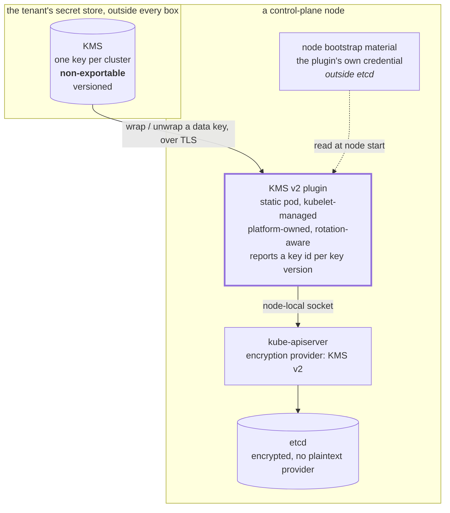

# ADR-100: The key that encrypts etcd lives outside the box

**Date:** 2026-10-02
**Status:** Accepted
**Amends:** ADR-003 §6 (Protection at rest)
**Relates to:** ADR-065 (the platform holds no tenant credential), ADR-076 (the escrow),
ADR-046 (two sites), ADR-041 (template immutability)

## Context

ADR-003 §6 established that Kubernetes Secrets must be encrypted at rest, adopted
`secretbox` as the immediate control, and named KMS v2 as the target without deciding
anything about it. `secretbox` keeps its key on the control-plane host, so it protects
etcd data, backups and disk snapshots and not a compromised node. Closing that
remaining exposure requires the key to leave the box.

Three facts constrain how:

- the provider interface is a node-local socket served by a plugin on every
  control-plane node, and the API server depends on it for every Secret read. A
  plugin that depends on ordinary scheduling cannot serve the API server that
  scheduling depends on.
- the tenant's secret store already offers a key-management service with a
  non-exportable, versioned key and a hardware-backed root, and the platform already
  requires every tenant to have an instance of it outside their box for the escrow
  (ADR-076). There is no second vendor to add.
- an instance **inside** a box cannot serve that box: it is circular on the
  management cluster, whose store reads its own database credential from a Secret in
  the data it would protect, and cross-boundary for a workload cluster, which would
  then depend on another site to read a Secret (ADR-046).

A vendor-supplied plugin exists and implements the current provider version, deploys
as a node-level static pod, and authenticates with a machine identity. It does not
support key rotation, and its documentation says so.

## Decision

**The key that encrypts etcd is held by an instance of the tenant's secret store
outside every box, one key per cluster, non-exportable. The platform owns one small
daemon: the node-local plugin, extended to be rotation-aware.**

### One key per cluster, never copied

Blast radius and lifecycle are per cluster, so the key is too. It is non-exportable
and is never written to a control-plane disk, a Kubernetes Secret, etcd, object
storage, a repository, or a backup. **An exported key is an offline decryption path
for every backup taken while it was in force**, which is the property encryption at
rest exists to remove.

Object storage may hold recovery METADATA — which cluster, which key, which version
is current, what a migration verified — and never key material. This is the one place
the escrow pattern (ADR-076) does NOT extend: every other root secret is escrowed
because it cannot be regenerated, and this one is deliberately not, because a copy
outside the key store is the exposure.

### The platform owns the plugin, and owns it because of rotation

The vendor plugin is adopted rather than rewritten, with one capability added: the
provider's rotation model is driven entirely by the key identifier the plugin
reports. A new key version must produce a new identifier, that identifier must stay
stable until the key actually changes, and an identifier must never be reused —
otherwise the API server either re-encrypts continuously or fails to notice a
rotation at all. The vendor plugin does not support rotation, so this is the gap, and
it is the whole of what the platform adds.

It remains a single daemon. It implements the provider interface, authenticates,
wraps and unwraps, reports status, observes which key version is active, and retains
the ability to unwrap data written under previous versions.

### The key identifier is the key's VERSION, and a version is never reactivated

This is the load-bearing detail, and getting it wrong makes rotation either
continuous or invisible.

The two systems disagree about what identity means. The key store treats a rotation as
the SAME key with an incremented version, retaining previous versions so older data
still unwraps. The Kubernetes provider interface treats the reported identifier as the
identity of the effective key: it must change when the key changes, stay stable while
it does not, and **never be reused**.

The vendor plugin returns the configured key id verbatim from both its status and its
encrypt path, and tracks no version at all — verified in its source. So a rotation in
the store is invisible to the API server: the identifier never changes, and the data
keys established under the old version are kept indefinitely. The rotation appears to
succeed and protects nothing.

**The platform's plugin therefore reports a composite identifier: the key, qualified by
the active version.** Version 2 of a key is a different identifier from version 1, and
one that has never been seen before.

**Reactivating a previous version as the active one is prohibited.** The interface
forbids reusing an identifier, so a reinstated version would have to be reported under
a name it has already used — or under a new name for old material, which makes the
identifier a lie. Forbidding reactivation keeps the mapping monotonic and removes the
case entirely. Recovering from a bad rotation is rolling FORWARD to a new version, not
back to an old one.

Unwrapping under previous versions continues, because the store retains them and data
written earlier still depends on them. Only the ACTIVE version is constrained.

### There is no rotation controller

Rotation is: the key store rotates the key to a new version, the plugin observes that
version, the composite identifier it reports changes, the API server establishes new
encryption state, and subsequent writes use it. No component in the cluster
participates.

Completing a rotation — rewriting existing data so nothing still depends on the
previous version — is a procedure with a verification step, not a reconcile. A
controller that rewrote every Secret on a schedule would be a component capable of
destroying the cluster's data if its notion of the current key were ever wrong.

### Rotation cadence and retention

At most 90 days, because the API server retains data keys in memory and a key's
exposure window is otherwise unbounded. A previous key version is retained until
every object encrypted under it is known to be migrated AND the disaster-recovery
retention window has passed. Destroying it earlier makes the backups taken under it
unreadable, which is the same loss as losing the key.

### The plugin's own credential is the remaining trade

The plugin authenticates with a machine identity scoped to one key: no access to
ordinary secret paths, no project-wide read, restricted to the control plane's egress
addresses, audited.

Its bootstrap credential is node-level material and lives **outside etcd** — it
cannot be a Kubernetes Secret, because the plugin must authenticate before the API
server can read one. This is the irreducible trade: a credential on the node that
reaches the key store. **It does not expose the key**, which stays non-exportable, so
compromising the node yields the ability to ask for unwrapping while the credential
is valid rather than the key itself. That is a smaller exposure than `secretbox`,
where the node holds the key.

### The plaintext provider is removed, not retained

A plaintext provider is kept only while existing data is being migrated, and removed
once every object has been rewritten and the stored form verified. Retained, it
permits plaintext writes and makes an incomplete migration invisible.

### Migration is part of adoption

Deploy the plugin, configure the provider, verify that new data is encrypted, rewrite
every existing object, inspect the stored form directly, confirm every object is
encrypted, remove the plaintext provider, verify again. The verification reads the
stored form: a read through the API server shows plaintext either way, because it
decrypts on the way out.

### The key store becomes part of the availability boundary

This is the consequence that must be accepted explicitly rather than discovered.
With the key outside the box, **the key store's availability is now part of the
cluster's ability to read its own Secrets.** Data keys are cached, so a brief outage
is survivable and an API server restart during one may not be.

This ADR therefore requires a FAILURE-INJECTION TEST, not a documented expectation:
the behaviour during an outage, after a restart during an outage, how long the cache
carries the cluster, and how a key-store incident affects recovery. An availability
boundary that has only been reasoned about is one whose limits are discovered during
an incident.

### What this does not do

It does not rotate the credentials inside the Secrets. Application credentials remain
static secrets reconciled into Kubernetes Secrets (ADR-003); this encrypts the
storage of that data and says nothing about its contents.

## Acceptance criteria

Conditions on the implementation, not on the architecture. Both concern the identifier,
because that is the one thing the platform's plugin adds and the one thing whose
failure is silent.

### The identifier is derived, deterministic and durable

The same key version MUST produce the same identifier on every control-plane node and
across every restart. It is derived from values that do not change — the cluster, the
key, the version — and from nothing else.

It MUST NOT incorporate a timestamp, process state, a random value, or a counter held
locally. Each of those produces a different identifier for the same key on a different
node or after a restart, and the interface reads a changed identifier as a changed key:
the API server would establish new encryption state on every node restart, repeatedly,
while nothing had rotated. Data written under the previous identifier remains
unwrappable, so this does not lose data — it makes the identifier meaningless, and with
it any ability to tell whether a rotation has happened.

### The reported identifier and the one used to wrap are always the same

There MUST be no window in which the status reports one version while the wrap path
uses another. The interface treats that disagreement as an unhealthy plugin, and it is
right to: an API server told the effective key is one thing while its data is wrapped
with another cannot reason about what a rotation has achieved.

Both paths therefore read ONE snapshot of the active version, and a move to the next
version is a controlled transition of that snapshot rather than two independent
observations of the key store. This matters most during a rotation on a multi-node
control plane, which is exactly when the two would otherwise be observed at different
moments.

## Ownership

Per ADR-039.

| Resource Class | System of Record | Lifecycle Owner | Reconciler | Consumer | Phase |
|---|---|---|---|---|---|
| Cluster key-encryption key | Tenant's secret store (outside the box) | Tenant | — | KMS plugin | Day-0 |
| KMS v2 plugin static pod | Git | Platform | CAPI (ClusterClass) | kube-apiserver | Day-0 |
| Plugin machine identity | Tenant's secret store | Tenant | — | KMS plugin | Day-0 |
| Plugin bootstrap credential | Node bootstrap material | Platform | CAPI (ClusterClass) | KMS plugin | Day-0 |
| Encryption provider configuration | Git | Platform | CAPI (ClusterClass) | kube-apiserver | Day-0 |
| Recovery metadata | Object storage | Platform | — | operators | Day-1+ |

**Two different things are owned here, and conflating them would read as manual work
for a tenant.**

The tenant holds KEY AUTHORITY: the key is theirs, in their store, and they can revoke
it without asking. It has no reconciler because ADR-065 holds that the platform keeps
no credential belonging to a tenant, and because a non-exportable key is not an object
a reconciler could converge in any case.

The platform owns the LIFECYCLE OF THE CLUSTER'S ENCRYPTION STATE: the plugin, the
provider configuration, the bootstrap credential, the rotation workflow and its
verification. "No reconciler" applies to the key object alone and never means a tenant
operator manages Kubernetes encryption by hand — that would put the most consequential
state on the box in the hands of whoever remembered it existed, which is the failure
this platform exists to remove (ADR-069).

## Consequences

### Positive

- The key leaves the box, which is the exposure `secretbox` cannot close. A
  compromised control-plane node no longer yields the key to every Secret and every
  backup.
- No new vendor and no second cloud account: the store is one every tenant already
  runs for the escrow, so the floor (ADR-070) does not move.
- Rotation needs no controller, so nothing in the cluster can rewrite every Secret on
  a mistaken belief about which key is current.
- One key per cluster means a rotation, a revocation or an incident is scoped to one
  cluster.

### Negative

- **The platform owns a daemon on the critical path of every Secret read.** Small, but
  its failure modes are the API server's.
- **The identifier mapping is a correctness burden the platform now carries.** The two
  systems disagree about what key identity means, and the plugin is the translation.
  A mistake there does not fail loudly: it makes a rotation invisible.
- **The key store is now in the cluster's availability boundary.** Accepted, bounded by
  the data-key cache, and required to be tested rather than assumed.
- A node-level bootstrap credential outside etcd, which is the remaining Secret Zero.
- A hardware-backed root key and external key management are licensed features of the
  store, so the strongest form of this is not available to every tenant.
- The key is deliberately NOT escrowed, so the tenant's own key-store continuity is
  the recovery story. A tenant who loses it loses their backups with it.

## Impact

- **Amends ADR-003 §6.** `secretbox` remains the current provider and is now the
  documented interim rather than the endpoint. §6's claim that adoption requires the
  platform to write the whole plugin is corrected: a vendor plugin exists and is
  adopted; the platform adds rotation awareness.
- **Extends ADR-076 by exception.** Every other root secret is escrowed because it
  cannot be regenerated. This one is not, because a copy outside the key store is the
  exposure the design exists to remove. The escrow's membership test is unchanged and
  this is the one value it deliberately excludes.
- **Constrains ADR-046.** The key store must not be reached across the hub/workload
  boundary, which is why it is outside every box rather than on the management
  cluster.
- **Requires a new control-plane template** on both ClusterClasses, since the provider
  configuration and the static pod are node-level and the templates are immutable
  (ADR-041).
- No change to ADR-065: the key is the tenant's and the platform never holds it.

## References

- ADR-003: Secret Lifecycle, §6 Protection at rest
- ADR-039: Platform Ownership Model
- ADR-046: Two sites
- ADR-065: The platform holds no credential belonging to a tenant
- ADR-070: The floor
- ADR-076: Reaching a box you own
