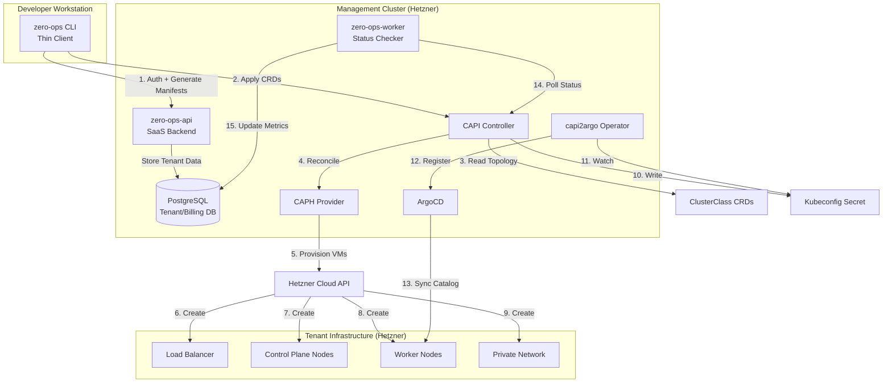

# Product Requirements Document: Zero-Ops Platform - Complete SaaS Architecture

**Version:** 3.0 (Unified Architecture)
**Status:** DRAFT
**Project Name:** zero-ops
**Repository Model:** Go-Centric Monorepo
**Author:** Platform Architecture Team

---

## 1. Executive Summary

The **Zero-Ops Platform** is a complete multi-tenant Kubernetes management SaaS that replicates the Syself operational model. It targets **Platform Engineers** (SaaS operators) and **Tenant Developers** (customers), delivering a unified system comprising: (1) a stateless CLI for infrastructure intent declaration, (2) a SaaS control plane API for tenant management and billing, (3) a Management Cluster ("Mothership") running Cluster API controllers, and (4) a service catalog enabling one-click deployment of production-grade add-ons (CNI, databases, observability). The platform operates on a "Bring Your Own Cloud" (BYOC) model where tenants provide infrastructure credentials while the control plane orchestrates provisioning via ClusterAPI ClusterClass topologies. Core principles: thin client architecture (no local state), declarative infrastructure (Kubernetes CRDs only), and monorepo consistency (CLI, API, and templates version-locked).

---

## 2. Problem Statement

### 2.1 Current State
Kubernetes cluster provisioning today relies on "fat client" workflows: developers running imperative tools (clusterctl, terraform, ansible) on local machines with fragmented state across kubeconfig files and local directories. There is no centralized control plane to enforce policy, manage Day-2 operations (upgrades, scaling), or provide standardized "Services on Top" (managed databases, observability stacks). Multi-tenancy is achieved through manual namespace creation and RBAC configuration. Billing and metering require custom scripts parsing cloud provider APIs.

### 2.2 Gap / Motivation
To operate as a production SaaS platform, infrastructure logic must migrate from developer laptops to a managed control plane. Key gaps:
- **No Management Cluster**: No single source of truth holding state for multiple tenant clusters
- **No ClusterClass Standardization**: Each cluster is a snowflake; no reusable topology blueprints
- **No Service Catalog**: Add-ons (Cilium, Postgres, Prometheus) require manual Helm/kubectl operations
- **No Thin Client**: Existing tools maintain local state and execute infrastructure API calls directly
- **No SaaS Backend**: Missing API layer for tenant onboarding, billing integration, and UI-driven workflows
- **Version Drift**: CLI, templates, and API can become incompatible across releases

### 2.3 Constraints & Non-Goals
**Constraints:**
- **Thin Client Principle**: CLI must be stateless, communicating only with Management Cluster API
- **BYOC Model**: Platform does not pay for tenant compute; tenants provide cloud credentials
- **Monorepo Requirement**: CLI, API, templates, and catalog must be version-locked in single repository
- **ClusterClass Only**: All clusters must use CAPI ClusterClass; no ad-hoc Machine deployments

**Non-Goals:**
- Multi-cloud orchestration in MVP (Hetzner only; AWS future)
- Custom Kubernetes distributions (vanilla upstream only)
- Managed control planes for tenant clusters (tenants manage their own clusters post-provisioning)
- Real-time cost optimization (billing is post-facto metering)

---

## 3. User Personas & User Journeys

### 3.1 Personas

**Persona 1: Platform Admin (SaaS Operator)**
- **Goals**: Bootstrap and maintain the Management Cluster, define ClusterClass topologies, manage service catalog, monitor platform health
- **Responsibilities**: Infrastructure provisioning for control plane, CAPI/CAPH upgrades, tenant quota management, incident response
- **Tools**: zero-ops CLI (admin mode), kubectl, Grafana dashboards

**Persona 2: Tenant Developer (Customer)**
- **Goals**: Provision production-grade Kubernetes clusters quickly, add managed services (databases, monitoring), scale workloads
- **Responsibilities**: Provide cloud credentials, select cluster topology, deploy applications, manage Day-2 operations
- **Tools**: zero-ops CLI (tenant mode), kubectl, Web UI (future)

**Persona 3: SRE / Operations (Tenant Side)**
- **Goals**: Monitor cluster health, respond to incidents, perform upgrades
- **Responsibilities**: Cluster observability, backup/restore, security patching
- **Tools**: Prometheus/Grafana, kubectl, zero-ops CLI

### 3.2 End-to-End User Journeys

#### Journey A: Platform Bootstrap (Platform Admin - First Time Setup) - Completed
**Trigger**: Initial SaaS platform deployment
**Actions**:
1. Admin configures local environment with Hetzner credentials
2. Runs `zero-ops mgmt bootstrap --name=mothership --region=fsn1`
3. CLI creates ephemeral Kind cluster locally
4. CLI installs CAPI/CAPH/Cert-Manager on Kind
5. CLI provisions permanent Management Cluster on Hetzner
6. CLI pivots CAPI state from Kind to Management Cluster
7. CLI applies ClusterClass library to Management Cluster
8. CLI deploys SaaS API backend and ArgoCD to Management Cluster

**System Response**:
- Management Cluster becomes self-hosted on Hetzner
- ClusterClasses (hetzner-prod-v1, hetzner-dev-v1) available
- API endpoint exposed with TLS certificate
- ArgoCD configured with capi2argo operator

**Error States**:
- Hetzner API rate limit: CLI retries with exponential backoff
- DNS propagation delay: CLI polls until Management Cluster API reachable
- CAPI pivot failure: CLI preserves Kind cluster for manual recovery

**Outcome**: Management Cluster operational, ready to accept tenant requests

#### Journey B: Tenant Onboarding (Platform Admin)
**Trigger**: New customer signup via Web UI or API
**Actions**:
1. Admin runs `zero-ops tenant onboard --name=acme-corp --quota-clusters=10`
2. CLI creates Kubernetes namespace `tenant-acme-corp`
3. CLI applies RBAC policies (tenant can only access own namespace)
4. CLI creates ResourceQuota limiting cluster count
5. CLI generates tenant API token and kubeconfig

**System Response**:
- Namespace created with labels `tenant=acme-corp`
- ServiceAccount and RoleBinding created
- Quota enforced by Kubernetes admission controller
- Tenant credentials stored in platform database

**Error States**:
- Duplicate tenant name: CLI returns error, suggests alternative
- Quota exceeded: Platform admin must increase limits

**Outcome**: Isolated tenant workspace ready for cluster provisioning


#### Journey C: Tenant Cluster Provisioning (Tenant Developer - Production Cluster)
**Trigger**: Tenant needs a production Kubernetes cluster
**Actions**:
1. Tenant authenticates: `zero-ops login --tenant=acme-corp`
2. Tenant creates secret: `zero-ops secret create --provider=hetzner --token=<HCLOUD_TOKEN>`
3. Tenant provisions cluster: `zero-ops cluster create --name=prod-api --class=hetzner-prod-v1 --workers=5 --region=fsn1`
4. CLI validates ClusterClass exists in registry
5. CLI generates CAPI Cluster manifest with topology reference
6. CLI applies manifest to Management Cluster (tenant namespace)

**System Response**:
- CAPI controller detects new Cluster resource
- CAPI hydrates topology from ClusterClass (hetzner-prod-v1)
- CAPH provisions: 3 control plane nodes (CPX31), 5 worker nodes (CX21), private network, load balancer
- CAPI writes kubeconfig to Secret `prod-api-kubeconfig`
- capi2argo operator detects kubeconfig, registers cluster in ArgoCD
- CLI polls cluster status, reports "Ready" when control plane healthy

**Error States**:
- Invalid ClusterClass: CLI fails fast with available classes list
- Insufficient Hetzner quota: CAPH reports error, CLI surfaces to user
- Network provisioning timeout: CAPI retries, CLI shows progress
- Kubeconfig not generated: CLI waits with timeout, suggests manual inspection

**Outcome**: Production cluster running on Hetzner, kubeconfig available, registered in ArgoCD

#### Journey D: Service Injection (Tenant Developer - Day 0/2 Operations)
**Trigger**: Tenant needs observability and database on existing cluster
**Actions**:
1. Tenant runs: `zero-ops cluster update prod-api --monitoring=prometheus --database=postgres`
2. CLI queries service catalog registry
3. CLI loads embedded manifests from `catalog/observability/prometheus/` and `catalog/databases/postgres-operator/`
4. CLI generates ArgoCD Application manifests targeting tenant cluster
5. CLI applies Applications to Management Cluster

**System Response**:
- ArgoCD detects new Applications
- ArgoCD syncs Prometheus Helm chart to prod-api cluster
- ArgoCD syncs CloudNativePG operator to prod-api cluster
- Services become available in tenant cluster

**Error States**:
- Service already installed: CLI detects, offers upgrade option
- Incompatible service versions: CLI validates dependencies, blocks if conflicts
- ArgoCD sync failure: CLI reports error with ArgoCD UI link

**Outcome**: Prometheus and Postgres operator running in tenant cluster

#### Journey E: Day-2 Operations - Cluster Scaling (Tenant Developer)
**Trigger**: Increased load requires more worker nodes
**Actions**:
1. Tenant runs: `zero-ops cluster scale prod-api --workers=10`
2. CLI patches Cluster resource topology.workers.replicas

**System Response**:
- CAPI detects spec change
- CAPH provisions 5 additional CX21 nodes
- Nodes join cluster automatically via kubeadm bootstrap

**Outcome**: Cluster scaled from 5 to 10 workers

#### Journey F: Incident Response - Node Failure (SRE)
**Trigger**: Hetzner VM crashes
**Actions**: None (automatic)

**System Response**:
- CAPI health check detects unhealthy Machine
- CAPH deletes failed VM via Hetzner API
- CAPI creates replacement Machine
- CAPH provisions new VM
- Node rejoins cluster

**Outcome**: Self-healing without human intervention

#### Journey G: Cluster Decommission (Tenant Developer)
**Trigger**: Project sunset, cluster no longer needed
**Actions**:
1. Tenant runs: `zero-ops cluster delete prod-api --confirm`
2. CLI deletes Cluster resource from Management Cluster

**System Response**:
- CAPI triggers deletion cascade
- CAPH deletes all VMs, networks, load balancers from Hetzner
- CAPI removes kubeconfig Secret
- capi2argo removes cluster from ArgoCD
- Finalizers ensure clean resource removal

**Outcome**: All infrastructure deleted, no orphaned resources

---

## 4. Proposed Architecture

### 4.1 High-Level Flow




### 4.2 Components & Responsibilities

| Component | Implementation Choice | Responsibility |
|-----------|----------------------|----------------|
| **zero-ops CLI** | Go (Cobra framework) | Thin client: generates Kubernetes manifests from embedded templates, applies to Management Cluster API. No local state. Uses go:embed for catalog/manifests. |
| **zero-ops-api** | Go (Gin/Echo framework) | SaaS backend: tenant onboarding, authentication, billing integration, Web UI API. Exposes REST endpoints for UI and CLI. |
| **zero-ops-worker** | Go (background service) | Async worker: polls cluster status, updates metrics in database, triggers billing events, sends notifications. |
| **Management Cluster** | Kubernetes 1.31+ (Hetzner) | Control plane hosting all controllers and tenant namespaces. Self-hosted after bootstrap. |
| **Cluster API (CAPI)** | Upstream v1.10+ | Core orchestration: watches Cluster CRDs, hydrates ClusterClass topologies, manages lifecycle. |
| **CAPH** | cluster-api-provider-hetzner | Infrastructure provider: translates CAPI resources to Hetzner API calls (VMs, networks, LBs). |
| **ClusterClass** | CAPI CRD | Topology blueprints: defines reusable cluster shapes (prod/dev/staging). Abstracts infrastructure details. |
| **capi2argo Operator** | dntosas/capi2argo-cluster-operator | Bridge: converts CAPI kubeconfig Secrets to ArgoCD Cluster definitions automatically. |
| **ArgoCD** | Upstream v2.x | GitOps engine: syncs service catalog applications to tenant clusters. Manages Day-2 add-ons. |
| **Cert-Manager** | cert-manager.io | TLS automation: issues certificates for Management Cluster API and tenant ingresses. |
| **PostgreSQL** | CloudNativePG operator | Platform database: stores tenant metadata, billing records, audit logs. |
| **Service Catalog** | Embedded YAML/Helm | Curated add-ons: CNI (Cilium), databases (Postgres), observability (Prometheus), GitOps (ArgoCD/Flux). |

### 4.3 Integration & Control Plane

**Control Plane Automation:**
- **Cluster Provisioning**: CAPI watches Cluster resources → reads ClusterClass → delegates to CAPH → CAPH calls Hetzner API → infrastructure created
- **Certificate Management**: Cert-Manager watches Ingress/Gateway resources → requests certificates from Let's Encrypt → stores in Secrets → automatically renews
- **GitOps Integration**: capi2argo watches CAPI kubeconfig Secrets → creates ArgoCD Cluster resources → ArgoCD can deploy to tenant clusters
- **Billing Events**: zero-ops-worker polls cluster status → calculates resource usage → writes billing records to PostgreSQL → triggers Stripe API calls

**External Dependencies:**
- Hetzner Cloud API (infrastructure provisioning)
- Hetzner DNS API (optional, for DNS automation)
- Let's Encrypt (TLS certificates)
- Stripe API (billing, future)
- GitHub/GitLab (GitOps source repositories)

**Network Architecture:**
- Management Cluster API exposed publicly via TLS (OIDC/mTLS authentication)
- Tenant clusters isolated in separate Hetzner projects (BYOC model)
- Private networks for tenant cluster internal communication
- Load balancers for tenant cluster API servers (public or private based on ClusterClass)

---

## 5. Technical Specifications

### 5.1 Platform Changes & Configuration

**New Applications to Deploy:**
1. **CAPI Core** (Management Cluster)
   - Namespace: `capi-system`
   - Components: capi-controller-manager, capi-kubeadm-bootstrap-controller, capi-kubeadm-control-plane-controller
   - Configuration: Feature gates for ClusterClass, ClusterResourceSet

2. **CAPH Provider** (Management Cluster)
   - Namespace: `caph-system`
   - Components: caph-controller-manager
   - Configuration: Hetzner API credentials per tenant namespace

3. **capi2argo Operator** (Management Cluster)
   - Namespace: `capi2argo-system`
   - Configuration: ArgoCD namespace reference, label selectors for cluster secrets

4. **ArgoCD** (Management Cluster)
   - Namespace: `argocd`
   - Configuration: Multi-cluster mode, ApplicationSet for catalog, RBAC for tenants

5. **zero-ops-api** (Management Cluster)
   - Namespace: `zero-ops-system`
   - Components: API server, PostgreSQL database
   - Configuration: JWT secrets, Stripe API keys, SMTP credentials

6. **zero-ops-worker** (Management Cluster)
   - Namespace: `zero-ops-system`
   - Configuration: Polling intervals, database connection

**Required Secrets:**
- `hetzner-token` (per tenant namespace): Hetzner Cloud API token
- `argocd-secret`: ArgoCD admin password
- `postgres-credentials`: Database connection string
- `stripe-api-key`: Billing integration (future)
- `tls-cert`: Management Cluster API certificate

### 5.2 Core Resources & APIs

**ClusterClass Resource (Example: hetzner-prod-v1)**
```yaml
apiVersion: cluster.x-k8s.io/v1beta1
kind: ClusterClass
metadata:
  name: hetzner-prod-v1
  namespace: default
spec:
  controlPlane:
    ref:
      apiVersion: controlplane.cluster.x-k8s.io/v1beta1
      kind: KubeadmControlPlaneTemplate
      name: hetzner-prod-control-plane
    machineInfrastructure:
      ref:
        kind: HCloudMachineTemplate
        apiVersion: infrastructure.cluster.x-k8s.io/v1beta1
        name: hetzner-prod-control-plane-machine
  infrastructure:
    ref:
      apiVersion: infrastructure.cluster.x-k8s.io/v1beta1
      kind: HetznerClusterTemplate
      name: hetzner-prod-cluster
  workers:
    machineDeployments:
      - class: default-worker
        template:
          bootstrap:
            ref:
              apiVersion: bootstrap.cluster.x-k8s.io/v1beta1
              kind: KubeadmConfigTemplate
              name: hetzner-prod-worker-bootstrap
          infrastructure:
            ref:
              apiVersion: infrastructure.cluster.x-k8s.io/v1beta1
              kind: HCloudMachineTemplate
              name: hetzner-prod-worker-machine
  variables:
    - name: region
      required: true
      schema:
        openAPIV3Schema:
          type: string
          default: "fsn1"
          enum: ["fsn1", "nbg1", "hel1"]
    - name: controlPlaneServerType
      required: false
      schema:
        openAPIV3Schema:
          type: string
          default: "cpx31"
    - name: workerServerType
      required: false
      schema:
        openAPIV3Schema:
          type: string
          default: "cx21"
```


**Tenant Cluster Resource (Generated by CLI)**
```yaml
apiVersion: cluster.x-k8s.io/v1beta1
kind: Cluster
metadata:
  name: prod-api
  namespace: tenant-acme-corp
  labels:
    tenant: acme-corp
    environment: production
spec:
  clusterNetwork:
    pods:
      cidrBlocks: ["10.244.0.0/16"]
    services:
      cidrBlocks: ["10.96.0.0/12"]
  topology:
    class: hetzner-prod-v1
    version: v1.31.0
    controlPlane:
      replicas: 3
    workers:
      machineDeployments:
        - class: default-worker
          name: worker-pool-1
          replicas: 5
    variables:
      - name: region
        value: "fsn1"
      - name: sshKeys
        value: ["acme-corp-key"]
```

**Naming Conventions:**
- Cluster names: `{environment}-{purpose}` (e.g., prod-api, staging-web)
- Tenant namespaces: `tenant-{org-name}` (e.g., tenant-acme-corp)
- Secrets: `{cluster-name}-kubeconfig`, `{provider}-token`
- Labels: `tenant={org}`, `environment={prod|staging|dev}`, `managed-by=zero-ops`

**Ownership & RBAC:**
- Tenant users have full access to their namespace only
- Platform admins have cluster-admin on Management Cluster
- Service accounts for controllers have minimal RBAC (least privilege)

### 5.3 Defaulting & Automation Logic

**Hostname Generation:**
- Management Cluster API: `api.zero-ops.{domain}`
- Tenant cluster API: `{cluster-name}.{tenant}.clusters.{domain}`
- Example: `prod-api.acme-corp.clusters.nutgraf.in`

**Resource Linking:**
- Cluster → ClusterClass: `spec.topology.class` references ClusterClass name
- Cluster → Secret: CAPH reads `spec.identityRef` for Hetzner token
- ArgoCD Application → Cluster: `spec.destination.name` matches capi2argo-generated cluster name
- Service Catalog → Cluster: Applications use label selectors `tenant={org}`

**Auto-Generated Values:**
- SSH keys: CLI generates if not provided, stores in Secret
- Network CIDRs: Default to non-overlapping ranges per tenant
- Node names: CAPI generates `{cluster}-{role}-{hash}` (e.g., prod-api-control-plane-abc123)
- Kubeconfig context: `{tenant}@{cluster}` (e.g., acme-corp@prod-api)

**Reconciliation Loops:**
- CAPI reconciles Cluster every 10 minutes (configurable)
- CAPH reconciles infrastructure every 5 minutes
- capi2argo watches kubeconfig Secrets continuously
- ArgoCD syncs applications every 3 minutes (configurable)
- zero-ops-worker polls cluster status every 1 minute

### 5.4 Security, Compliance & Reliability

**TLS & Certificate Strategy:**
- Management Cluster API: Let's Encrypt certificate via Cert-Manager
- Tenant cluster APIs: Self-signed CA during bootstrap, optionally replaced with Let's Encrypt
- Internal communication: mTLS between CAPI components
- Certificate rotation: Automated via Cert-Manager (90-day renewal)

**Network Boundaries:**
- Management Cluster: Public API with authentication (OIDC/mTLS)
- Tenant clusters: API can be public or private (ClusterClass variable)
- Private networks: Tenant cluster nodes communicate via Hetzner private network
- Egress control: Tenant clusters can access internet (no egress filtering in MVP)

**Multi-Tenancy Isolation:**
- Namespace-level isolation: Each tenant has dedicated namespace
- RBAC enforcement: Tenants cannot access other tenants' resources
- Resource quotas: Enforced per tenant namespace (max clusters, max nodes)
- Network isolation: Tenant clusters in separate Hetzner projects (BYOC)
- Secret isolation: Hetzner tokens stored in tenant namespace, not accessible cross-tenant

**Reliability & SLOs:**
- Management Cluster availability: 99.9% uptime target
- Cluster provisioning time: < 10 minutes for standard topology
- Self-healing: Failed nodes replaced automatically within 5 minutes
- Backup strategy: Management Cluster etcd backed up daily to object storage
- Disaster recovery: Management Cluster can be restored from backup within 1 hour

**Audit & Compliance:**
- All API calls logged to PostgreSQL audit table
- Kubernetes audit logs enabled on Management Cluster
- Tenant actions traceable via `kubectl` audit logs
- GDPR compliance: Tenant data deletable on request (cascade delete)

---

## 6. User Journey Deep Dives (Scenario-Based)

### Scenario 1: Platform Admin Bootstraps the SaaS (The Inception)

**Scenario Name:** Initial Management Cluster Bootstrap
**Actors:** Platform Admin
**Preconditions:** 
- Admin has Hetzner account with API token
- Admin has `zero-ops` CLI installed locally
- Admin has Docker installed (for Kind)
- DNS domain configured (e.g., nutgraf.in)

**Step-by-Step Flow:**

1. **Admin Action:** Export Hetzner credentials
   ```bash
   export HCLOUD_TOKEN=<token>
   export ZERO_OPS_DOMAIN=nutgraf.in
   ```

2. **Admin Action:** Run bootstrap command
   ```bash
   zero-ops mgmt bootstrap --name=mothership --region=fsn1
   ```

3. **CLI Action:** Validate prerequisites
   - Check Docker daemon running
   - Verify Hetzner token valid (test API call)
   - Check DNS domain resolvable

4. **CLI Action:** Create local Kind cluster
   ```bash
   kind create cluster --name=bootstrap-zero-ops
   ```
   - Wait for cluster ready (30 seconds)

5. **CLI Action:** Initialize CAPI on Kind
   ```bash
   clusterctl init --infrastructure hetzner
   ```
   - Install CAPI core controllers
   - Install CAPH provider
   - Install Cert-Manager
   - Wait for all pods Ready (2 minutes)

6. **CLI Action:** Generate Management Cluster manifest
   - Load embedded `manifests/classes/hetzner-mgmt-v1.yaml`
   - Substitute variables: name=mothership, region=fsn1
   - Create Cluster resource YAML

7. **CLI Action:** Provision Management Cluster
   ```bash
   kubectl apply -f mothership-cluster.yaml
   ```
   - CAPH creates 3 control plane VMs (CPX31)
   - CAPH creates load balancer
   - CAPH creates private network
   - Wait for Cluster phase=Provisioned (8 minutes)


8. **CLI Action:** Retrieve Management Cluster kubeconfig
   ```bash
   kubectl get secret mothership-kubeconfig -o jsonpath='{.data.value}' | base64 -d > mothership.kubeconfig
   ```

9. **CLI Action:** Install CAPI on Management Cluster
   ```bash
   clusterctl init --kubeconfig=mothership.kubeconfig --infrastructure hetzner
   ```
   - Wait for controllers Ready on remote cluster (2 minutes)

10. **CLI Action:** Pivot CAPI state
    ```bash
    clusterctl move --to-kubeconfig=mothership.kubeconfig
    ```
    - Migrate all CAPI resources from Kind to Management Cluster
    - Verify migration successful (check resource counts match)

11. **CLI Action:** Apply ClusterClass library
    - Load embedded `manifests/classes/*.yaml`
    - Apply to Management Cluster:
      - `hetzner-prod-v1.yaml` (HA production topology)
      - `hetzner-dev-v1.yaml` (single-node development)
      - `hetzner-staging-v1.yaml` (cost-optimized staging)

12. **CLI Action:** Deploy SaaS backend
    - Apply `manifests/core/zero-ops-api.yaml`
    - Apply `manifests/core/postgres.yaml`
    - Apply `manifests/core/argocd.yaml`
    - Apply `manifests/core/capi2argo.yaml`
    - Wait for all deployments Ready (3 minutes)

13. **CLI Action:** Configure DNS
    - Create A record: `api.nutgraf.in` → Management Cluster LB IP
    - Wait for DNS propagation (30 seconds)

14. **CLI Action:** Issue TLS certificate
    - Apply Certificate resource for `api.nutgraf.in`
    - Cert-Manager requests from Let's Encrypt
    - Wait for certificate Ready (1 minute)

15. **CLI Action:** Cleanup
    ```bash
    kind delete cluster --name=bootstrap-zero-ops
    ```

16. **CLI Output:** Success message
    ```
    ✓ Management Cluster 'mothership' ready
    ✓ API endpoint: https://api.nutgraf.in
    ✓ ClusterClasses available: hetzner-prod-v1, hetzner-dev-v1, hetzner-staging-v1
    ✓ ArgoCD UI: https://argocd.nutgraf.in (admin password in Secret)
    
    Next steps:
    1. Configure DNS for *.clusters.nutgraf.in
    2. Onboard first tenant: zero-ops tenant onboard --name=<org>
    ```

**Variations / Edge Cases:**

- **Hetzner API rate limit:** CLI implements exponential backoff, retries up to 5 times
- **DNS propagation delay:** CLI polls DNS until resolvable, timeout 5 minutes
- **CAPI pivot failure:** CLI preserves Kind cluster, outputs manual recovery steps
- **Certificate issuance failure:** CLI continues without TLS, admin must debug Cert-Manager
- **Insufficient Hetzner quota:** CAPH reports error, CLI suggests quota increase

**Success Verification:**
```bash
# Verify Management Cluster accessible
kubectl --kubeconfig=mothership.kubeconfig get nodes

# Verify ClusterClasses installed
kubectl --kubeconfig=mothership.kubeconfig get clusterclasses

# Verify CAPI controllers running
kubectl --kubeconfig=mothership.kubeconfig get pods -n capi-system

# Verify API endpoint
curl https://api.nutgraf.in/health
```

---

### Scenario 2: Tenant Provisions a Production Cluster

**Scenario Name:** Tenant Creates Production Kubernetes Cluster
**Actors:** Tenant Developer (acme-corp)
**Preconditions:**
- Tenant onboarded (namespace `tenant-acme-corp` exists)
- Tenant has `zero-ops` CLI installed
- Tenant has Hetzner account with API token
- Tenant has kubeconfig for Management Cluster (tenant-scoped)

**Step-by-Step Flow:**

1. **Tenant Action:** Authenticate to platform
   ```bash
   zero-ops login --tenant=acme-corp --token=<jwt-token>
   ```
   - CLI stores credentials in `~/.zero-ops/config` (ephemeral session)
   - CLI validates token against zero-ops-api

2. **Tenant Action:** Store Hetzner credentials
   ```bash
   zero-ops secret create --provider=hetzner --token=<HCLOUD_TOKEN>
   ```
   - CLI creates Secret in `tenant-acme-corp` namespace
   - Secret name: `hetzner-token`
   - Secret type: `Opaque`
   - Data encrypted at rest in etcd

3. **Tenant Action:** List available ClusterClasses
   ```bash
   zero-ops cluster classes
   ```
   - CLI queries Management Cluster API
   - Output:
     ```
     NAME                 PROVIDER  CONTROL_PLANE  WORKERS  DESCRIPTION
     hetzner-prod-v1      hetzner   3 x CPX31      CX21     HA production cluster
     hetzner-dev-v1       hetzner   1 x CPX21      CX11     Single-node development
     hetzner-staging-v1   hetzner   1 x CPX31      CX21     Cost-optimized staging
     ```

4. **Tenant Action:** Create production cluster
   ```bash
   zero-ops cluster create \
     --name=prod-api \
     --class=hetzner-prod-v1 \
     --workers=5 \
     --region=fsn1 \
     --k8s-version=v1.31.0
   ```

5. **CLI Action:** Validate inputs
   - Check ClusterClass `hetzner-prod-v1` exists
   - Verify Secret `hetzner-token` exists in tenant namespace
   - Validate cluster name unique in namespace
   - Check tenant quota (max 10 clusters)

6. **CLI Action:** Generate Cluster manifest
   - Load ClusterClass definition from cache
   - Populate topology:
     - `spec.topology.class: hetzner-prod-v1`
     - `spec.topology.version: v1.31.0`
     - `spec.topology.controlPlane.replicas: 3` (from ClusterClass)
     - `spec.topology.workers.machineDeployments[0].replicas: 5`
   - Set variables:
     - `region: fsn1`
     - `sshKeys: [acme-corp-default]`
   - Add labels:
     - `tenant: acme-corp`
     - `environment: production`
     - `managed-by: zero-ops`

7. **CLI Action:** Apply manifest to Management Cluster
   ```bash
   kubectl apply -f prod-api-cluster.yaml --namespace=tenant-acme-corp
   ```
   - CLI uses tenant-scoped kubeconfig (RBAC enforced)

8. **CLI Action:** Poll cluster status
   ```bash
   kubectl get cluster prod-api -n tenant-acme-corp -w
   ```
   - CLI watches for `status.phase` transitions:
     - `Pending` → `Provisioning` → `Provisioned` → `Ready`
   - Display progress bar with estimated time (8 minutes)


9. **Platform Action (CAPI):** Reconcile Cluster resource
   - CAPI controller detects new Cluster in `tenant-acme-corp`
   - Read ClusterClass `hetzner-prod-v1`
   - Hydrate topology into concrete resources:
     - Create `KubeadmControlPlane` (3 replicas)
     - Create `MachineDeployment` (5 replicas)
     - Create `HetznerCluster` (infrastructure)

10. **Platform Action (CAPH):** Provision infrastructure
    - CAPH reads `HetznerCluster` resource
    - Retrieve Hetzner token from Secret `hetzner-token`
    - Call Hetzner API:
      - Create private network `prod-api-network`
      - Create load balancer `prod-api-lb` (control plane API)
      - Create 3 VMs for control plane (CPX31, fsn1)
      - Create 5 VMs for workers (CX21, fsn1)
      - Attach VMs to private network
      - Configure load balancer backend (control plane nodes:6443)
    - Wait for VMs ready (5 minutes)

11. **Platform Action (CAPI):** Bootstrap Kubernetes
    - CAPI runs kubeadm on control plane nodes
    - Initialize first control plane node
    - Join additional control plane nodes
    - Generate cluster certificates
    - Bootstrap worker nodes with kubeadm join
    - Install CNI (Cilium, from ClusterClass)
    - Wait for all nodes Ready (3 minutes)

12. **Platform Action (CAPI):** Generate kubeconfig
    - CAPI creates Secret `prod-api-kubeconfig` in `tenant-acme-corp`
    - Secret contains admin kubeconfig for tenant cluster
    - Kubeconfig server: `https://<lb-ip>:6443`

13. **Platform Action (capi2argo):** Register cluster in ArgoCD
    - capi2argo watches Secret `prod-api-kubeconfig`
    - Extract kubeconfig data
    - Create ArgoCD Cluster resource:
      - Name: `acme-corp-prod-api`
      - Server: `https://<lb-ip>:6443`
      - Config: TLS cert + client cert from kubeconfig
    - ArgoCD can now deploy to tenant cluster

14. **CLI Action:** Detect cluster Ready
    - CLI polls until `status.phase: Ready`
    - Retrieve kubeconfig:
      ```bash
      zero-ops cluster kubeconfig prod-api > prod-api.kubeconfig
      ```

15. **CLI Output:** Success message
    ```
    ✓ Cluster 'prod-api' ready (8m 32s)
    ✓ Control plane: 3 nodes (CPX31)
    ✓ Workers: 5 nodes (CX21)
    ✓ Kubernetes version: v1.31.0
    ✓ API endpoint: https://prod-api.acme-corp.clusters.nutgraf.in
    ✓ Kubeconfig saved to: prod-api.kubeconfig
    
    Next steps:
    1. Verify cluster: kubectl --kubeconfig=prod-api.kubeconfig get nodes
    2. Add services: zero-ops cluster update prod-api --monitoring=prometheus
    3. Deploy apps: kubectl --kubeconfig=prod-api.kubeconfig apply -f app.yaml
    ```

**Variations / Edge Cases:**

- **Invalid ClusterClass:** CLI fails immediately with error:
  ```
  Error: ClusterClass 'hetzner-prod-v2' not found
  Available classes: hetzner-prod-v1, hetzner-dev-v1, hetzner-staging-v1
  ```

- **Insufficient Hetzner quota:** CAPH reports error after 2 minutes:
  ```
  Error: Hetzner API error: quota exceeded for server type CPX31
  Suggestion: Increase quota in Hetzner Console or use smaller server type
  ```
  - CLI surfaces error to user
  - Cluster remains in `Provisioning` phase
  - Tenant can delete and retry with different topology

- **Network provisioning timeout:** CAPH retries network creation 3 times:
  - If successful: Provisioning continues
  - If failed: Cluster enters `Failed` phase
  - CLI suggests manual inspection: `kubectl describe hetznercluster prod-api`

- **Kubeconfig not generated:** CLI waits 15 minutes, then:
  ```
  Warning: Cluster provisioned but kubeconfig not available
  Suggestion: Check CAPI logs: kubectl logs -n capi-system -l cluster.x-k8s.io/cluster-name=prod-api
  ```

- **Quota exceeded (tenant limit):** CLI fails before creating Cluster:
  ```
  Error: Tenant quota exceeded (10/10 clusters)
  Contact support to increase quota
  ```

**Success Verification:**
```bash
# Verify cluster exists in Management Cluster
kubectl get cluster prod-api -n tenant-acme-corp

# Verify infrastructure provisioned
kubectl get hetznercluster prod-api -n tenant-acme-corp
kubectl get machines -n tenant-acme-corp -l cluster.x-k8s.io/cluster-name=prod-api

# Verify kubeconfig works
kubectl --kubeconfig=prod-api.kubeconfig get nodes
kubectl --kubeconfig=prod-api.kubeconfig get pods -A

# Verify ArgoCD registration
kubectl get secret -n argocd -l argocd.argoproj.io/secret-type=cluster | grep acme-corp-prod-api

# Verify Hetzner resources (via Hetzner Console or API)
# - 3 control plane VMs
# - 5 worker VMs
# - 1 load balancer
# - 1 private network
```

---

## 7. Success Criteria & Acceptance Tests

### 7.1 Bootstrap Criteria

**Functional Requirements:**
- [ ] **Self-Hosting:** Management Cluster runs on Hetzner, not Kind, after bootstrap completes
- [ ] **ClusterClass Availability:** `kubectl get clusterclasses` lists at least 3 classes (prod, dev, staging)
- [ ] **API Accessibility:** `curl https://api.nutgraf.in/health` returns 200 OK
- [ ] **ArgoCD Operational:** ArgoCD UI accessible, no degraded applications
- [ ] **Database Initialized:** PostgreSQL running, schema migrations applied

**Verification Commands:**
```bash
# Verify Management Cluster nodes
kubectl --kubeconfig=mothership.kubeconfig get nodes
# Expected: 3 nodes, all Ready

# Verify ClusterClasses
kubectl --kubeconfig=mothership.kubeconfig get clusterclasses
# Expected: hetzner-prod-v1, hetzner-dev-v1, hetzner-staging-v1

# Verify CAPI controllers
kubectl --kubeconfig=mothership.kubeconfig get pods -n capi-system
# Expected: All pods Running

# Verify API endpoint
curl -k https://api.nutgraf.in/health
# Expected: {"status":"healthy"}

# Verify DNS resolution
nslookup api.nutgraf.in
# Expected: Resolves to Management Cluster LB IP
```

### 7.2 Provisioning Criteria

**Functional Requirements:**
- [ ] **Topology Sync:** Creating Cluster with ClusterClass reference provisions correct infrastructure
- [ ] **Node Count Match:** Cluster has exact number of nodes specified in topology
- [ ] **Kubeconfig Generation:** Secret `{cluster}-kubeconfig` created automatically
- [ ] **ArgoCD Registration:** Cluster appears in ArgoCD clusters list
- [ ] **Self-Healing:** Manually deleting VM results in automatic replacement within 5 minutes

**Verification Commands:**
```bash
# Verify Cluster resource
kubectl get cluster prod-api -n tenant-acme-corp -o yaml
# Expected: status.phase=Ready, status.controlPlaneReady=true

# Verify node count
kubectl --kubeconfig=prod-api.kubeconfig get nodes
# Expected: 8 nodes (3 control plane + 5 workers)

# Verify kubeconfig Secret
kubectl get secret prod-api-kubeconfig -n tenant-acme-corp
# Expected: Secret exists with data.value

# Verify ArgoCD cluster
kubectl get secret -n argocd -l argocd.argoproj.io/secret-type=cluster | grep prod-api
# Expected: Secret exists

# Test self-healing
# 1. Delete VM in Hetzner Console
# 2. Wait 5 minutes
# 3. Verify new VM created and node rejoined
kubectl --kubeconfig=prod-api.kubeconfig get nodes
# Expected: Node count restored to 8
```


### 7.3 Thin Client Verification

**Functional Requirements:**
- [ ] **No Local State:** Deleting `~/.zero-ops` does not affect running clusters
- [ ] **Stateless Operations:** CLI can manage clusters from any machine with valid kubeconfig
- [ ] **Embedded Assets:** CLI works without internet access to GitHub (manifests embedded)
- [ ] **Multi-Tool Support:** CLI code contains interfaces for swapping implementations (Hetzner/AWS, ArgoCD/Flux)

**Verification Commands:**
```bash
# Test stateless operation
rm -rf ~/.zero-ops
zero-ops login --tenant=acme-corp --token=<jwt>
zero-ops cluster list
# Expected: Lists all tenant clusters (data from Management Cluster)

# Test embedded assets
# 1. Disconnect from internet
# 2. Run: zero-ops cluster create --name=test --class=hetzner-dev-v1 --dry-run
# Expected: Generates manifest without network calls

# Verify interface abstraction
grep -r "type ClusterProvisioner interface" zero-ops/pkg/capability/
grep -r "type GitOpsInstaller interface" zero-ops/pkg/capability/
# Expected: Interfaces defined, multiple implementations exist
```

### 7.4 Service Catalog Verification

**Functional Requirements:**
- [ ] **Catalog Deployment:** Using `--monitoring=prometheus` deploys Prometheus to tenant cluster
- [ ] **ArgoCD Sync:** ArgoCD Application created and synced successfully
- [ ] **Service Availability:** Prometheus UI accessible in tenant cluster
- [ ] **Multi-Service:** Multiple services can be added simultaneously (e.g., `--monitoring=prometheus --database=postgres`)

**Verification Commands:**
```bash
# Add monitoring service
zero-ops cluster update prod-api --monitoring=prometheus

# Verify ArgoCD Application
kubectl get application -n argocd | grep prod-api-prometheus
# Expected: Application exists, status=Synced

# Verify Prometheus deployed
kubectl --kubeconfig=prod-api.kubeconfig get pods -n monitoring
# Expected: Prometheus pods Running

# Verify Prometheus accessible
kubectl --kubeconfig=prod-api.kubeconfig port-forward -n monitoring svc/prometheus 9090:9090
curl http://localhost:9090/-/healthy
# Expected: Prometheus returns healthy

# Test multi-service
zero-ops cluster update prod-api --database=postgres
kubectl --kubeconfig=prod-api.kubeconfig get pods -n databases
# Expected: CloudNativePG operator Running
```

### 7.5 Multi-Tenancy Verification

**Functional Requirements:**
- [ ] **Namespace Isolation:** Tenant A cannot access Tenant B's resources
- [ ] **RBAC Enforcement:** Tenant kubeconfig limited to own namespace
- [ ] **Secret Isolation:** Hetzner tokens not accessible cross-tenant
- [ ] **Quota Enforcement:** Tenant cannot exceed cluster limit

**Verification Commands:**
```bash
# Test namespace isolation (as tenant-acme-corp)
kubectl get clusters -n tenant-other-corp --kubeconfig=acme-corp.kubeconfig
# Expected: Error: forbidden

# Test RBAC
kubectl get clusterclasses --kubeconfig=acme-corp.kubeconfig
# Expected: Success (read-only access to ClusterClasses)

kubectl delete clusterclass hetzner-prod-v1 --kubeconfig=acme-corp.kubeconfig
# Expected: Error: forbidden

# Test secret isolation
kubectl get secret hetzner-token -n tenant-other-corp --kubeconfig=acme-corp.kubeconfig
# Expected: Error: forbidden

# Test quota enforcement
# 1. Create 10 clusters (tenant limit)
# 2. Attempt 11th cluster
zero-ops cluster create --name=cluster-11 --class=hetzner-dev-v1
# Expected: Error: quota exceeded
```

### 7.6 Reliability & Self-Healing

**Functional Requirements:**
- [ ] **Node Replacement:** Failed node replaced automatically within 5 minutes
- [ ] **Control Plane HA:** Cluster remains operational with 1 control plane node down
- [ ] **Etcd Backup:** Management Cluster etcd backed up daily
- [ ] **Disaster Recovery:** Management Cluster restorable from backup

**Verification Commands:**
```bash
# Test node replacement
# 1. Identify worker node
kubectl --kubeconfig=prod-api.kubeconfig get nodes
# 2. Delete VM in Hetzner Console
# 3. Wait and observe
kubectl --kubeconfig=prod-api.kubeconfig get nodes -w
# Expected: Node marked NotReady, then deleted, new node appears within 5 minutes

# Test control plane HA
# 1. Stop 1 control plane VM
# 2. Verify cluster still operational
kubectl --kubeconfig=prod-api.kubeconfig get nodes
# Expected: 2/3 control plane nodes Ready, cluster functional

# Verify etcd backup
kubectl get cronjob -n zero-ops-system | grep etcd-backup
# Expected: CronJob exists, last run < 24h ago

# Test disaster recovery (in staging environment)
# 1. Restore etcd from backup
# 2. Verify all Cluster resources present
kubectl get clusters -A
# Expected: All tenant clusters listed
```

### 7.7 Architecture Verification

**Functional Requirements:**
- [ ] **Monorepo Consistency:** Single PR can update ClusterClass and CLI validation simultaneously
- [ ] **No Terraform/Ansible:** CLI code contains no calls to external IaC tools
- [ ] **Declarative Only:** All infrastructure changes via Kubernetes CRDs
- [ ] **Version Lock:** CLI version determines template version (no drift)

**Verification Commands:**
```bash
# Verify monorepo structure
ls -la zero-ops/
# Expected: cmd/, pkg/, manifests/, catalog/, go.mod in same repo

# Verify no external IaC
grep -r "terraform" zero-ops/cmd/ zero-ops/pkg/
grep -r "ansible" zero-ops/cmd/ zero-ops/pkg/
# Expected: No matches

# Verify declarative approach
grep -r "ssh" zero-ops/cmd/ zero-ops/pkg/ | grep -v "sshKeys"
# Expected: No SSH client usage

# Verify version lock
zero-ops version
# Expected: CLI v1.0.0, Templates v1.0.0, API v1.0.0 (all matching)
```

---

## 8. Monorepo Structure (Final)

Based on all requirements, the complete monorepo structure:

```text
zero-ops/
├── cmd/
│   ├── zero-ops/               # Thin Client CLI
│   ├── zero-ops-api/           # SaaS Backend API
│   └── zero-ops-worker/        # Async Status Checker
│
├── pkg/
│   ├── capability/             # Interfaces (ClusterProvisioner, GitOpsInstaller)
│   ├── registry/               # Adapter selection logic
│   ├── adapter/                # Implementations
│   │   ├── infrastructure/
│   │   │   ├── hetzner/        # CAPH adapter
│   │   │   └── aws/            # CAPA adapter (future)
│   │   └── gitops/
│   │       ├── argocd/         # ArgoCD manifest generator
│   │       └── flux/           # Flux manifest generator
│   ├── k8sclient/              # Kubernetes client wrappers
│   └── auth/                   # Authentication logic
│
├── internal/
│   ├── assets/                 # go:embed logic
│   ├── db/                     # PostgreSQL schema/migrations
│   ├── billing/                # Stripe integration
│   └── api/                    # API server internals
│
├── manifests/                  # Infrastructure definitions
│   ├── core/                   # Bootstrap components
│   │   ├── capi/               # Cluster API manifests
│   │   ├── caph/               # Hetzner provider
│   │   ├── cert-manager/       # Certificate management
│   │   ├── argocd/             # GitOps engine
│   │   ├── capi2argo/          # CAPI-ArgoCD bridge
│   │   ├── postgres/           # Platform database
│   │   └── zero-ops-api/       # SaaS backend deployment
│   └── classes/                # ClusterClass topologies
│       ├── hetzner-prod-v1.yaml
│       ├── hetzner-dev-v1.yaml
│       ├── hetzner-staging-v1.yaml
│       └── hetzner-mgmt-v1.yaml  # Management Cluster topology
│
├── catalog/                    # Services on Top
│   ├── cni/
│   │   ├── cilium/
│   │   └── calico/
│   ├── databases/
│   │   ├── postgres-operator/
│   │   └── redis/
│   ├── observability/
│   │   ├── prometheus/
│   │   └── grafana/
│   ├── gitops/
│   │   ├── argocd/
│   │   └── flux/
│   ├── ioc/
│   │   └── crossplane/
│   ├── secrets/
│   │   └── sealed-secrets/
│   └── messaging/
│       └── nats/
│
├── ioc/                        # Infrastructure-as-Code for initial bootstrap
│   ├── terraform/              # Terraform modules (optional, for DNS/networking)
│   └── scripts/                # Shell scripts for one-time setup
│
├── web/                        # Frontend (future)
│   ├── src/
│   ├── public/
│   └── package.json
│
├── docs/                       # Documentation
│   ├── architecture/
│   ├── user-guides/
│   └── api-reference/
│
├── .github/
│   └── workflows/              # CI/CD pipelines
│
├── go.mod
├── go.sum
├── Makefile
└── README.md
```

---

## 9. Implementation Phases

**Phase 1: MVP (Hetzner + CLI)**
- Bootstrap workflow (Kind → Management Cluster)
- ClusterClass definitions (prod, dev, staging)
- Thin CLI with embedded manifests
- Basic tenant onboarding (manual)
- Cluster provisioning via CAPI/CAPH

**Phase 2: SaaS Backend**
- zero-ops-api deployment
- PostgreSQL database
- Tenant management API
- Authentication (JWT)
- Basic billing integration

**Phase 3: Service Catalog**
- ArgoCD integration
- capi2argo operator
- Catalog structure (CNI, databases, observability)
- CLI service injection commands

**Phase 4: Web UI**
- React/Next.js frontend
- Cluster creation wizard
- Service catalog browser
- Billing dashboard

**Phase 5: Multi-Cloud**
- AWS support (CAPA)
- ClusterClass for EKS
- Provider abstraction in CLI

---

**End of PRD**
